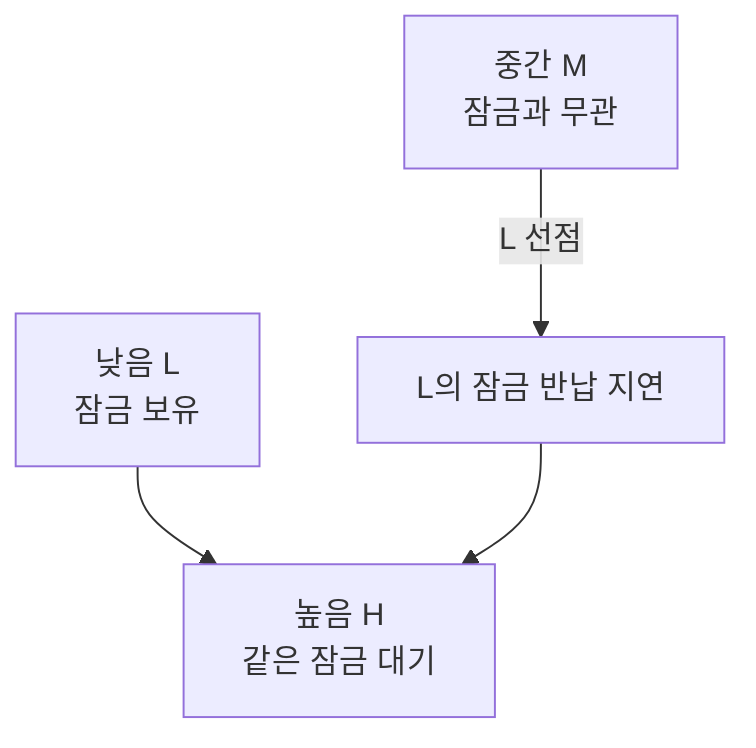
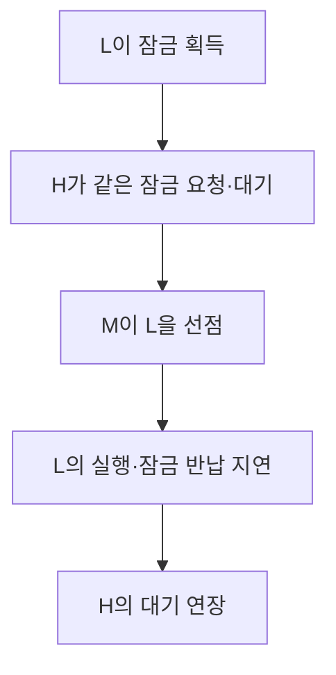
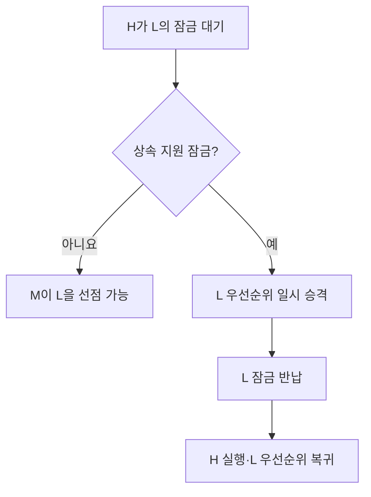

---
sidebar:
  order: 59
  label: "059. 우선순위 역전"
  badge:
    text: "기초"
    variant: note
title: "우선순위 역전(Priority Inversion)"
author: "Codex"
date: "2026-09-24T00:00:00+09:00"
tags:
  - "notes-computer-system"
weight: 59
extra:
  model: "GPT-6"
  keyword_grade: "기초"
  question_no: "059"
---

## 지식 로드맵 내 현재 위치

지식 위치: 컴퓨터 시스템 → 운영체제 → **실시간 스케줄링·동기화**

## 30초 인출

- 본질: **우선순위 역전** : 높은 우선순위 작업이 낮은 우선순위 작업이 가진 자원을 기다려 제때 실행되지 못하는 현상
- 메커니즘: 낮은 우선순위 작업이 잠금 보유 → 높은 우선순위 작업 대기 → 중간 우선순위 작업이 보유자를 선점하면 대기 증가

핵심 용어

- **우선순위 역전(Priority Inversion)** : 우선순위가 높은 작업이 낮은 작업이 보유한 자원 때문에 대기하는 현상
- **임계 구역(Critical Section)** : 공유 자원 보호를 위해 한 번에 제한된 작업만 진입하는 코드 구간
- **뮤텍스(Mutex)** : 공유 자원에 대한 상호 배제를 제공하는 잠금
- **우선순위 상속(Priority Inheritance)** : 높은 우선순위 작업을 막고 있는 잠금 보유자의 우선순위를 일시 높이는 기법
- **우선순위 천장(Priority Ceiling)** : 공유 자원에 접근하는 작업들의 우선순위를 기준으로 잠금의 상한을 설정하는 기법
- **기아(Starvation)** : 작업이 오랫동안 실행 기회를 얻지 못하는 현상

---

## 1교시 예상문제 (10점)

> 우선순위 역전의 발생 과정과 우선순위 상속을 설명하시오. (예상·10점)

---

## 1교시 10점 답안

### Ⅰ. 우선순위 역전의 개요

| 구분 | 핵심 |
|---|---|
| 정의 | **우선순위 역전** : 높은 우선순위 작업이 낮은 작업의 자원 점유 때문에 대기하는 현상 |
| 목적 | 대기 시간을 제한해 실시간 작업의 기한 준수 |

### Ⅱ. 세 작업의 관계

- 제언: 공유 자원의 잠금 보유 시간을 줄이고 필요한 잠금에는 우선순위 상속 적용.

---

## 2~4교시 예상문제 (25점)

> 우선순위 역전의 발생 원리와 실시간 작업에 미치는 영향을 설명하고, 우선순위 상속·천장 기법 및 적용 한계를 제시하시오. (예상·25점)

---

## 2~4교시 25점 답안

## Ⅰ. 우선순위 역전의 개요

| 구분 | 핵심 |
|---|---|
| 정의 | **우선순위 역전** : 높은 우선순위 작업이 낮은 작업의 자원 점유 때문에 대기하는 현상 |
| 목적 | 대기 시간을 제한해 실시간 작업의 기한 준수 |

## Ⅱ. 발생 과정

높은 우선순위 H의 지연은 L의 임계 구역 길이뿐 아니라 잠금과 무관한 M의 선점에도 좌우됨.

## Ⅲ. 우선순위 상속과 천장

| 기법 | 적용 방식 | 초점 |
|---|---|---|
| 우선순위 상속 | H가 대기할 때 L을 H 수준으로 일시 승격 | M의 불필요한 선점 방지 |
| 우선순위 천장 | 잠금에 접근 가능한 작업을 고려해 우선순위 상한 설정 | 사전적인 자원 접근 규칙 |

구체 천장 프로토콜마다 승격 시점과 교착상태 예방 조건이 다름. 모든 잠금에 임의로 적용한다고 모든 교착상태가 없어지는 것은 아님.

## Ⅳ. 상속 적용 전후

상속은 잠금 때문에 생긴 대기를 줄이는 기법. 긴 임계 구역·입출력 대기·잘못된 작업 설계까지 없애지는 못함.

## Ⅴ. 한계와 대응

| 한계 | 대응 |
|---|---|
| 잠금 보유 구간이 길어 H가 오래 대기 | 임계 구역 축소·블로킹 작업 분리 |
| 상속 없는 잠금에서 M의 선점 | 실시간 뮤텍스의 상속 지원 여부 확인 |
| 여러 잠금의 순환 대기 | 잠금 순서와 자원 획득 규칙 설계 |
| 스케줄러 우선순위만 보고 기한 보장 가정 | 최악 대기 시간과 실제 부하 시험 |

## Ⅵ. 기술사적 제언

| 우선 제언 | 실행·확인 |
|---|---|
| 공유 자원 경로를 작업 우선순위와 함께 분석 | H가 대기하는 잠금의 보유자·임계 구역·선점 작업 기록 |
| 기한 준수를 실측 | 상속 적용 전후 최대 대기와 데드라인 위반 여부 검증 |

---

## 검증 출처

- [Linux Kernel: RT-mutex implementation design](https://docs.kernel.org/locking/rt-mutex-design.html)
- [Linux Kernel: RT-mutex subsystem with PI support](https://docs.kernel.org/6.5/locking/rt-mutex.html)
- [POSIX: pthread_mutexattr_setprotocol](https://man7.org/linux/man-pages/man3/pthread_mutexattr_getprotocol.3p.html)

## 연결 토픽

- 연관 토픽: [CPU 스케줄링](./019_cpu_scheduling.md), [교착상태](./038_deadlock.md)