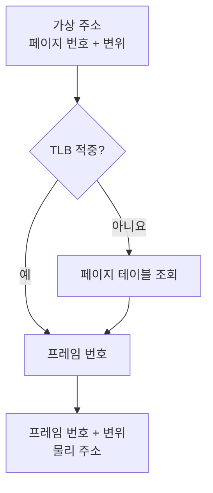
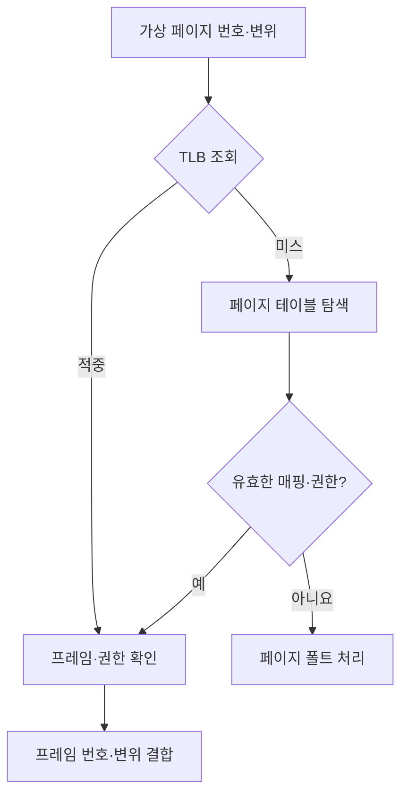

---
sidebar:
  order: 60
  label: "060. 페이징"
  badge:
    text: "기초"
    variant: note
title: "페이징(Paging)"
author: "Codex"
date: "2026-09-24T00:00:00+09:00"
tags:
  - "notes-computer-system"
weight: 60
extra:
  model: "GPT-6"
  keyword_grade: "기초"
  question_no: "060"
---

## 지식 로드맵 내 현재 위치

지식 위치: 컴퓨터 시스템 → 운영체제 → **가상 메모리·주소 변환**

## 30초 인출

- 본질: **페이징** : 가상 주소 공간을 페이지, 물리 메모리를 프레임으로 나누어 서로 대응시키는 메모리 관리 기법
- 메커니즘: 가상 페이지 번호로 페이지 테이블에서 프레임을 찾고 페이지 내 변위를 결합해 물리 주소 계산

핵심 용어

- **페이징(Paging)** : 같은 크기의 페이지·프레임을 대응시켜 가상 주소를 물리 주소로 변환하는 기법
- **페이지(Page)** : 가상 주소 공간을 나눈 고정 크기 단위
- **프레임(Frame)** : 물리 메모리를 페이지 크기에 맞춰 나눈 단위
- **페이지 테이블(Page Table)** : 가상 페이지와 물리 프레임의 대응·접근 권한을 기록한 자료구조
- **TLB(Translation Lookaside Buffer)** : 최근 가상 주소 변환 결과를 보관하는 캐시
- **페이지 폴트(Page Fault)** : 필요한 페이지 매핑이 없거나 접근 조건에 맞지 않을 때 발생하는 예외
- **대형 페이지(Huge Page)** : 기본 페이지보다 큰 크기로 매핑해 주소 변환 부담을 줄일 수 있는 페이지

---

## 1교시 예상문제 (10점)

> 페이징의 주소 변환 원리와 TLB의 역할을 설명하시오. (예상·10점)

---

## 1교시 10점 답안

### Ⅰ. 페이징의 개요

| 구분 | 핵심 |
|---|---|
| 정의 | **페이징** : 가상 페이지와 물리 프레임을 대응시켜 주소를 변환하는 기법 |
| 목적 | 비연속 프레임 활용과 메모리 보호·가상 주소 공간 제공 |

### Ⅱ. 주소 변환

- 제언: TLB 미스와 페이지 폴트를 구별하고, 프레임 배치와 페이지 내 변위의 역할 설명.

---

## 2~4교시 예상문제 (25점)

> 페이징의 주소 변환과 TLB·페이지 폴트를 설명하고 세그먼테이션과 비교하여 한계와 대응 방안을 제시하시오. (예상·25점)

---

## 2~4교시 25점 답안

## Ⅰ. 페이징의 개요

| 구분 | 핵심 |
|---|---|
| 정의 | **페이징** : 가상 페이지와 물리 프레임을 대응시켜 주소를 변환하는 기법 |
| 목적 | 비연속 프레임 활용과 메모리 보호·가상 주소 공간 제공 |

## Ⅱ. 페이지·프레임의 대응

| 가상 페이지 | 물리 프레임 | 페이지 내 변위 |
|---|---|---|
| 페이지 0 | 프레임 5 | 유지 |
| 페이지 1 | 프레임 2 | 유지 |
| 페이지 2 | 프레임 9 | 유지 |

가상으로 연속된 페이지가 물리적으로 연속된 프레임에 놓일 필요는 없음. 같은 크기 블록의 대응이 외부 단편화 문제를 줄임.

## Ⅲ. 주소 변환과 예외

**TLB 미스** : 변환 캐시에 정보가 없는 상태. 페이지 테이블에 유효한 매핑이 있으면 페이지 폴트 없이 변환 가능. **페이지 폴트** : 새 매핑·적재가 필요하거나 허용되지 않은 접근으로 발생하는 예외.

## Ⅳ. 세그먼테이션과 비교

| 관점 | 페이징 | 세그먼테이션 |
|---|---|---|
| 단위 | 고정 크기 페이지 | 의미별 가변 크기 세그먼트 |
| 주소 구성 | 페이지 번호·변위 | 세그먼트 번호·변위 |
| 보호 범위 | 페이지별 권한 | 세그먼트별 권한 |
| 공간 한계 | 마지막 페이지 등의 내부 단편화 가능 | 가변 크기 할당의 외부 단편화 가능 |

## Ⅴ. 성능과 대형 페이지

| 요소 | 역할 | 유의점 |
|---|---|---|
| TLB | 주소 변환 결과 재사용 | 작업 집합이 크면 미스 증가 가능 |
| 계층형 페이지 테이블 | 사용하지 않는 가상 주소 구간의 테이블 절약 | 미스 시 테이블 탐색 비용 |
| 대형 페이지 | 한 변환으로 더 큰 범위 매핑 | 메모리 예약·단편화·워크로드 적합성 확인 |

대형 페이지가 모든 부하의 성능을 높인다는 보장은 없음.

## Ⅵ. 한계와 대응

| 한계 | 대응 |
|---|---|
| 잦은 TLB 미스로 주소 변환 부담 | 페이지 크기·접근 패턴을 실측 후 조정 |
| 페이지 테이블의 메모리·탐색 비용 | 계층형 구조 활용과 매핑 규모 관리 |
| 고정 크기 할당의 내부 단편화 | 페이지 크기와 사용량의 균형 검토 |
| 페이지 폴트를 모두 치명적 오류로 해석 | 정상적인 지연 할당과 잘못된 접근을 원인별로 구별 |

## Ⅶ. 기술사적 제언

| 우선 제언 | 실행·확인 |
|---|---|
| 주소 변환 경로와 실제 데이터 접근을 분리 | TLB 미스·페이지 폴트·캐시 미스를 각각 측정 |
| 페이지 크기는 워크로드로 결정 | 작업 집합과 TLB 효율·메모리 낭비를 함께 시험 |

---

## 검증 출처

- [Linux Kernel: Page Tables](https://docs.kernel.org/mm/page_tables.html)
- [Linux Kernel: HugeTLB Pages](https://docs.kernel.org/admin-guide/mm/hugetlbpage.html)
- [Linux Kernel: Cache and TLB Flushing](https://docs.kernel.org/core-api/cachetlb.html)

## 연결 토픽

- 연관 토픽: [세그먼테이션](./058_segmentation.md), [프로세스 메모리 영역](./050_process_memory_layout.md)