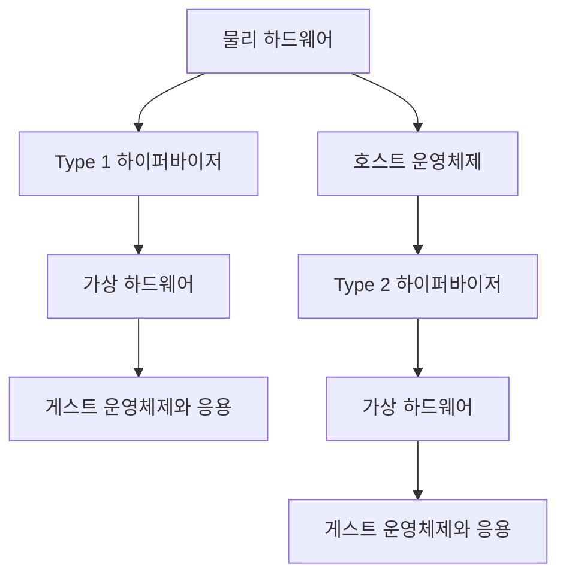
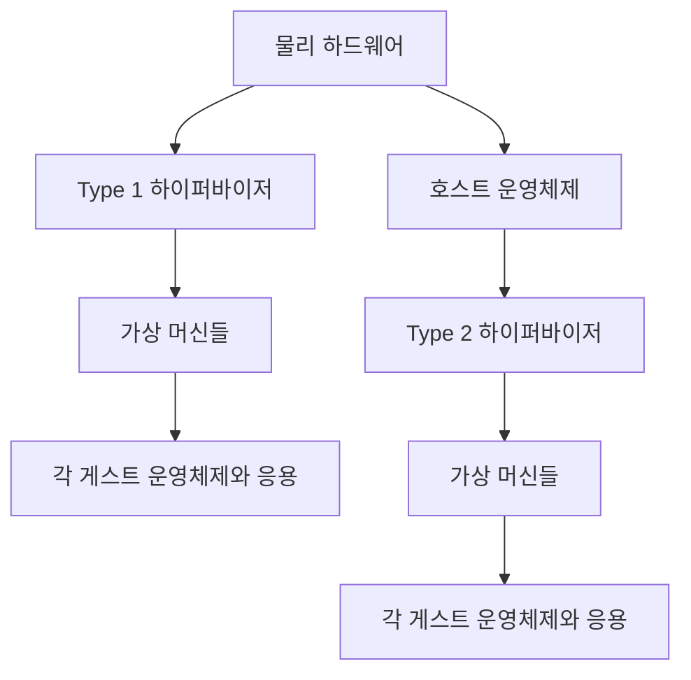
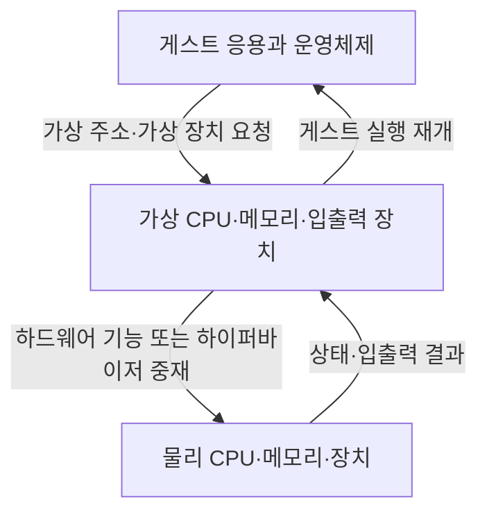

---
sidebar:
  order: 61
  label: "061. 하이퍼바이저"
  badge:
    text: "기초"
    variant: note
title: "하이퍼바이저 (Hypervisor)"
author: "GPT-6"
date: "2026-09-24T20:27:00+09:00"
tags:
  - "notes-computer-system"
weight: 61
extra:
  model: "GPT-6"
  keyword_grade: "기초"
  question_no: "061"
---

## 지식 로드맵 내 현재 위치

컴퓨터 시스템 → 서버 가상화 → 하이퍼바이저

## 30초 인출

- 본질: **하이퍼바이저 (Hypervisor)** 는 한 물리 컴퓨터에서 여러 가상 머신의 실행을 관리하는 가상화 소프트웨어 계층
- 메커니즘: CPU·메모리·입출력 자원을 VM별 가상 장치에 연결하고, 게스트 간 접근을 분리·중재

핵심 용어

- **하이퍼바이저 (Hypervisor)**: 물리 자원을 가상 머신에 제공하고 게스트 실행을 격리·관리하는 소프트웨어 계층
- **가상 머신 모니터 (Virtual Machine Monitor, VMM)**: 가상 CPU·메모리·장치의 실행을 관리하는 하이퍼바이저 구성 요소를 가리키는 명칭
- **Type 1 하이퍼바이저**: 물리 하드웨어 위에서 게스트 VM을 관리하는 구조
- **Type 2 하이퍼바이저**: 호스트 운영체제 위에서 VM을 응용 프로그램처럼 실행하는 구조
- **하드웨어 지원 가상화**: CPU·메모리 관리 장치의 확장 기능으로 게스트 실행과 주소 변환을 돕는 프로세서 기능
- **VM-Exit / VM-Entry**: 특정 조건에서 게스트 실행을 하이퍼바이저로 넘기고 다시 게스트로 돌리는 전환
- **KVM (Kernel-based Virtual Machine)**: Linux 커널의 가상화 기능을 제공하며 사용자 공간의 가상 장치 에뮬레이터와 함께 VM을 구성하는 기술

---

## 1교시 예상문제 (10점)

> 하이퍼바이저에 관하여 설명하시오. (예상)

---

## 1교시 10점 답안

## Ⅰ. 하이퍼바이저의 개요

| 구분 | 핵심 |
|---|---|
| 정의 | **하이퍼바이저 (Hypervisor)** 는 물리 컴퓨터의 자원을 여러 가상 머신에 제공하고 게스트 실행을 격리·관리하는 소프트웨어 계층 |
| 목적 | 하나의 물리 시스템에서 서로 분리된 운영체제와 작업 환경을 실행하고 자원 활용·관리를 유연하게 하는 기반 |

## Ⅱ. 구조와 유형

- 제언: 업무 중요도와 장애 격리 요구에 맞춘 하이퍼바이저 유형·운영 경계 선택

---

## 2~4교시 예상문제 (25점)

> 하이퍼바이저의 구조와 자원 가상화 방식을 설명하고, 유형별 차이와 운영 시 고려사항을 논하시오. (예상)

---

## 2~4교시 25점 답안

## Ⅰ. 하이퍼바이저의 개요

| 구분 | 핵심 |
|---|---|
| 정의 | **하이퍼바이저 (Hypervisor)** 는 물리 컴퓨터의 자원을 여러 가상 머신에 제공하고 게스트 실행을 격리·관리하는 소프트웨어 계층 |
| 목적 | 하나의 물리 시스템에서 서로 분리된 운영체제와 작업 환경을 실행하고 자원 활용·관리를 유연하게 하는 기반 |

## Ⅱ. 배치 유형

| 유형 | 구성 | 주된 활용 맥락 |
|---|---|---|
| Type 1 | 하드웨어 위에서 하이퍼바이저가 VM 실행 관리 | 서버 통합·가상화 클러스터 |
| Type 2 | 호스트 OS 위의 하이퍼바이저가 VM 실행 관리 | 개발·시험·개인용 환경 |

## Ⅲ. 자원 가상화와 게스트 실행

| 자원 | 가상화 역할 | 주요 관리 대상 |
|---|---|---|
| CPU | vCPU를 물리 프로세서 실행 문맥에 배치 | 스케줄링·특권 명령·인터럽트 |
| 메모리 | 게스트 주소를 호스트 물리 주소로 변환 | 주소 매핑·격리·페이지 회수 |
| 입출력 | 가상 장치를 에뮬레이션하거나 장치 기능을 할당 | 장치 모델·드라이버·DMA 격리 |

## Ⅳ. 가상화 방식과 전환

| 방식 | 게스트 실행 특징 | 하이퍼바이저의 역할 |
|---|---|---|
| 전가상화 | 수정되지 않은 게스트 OS 실행 가능 | 특권 동작을 가상화하고 장치를 제공 |
| 반가상화 | 게스트가 하이퍼바이저용 호출을 사용하는 협력 방식 | Hypercall 인터페이스 제공 |
| 하드웨어 지원 가상화 | CPU·메모리 하드웨어 확장 활용 | VM-Exit 조건을 설정하고 게스트 상태 전환 관리 |

VM-Exit는 모든 특권 명령에서 발생하는 것이 아니라 설정된 전환 조건에서 발생하며, VM-Entry는 저장된 게스트 상태로 실행을 재개하는 전환.

## Ⅴ. 하이퍼바이저와 컨테이너 비교

| 비교 축 | 가상 머신 | 컨테이너 |
|---|---|---|
| 커널 | VM별 게스트 OS 커널 실행 | 호스트 커널 공유 |
| 격리 경계 | 가상 하드웨어·하이퍼바이저 | 운영체제 기능을 이용한 프로세스 격리 |
| 운영 선택 | 서로 다른 OS·커널 또는 강한 격리 경계가 필요한 작업 | 같은 커널 계열에서 빠른 배포·프로세스 격리가 필요한 작업 |

## Ⅵ. 운영상 한계와 대응

| 한계 | 대응 |
|---|---|
| 가상 자원 과할당으로 지연·자원 경합 발생 가능 | 업무 중요도와 부하를 반영한 용량 계획·성능 관측 |
| 가상 장치·하이퍼바이저 취약점이 호스트 격리에 영향 | 최소 장치 모델·보안 업데이트·관리망 분리·접근 통제 |
| 직접 장치 할당 시 이동·공유 기능이 제약될 수 있음 | 성능 요구와 이식성 요구를 비교해 장치 할당 방식 선택 |

## Ⅶ. 기술사적 제언

| 한계 | 해결 방안 |
|---|---|
| 한 종류의 VM 배치 기준으로 업무 중요도와 장애 영향 차이를 반영하기 어려움 | 업무 등급별 격리 수준·자원 예약·복구 우선순위를 정의한 가상화 기준 수립 |

---

## 출제 이력과 검증 출처

- **기출 이력**: 제122회 1교시 하이퍼바이저 개념과 유형 출제
- **검증 출처**:
  - [Linux Kernel KVM documentation](https://docs.kernel.org/virt/kvm/index.html)
  - [Linux Kernel Hyper-V overview](https://docs.kernel.org/virt/hyperv/overview.html)
  - [NIST SP 800-125A Rev. 1, Security Recommendations for Server-based Hypervisor Platforms](https://csrc.nist.gov/pubs/sp/800/125/a/r1/final)

---

## 연결 토픽

- 비교 토픽: [가상 머신](./085_virtual_machine.md), [클라우드 서비스 취약점](./088_cloud_service_security_vulnerabilities.md)
