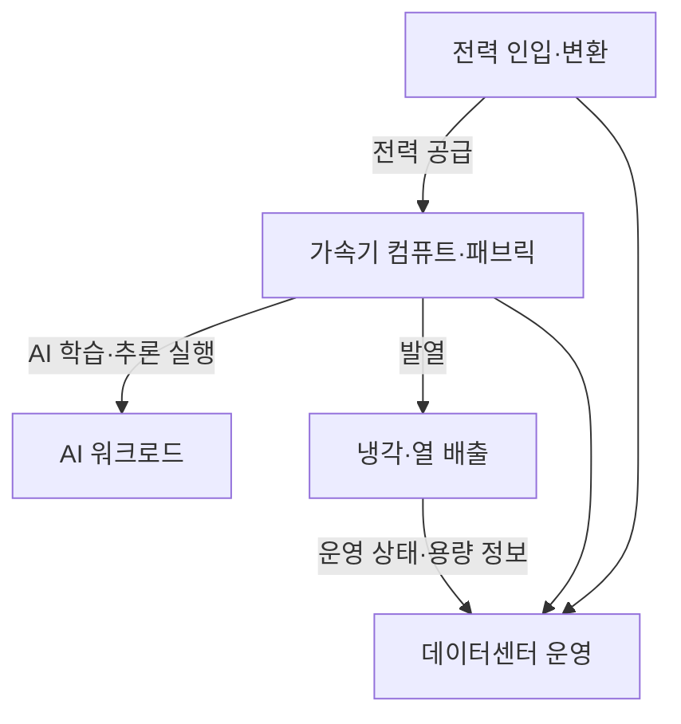
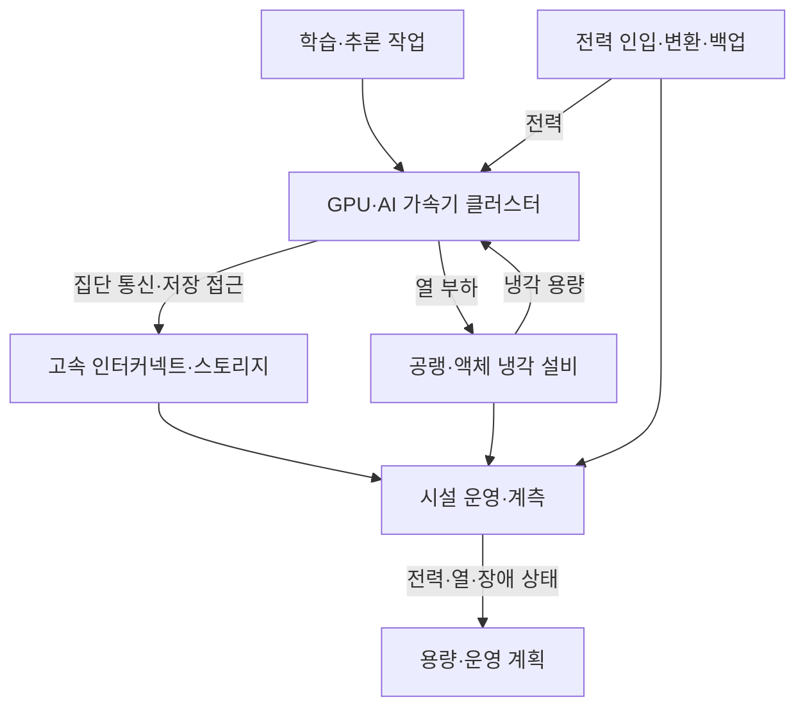

---
sidebar:
  order: 62
  label: "062. AI 데이터센터"
  badge:
    text: "서브"
    variant: note
title: "AI 팩토리·기가와트급 AI 데이터센터"
author: "GPT-6"
date: "2026-09-24T20:27:00+09:00"
tags:
  - "notes-computer-system"
weight: 62
extra:
  model: "GPT-6"
  keyword_grade: "서브"
  question_no: "062"
---

## 지식 로드맵 내 현재 위치

컴퓨터 시스템 → 데이터센터 → AI 워크로드 인프라 → AI 팩토리

## 30초 인출

- 본질: **AI 팩토리 (AI Factory)** 는 AI 학습·추론을 위해 컴퓨트와 전력·냉각·네트워크를 함께 설계하는 데이터센터
- 메커니즘: 가속기 클러스터의 전력·열·통신 요구를 시설 용량과 연결하고, 전체 인프라를 하나의 운영 단위로 관리

핵심 용어

- **AI 팩토리 (AI Factory)**: AI 모델 학습·추론을 위한 컴퓨트와 기반시설을 통합 설계·운영하는 데이터센터 개념
- **PUE (Power Usage Effectiveness)**: 데이터센터 총 에너지를 IT 장비 에너지로 나눈 에너지 효율 지표
- **CDU (Coolant Distribution Unit)**: 설비 냉각 회로와 IT 장비 냉각 회로 사이에서 냉각수 흐름·열교환을 관리하는 장치
- **직접 칩 냉각 (Direct-to-Chip Cooling, D2C)**: 냉각판 등을 통해 칩 가까이에서 냉각 유체로 열을 전달하는 방식
- **SMR (Small Modular Reactor)**: 소형 모듈형 원자로 설계 개념; 특정 데이터센터에 공급한다는 뜻이나 상용화 일정을 보장하지 않음

---

## 1교시 예상문제 (10점)

> AI 팩토리에 관하여 설명하시오. (예상)

---

## 1교시 10점 답안

## Ⅰ. AI 팩토리의 개요

| 구분 | 핵심 |
|---|---|
| 정의 | **AI 팩토리 (AI Factory)** 는 AI 학습·추론을 위해 컴퓨트와 전력·냉각·네트워크를 함께 설계하는 데이터센터 |
| 목적 | 고밀도 AI 연산을 안정적으로 제공하고 기반시설의 용량·효율을 함께 관리 |

## Ⅱ. 통합 운영 구조

- 제언: 가속기 증설과 전력·냉각·네트워크 용량 검토를 하나의 설계 승인 절차로 운영

---

## 2~4교시 예상문제 (25점)

> AI 팩토리의 구성과 운영 원리를 설명하고, 고밀도 AI 데이터센터의 기반시설 설계 고려사항을 논하시오. (예상)

---

## 2~4교시 25점 답안

## Ⅰ. AI 팩토리의 개요

| 구분 | 핵심 |
|---|---|
| 정의 | **AI 팩토리 (AI Factory)** 는 AI 학습·추론을 위해 컴퓨트와 전력·냉각·네트워크를 함께 설계하는 데이터센터 |
| 목적 | 고밀도 AI 연산을 안정적으로 제공하고 기반시설의 용량·효율을 함께 관리 |

## Ⅱ. 시스템 구성과 상호작용

## Ⅲ. 컴퓨트·네트워크·저장 설계

| 영역 | 설계 초점 | 확인 항목 |
|---|---|---|
| 가속기 컴퓨트 | 작업 병렬성·메모리 용량 | 노드 구성·가속기 메모리·소프트웨어 호환성 |
| 스케일업 패브릭 | 한 노드·파드 안의 가속기 간 통신 | 토폴로지·링크 대역폭·집단 통신 패턴 |
| 스케일아웃 네트워크 | 노드·랙 간 학습 데이터와 작업 통신 | 혼잡 제어·경로·장애 격리 |
| 저장소 | 학습 데이터 공급과 체크포인트 보존 | 처리량·동시성·복구 경로 |

## Ⅳ. 전력·냉각 기반시설

| 기반시설 | 역할 | 설계 고려사항 |
|---|---|---|
| 전력 계통 | IT 부하에 전력 공급·변환·보호 | 인입 용량·분전·전원 이중화·단계적 증설 |
| 열 제거 | 서버에서 발생한 열을 시설 밖으로 배출 | 랙별 열밀도·유체·누수 감지·정비성 |
| CDU | 냉각 회로 사이 열 교환과 유량 관리 | 장비 요구 온도·유량·회로 분리 |
| 계측 | 시설·IT 전력 및 온도 관측 | 전력 효율·열 상태·장애 영향 상관 분석 |

## Ⅴ. 전통 데이터센터와의 설계 차이

| 비교 축 | 범용 데이터센터 | AI 중심 데이터센터 |
|---|---|---|
| 주된 작업 | 다양한 CPU·저장·네트워크 서비스 | 가속기 기반 학습·추론 비중이 큰 작업 |
| 설계 결합 | IT와 설비 용량을 각각 계획할 수 있음 | 가속기 랙·전력·냉각·패브릭을 함께 계획 |
| 운영 단위 | 서버·서비스·시설 지표 중심 | 클러스터 작업 성능과 시설 상태의 연계 분석 |

## Ⅵ. 설계 한계와 대응

| 한계 | 대응 |
|---|---|
| 가속기 증설이 전력 인입·냉각 용량보다 빠를 수 있음 | IT·시설의 단계별 수용 한계를 함께 산정하고 증설 승인에 반영 |
| 액체 냉각 도입으로 배관·유지보수·누수 관리가 복잡해질 수 있음 | 냉각 회로 격리·누수 감지·정비 접근성을 설계 검토에 포함 |
| 대규모 시설 투자와 계통 연계가 장기간 소요될 수 있음 | 수요 전망과 실제 가동률을 단계별로 검토하고 설비 증설을 순차화 |

## Ⅶ. 기술사적 제언

| 한계 | 해결 방안 |
|---|---|
| 시설과 IT가 별도 일정·용량 기준으로 조달되면 가속기 납품 시점에 전력·냉각 준비가 늦어질 수 있음 | 컴퓨트·전력·냉각의 통합 용량 모델을 기준으로 투자 단계와 가동 승인 시점을 공동 결정 |

---

## 출제 이력과 검증 출처

- **기출 이력**: 기출 확인 없음; AI 인프라 개념 중심 예상문제
- **검증 출처**:
  - [U.S. Department of Energy, Best Practices Guide for Energy-Efficient Data Center Design](https://www.energy.gov/sites/default/files/2024-07/best-practice-guide-data-center-design_0.pdf)
  - [The Green Grid, PUE: A Comprehensive Examination of the Metric](https://www.thegreengrid.org/en/resources/library-and-tools/237-PUE%3A-A-Comprehensive-Examination-of-the-Metric)

---

## 연결 토픽

- 관련 토픽: [CXL](./063_cxl.md), [GPU](./083_gpgpu.md), [고대역폭 메모리](./079_hbm.md)
