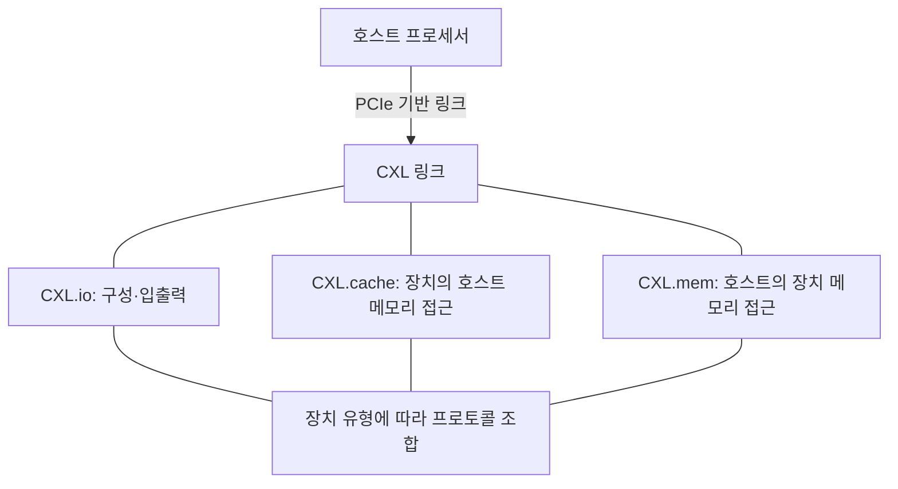
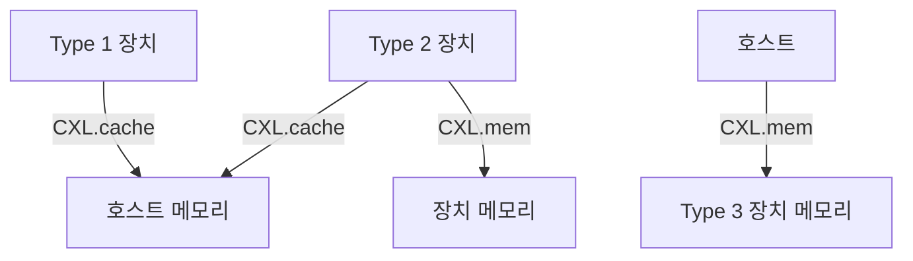
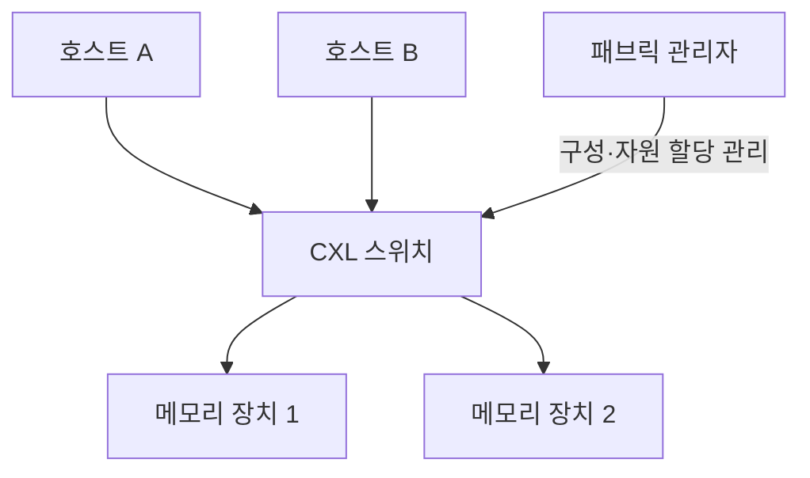

---
sidebar:
  order: 63
  label: "063. CXL"
  badge:
    text: "기초"
    variant: note
title: "CXL (Compute Express Link)"
author: "GPT-6"
date: "2026-09-24T20:27:00+09:00"
tags:
  - "notes-computer-system"
weight: 63
extra:
  model: "GPT-6"
  keyword_grade: "기초"
  question_no: "063"
---

## 지식 로드맵 내 현재 위치

컴퓨터 시스템 → 고속 장치 연결 → 메모리 일관성 인터커넥트 → CXL

## 30초 인출

- 본질: **CXL (Compute Express Link)** 은 프로세서와 장치가 메모리·입출력 자원을 효율적으로 연결하도록 돕는 고속 인터커넥트 표준
- 메커니즘: PCI Express (PCIe) 기반 링크에서 CXL.io, CXL.cache, CXL.mem 프로토콜을 장치 유형과 사용 방식에 맞게 조합

핵심 용어

- **CXL (Compute Express Link)**: 프로세서와 장치 간 입출력 및 메모리 의미의 통신을 제공하는 인터커넥트 표준
- **CXL.io**: 장치 탐색·구성·입출력에 쓰이는 PCIe 호환 프로토콜
- **CXL.cache**: 장치가 호스트 메모리에 접근할 때 캐시 일관성 기능을 제공하는 프로토콜
- **CXL.mem**: 호스트가 장치의 메모리 영역을 읽고 쓸 수 있게 하는 프로토콜
- **Type 1·2·3 장치**: 각각 CXL.cache 사용 가속기, 캐시와 장치 메모리를 함께 쓰는 가속기, 메모리 확장 장치 유형
- **메모리 풀링 (Memory Pooling)**: 여러 호스트가 스위치 패브릭을 통해 공유 가능한 장치 메모리 자원을 필요에 따라 할당받는 구성
- **패브릭 연결 메모리 (Fabric-Attached Memory, FAM)**: CXL 패브릭으로 연결해 관리하는 메모리 자원

---

## 1교시 예상문제 (10점)

> CXL에 관하여 설명하시오. (예상)

---

## 1교시 10점 답안

## Ⅰ. CXL의 개요

| 구분 | 핵심 |
|---|---|
| 정의 | **CXL (Compute Express Link)** 은 프로세서와 장치 간 입출력·캐시·메모리 통신을 제공하는 PCIe 기반 인터커넥트 표준 |
| 목적 | 장치별 사용 방식에 맞는 메모리 접근과 확장 가능한 시스템 연결 지원 |

## Ⅱ. 프로토콜과 장치 유형

| 장치 유형 | 지원 프로토콜 | 대표 역할 |
|---|---|---|
| Type 1 | CXL.io, CXL.cache | 장치가 호스트 메모리를 캐시하는 가속기 |
| Type 2 | CXL.io, CXL.cache, CXL.mem | 장치 메모리와 호스트 메모리를 함께 쓰는 가속기 |
| Type 3 | CXL.io, CXL.mem | 호스트에 메모리 용량을 제공하는 장치 |

- 제언: 장치의 메모리 접근 방향과 일관성 요구를 먼저 확인한 뒤 CXL 유형·토폴로지 선정

---

## 2~4교시 예상문제 (25점)

> CXL의 프로토콜 구조와 장치 유형을 설명하고, 메모리 확장·풀링 적용 시 고려사항을 논하시오. (예상)

---

## 2~4교시 25점 답안

## Ⅰ. CXL의 개요

| 구분 | 핵심 |
|---|---|
| 정의 | **CXL (Compute Express Link)** 은 프로세서와 장치 간 입출력·캐시·메모리 통신을 제공하는 PCIe 기반 인터커넥트 표준 |
| 목적 | 장치별 사용 방식에 맞는 메모리 접근과 확장 가능한 시스템 연결 지원 |

## Ⅱ. 프로토콜 계층

| 프로토콜 | 통신 역할 | 연결 방향의 핵심 |
|---|---|---|
| CXL.io | 구성·입출력 및 PCIe 호환 동작 | 호스트와 장치 사이의 I/O |
| CXL.cache | 장치가 호스트 메모리에 접근하며 일관성 관리 | 장치 → 호스트 메모리 |
| CXL.mem | 호스트가 장치 메모리에 접근 | 호스트 → 장치 메모리 |

## Ⅲ. 장치 유형과 메모리 접근

| 유형 | 프로토콜 | 메모리 역할 | 예시 |
|---|---|---|---|
| Type 1 | CXL.io + CXL.cache | 장치가 호스트 메모리 접근 | 메모리 확장이 없는 가속기 |
| Type 2 | CXL.io + CXL.cache + CXL.mem | 호스트·장치 메모리를 함께 사용하는 가속기 | 자체 메모리를 가진 가속기 |
| Type 3 | CXL.io + CXL.mem | 장치 메모리를 호스트에 제공 | 메모리 확장 장치 |

## Ⅳ. 확장·스위칭·풀링

| 개념 | 의미 | 설계 확인 |
|---|---|---|
| 메모리 확장 | 한 호스트에 CXL 메모리 장치 연결 | OS 지원·주소공간·용량 구성 |
| 메모리 풀링 | 호스트가 패브릭의 메모리를 할당받는 구성 | 스위치·관리 소프트웨어·할당 정책 지원 |
| FAM | 패브릭에 연결된 메모리 자원 구성 | 표준 버전과 장치·패브릭 상호운용성 |

## Ⅴ. 적용 이점과 제약

| 관점 | 기대 가능한 이점 | 제약·확인 |
|---|---|---|
| 용량 | 호스트 직결 메모리 외 확장 자원 구성 | 호스트·장치·OS의 지원 조합 확인 |
| 자원 활용 | 지원 토폴로지에서 풀 단위 메모리 할당 가능 | 모든 구현이 동적 공유·동일 지연을 보장하지 않음 |
| 성능 | 장치 메모리 접근 경로 선택 | 로컬 메모리와 지연·대역폭 차이를 워크로드로 측정 |
| 운영 | 메모리 자원 분리·재할당 가능성 | 격리·장애 도메인·관리 권한 검토 |

## Ⅵ. 적용 시 한계와 대응

| 한계 | 대응 |
|---|---|
| CXL 메모리는 로컬 DRAM과 지연·대역폭 특성이 다름 | 워크로드별 접근 패턴을 측정하고 메모리 계층 배치 정책 검증 |
| 스위치·호스트·장치의 지원 수준이 다를 수 있음 | 표준 버전·상호운용성·OS 지원을 구성표로 확인 |
| 공유 자원에서 성능 간섭·격리 위험 발생 가능 | 할당·접근 제어와 테넌트별 성능 관측 기준 수립 |

## Ⅶ. 기술사적 제언

| 한계 | 해결 방안 |
|---|---|
| 제품 지원 확인 없이 풀링을 전제로 용량 계획을 세우면 실제 배치가 제한될 수 있음 | 호스트·스위치·메모리 장치의 호환 조합을 검증한 소규모 파일럿을 거쳐 확장 범위 결정 |

---

## 출제 이력과 검증 출처

- **기출 이력**: 제136회 1교시 CXL의 개념과 프로토콜·장치 유형 출제
- **검증 출처**:
  - [Compute Express Link 4.0 Specification](https://computeexpresslink.org/cxl-specification/)
  - [CXL Consortium: CXL 3.2 specification release](https://computeexpresslink.org/wp-content/uploads/2024/12/CXL_3.2-Spec-Announcement_FINAL-1.pdf)

---

## 연결 토픽

- 관련 토픽: [고대역폭 메모리](./079_hbm.md), [GPU](./083_gpgpu.md), [메모리 가상화](./081_storage_virtualization.md)
