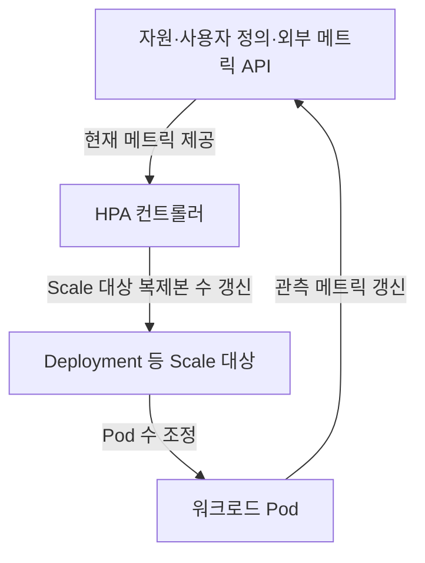
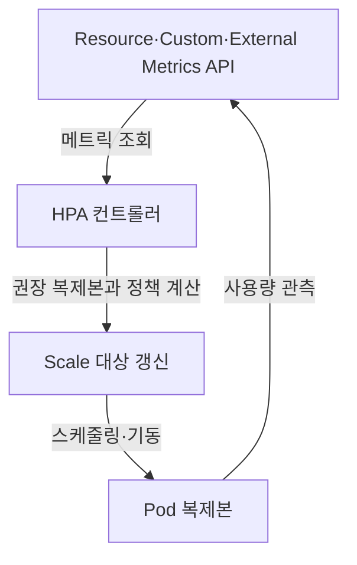

---
sidebar:
  order: 64
  label: "064. HPA"
  badge:
    text: "기초"
    variant: note
title: "HPA (Horizontal Pod Autoscaler)"
author: "GPT-6"
date: "2026-09-24T20:27:00+09:00"
tags:
  - "notes-computer-system"
weight: 64
extra:
  model: "GPT-6"
  keyword_grade: "기초"
  question_no: "064"
---

## 지식 로드맵 내 현재 위치

클라우드 플랫폼 → Kubernetes 워크로드 관리 → 수평 자동 확장 → HPA

## 30초 인출

- 본질: **HPA (Horizontal Pod Autoscaler)** 는 메트릭에 따라 대상 워크로드의 Pod 복제본 수를 조정하는 Kubernetes 컨트롤러
- 메커니즘: 지정 메트릭과 목표값의 비율로 권장 복제본 수를 계산하고, 안정화·변경 정책을 거쳐 Scale 대상에 반영

핵심 용어

- **HPA (Horizontal Pod Autoscaler)**: 메트릭에 맞춰 대상 워크로드의 Pod 복제본 수를 조정하는 Kubernetes 컨트롤러
- **VPA (Vertical Pod Autoscaler)**: 컨테이너 자원 사용량을 바탕으로 CPU·메모리 요청값을 권고하거나 조정하는 도구
- **Kubernetes**: 컨테이너화된 워크로드의 배포·확장·관리를 자동화하는 오픈소스 플랫폼
- **메트릭 서버 (Metrics Server)**: Kubernetes의 기본 자원 메트릭 API에 CPU·메모리 사용량을 제공하는 구성 요소
- **사용자 정의 메트릭 (Custom Metrics)**: Kubernetes 자원 외의 응용·업무 메트릭으로 수평 확장 기준에 쓸 수 있는 값
- **외부 메트릭 (External Metrics)**: 클러스터 외부 시스템에서 제공하는 HPA 확장 기준 메트릭
- **안정화 윈도우 (Stabilization Window)**: 최근 확장 권고를 고려해 급격한 복제본 축소·확대를 완화하는 시간 구간
- **KEDA (Kubernetes Event-driven Autoscaling)**: 이벤트·외부 메트릭 기반 Kubernetes 확장 기능을 제공하는 오픈소스 프로젝트

---

## 1교시 예상문제 (10점)

> HPA에 관하여 설명하시오. (예상)

---

## 1교시 10점 답안

## Ⅰ. HPA의 개요

| 구분 | 핵심 |
|---|---|
| 정의 | **HPA (Horizontal Pod Autoscaler)** 는 메트릭에 따라 대상 워크로드의 Pod 복제본 수를 조정하는 Kubernetes 컨트롤러 |
| 목적 | 부하 변화에 맞춘 워크로드 용량 조절과 수동 확장 부담 완화 |

## Ⅱ. 제어 흐름

- 제언: 목표 메트릭·최소최대 복제본과 실제 확장 반응을 부하 시험으로 확인

---

## 2~4교시 예상문제 (25점)

> HPA의 제어 구조와 확장 알고리즘을 설명하고, 메트릭 선택과 운영 시 고려사항을 논하시오. (예상)

---

## 2~4교시 25점 답안

## Ⅰ. HPA의 개요

| 구분 | 핵심 |
|---|---|
| 정의 | **HPA (Horizontal Pod Autoscaler)** 는 메트릭에 따라 대상 워크로드의 Pod 복제본 수를 조정하는 Kubernetes 컨트롤러 |
| 목적 | 부하 변화에 맞춘 워크로드 용량 조절과 수동 확장 부담 완화 |

## Ⅱ. 제어 구조와 처리 흐름

| 구성 요소 | 역할 |
|---|---|
| 메트릭 API | HPA가 사용할 메트릭 제공 |
| HPA 컨트롤러 | 목표와 현재 메트릭 비교, 복제본 수 권고 |
| Scale 대상 | Deployment·StatefulSet 등에서 원하는 복제본 수 관리 |
| 스케줄러·노드 | Pod 배치와 실행 자원 제공 |

## Ⅲ. 확장 권고 계산

| 단계 | 판정 |
|---|---|
| 메트릭 비교 | 현재 메트릭과 목표 메트릭의 비율 산출 |
| 복제본 계산 | 기본 형태: `원하는 복제본 수 = ceil(현재 복제본 수 × 현재 메트릭 / 목표 메트릭)` |
| 조정 판단 | 허용 오차·최소최대 복제본·변경 정책·안정화 구간 반영 |
| 실행 | 계산된 값을 Scale 대상에 반영 |

이는 단순화한 기본식이며, 누락 메트릭·미준비 Pod·여러 메트릭이 있으면 컨트롤러가 보수적 보정과 별도 규칙 적용.

## Ⅳ. 메트릭 유형과 전제조건

| 메트릭 유형 | 예시 | 필요한 연계·설정 |
|---|---|---|
| Resource | CPU·메모리 사용률 | 적절한 Pod 자원 요청량과 Resource Metrics API |
| Custom | 애플리케이션 큐·요청 처리량 | Custom Metrics API와 메트릭 제공자 |
| External | 메시지 큐 길이·외부 서비스 QPS | External Metrics API와 외부 메트릭 제공자 |

## Ⅴ. HPA와 다른 확장 방식

| 구분 | 조정 대상 | 주요 입력 |
|---|---|---|
| HPA | Pod 복제본 수 | 메트릭·목표값 |
| VPA (Vertical Pod Autoscaler) | Pod의 CPU·메모리 자원 요청·제한 권고 또는 변경 | 컨테이너 자원 사용량 |
| 클러스터 오토스케일러 (Cluster Autoscaler) | 클러스터 노드 수 | 스케줄 불가 Pod·노드 자원 상태 |

## Ⅵ. 운영 한계와 대응

| 한계 | 대응 |
|---|---|
| CPU 사용률이 응답 지연·큐 적체를 대표하지 못할 수 있음 | 요청량·큐 길이·지연 등 업무 부하를 더 직접 반영하는 지표 검토 |
| Pod 기동·이미지 다운로드 시간이 확장 반응을 늦춤 | 준비된 용량, 기동 시간 개선, 사전 확장 정책을 함께 검토 |
| 메트릭 API·자원 요청 누락 시 계산이 제한될 수 있음 | 메트릭 수집 상태와 자원 요청을 배포 검증에 포함 |
| 급격한 메트릭 변동이 복제본 수 변동을 유발 | scaleUp·scaleDown 정책과 안정화 윈도우 조정 |

## Ⅶ. 기술사적 제언

| 한계 | 해결 방안 |
|---|---|
| 기본 자원 메트릭만으로 서비스 품질과 비용 목표를 함께 충족하기 어려움 | 대표 부하 시험에서 서비스 지연·처리량과 메트릭 응답을 비교해 업무별 확장 신호와 목표값을 선정 |

---

## 출제 이력과 검증 출처

- **기출 이력**: 제137회 4교시 Kubernetes 문제에서 HPA의 동작·피드백 구조 관련 내용 출제
- **검증 출처**:
  - [Kubernetes: Horizontal Pod Autoscaling](https://kubernetes.io/docs/concepts/workloads/autoscaling/horizontal-pod-autoscale/)
  - [Kubernetes API: HorizontalPodAutoscalerBehavior](https://kubernetes.io/docs/reference/kubernetes-api/autoscaling/horizontal-pod-autoscaler-v2/)
  - [KEDA documentation](https://keda.sh/docs/)
  - [Q-Net: 제137회 정보관리기술사 문제지](https://www.q-net.or.kr/cst006.do?artlSeq=5242749&brdId=Q006&code=1203&gId=&gSite=Q&id=cst00602)

---

## 연결 토픽

- 관련 토픽: [Kubernetes](./012_kubernetes.md)
