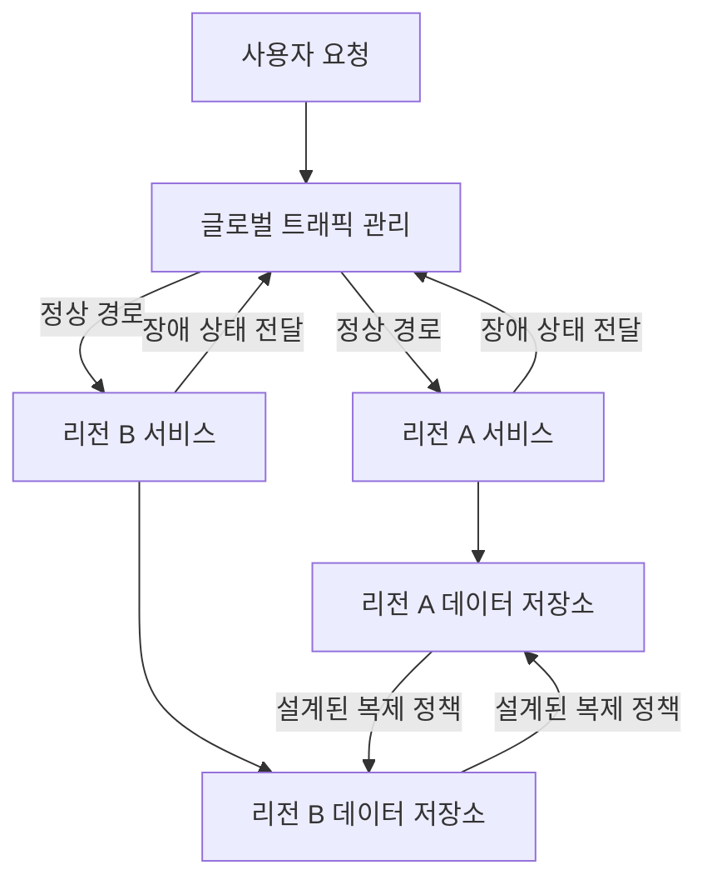
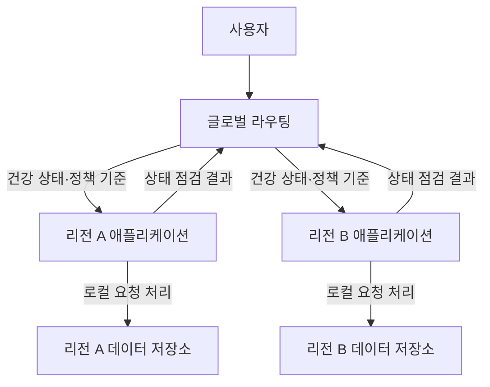
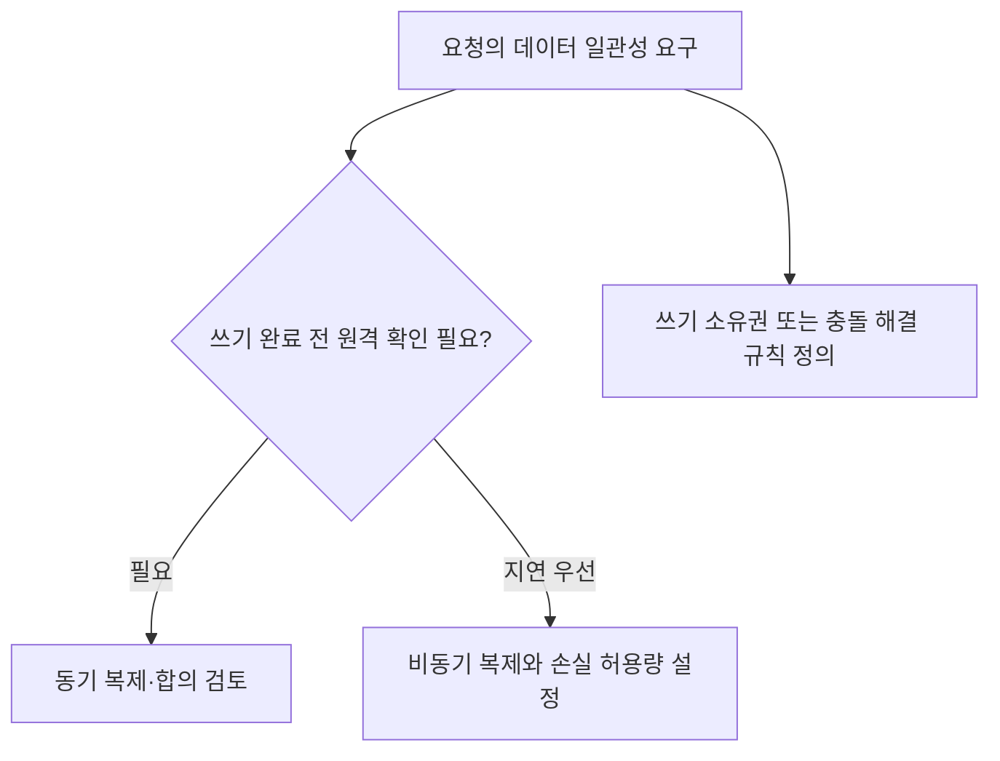

---
sidebar:
  order: 65
  label: "065. 다중 리전 Active-Active DR"
  badge:
    text: "서브"
    variant: note
title: "다중 리전 Active-Active 재해복구"
author: "GPT-6"
date: "2026-09-24T20:27:00+09:00"
tags:
  - "notes-computer-system"
weight: 65
extra:
  model: "GPT-6"
  keyword_grade: "서브"
  question_no: "065"
---

## 지식 로드맵 내 현재 위치

정보시스템 운영 → 가용성·재해복구 → 지역 장애 대비 → 다중 리전 Active-Active

## 30초 인출

- 본질: **다중 리전 Active-Active 재해복구 (Multi-Region Active-Active DR)** 는 둘 이상의 리전에서 서비스를 운영해 한 리전 장애에도 다른 리전에서 서비스 지속을 노리는 구조
- 메커니즘: 요청을 사용 가능한 리전으로 라우팅하고, 데이터 복제·쓰기 소유권·복구 절차를 일관성 요구에 맞춰 설계

핵심 용어

- **다중 리전 Active-Active 재해복구 (Multi-Region Active-Active Disaster Recovery)**: 여러 리전이 정상 상태에서 서비스 요청을 처리하고 장애 시 잔여 리전으로 운영을 이어가는 복구 구조
- **RTO (Recovery Time Objective)**: 장애 후 서비스를 복구하기까지 허용하는 목표 시간
- **RPO (Recovery Point Objective)**: 장애 시 허용하는 데이터 복구 시점의 손실 범위
- **동기 복제 (Synchronous Replication)**: 쓰기 완료 응답 전에 정한 복제 대상의 확인을 기다리는 방식
- **비동기 복제 (Asynchronous Replication)**: 원본 쓰기를 먼저 완료하고 변경 사항을 뒤이어 복제하는 방식
- **스플릿 브레인 (Split Brain)**: 통신 단절 등으로 둘 이상의 노드가 같은 데이터의 쓰기 주체라고 판단하는 상태
- **쿼럼 (Quorum)**: 분산 노드가 합의·쓰기 결정을 내리는 데 필요한 정족수
- **글로벌 트래픽 관리 (Global Traffic Management)**: 건강 상태·정책에 따라 사용자 요청을 여러 지역 엔드포인트로 분배하는 기능

---

## 1교시 예상문제 (10점)

> 다중 리전 Active-Active 재해복구에 관하여 설명하시오. (예상)

---

## 1교시 10점 답안

## Ⅰ. 개요

| 구분 | 핵심 |
|---|---|
| 정의 | **다중 리전 Active-Active 재해복구 (Multi-Region Active-Active DR)** 는 여러 리전이 정상 상태에서 요청을 처리하고 장애 시 잔여 리전에서 운영을 이어가는 복구 구조 |
| 목적 | 리전 장애의 서비스 중단과 데이터 손실을 업무가 정한 RTO·RPO 범위로 제한 |

## Ⅱ. 서비스·데이터 처리 구조

- 제언: 서비스별 RTO·RPO와 데이터 쓰기 소유권을 정한 뒤 장애 전환을 시험

---

## 2~4교시 예상문제 (25점)

> 다중 리전 Active-Active 재해복구의 구성과 데이터 처리 방식을 설명하고, 가용성·일관성·복구 목표의 설계 고려사항을 논하시오. (예상)

---

## 2~4교시 25점 답안

## Ⅰ. 개요

| 구분 | 핵심 |
|---|---|
| 정의 | **다중 리전 Active-Active 재해복구 (Multi-Region Active-Active DR)** 는 여러 리전이 정상 상태에서 요청을 처리하고 장애 시 잔여 리전에서 운영을 이어가는 복구 구조 |
| 목적 | 리전 장애의 서비스 중단과 데이터 손실을 업무가 정한 RTO·RPO 범위로 제한 |

## Ⅱ. 구성과 요청 흐름

각 리전의 애플리케이션을 가동해 두더라도 요청 분배 방식과 데이터 쓰기 구조는 별도로 결정해야 하는 설계 요소.

## Ⅲ. 데이터 복제와 일관성 선택

| 설계 방식 | 쓰기 완료 기준 | 장애 시 고려사항 |
|---|---|---|
| 동기 복제·합의 | 지정 복제본·쿼럼의 확인 후 완료 응답 | 강한 데이터 일관성에 유리하나 WAN 지연·쿼럼 가용성 영향 |
| 비동기 복제 | 원본 리전의 완료 후 변경 전파 | 응답 지연에 유리하나 장애 직전 변경의 복제 지연 가능 |
| 데이터 소유권 분할 | 데이터·사용자·샤드별 쓰기 리전 지정 | 충돌을 줄일 수 있으나 이동·교차 리전 접근 절차 필요 |
| 다중 쓰기·충돌 해결 | 복수 리전에서 쓰고 정책으로 충돌 처리 | 업무별 병합 규칙·중복 요청 처리의 정확성 검토 |

## Ⅳ. RTO·RPO와 장애 전환

| 항목 | 설계 질문 | 확인 방법 |
|---|---|---|
| RTO | 요청이 다른 리전에서 다시 처리되기까지 허용 시간은 얼마인가? | 라우팅 변경·앱 기동·의존 서비스 전환을 포함한 장애 훈련 |
| RPO | 장애 직전까지 어느 시점의 데이터가 필요하며 손실을 어디까지 허용하는가? | 복제 지연·커밋 확인·복구 지점의 일관성 확인 |
| 재진입 | 복구 리전을 어떻게 다시 서비스에 참여시키는가? | 복제 재동기화·충돌·트래픽 복귀 절차 점검 |

## Ⅴ. Active-Active와 Active-Passive 비교

| 비교 축 | Active-Active | Active-Passive |
|---|---|---|
| 정상 시 처리 | 복수 리전이 요청 처리 | 주 리전이 처리하고 대기 리전은 복구 준비 |
| 장애 시 작업 | 트래픽 재분배·데이터 일관성 확인 | 대기 환경 승격·트래픽 전환 |
| 주요 이점 | 정상 시 자원 활용과 지역별 서비스 제공 | 운영·데이터 소유권 구조가 상대적으로 단순 |
| 주요 부담 | 데이터 충돌·용량 계획·시험 복잡성 | 복구 단계와 대기 용량·전환 시간 관리 |

## Ⅵ. 한계와 대응

| 한계 | 대응 |
|---|---|
| 네트워크 분할 중 다중 쓰기로 충돌·분기 발생 가능 | 쓰기 소유권·쿼럼·충돌 해결 정책을 데이터 유형별로 명시 |
| 비동기 복제 중 리전 장애가 나면 복제 미완료 변경의 손실 가능 | 복제 지연을 관측하고 업무별 RPO와 쓰기 확인 방식을 맞춤 |
| 모든 리전으로 트래픽이 몰리면 잔여 리전 용량 부족 | 장애 시나리오 기준 잔여 용량·우선순위·부하차단 정책 시험 |
| 장애 판단 오류로 정상 리전까지 제외할 가능성 | 상태 점검·수동 개입 기준·복귀 절차를 함께 검증 |

## Ⅶ. 기술사적 제언

| 한계 | 해결 방안 |
|---|---|
| 정상 시 분산 처리만 검증하고 단일 리전 상실 후 서비스·데이터 복귀를 시험하지 않을 수 있음 | 리전 차단·복제 지연·복귀까지 포함한 정기 훈련을 시행하고, 결과를 RTO·RPO 승인 기준에 반영 |

---

## 출제 이력과 검증 출처

- **기출 이력**: 제137회 정보관리기술사 3교시 다중지역 동시 가동 재해복구 시스템 출제
- **검증 출처**:
  - [Google Cloud: Multi-regional deployment archetype](https://docs.cloud.google.com/architecture/deployment-archetypes/multiregional)
  - [Google Cloud: Architecting disaster recovery](https://docs.cloud.google.com/architecture/disaster-recovery)
  - [Google Cloud Storage: Availability and durability](https://cloud.google.com/storage/docs/availability-durability)
  - [Q-Net: 제137회 정보관리기술사 문제지](https://www.q-net.or.kr/cst006.do?artlSeq=5242749&brdId=Q006&code=1203&gId=&gSite=Q&id=cst00602)

---

## 연결 토픽

- 관련 토픽: [다중 리전 재해복구 시스템](./068_multi_region_active_active_disaster_recovery.md), [클라우드 서비스 취약점](./088_cloud_service_security_vulnerabilities.md)
