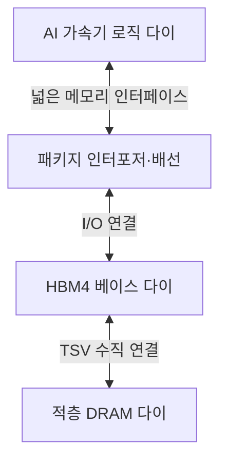
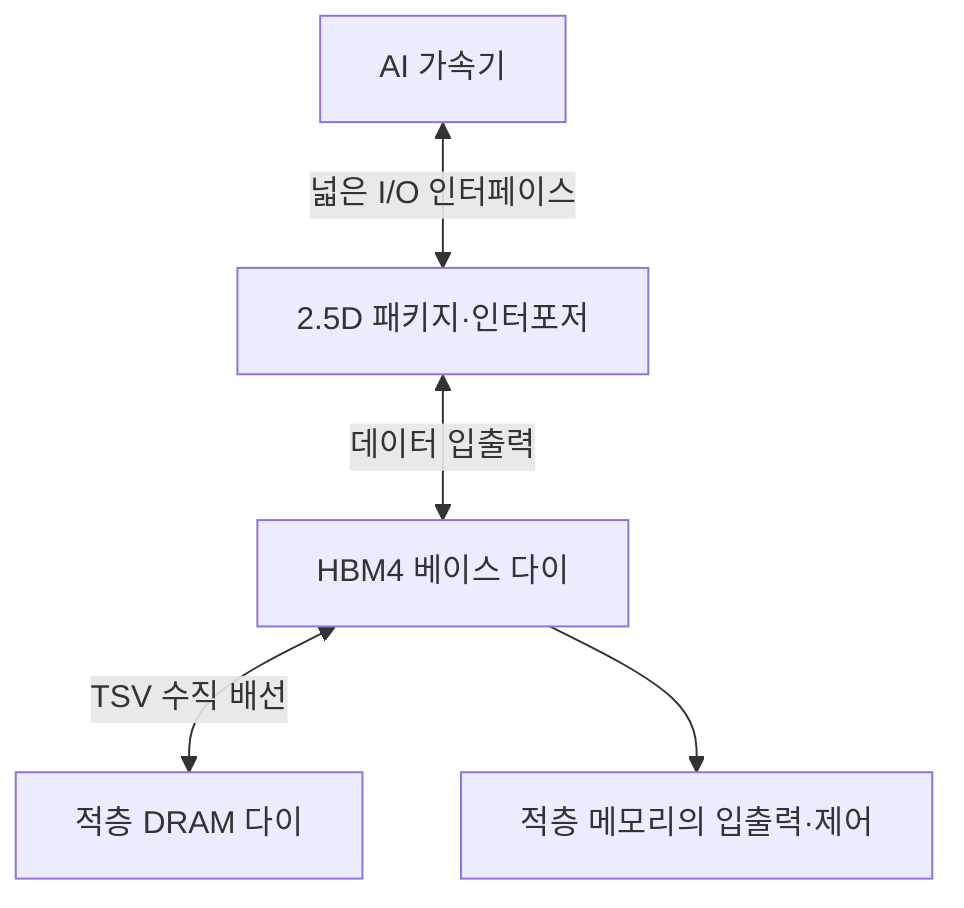
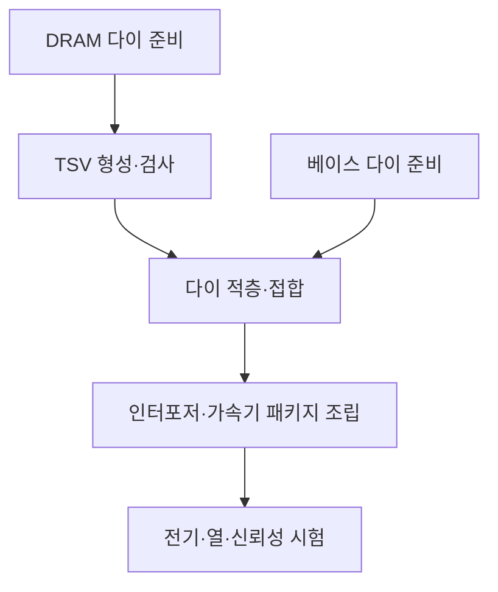

---
sidebar:
  order: 66
  label: "066. SK hynix HBM4"
  badge:
    text: "응용"
    variant: note
title: "SK하이닉스 HBM4 양산"
author: "GPT-6"
date: "2026-09-24T20:27:00+09:00"
tags:
  - "notes-computer-system"
weight: 66
extra:
  model: "GPT-6"
  keyword_grade: "응용"
  question_no: "066"
---

## 지식 로드맵 내 현재 위치

컴퓨터 시스템 → AI 가속기 메모리 → 적층형 고대역폭 메모리 → HBM4

## 30초 인출

- 본질: **HBM4 (High Bandwidth Memory 4)** 는 다수의 DRAM 다이를 수직 적층해 AI 가속기에 높은 메모리 대역폭을 제공하는 고대역폭 메모리 세대
- 메커니즘: TSV 기반 적층·넓은 I/O 인터페이스·베이스 다이·첨단 패키징을 결합해 가속기와 메모리 사이의 데이터 이동을 지원

핵심 용어

- **HBM4 (High Bandwidth Memory 4)**: 적층 DRAM 다이와 베이스 다이를 결합한 4세대 고대역폭 메모리
- **HBM (High Bandwidth Memory)**: 여러 DRAM 다이를 수직 적층해 가속기 가까이에 배치하는 메모리 제품군
- **베이스 다이 (Base Die)**: 적층 메모리의 입출력·제어 기능을 담당하며 상위 DRAM 다이와 외부 시스템 사이에 위치한 하단 다이
- **TSV (Through-Silicon Via)**: 실리콘 다이를 관통해 적층 다이 사이 전기 신호를 연결하는 수직 배선
- **MR-MUF (Mass Reflow Molded Underfill)**: 적층 다이 사이에 보호 재료를 채우고 경화하는 패키징 공정
- **I/O (Input/Output)**: 메모리와 외부 장치 사이 데이터 신호의 입력·출력 연결
- **HBM4 양산 상태**: SK hynix가 2026년 2분기 실적 발표에서 HBM4 대량 출하 시작을 공시한 기업별 진행 현황

---

## 1교시 예상문제 (10점)

> HBM4에 관하여 설명하시오. (예상)

---

## 1교시 10점 답안

## Ⅰ. HBM4의 개요

| 구분 | 핵심 |
|---|---|
| 정의 | **HBM4 (High Bandwidth Memory 4)** 는 다수의 DRAM 다이와 베이스 다이를 수직 적층해 AI 가속기에 높은 메모리 대역폭을 제공하는 메모리 세대 |
| 목적 | 가속기와 메모리 사이 데이터 이동 병목을 줄이고 고대역폭·전력 효율 요구에 대응 |

## Ⅱ. 적층 구조

- 제언: 가속기 인터페이스·패키지·열 설계와 함께 HBM4 적층 사양 검토

---

## 2~4교시 예상문제 (25점)

> HBM4의 구조와 성능 특성을 설명하고, AI 가속기 적용 시 패키징·열·공급 측면의 고려사항을 논하시오. (예상)

---

## 2~4교시 25점 답안

## Ⅰ. HBM4의 개요

| 구분 | 핵심 |
|---|---|
| 정의 | **HBM4 (High Bandwidth Memory 4)** 는 다수의 DRAM 다이와 베이스 다이를 수직 적층해 AI 가속기에 높은 메모리 대역폭을 제공하는 메모리 세대 |
| 목적 | 가속기와 메모리 사이 데이터 이동 병목을 줄이고 고대역폭·전력 효율 요구에 대응 |

## Ⅱ. 적층 구조와 데이터 경로

| 구성 | 역할 |
|---|---|
| DRAM 다이 | 데이터 저장 용량 제공 |
| TSV | 적층 다이 간 수직 전기 연결 |
| 베이스 다이 | DRAM 스택의 외부 I/O·제어 연결 |
| 인터포저·패키지 | 가속기와 HBM 패키지 사이 고밀도 신호 연결 |

## Ⅲ. HBM4 세대 특성

| 항목 | 설명 | 확인 시 주의 |
|---|---|---|
| I/O 폭 | SK hynix 발표 기준 2,048개 I/O 단자 | 제품·세대별 제조사 발표 사양 구분 |
| 대역폭 | SK hynix는 HBM4 제품의 2.8 TB/s 초과 대역폭을 안내 | 제품 구성·속도 등급에 따른 조건 확인 |
| 베이스 다이 | 로직 파운드리 공정 활용을 통한 기능·전력 최적화 방향 | 업체 제품 설계에 따른 구현 차이 |
| 패키징 | 적층·접합·보호재 공정이 제품 신뢰성에 영향 | 적층 수·열·휨·수율 조건 확인 |

## Ⅳ. 제조·패키징 흐름

SK hynix는 HBM4에 Advanced MR-MUF와 로직 파운드리 기반 베이스 다이를 적용한다고 발표했으며, 제품별 공정 조건은 회사 발표와 양산 시점에 따라 구분.

## Ⅴ. HBM3E와 HBM4 비교

| 비교 축 | HBM3E | HBM4 |
|---|---|---|
| I/O 구성 | 이전 세대 인터페이스 | 표준·제품별 2,048 I/O 구성 적용 |
| 설계 초점 | 적층 용량과 대역폭 확대 | 더 넓은 인터페이스·베이스 다이·전력 효율 개선 |
| 시스템 의존 | 가속기 메모리 컨트롤러·패키지와 연계 | 차세대 가속기·인터포저·열 설계와 공동 검증 필요 |

## Ⅵ. 적용 한계와 대응

| 한계 | 대응 |
|---|---|
| 다이 적층이 늘면 휨·접합·열 방출·수율 관리가 어려워질 수 있음 | 적층 수·MR-MUF·접합 공정별 전기·열·기계 신뢰성 시험 |
| 넓은 I/O와 고속 신호가 패키지 배선·전력 무결성 부담을 키움 | 가속기·HBM·인터포저 공동 설계와 패키지 수준 SI/PI 검증 |
| 특정 가속기·패키지 조합에 대한 검증과 공급 일정이 맞지 않을 수 있음 | 고객 인증·시스템 통합 시험·공급 계획을 제품 도입 일정과 연계 |

## Ⅶ. 기술사적 제언

| 한계 | 해결 방안 |
|---|---|
| 제조사 발표 사양만으로는 실제 AI 시스템에서의 이득과 공급 적합성을 판단하기 어려움 | 목표 가속기·워크로드 조합에서 대역폭·전력·열·수율 조건을 확인하는 단계별 수용 기준 수립 |

---

## 출제 이력과 검증 출처

- **기출 이력**: 기출 확인 없음; HBM4 구조·시스템 적용 중심 예상문제
- **검증 출처**:
  - [SK hynix: HBM4 development and mass production preparation, 2025-09-12](https://news.skhynix.com/en/sk-hynix-completes-worlds-first-hbm4-development-and-readies-mass-production/)
  - [SK hynix: 2Q 2026 financial results and HBM4 mass shipments](https://news.skhynix.com/en/q2-2026-business-results/)
  - [SK hynix: HBM4 architecture and future memory technologies](https://research-user.skhynix.com/research-areas/future-memory-technologies/evolutionary-memory)

---

## 연결 토픽

- 비교 토픽: [HBM](./079_hbm.md), [GPU](./083_gpgpu.md), [CXL](./063_cxl.md)
