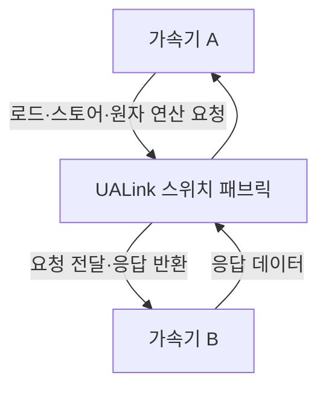
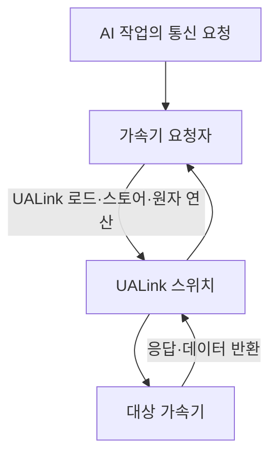

---
sidebar:
  order: 67
  label: "067. UALink 1.0"
  badge:
    text: "서브"
    variant: note
title: "UALink 1.0 (Ultra Accelerator Link)"
author: "GPT-6"
date: "2026-09-24T20:27:00+09:00"
tags:
  - "notes-computer-system"
weight: 67
extra:
  model: "GPT-6"
  keyword_grade: "서브"
  question_no: "067"
---

## 지식 로드맵 내 현재 위치

AI 시스템 → 가속기 연결 → 스케일업 인터커넥트 → UALink

## 30초 인출

- 본질: **UALink (Ultra Accelerator Link)** 는 AI 가속기 간 고대역폭·저지연 통신을 위한 개방형 스케일업 인터커넥트 표준
- 메커니즘: 가속기 간 직접 로드·스토어·원자 연산을 지원하고, 스위치를 이용해 AI 컴퓨팅 파드 안에서 연결 규모를 확장

핵심 용어

- **UALink (Ultra Accelerator Link)**: AI 가속기와 스위치 사이의 통신을 위한 개방형 인터커넥트 표준
- **스케일업 (Scale-up)**: 한 시스템·파드 안에서 가속기 연결과 자원을 확장하는 방식
- **로드·스토어 (Load/Store)**: 메모리 주소를 대상으로 값을 읽고 쓰는 명령 의미
- **UALink 컨소시엄 (Ultra Accelerator Link Consortium)**: UALink 사양을 제정·관리하는 산업 표준화 단체
- **InfiniBand**: 고성능 컴퓨팅·데이터센터의 패킷 기반 네트워크 인터커넥트 기술
- **UEC (Ultra Ethernet Consortium)**: AI·고성능 컴퓨팅용 Ethernet 기반 스케일아웃 기술을 개발하는 산업 단체

---

## 1교시 예상문제 (10점)

> UALink에 관하여 설명하시오. (예상)

---

## 1교시 10점 답안

## Ⅰ. UALink의 개요

| 구분 | 핵심 |
|---|---|
| 정의 | **UALink (Ultra Accelerator Link)** 는 AI 가속기와 스위치 사이의 통신을 위한 개방형 고속 인터커넥트 표준 |
| 목적 | AI 컴퓨팅 파드에서 가속기 간 저지연·고대역폭 통신과 확장성 지원 |

## Ⅱ. 기본 동작

- 제언: 가속기 간 통신 요구와 가속기 수를 기준으로 UALink 지원 여부·연결 구성을 확인

---

## 2~4교시 예상문제 (25점)

> UALink의 구조와 동작을 설명하고, 스케일업 인터커넥트의 적용 범위와 설계 고려사항을 논하시오. (예상)

---

## 2~4교시 25점 답안

## Ⅰ. UALink의 개요

| 구분 | 핵심 |
|---|---|
| 정의 | **UALink (Ultra Accelerator Link)** 는 AI 가속기와 스위치 사이의 통신을 위한 개방형 고속 인터커넥트 표준 |
| 목적 | AI 컴퓨팅 파드에서 가속기 간 저지연·고대역폭 통신과 확장성 지원 |

## Ⅱ. 프로토콜 경로

UALink 1.0은 가속기 간 직접 메모리 의미의 통신을 정의하며, 임의의 구현에서 모든 메모리가 하나의 전역 주소 공간으로 자동 공유된다는 뜻은 아님.

## Ⅲ. 주요 구성

| 계층·구성 | 역할 |
|---|---|
| 트랜잭션 계층 | 가속기 간 요청·응답과 데이터 전송 의미 처리 |
| 데이터 링크 계층 | 링크 전송·흐름 제어·오류 처리 기능 제공 |
| 물리 계층 | 직렬화 신호를 매체로 송수신 |
| 스위치 | 가속기 요청을 목적지로 전달하고 파드 연결 확장 |

## Ⅳ. 버전 1.0의 연결 범위

| 항목 | UALink Consortium 자료에 기재된 범위 |
|---|---|
| 발표 사양 | UALink 200G 1.0 |
| 레인 속도 | 레인당 200G급 연결 사양 |
| 확장 규모 | AI 컴퓨팅 파드 내 최대 1,024 가속기 연결 지원 목표 |
| 적용 경계 | 스케일업 파드 내 가속기·스위치 통신 |

실제 시스템 처리량·지연시간은 링크 구성, 구현, 토폴로지와 작업 특성에 따라 별도 검증.

## Ⅴ. 스케일업과 스케일아웃 비교

| 비교 축 | 스케일업 인터커넥트 (UALink) | 스케일아웃 네트워크 (Ethernet·InfiniBand) |
|---|---|---|
| 연결 범위 | 가속기·스위치 중심의 파드 내부 | 서버·랙·데이터센터 간 연결 |
| 통신 의미 | 메모리 의미의 가속기 간 요청 지원 | 패킷 전송 기반 노드 간 통신 |
| 설계 초점 | 토폴로지·가속기 상호연결·메모리 접근 | 혼잡 제어·라우팅·전송 신뢰성 |
| 선택 기준 | 파드 내부 집단 통신의 대역폭·지연 요구 | 더 큰 시스템 범위의 확장성과 상호운용성 |

## Ⅵ. 적용 시 한계와 대응

| 한계 | 대응 |
|---|---|
| 개방형 표준이어도 제품 간 상호운용성은 구현·사양 지원에 좌우 | 지원 버전·기능·시험 결과를 확인한 조합으로 구성 |
| 파드 규모가 커질수록 스위치·링크 구성과 장애 영향이 복잡 | 토폴로지·경로 이중화·장애 격리 조건을 설계 단계에서 검토 |
| 가속기 통신 라이브러리와 메모리 관리가 표준 기능만으로 자동 해결되지 않음 | 시스템 소프트웨어·런타임·가속기 간 연계 지원 확인 |

## Ⅶ. 기술사적 제언

| 한계 | 해결 방안 |
|---|---|
| 표준 사양의 최대 규모를 곧바로 운영 규모로 간주하면 실제 응용의 통신 성능을 놓칠 수 있음 | 대표 AI 작업으로 가속기 수·통신 패턴을 단계적으로 늘리는 파일럿을 수행한 뒤 본격 확장 범위 결정 |

---

## 출제 이력과 검증 출처

- **기출 이력**: 정보관리기술사 기출 확인 없음; 표준 개념 중심 예상문제
- **검증 출처**:
  - [UALink Consortium specifications](https://ualinkconsortium.org/specification/)
  - [UALink Consortium FAQ](https://ualinkconsortium.org/faq/)
  - [UALink 200G 1.0 Specification White Paper](https://ualinkconsortium.org/wp-content/uploads/2025/04/UALink-1.0-White_Paper_v3.pdf)

---

## 연결 토픽

- 관련 토픽: [CXL](./063_cxl.md), [GPU](./083_gpgpu.md), [고대역폭 메모리](./079_hbm.md)
