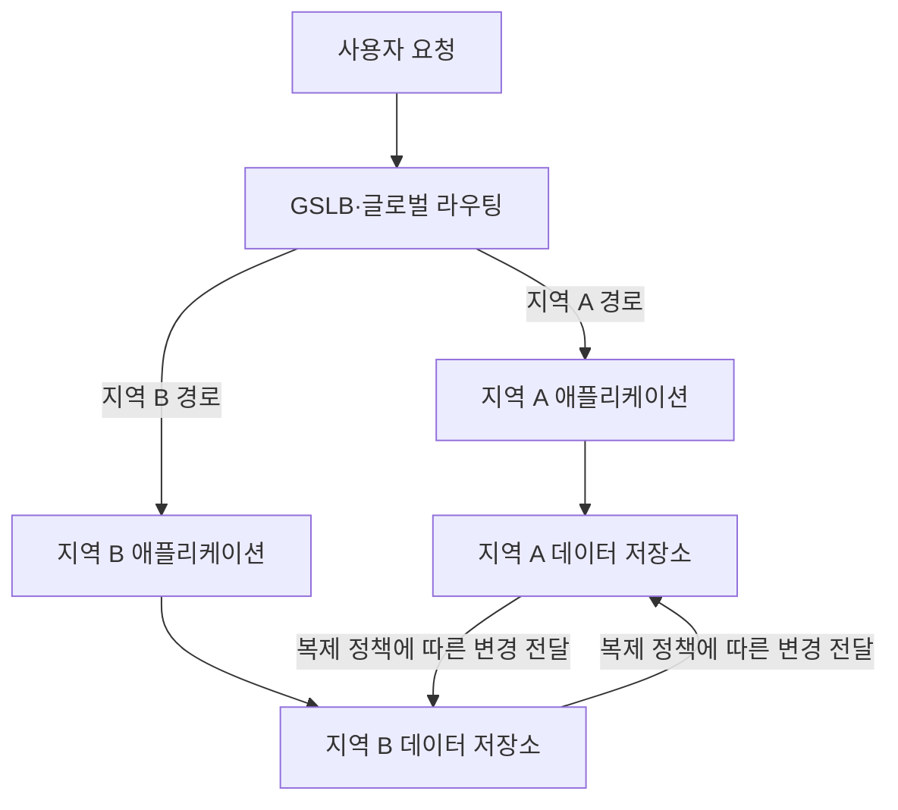
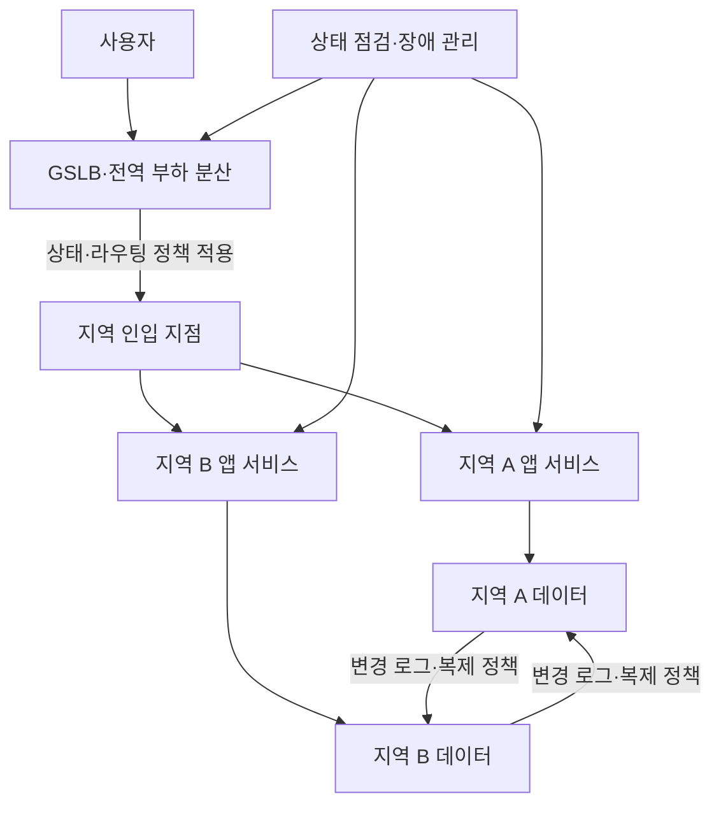
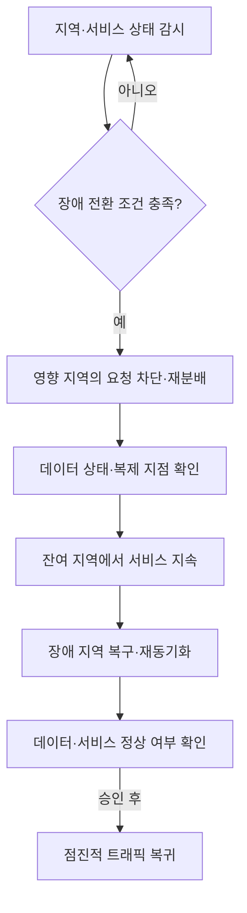

---
sidebar:
  order: 68
  label: "068. 다중 리전 재해복구 시스템"
  badge:
    text: "서브"
    variant: note
title: "다중지역 동시 가동 재해복구 시스템"
author: "GPT-6"
date: "2026-09-24T20:27:00+09:00"
tags:
  - "notes-computer-system"
weight: 68
extra:
  model: "GPT-6"
  keyword_grade: "서브"
  question_no: "068"
---

## 지식 로드맵 내 현재 위치

정보시스템 운영 → 재해복구 아키텍처 → 다중 지역 동시 가동 재해복구 시스템

## 30초 인출

- 본질: **다중지역 동시 가동 재해복구 시스템 (Multi-Region Active-Active DR)** 은 복수 지역의 서비스를 정상 시 함께 운영하고 한 지역 장애 시 다른 지역으로 처리를 이어가는 구성
- 메커니즘: 글로벌 라우팅, 지역별 애플리케이션 용량, 데이터 복제·쓰기 정책을 함께 구성하고 장애 전환과 복귀를 훈련

핵심 용어

- **다중지역 동시 가동 재해복구 시스템 (Multi-Region Active-Active Disaster Recovery)**: 여러 지역의 서비스가 정상 시 요청을 처리하며 장애 시 잔여 지역에서 처리를 지속하도록 구성한 시스템
- **GSLB (Global Server Load Balancing)**: 여러 지역의 서버 상태·정책을 바탕으로 요청 목적지를 선택하는 글로벌 트래픽 분산 기능
- **DCI (Data Center Interconnect)**: 지역 간 데이터센터를 연결하는 네트워크 구성
- **RTO (Recovery Time Objective)**: 장애 후 서비스를 복구하기까지 허용하는 목표 시간
- **RPO (Recovery Point Objective)**: 장애 시 허용하는 데이터 복구 시점의 손실 범위
- **장애 전환 (Failover)**: 장애가 발생한 서비스 처리를 정상 지역으로 옮기는 절차
- **장애 복귀 (Failback)**: 복구된 지역을 검증한 뒤 서비스 처리에 다시 편입하는 절차

---

## 1교시 예상문제 (10점)

> 다중지역 동시 가동 재해복구 시스템에 관하여 설명하시오. (예상)

---

## 1교시 10점 답안

## Ⅰ. 개요

| 구분 | 핵심 |
|---|---|
| 정의 | **다중지역 동시 가동 재해복구 시스템 (Multi-Region Active-Active DR)** 은 복수 지역의 서비스를 정상 시 함께 운영하고 장애 시 잔여 지역에서 처리를 지속하는 구성 |
| 목적 | 지역 장애의 서비스 중단과 데이터 손실을 업무가 정한 RTO·RPO 범위로 제한 |

## Ⅱ. 3계층 구성

- 제언: 지역별 최대 부하와 데이터 복제 정책을 장애 시나리오에서 함께 시험

---

## 2~4교시 예상문제 (25점)

> 다중지역 동시 가동 재해복구 시스템의 구성과 장애 전환을 설명하고, 데이터·용량·복구 절차의 설계 고려사항을 논하시오. (예상)

---

## 2~4교시 25점 답안

## Ⅰ. 개요

| 구분 | 핵심 |
|---|---|
| 정의 | **다중지역 동시 가동 재해복구 시스템 (Multi-Region Active-Active DR)** 은 복수 지역의 서비스를 정상 시 함께 운영하고 장애 시 잔여 지역에서 처리를 지속하는 구성 |
| 목적 | 지역 장애의 서비스 중단과 데이터 손실을 업무가 정한 RTO·RPO 범위로 제한 |

## Ⅱ. 계층별 구성

## Ⅲ. 계층별 설계 항목

| 계층 | 설계 항목 | 확인 기준 |
|---|---|---|
| 전역 트래픽 | DNS·글로벌 로드밸런서·헬스체크 | 장애 감지·라우팅 갱신·세션 처리 |
| 애플리케이션 | 지역별 배포·설정·비밀정보·외부 의존성 | 동등한 서비스 기능·가용 용량 |
| 데이터 | 복제·쓰기 소유권·충돌 해결·백업 | 일관성 요구·RPO·복구 가능성 |
| 운영 관리 | 관측·경보·권한·장애 절차 | 지역 간 독립 장애와 공통 원인 분석 |

## Ⅳ. 데이터 동기화 방식

| 방식 | 특성 | 고려사항 |
|---|---|---|
| 동기 복제 | 정한 복제 확인 후 쓰기 완료 처리 | 리전 간 지연·쿼럼 장애 영향과 강한 일관성 요구 비교 |
| 비동기 복제 | 원본 쓰기 완료 뒤 변경 전파 | 복제 지연 구간의 데이터 손실 가능성과 재동기화 절차 |
| 단일 쓰기 소유권 | 계정·샤드 등 범위별 쓰기 지역 고정 | 지역 간 사용자 이동·소유권 이전 처리 |
| 다중 쓰기 | 복수 지역이 쓰기 처리 | 충돌 탐지·업무별 병합 규칙·멱등성 검증 |

## Ⅴ. 장애 전환과 복귀 절차

## Ⅵ. 적용 한계와 대응

| 한계 | 대응 |
|---|---|
| 복수 지역 활성만으로 데이터 쓰기 충돌이 사라지지 않음 | 데이터별 소유권·복제·충돌 해결 규칙을 명시하고 검증 |
| 단일 지역 장애 시 유입 부하가 잔여 지역 용량을 초과할 수 있음 | 장애 모드의 부하 시험과 우선순위·요청 제한 계획 |
| 장애 감지 오류가 정상 지역을 차단하거나 불필요한 전환을 일으킬 수 있음 | 상태 점검 기준·전환 승인 조건·수동 개입 경로 시험 |
| 복구 리전의 재동기화가 완료되지 않으면 즉시 정상 편입하기 어려움 | 복제 지연·충돌·정합성 확인 뒤 단계적 복귀 |

## Ⅶ. 기술사적 제언

| 한계 | 해결 방안 |
|---|---|
| 구성도만 검증하고 실제 전환·복귀 시 서비스 책임자가 판단할 자료가 부족할 수 있음 | 리전 장애 훈련의 결과를 서비스별 RTO·RPO와 데이터 검증 기록으로 남기고, 복귀 승인 기준으로 사용 |

---

## 출제 이력과 검증 출처

- **기출 이력**: 제137회 정보관리기술사 3교시 다중지역 동시 가동 재해복구 시스템 출제
- **검증 출처**:
  - [Q-Net: 제137회 정보관리기술사 문제지](https://www.q-net.or.kr/cst006.do?artlSeq=5242749&brdId=Q006&code=1203&gId=&gSite=Q&id=cst00602)
  - [Google Cloud: Multi-regional deployment archetype](https://docs.cloud.google.com/architecture/deployment-archetypes/multiregional)
  - [Google Cloud: Architecting disaster recovery](https://docs.cloud.google.com/architecture/disaster-recovery)

---

## 연결 토픽

- 개념 비교: [다중 리전 Active-Active DR](./065_multi_region_active_active_dr.md)
