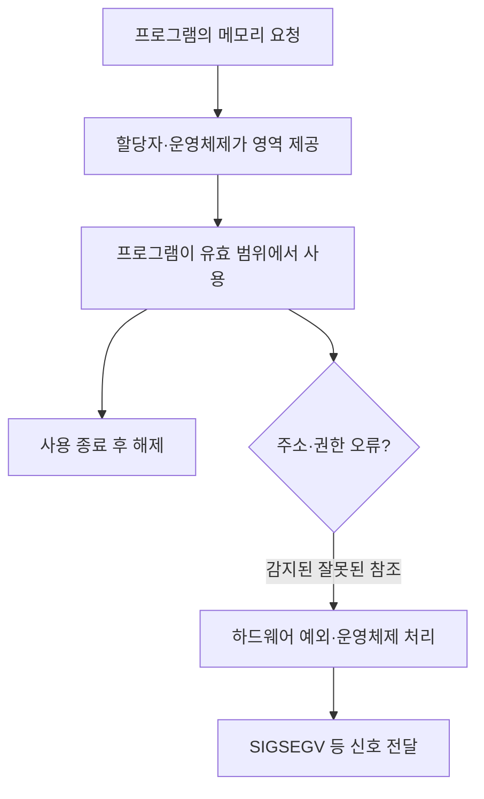
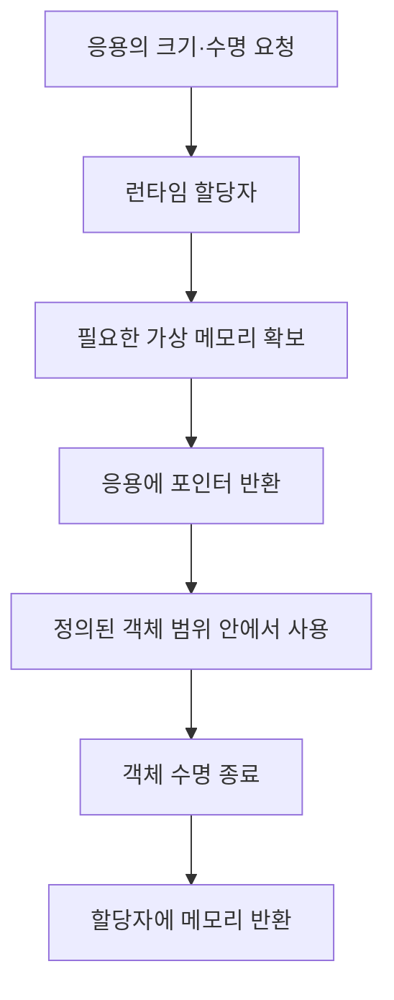
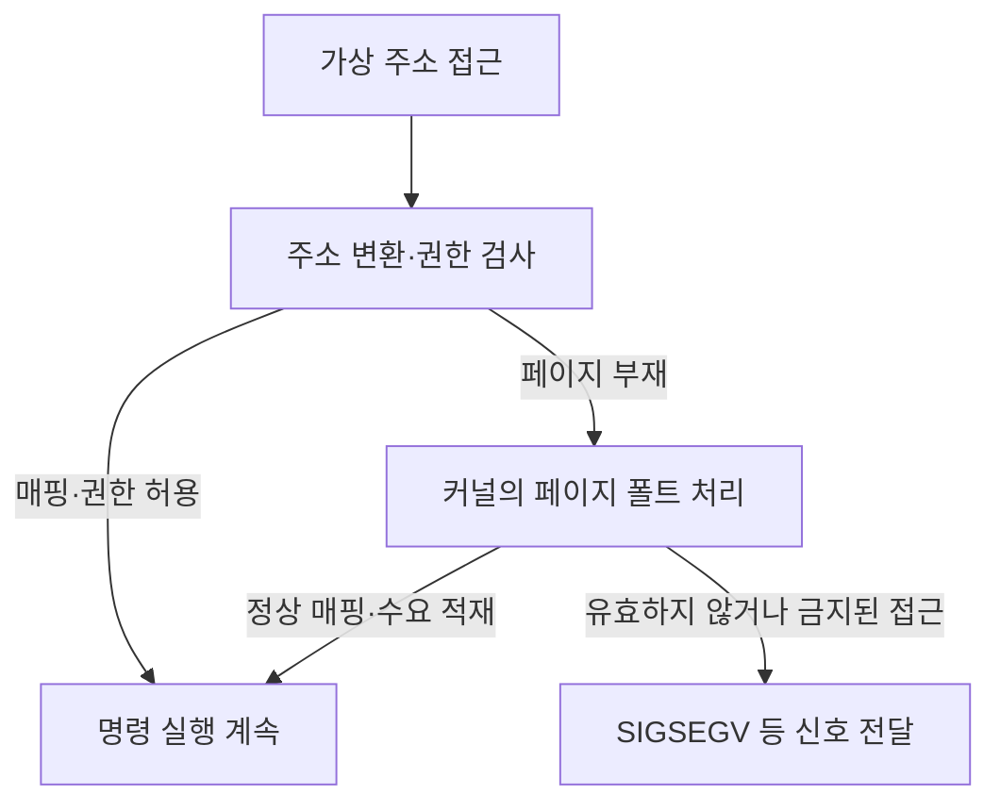

---
sidebar:
  order: 69
  label: "069. 동적 메모리·세그멘테이션 오류"
  badge:
    text: "기초"
    variant: note
title: "동적 메모리 할당과 세그멘테이션 오류"
author: "GPT-6"
date: "2026-09-24T20:27:00+09:00"
tags:
  - "notes-computer-system"
weight: 69
extra:
  model: "GPT-6"
  keyword_grade: "기초"
  question_no: "069"
---

## 지식 로드맵 내 현재 위치

컴퓨터 시스템 → 프로세스 메모리 → 동적 할당·주소 보호 → 세그멘테이션 오류

## 30초 인출

- 본질: **동적 메모리 할당 (Dynamic Memory Allocation)** 은 실행 중 필요한 메모리를 확보·반환하는 기능이며, 잘못된 주소 접근은 프로세스의 메모리 오류로 이어질 수 있음
- 메커니즘: 할당된 객체의 크기·수명을 관리하고, 유효하지 않거나 권한 없는 주소 접근을 운영체제와 하드웨어가 감지하면 `SIGSEGV` 등 신호로 알림

핵심 용어

- **동적 메모리 할당 (Dynamic Memory Allocation)**: 프로그램 실행 중 필요한 크기의 메모리 영역을 요청하고 사용 후 반환하는 방식
- **힙 (Heap)**: 실행 중 동적으로 생성한 객체의 저장에 쓰이는 프로세스 메모리 영역
- **세그멘테이션 오류 (Segmentation Fault)**: 잘못된 메모리 참조에 대해 운영체제가 프로세스에 보내는 오류 신호 또는 그로 인한 실행 오류
- **SIGSEGV (Segmentation Violation)**: Linux에서 잘못된 메모리 참조를 알리는 신호 이름
- **MMU (Memory Management Unit)**: 가상 주소 변환과 메모리 접근 권한 확인을 수행하는 하드웨어 기능
- **댕글링 포인터 (Dangling Pointer)**: 수명이 끝난 객체 또는 반환된 메모리를 계속 가리키는 포인터
- **정의되지 않은 동작 (Undefined Behavior, UB)**: 언어 규칙에 맞지 않는 동작으로 결과를 보장할 수 없는 상태
- **RAII (Resource Acquisition Is Initialization)**: C++에서 객체 수명과 자원 획득·해제를 연결하는 관리 관용구

---

## 1교시 예상문제 (10점)

> 동적 메모리 할당과 세그멘테이션 오류에 관하여 설명하시오. (예상)

---

## 1교시 10점 답안

## Ⅰ. 개요

| 구분 | 핵심 |
|---|---|
| 정의 | **동적 메모리 할당 (Dynamic Memory Allocation)** 은 프로그램 실행 중 필요한 메모리를 요청·사용·반환하는 기능 |
| 목적 | 실행 중 생성되는 객체의 메모리 수명·용량 관리와 프로세스 주소 공간 보호 |

## Ⅱ. 할당과 오류 감지 흐름

- 제언: 할당·해제 소유권을 명확히 하고 범위·수명 오류를 자동 시험으로 탐지

---

## 2~4교시 예상문제 (25점)

> 동적 메모리 할당과 세그멘테이션 오류의 관계를 설명하고, 주요 오류 유형과 예방·진단 방안을 논하시오. (예상)

---

## 2~4교시 25점 답안

## Ⅰ. 개요

| 구분 | 핵심 |
|---|---|
| 정의 | **동적 메모리 할당 (Dynamic Memory Allocation)** 은 프로그램 실행 중 필요한 메모리를 요청·사용·반환하는 기능 |
| 목적 | 실행 중 생성되는 객체의 메모리 수명·용량 관리와 프로세스 주소 공간 보호 |

## Ⅱ. 메모리 할당·사용·해제

| 단계 | 담당 | 주의사항 |
|---|---|---|
| 요청 | 응용 프로그램 | 객체 크기·수명과 산술 오버플로 확인 |
| 할당 | 런타임 할당자·운영체제 | 실패 처리와 접근 권한 확인 |
| 사용 | 응용 프로그램 | 배열 범위·객체 수명·동시 접근 준수 |
| 해제 | 응용 프로그램·할당자 | 한 번만 해제하고 이후 포인터 사용 금지 |

## Ⅲ. 오류 유형과 프로세스 영향

| 오류 유형 | 의미 | 대표 결과 |
|---|---|---|
| 널·비매핑 주소 역참조 | 읽기·쓰기가 허용되지 않는 주소 접근 | 감지되면 `SIGSEGV` 등 신호 발생 가능 |
| 범위 초과 접근 | 배열·객체의 유효 범위를 벗어난 접근 | 정의되지 않은 동작; 반드시 즉시 오류 신호가 발생하는 것은 아님 |
| 해제 후 사용 | 반환된 객체를 댕글링 포인터로 접근 | 데이터 손상·정보 노출·취약점 또는 오류 신호 가능 |
| 잘못된 해제·이중 해제 | 유효하지 않은 포인터를 해제하거나 이미 해제한 영역을 재해제 | 할당자 상태 손상 또는 프로세스 오류 가능 |

## Ⅳ. 접근 위반과 세그멘테이션 오류

세그멘테이션 오류는 범위 초과를 모두 즉시 잡는 경계 검사기가 아니며, 프로세스가 접근한 주소·권한과 플랫폼 처리에 따라 감지 여부가 달라짐.

## Ⅴ. `SIGSEGV`와 `SIGBUS` 구분

| 신호 | 일반적인 의미 | 적용 시 주의 |
|---|---|---|
| `SIGSEGV` | 잘못된 메모리 참조 | 가상 주소 미매핑·권한 위반 등에서 발생 가능 |
| `SIGBUS` | 메모리 객체의 유효하지 않은 부분 접근 등 버스 오류 | 하드웨어·파일 매핑·아키텍처 조건에 따라 사례 차이 |

Linux 문서는 특정 하드웨어 예외가 어떤 신호로 전달되는지가 CPU 아키텍처에 따라 다를 수 있음을 명시하므로 신호명만으로 원인을 단정하지 않음.

## Ⅵ. 예방·진단 방안

| 위험 | 예방·진단 |
|---|---|
| 할당 크기·배열 경계 오류 | 크기 산술 검증·경계 시험·정적 분석 |
| 객체 수명·소유권 혼선 | 단일 해제 책임·RAII·소유권이 드러나는 API 사용 |
| 동시 실행 중 해제·참조 경쟁 | 수명·동기화 설계 검토·경쟁 상태 시험 |
| 재현이 어려운 런타임 오류 | 코어 덤프·스택 추적·AddressSanitizer 등 진단 도구 활용 |

## Ⅶ. 기술사적 제언

| 한계 | 해결 방안 |
|---|---|
| 운영 장애 후 코어 덤프만 수집하면 잘못된 참조가 처음 만들어진 경로를 찾기 어려울 수 있음 | 빌드·시험 단계에 메모리 안전 도구를 적용하고 재현 입력·스택 정보를 결함 분석에 연결 |

---

## 출제 이력과 검증 출처

- **기출 이력**: 제136회 3교시 동적 메모리 할당 관련 문항
- **검증 출처**:
  - [Linux Kernel: Page Tables and Page Faults](https://docs.kernel.org/mm/page_tables.html)
  - [Linux man-pages: signal(7)](https://man7.org/linux/man-pages/man7/signal.7.html)
  - [SEI CERT C: ARR30-C, Out-of-bounds pointers and subscripts](https://wiki.sei.cmu.edu/confluence/spaces/c/pages/87152322/ARR30-C.%2BDo%2Bnot%2Bform%2Bor%2Buse%2Bout-of-bounds%2Bpointers%2Bor%2Barray%2Bsubscripts)
  - [SEI CERT C: MEM30-C, Do not access freed memory](https://wiki.sei.cmu.edu/confluence/display/c/MEM30-C.%2BDo%2Bnot%2Baccess%2Bfreed%2Bmemory)

---

## 연결 토픽

- 관련 토픽: [세그멘테이션 오류](./071_segmentation_fault.md), [가상 메모리](./023_virtual_memory.md)
