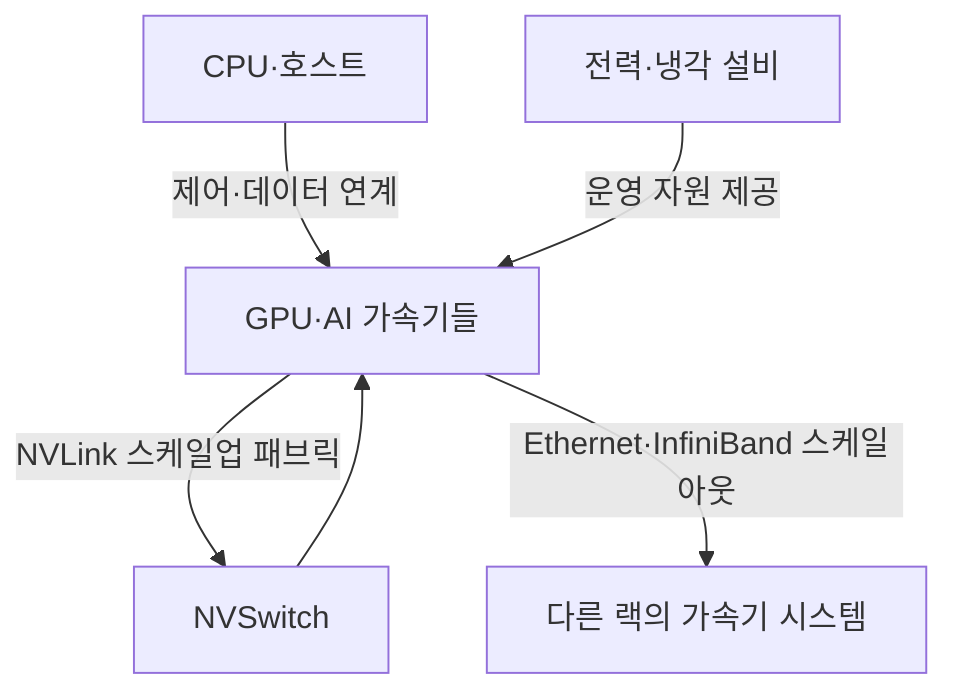
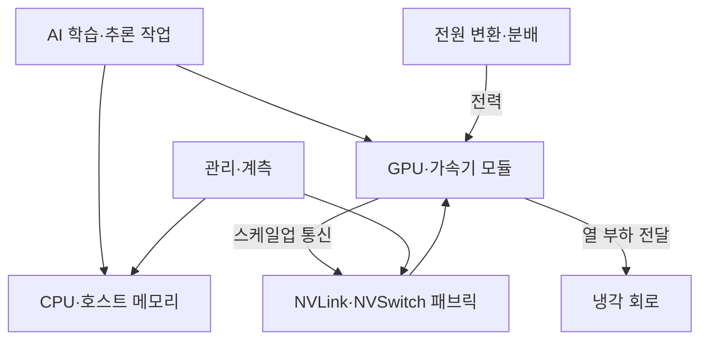

---
sidebar:
  order: 70
  label: "070. 랙스케일 AI 시스템"
  badge:
    text: "응용"
    variant: note
title: "랙스케일 AI 시스템 (GB200 NVL72·Vera Rubin NVL72)"
author: "GPT-6"
date: "2026-09-24T20:27:00+09:00"
tags:
  - "notes-computer-system"
weight: 70
extra:
  model: "GPT-6"
  keyword_grade: "응용"
  question_no: "070"
---

## 지식 로드맵 내 현재 위치

AI 인프라 → 가속기 시스템 → 랙스케일 통합 → NVLink 패브릭

## 30초 인출

- 본질: **랙스케일 AI 시스템 (Rack-Scale AI System)** 은 여러 가속기·CPU·스위치와 전력·냉각 설비를 랙 단위로 통합한 AI 컴퓨팅 시스템
- 메커니즘: 랙 내부 스케일업 패브릭으로 가속기 간 통신을 확장하고, Ethernet·InfiniBand 등으로 여러 랙을 연결

핵심 용어

- **랙스케일 시스템 (Rack-Scale System)**: 서버·가속기·네트워크·전력·냉각을 랙 단위 시스템으로 설계·운영하는 방식
- **GB200 NVL72**: NVIDIA의 72 Blackwell GPU·36 Grace CPU를 NVLink 도메인으로 연결하는 랙 규모 시스템
- **Vera Rubin NVL72**: NVIDIA가 2026년 발표한 72 Rubin GPU·36 Vera CPU 기반 차세대 랙 시스템
- **NVLink**: NVIDIA GPU 사이의 고속 스케일업 인터커넥트
- **NVSwitch**: NVLink를 여러 GPU 사이에 스위칭하는 칩
- **GPU (Graphics Processing Unit)**: 대규모 병렬 계산에 특화된 프로세서
- **Scale-up / Scale-out**: 각각 한 시스템·랙 안에서 자원을 확장하는 방식과 여러 시스템·랙을 네트워크로 확장하는 방식
- **D2C (Direct-to-Chip Cooling)**: 냉각판을 칩에 가까이 배치해 열을 액체 냉각 회로로 전달하는 방식

---

## 1교시 예상문제 (10점)

> 랙스케일 AI 시스템에 관하여 설명하시오. (예상)

---

## 1교시 10점 답안

## Ⅰ. 랙스케일 AI 시스템의 개요

| 구분 | 핵심 |
|---|---|
| 정의 | **랙스케일 AI 시스템 (Rack-Scale AI System)** 은 여러 가속기·CPU·스위치와 전력·냉각 설비를 랙 단위로 통합한 컴퓨팅 시스템 |
| 목적 | 가속기 간 통신·전력·냉각·운영을 공동 설계해 AI 작업의 확장 기반 제공 |

## Ⅱ. 랙 내부 연결 구조

- 제언: 가속기 연결 규모를 기준으로 랙 전력·냉각·패브릭의 수용 능력을 함께 검토

---

## 2~4교시 예상문제 (25점)

> 랙스케일 AI 시스템의 구성과 확장 구조를 설명하고, 가속기 패브릭·전력·냉각의 설계 고려사항을 논하시오. (예상)

---

## 2~4교시 25점 답안

## Ⅰ. 랙스케일 AI 시스템의 개요

| 구분 | 핵심 |
|---|---|
| 정의 | **랙스케일 AI 시스템 (Rack-Scale AI System)** 은 여러 가속기·CPU·스위치와 전력·냉각 설비를 랙 단위로 통합한 컴퓨팅 시스템 |
| 목적 | 가속기 간 통신·전력·냉각·운영을 공동 설계해 AI 작업의 확장 기반 제공 |

## Ⅱ. 랙 내부 구성

| 구성 | 역할 |
|---|---|
| 컴퓨트 트레이 | CPU·GPU·메모리·로컬 저장 장치 탑재 |
| 스위치 트레이 | 여러 GPU 사이의 NVLink 연결 구성 |
| 전원 셸프·버스바 | 랙 장비에 전력 공급·분배 |
| 냉각 매니폴드 | 랙 냉각 회로의 유체 공급·회수 |
| 관리 구성 요소 | 트레이·스위치·전원·냉각 상태 관측 |

## Ⅲ. NVLink 도메인과 서버 간 네트워크

| 연결 범위 | 역할 | 설계 관점 |
|---|---|---|
| 랙 내부 스케일업 | NVLink·NVSwitch로 GPU 간 통신 | 도메인 규모·집단 통신·패브릭 관리 |
| 랙 간 스케일아웃 | Ethernet·InfiniBand 등으로 노드·랙 연결 | 라우팅·혼잡·스토리지·관리망 분리 |
| 다중 랙 시스템 | 스케일업 랙들을 클러스터로 통합 | 작업 분할·스케줄링·장애 도메인 |

GB200 NVL72는 NVIDIA 자료 기준 72 Blackwell GPU·36 Grace CPU·9개 NVLink 스위치 트레이 구성이며, GPU들이 하나의 NVLink 도메인으로 연결되는 시스템. 세대·제품별 구성과 성능 수치는 해당 제조사 사양으로 확인.

## Ⅳ. 랙 규모 시스템의 세대별 구성 예

| 시스템 예 | 제조사 발표 구성 | 자료의 상태 |
|---|---|---|
| GB200 NVL72 | 72 Blackwell GPU·36 Grace CPU·NVLink 5 기반 랙 | NVIDIA 제품·시스템 문서 |
| Vera Rubin NVL72 | 72 Rubin GPU·36 Vera CPU·NVLink 6 기반 랙 | NVIDIA 2026년 발표 플랫폼 |

제조사 발표 성능 수치와 구성은 제품 세대·구성·평가 조건이 다를 수 있으므로 단순 비교 시 조건 병기.

## Ⅴ. 랙스케일·서버스케일 비교

| 비교 축 | 서버스케일 GPU 서버 | 랙스케일 GPU 시스템 |
|---|---|---|
| 통합 단위 | 서버·노드 | 랙 또는 NVLink 도메인 |
| GPU 연결 | 서버 내부 고속 인터커넥트 | 여러 트레이의 GPU를 스위치 패브릭으로 확장 |
| 서버 간 확장 | Ethernet·InfiniBand 등 | 랙 내부 스케일업과 랙 간 스케일아웃 조합 |
| 운영 영향 | 서버별 전력·냉각 구성 | 랙 전력 분배·액체 냉각·패브릭을 공동 운영 |

## Ⅵ. 설계 한계와 대응

| 한계 | 대응 |
|---|---|
| 랙 전력·발열이 기존 시설의 공급·제거 용량을 초과할 수 있음 | 제품의 실제 전력·냉각 요구와 시설 용량을 대조한 단계별 수용성 시험 |
| 고속 패브릭의 링크·스위치 장애가 다수 가속기에 영향 | 경로·스위치 상태 관측, 장애 격리·정비 절차 검증 |
| 액체 냉각 도입으로 누수·정비·운영 절차가 추가 | 누수 감지·유체 연결·서비스 접근 절차를 설치·운영 시험에 포함 |
| 랙·제품 공급 시점과 데이터센터 구축 일정의 불일치 | 전력·냉각·네트워크 준비를 장비 반입·가동 승인과 연계 |

## Ⅶ. 기술사적 제언

| 한계 | 해결 방안 |
|---|---|
| 제품 카탈로그의 최대 구성을 시설에 그대로 적용하면 현장별 전력·냉각·운영 제약을 놓칠 수 있음 | 실제 채택 구성으로 한 랙 검증을 먼저 수행하고, 시설 계측 결과를 기준으로 확장 승인 |

---

## 출제 이력과 검증 출처

- **기출 이력**: 기출 확인 없음; 랙스케일 시스템 개념 중심 예상문제
- **검증 출처**:
  - [NVIDIA: DGX GB Rack Scale Systems User Guide](https://docs.nvidia.com/dgx/dgxgb200-user-guide/)
  - [NVIDIA: GB200 NVL72 specifications](https://www.nvidia.com/en-us/data-center/gb200-nvl72/)
  - [NVIDIA: Vera Rubin NVL72 announcement](https://investor.nvidia.com/news/press-release-details/2026/NVIDIA-Vera-Rubin-Opens-Agentic-AI-Frontier/)
  - [NVIDIA DGX Vera Rubin NVL72](https://www.nvidia.com/en-eu/data-center/dgx-vera-rubin-nvl72/)

---

## 연결 토픽

- 관련 토픽: [GPU](./083_gpgpu.md), [HBM](./079_hbm.md), [UALink](./067_ualink_1_0.md)
