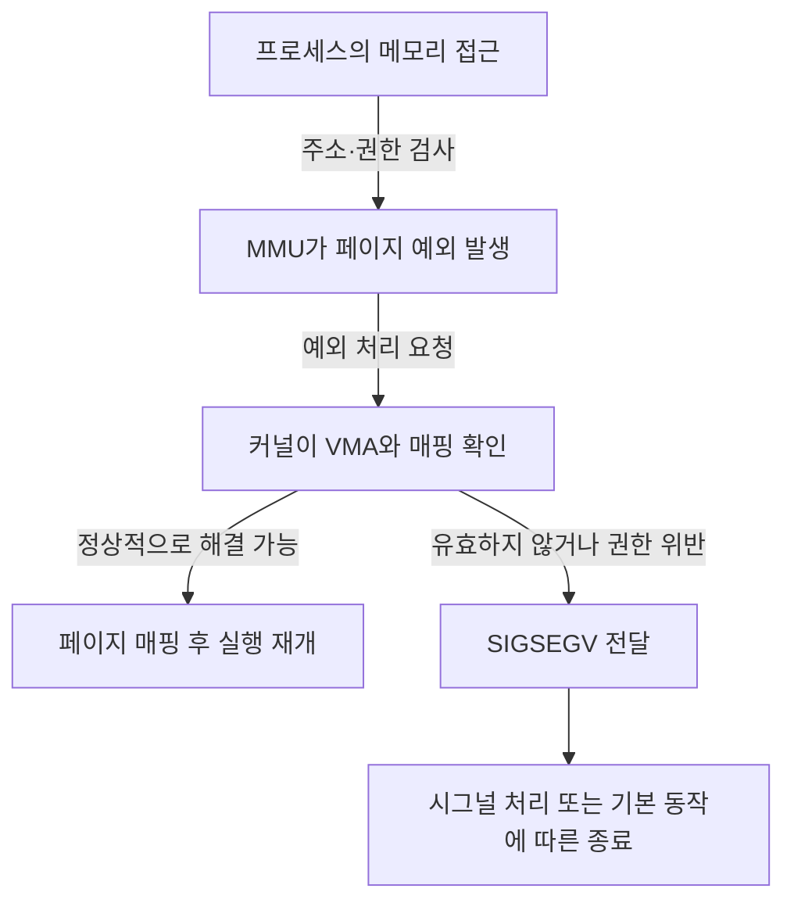
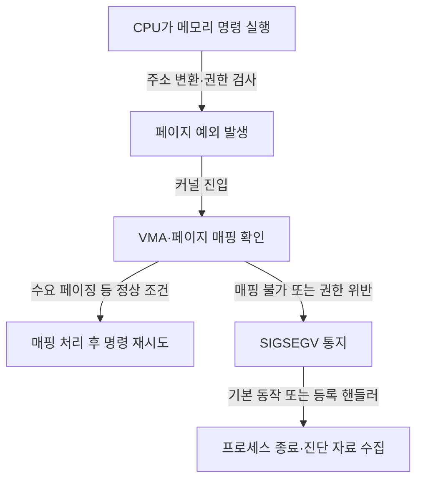

---
sidebar:
  order: 71
  label: "071. 세그먼테이션 오류"
  badge:
    text: "기초"
    variant: note
title: "세그먼테이션 오류 (Segmentation Fault)"
author: "GPT-6"
date: "2026-09-24T21:30:00+09:00"
tags:
  - "notes-computer-system"
extra:
  model: "GPT-6"
  keyword_grade: "기초"
  question_no: "071"
---

## 지식 로드맵 내 현재 위치

컴퓨터 시스템 및 네트워크 → 핵심 개념 → 가상 메모리 접근 오류

## 30초 인출

- 본질: **세그먼테이션 오류 (Segmentation Fault)**는 프로세스가 허용되지 않은 가상 메모리에 접근해 운영체제가 접근 실패를 알리는 오류
- 메커니즘: 잘못된 주소·권한 접근 → CPU 예외 → 커널의 주소 매핑 확인 → 미해결이면 `SIGSEGV` 전달

핵심 용어

- **세그먼테이션 오류 (Segmentation Fault)**: 프로세스의 가상 메모리 접근이 유효하지 않아 발생하는 실행 오류
- **MMU (Memory Management Unit)**: 가상 주소 변환과 접근 권한 확인을 수행하는 하드웨어 구성 요소
- **VMA (Virtual Memory Area)**: Linux 프로세스의 가상 주소 구간과 접근 권한을 나타내는 커널 자료구조
- **SIGSEGV (Segmentation Violation Signal)**: 잘못된 메모리 접근을 프로세스에 알리는 POSIX 시그널
- **코어 덤프 (Core Dump)**: 비정상 종료 시점의 프로세스 상태를 분석하기 위해 저장하는 자료

---

## 1교시 예상문제 (10점)

> 세그먼테이션 오류의 개념과 발생·처리 과정을 설명하시오. (예상)

---

## 1교시 10점 답안

### Ⅰ. 개요

| 구분 | 핵심 |
|---|---|
| 정의 | **세그먼테이션 오류 (Segmentation Fault)**는 프로세스의 가상 주소 접근이 매핑·권한 조건을 만족하지 못해 커널이 오류를 통지하는 현상 |
| 목적 | 잘못된 접근을 탐지하고 해당 프로세스의 오류를 격리해 다른 실행 영역의 손상을 줄이는 메모리 보호 기능 |

### Ⅱ. 발생과 처리

### Ⅲ. 제언

- 제언: 포인터 검증·메모리 보호 설정·코어 덤프 분석을 함께 운영하는 오류 대응 체계

---

## 2~4교시 예상문제 (25점)

> 세그먼테이션 오류의 발생 원인과 운영체제의 처리 과정을 설명하고, 진단·예방 방안을 제시하시오. (예상)

---

## 2~4교시 25점 답안

### Ⅰ. 개요

| 구분 | 핵심 |
|---|---|
| 정의 | **세그먼테이션 오류 (Segmentation Fault)**는 프로세스의 가상 주소 접근이 매핑·권한 조건을 만족하지 못해 커널이 오류를 통지하는 현상 |
| 목적 | 잘못된 접근을 탐지하고 해당 프로세스의 오류를 격리해 다른 실행 영역의 손상을 줄이는 메모리 보호 기능 |

### Ⅱ. 발생 원인

| 원인 | 접근 사례 | 운영체제 관점 |
|---|---|---|
| 미매핑 주소 | 해제된 포인터·잘못된 주소 사용 | 유효한 가상 메모리 구간이 없음 |
| 권한 위반 | 읽기 전용 페이지에 쓰기 | 페이지 권한과 접근 종류 불일치 |
| 수명 오류 | 객체 해제 후 포인터 사용 | 프로그램의 객체 수명 관리 결함 |

### Ⅲ. 예외 처리 흐름

### Ⅳ. 시그널과 진단 자료

| 항목 | 의미 | 진단 활용 |
|---|---|---|
| `SIGSEGV` | 잘못된 주소·권한 접근 통지 | 시그널 코드와 오류 주소 확인 |
| 코어 덤프 | 충돌 시 메모리·레지스터 상태 | 디버거로 호출 경로와 변수 상태 조사 |
| 스택 추적 | 함수 호출 관계 | 오류 발생 경로의 재현·원인 분석 |

### Ⅴ. `SIGBUS`와 구분

| 구분 | `SIGSEGV` | `SIGBUS` |
|---|---|---|
| 공통점 | 메모리 접근 관련 시그널이며 구체 원인은 플랫폼·상황별 확인 필요 | 메모리 접근 관련 시그널이며 구체 원인은 플랫폼·상황별 확인 필요 |
| 대표 사례 | 주소 매핑·접근 권한 위반 | 파일 매핑 영역의 유효 범위 밖 접근 등 |
| 유의점 | 시그널 이름만으로 버그 원인을 단정하지 않고 오류 주소·코드 확인 | 모든 `SIGBUS`를 정렬 오류로 한정하지 않음 |

### Ⅵ. 예방과 대응

| 단계 | 대응 |
|---|---|
| 개발 | 포인터·배열 경계 검사, 안전한 메모리 수명 관리, 정적·동적 분석 |
| 운영 | 코어 덤프 정책과 저장 용량·접근 통제 구성 |
| 장애 분석 | 오류 주소, 시그널 코드, 호출 스택, 빌드 심볼을 함께 확인 |

### Ⅶ. 기술사적 제언

| 한계 | 해결 방안 |
|---|---|
| 운영 환경에서 충돌을 빠르게 탐지해도 재현 자료가 부족하면 원인 분석이 지연될 수 있음 | 핵심 서비스별 코어 덤프 수집 정책과 개인정보 제거·보존 기간을 정하고, 오류 주소·호출 경로 기반 회귀 테스트로 수정 효과 확인 |

---

## 출제 이력과 검증 출처

- 제136회 1교시 7번: “세그먼테이션 오류 (Segmentation Fault)” 출제 이력 유지
- 검증 출처:
  - [Linux man-pages: signal(7)](https://man7.org/linux/man-pages/man7/signal.7.html)
  - [Linux kernel documentation: Memory Management](https://kernel.org/doc/html/latest/admin-guide/mm/index.html)
  - [Linux kernel documentation: Userfaultfd](https://docs.kernel.org/admin-guide/mm/userfaultfd.html)

---

## 연결 토픽

- 관련 개념: [가상 메모리](./023_virtual_memory.md), [동적 메모리 할당](./069_dynamic_memory_allocation_segmentation_fault.md)