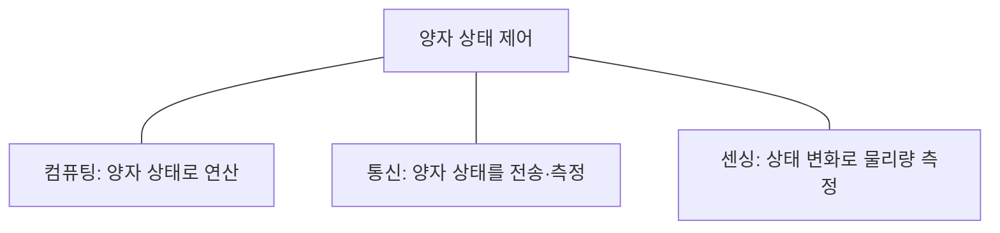
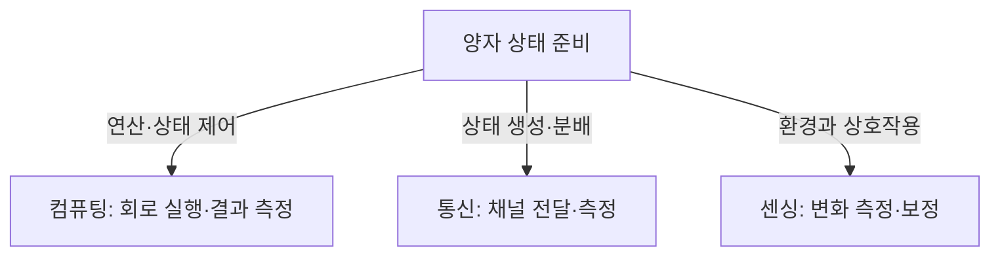
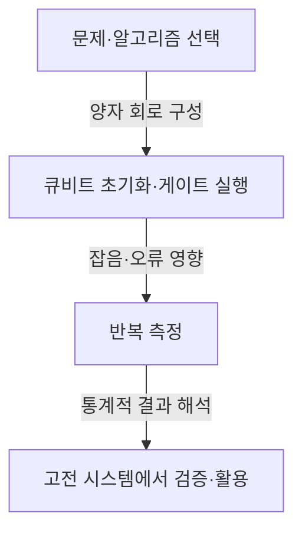

---
sidebar:
  order: 72
  label: "072. 양자기술"
  badge:
    text: "서브"
    variant: note
title: "양자기술 (Quantum Technology)"
author: "GPT-6"
date: "2026-09-24T21:30:00+09:00"
tags:
  - "notes-computer-system"
extra:
  model: "GPT-6"
  keyword_grade: "서브"
  question_no: "072"
---

## 지식 로드맵 내 현재 위치

컴퓨터 시스템 및 네트워크 → 차세대 컴퓨팅 기반 → 양자기술

## 30초 인출

- 본질: **양자기술 (Quantum Technology)**은 중첩·얽힘 등 양자역학의 성질을 정보 처리·통신·측정에 활용하는 기술군
- 메커니즘: 큐비트 상태를 준비·변환하고 측정하며, 성능은 오류·제어·측정 조건에 좌우

핵심 용어

- **양자기술 (Quantum Technology)**: 양자역학의 효과를 컴퓨팅·통신·센싱에 이용하는 기술 분야
- **큐비트 (Qubit)**: 양자 상태의 중첩을 표현하는 양자 정보의 기본 단위
- **중첩 (Superposition)**: 측정 전 양자 상태를 여러 기저 상태의 선형결합으로 표현하는 성질
- **얽힘 (Entanglement)**: 복합계의 상태를 각 구성 요소의 독립 상태만으로 설명할 수 없는 상관관계
- **NISQ (Noisy Intermediate-Scale Quantum)**: 오류가 존재하며 대규모 오류정정이 완성되지 않은 현재의 중간 규모 양자컴퓨팅 단계
- **PQC (Post-Quantum Cryptography)**: 양자컴퓨터의 공격 가능성을 고려해 설계된 고전 컴퓨터용 암호 알고리즘

---

## 1교시 예상문제 (10점)

> 양자기술의 개념과 컴퓨팅·통신·센싱 분야를 설명하시오. (예상)

---

## 1교시 10점 답안

### Ⅰ. 개요

| 구분 | 핵심 |
|---|---|
| 정의 | **양자기술 (Quantum Technology)**은 양자역학의 중첩·얽힘 등 양자 상태를 정보 처리·전달·측정에 활용하는 기술 분야 |
| 목적 | 고전 기술과 다른 방식으로 계산·보안 통신·정밀 측정의 가능성을 넓히는 것 |

### Ⅱ. 핵심 분야

| 분야 | 핵심 대상 | 기술 예 |
|---|---|---|
| 컴퓨팅 | 양자 상태를 계산에 이용 | 양자 회로, 양자 시뮬레이션 |
| 통신 | 양자 상태의 분배·측정 | 양자 키 분배, 양자 네트워크 연구 |
| 센싱 | 양자 상태의 민감한 변화 측정 | 원자시계, 양자 센서 |

### Ⅲ. 제언

- 제언: 문제 특성·기술 성숙도·오류 허용도를 기준으로 양자기술의 적용 타당성을 검증하는 접근

---

## 2~4교시 예상문제 (25점)

> 양자기술의 기반 원리와 컴퓨팅·통신·센싱의 구조를 설명하고, 정보시스템 도입 시 고려사항을 제시하시오. (예상)

---

## 2~4교시 25점 답안

### Ⅰ. 개요

| 구분 | 핵심 |
|---|---|
| 정의 | **양자기술 (Quantum Technology)**은 양자역학의 중첩·얽힘 등 양자 상태를 정보 처리·전달·측정에 활용하는 기술 분야 |
| 목적 | 고전 기술과 다른 방식으로 계산·보안 통신·정밀 측정의 가능성을 넓히는 것 |

### Ⅱ. 기반 원리

| 원리 | 의미 | 시스템 고려 |
|---|---|---|
| 중첩 | 상태를 여러 기저 상태의 선형결합으로 표현 | 측정 결과는 확률적으로 얻으며 중간 상태를 임의 복제할 수 없음 |
| 얽힘 | 복합 양자계 사이의 비고전적 상관관계 | 상태 준비·유지·측정에 정밀한 제어 필요 |
| 측정 | 상태와 관측량에 따른 결과 획득 | 결과 검증과 반복 실험이 중요 |

### Ⅲ. 분야별 구조

| 분야 | 입력·처리 | 대표 목적 |
|---|---|---|
| 컴퓨팅 | 큐비트 상태에 게이트를 적용하고 측정 | 특정 계산·시뮬레이션 탐색 |
| 통신 | 양자 상태를 채널로 전달하고 측정 | 키 분배·네트워크 연구 |
| 센싱 | 양자계의 물리량 민감도 이용 | 시간·자기장 등 측정 정밀도 향상 |

### Ⅳ. 컴퓨팅의 실행 특성

| 고려 요소 | 설명 |
|---|---|
| 문제 적합성 | 양자 알고리즘이 이점을 가질 수 있는 문제인지 검토 |
| 오류 | 물리 큐비트의 잡음과 게이트 오류가 결과에 영향 |
| 하이브리드 실행 | 고전 컴퓨터가 전처리·제어·결과 분석을 담당할 수 있음 |

### Ⅴ. 보안기술과 구분

| 구분 | 기반 | 활용·유의점 |
|---|---|---|
| 양자 키 분배 (QKD, Quantum Key Distribution) | 양자 상태 측정 특성 | 키 분배 기술이며 종단 간 보안 전체를 대신하지 않음 |
| 양자내성암호 (PQC, Post-Quantum Cryptography) | 고전 수학 알고리즘 | 기존 시스템 암호 전환 계획과 상호운용성 검토 필요 |

### Ⅵ. 도입 고려사항

| 한계 | 대응 |
|---|---|
| 기술별 성숙도와 오류 특성이 다르고 성능을 단일 큐비트 수로 비교하기 어려움 | 실제 업무 문제를 기준으로 정확도·실행시간·자원·고전 기준선을 함께 시험 |
| QKD·PQC를 양자컴퓨터 자체와 혼동하면 보안 설계가 왜곡될 수 있음 | 암호 민첩성·키 관리·전송 보안을 포함한 현행 보안 구조와 통합 검토 |

### Ⅶ. 기술사적 제언

| 한계 | 해결 방안 |
|---|---|
| 연구 성과를 곧바로 업무 효과로 간주하면 과도한 투자나 기술 종속 위험 | 제한된 문제군에서 고전 기준선과 비교 실증을 수행하고, 검증된 이점·운영비·인력 조건을 충족할 때 확대 |

---

## 출제 이력과 검증 출처

- 기출 확인 없음. 예상문제는 표제어인 양자기술의 원리와 세 분야를 직접 다루도록 구성
- 검증 출처:
  - [NIST: Quantum Information Science](https://www.nist.gov/quantum-information-science)
  - [NIST: Quantum Computing Explained](https://www.nist.gov/quantum-information-science/quantum-computing-explained)
  - [NIST: Quantum Science](https://www.nist.gov/quantum-science)