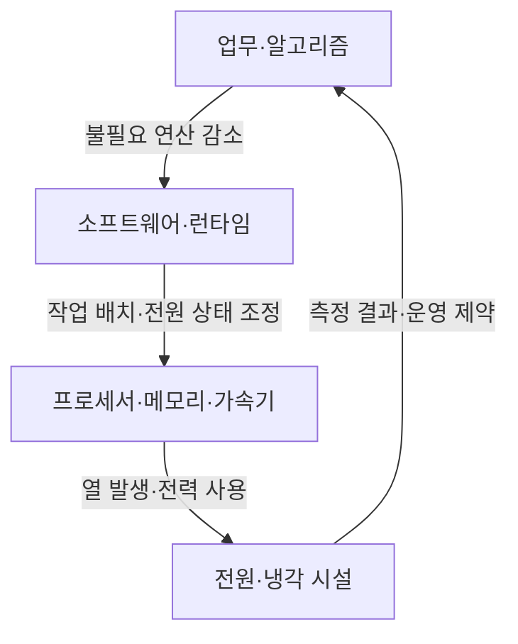
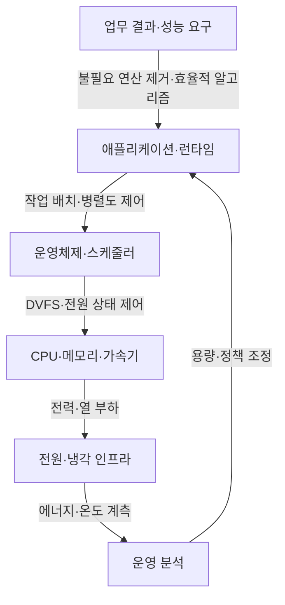
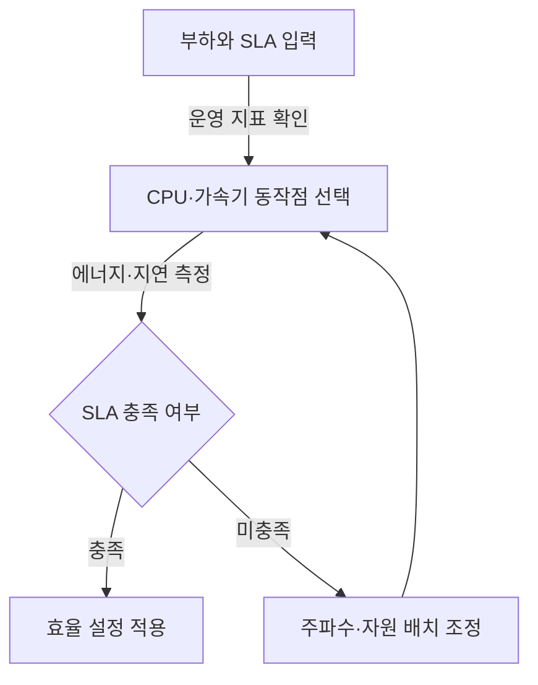
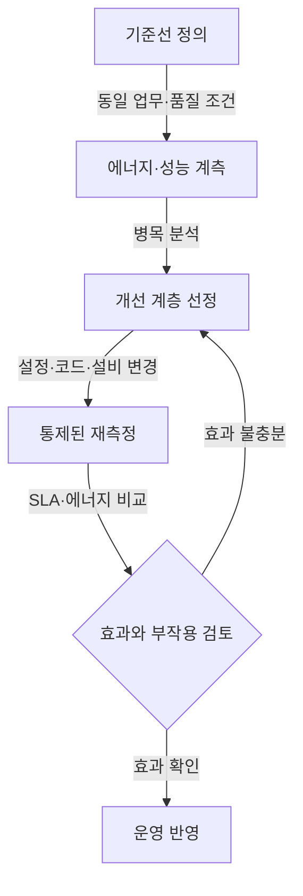

---
sidebar:
  order: 73
  label: "073. 에너지 효율 컴퓨팅"
  badge:
    text: "기초"
    variant: note
title: "에너지 효율 컴퓨팅"
author: "GPT-6"
date: "2026-09-24T21:30:00+09:00"
tags:
  - "notes-computer-system"
extra:
  model: "GPT-6"
  keyword_grade: "기초"
  question_no: "073"
---

## 지식 로드맵 내 현재 위치

컴퓨터 시스템 및 네트워크 → 컴퓨터 구조·운영 → 에너지 효율 컴퓨팅

## 30초 인출

- 본질: **에너지 효율 컴퓨팅 (Energy-Efficient Computing)**은 필요한 성능과 서비스 품질을 유지하면서 계산에 쓰이는 에너지를 줄이는 설계·운영 접근
- 메커니즘: 작업량·성능·에너지를 측정하고, 소프트웨어부터 장비·시설까지 병목이 있는 계층을 개선

핵심 용어

- **에너지 효율 컴퓨팅 (Energy-Efficient Computing)**: 업무 결과와 서비스 품질을 고려해 계산 에너지 사용을 최적화하는 접근
- **DVFS (Dynamic Voltage and Frequency Scaling)**: 부하와 성능 요구에 따라 프로세서 전압·주파수 동작점을 조절하는 기술
- **성능/와트 (Performance per Watt)**: 사용 에너지 대비 처리 성능을 보는 지표
- **PUE (Power Usage Effectiveness)**: 데이터센터 전체 에너지를 IT 장비 에너지로 나눈 시설 에너지 지표
- **전력 관리 (Power Management)**: 장비의 동작 상태·전압·주파수 등을 조정해 전력 사용을 제어하는 기능

---

## 1교시 예상문제 (10점)

> 에너지 효율 컴퓨팅의 개념과 주요 최적화 계층을 설명하시오. (예상)

---

## 1교시 10점 답안

### Ⅰ. 개요

| 구분 | 핵심 |
|---|---|
| 정의 | **에너지 효율 컴퓨팅 (Energy-Efficient Computing)**은 필요한 처리 성능과 서비스 품질을 고려하면서 계산에 쓰이는 에너지를 줄이는 설계·운영 접근 |
| 목적 | 에너지 비용·전력 제약을 관리하면서 업무 요구 성능을 제공하는 것 |

### Ⅱ. 최적화 계층

### Ⅲ. 제언

- 제언: 동일한 업무량·품질 조건에서 에너지와 성능을 함께 계측하는 최적화 기준

---

## 2~4교시 예상문제 (25점)

> 에너지 효율 컴퓨팅의 개념과 계층별 최적화 구조를 설명하고, 정보시스템 적용 시 측정·개선 방안을 제시하시오. (예상)

---

## 2~4교시 25점 답안

### Ⅰ. 개요

| 구분 | 핵심 |
|---|---|
| 정의 | **에너지 효율 컴퓨팅 (Energy-Efficient Computing)**은 필요한 처리 성능과 서비스 품질을 고려하면서 계산에 쓰이는 에너지를 줄이는 설계·운영 접근 |
| 목적 | 에너지 비용·전력 제약을 관리하면서 업무 요구 성능을 제공하는 것 |

### Ⅱ. 계층별 개선 구조

| 계층 | 개선 수단 | 측정 관점 |
|---|---|---|
| 소프트웨어 | 알고리즘 선택, 중복 연산·데이터 이동 감소 | 작업당 에너지, 처리시간, 결과 품질 |
| 시스템 | 스케줄링, 유휴 상태, DVFS, 가속기 적합성 | 처리량·지연시간과 전력 |
| 시설 | 전원 변환·공기 흐름·냉각 설계 | IT 에너지, 시설 에너지, 온도·가용성 |

### Ⅲ. DVFS와 성능·전력 절충

| 요소 | 관계 | 운영상 유의점 |
|---|---|---|
| 전압·주파수 | 동작점 조정으로 동적 전력과 성능이 함께 변함 | 절감률을 고정 비율로 단정하지 않고 부하·장비별 측정 |
| 낮은 동작점 | 에너지 사용 감소 가능 | 처리 지연·SLA 위반 여부 확인 |
| 가속기 선택 | 특정 병렬 작업에서 효율 개선 가능 | 데이터 이동·대기 시간·활용률까지 비교 |

### Ⅳ. 데이터센터 에너지 관리

| 지표 | 계산·의미 | 해석 한계 |
|---|---|---|
| PUE | 시설 전체 에너지 ÷ IT 장비 에너지 | 업무량·서비스 품질별 효율을 직접 나타내지 않음 |
| 작업당 에너지 | 업무 수행 에너지 ÷ 완료 작업량 | 작업 정의·품질·측정 경계를 함께 고정해야 비교 가능 |
| 성능/와트 | 처리 성능 ÷ 전력 | 지연시간·가용성·정확도와 함께 봐야 함 |

### Ⅴ. 최적화 절차

### Ⅵ. 한계와 대응

| 한계 | 해결 방안 |
|---|---|
| 단일 시설 지표만 낮추면 처리량 저하나 지연 증가를 놓칠 수 있음 | 업무별 성능·품질·에너지 지표를 함께 두고 동일 조건에서 비교 |
| 저전력 설정은 부하 급증 시 처리 여유를 줄일 수 있음 | 부하 구간별 정책을 시험하고 SLA 위반 시 안전한 동작점으로 복귀 |

### Ⅶ. 기술사적 제언

| 한계 | 해결 방안 |
|---|---|
| 계층별 팀이 서로 다른 측정 범위를 쓰면 개선 효과가 중복 집계되거나 누락될 수 있음 | 공통 작업 단위·측정 경계·성능 기준선을 정의하고, 검증된 절감 효과를 용량·배포 의사결정에 반영 |

---

## 출제 이력과 검증 출처

- 기출 확인 없음. 예상문제는 에너지 효율 컴퓨팅 자체와 계층별 최적화를 직접 질문
- 검증 출처:
  - [U.S. Department of Energy: Best Practices Guide for Energy-Efficient Data Center Design](https://www.energy.gov/cmei/femp/articles/best-practices-guide-energy-efficient-data-center-design)
  - [Lawrence Berkeley National Laboratory: PUE metric examination](https://datacenters.lbl.gov/resources/pue-comprehensive-examination-metric)