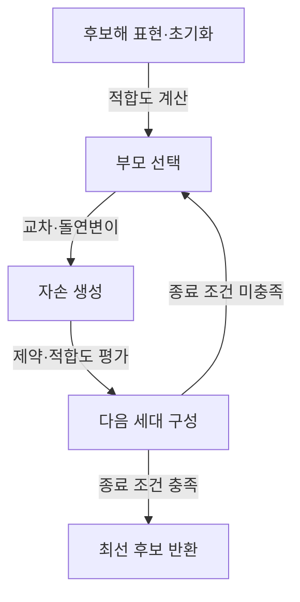
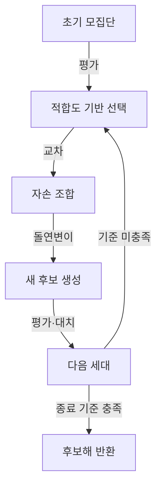
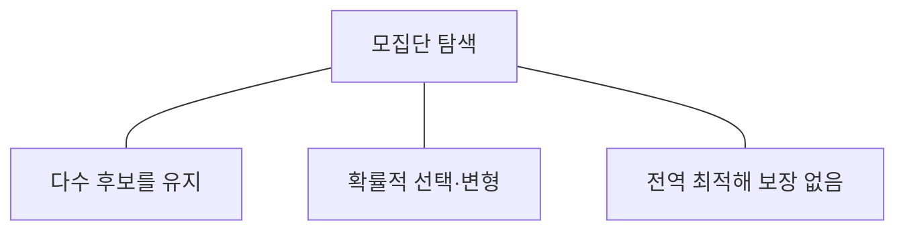

---
sidebar:
  order: 74
  label: "074. 유전 알고리즘"
  badge:
    text: "기초"
    variant: note
title: "유전 알고리즘 (Genetic Algorithm)"
author: "GPT-6"
date: "2026-09-24T22:00:00+09:00"
tags:
  - "notes-computer-system"
extra:
  model: "GPT-6"
  keyword_grade: "기초"
  question_no: "074"
---

## 지식 로드맵 내 현재 위치

컴퓨터 시스템 및 네트워크 → 탐색·최적화 알고리즘 → 유전 알고리즘

## 30초 인출

- 본질: **유전 알고리즘 (Genetic Algorithm, GA)**은 후보해 집단에 선택·교차·변이를 반복 적용해 좋은 해를 탐색하는 메타휴리스틱
- 메커니즘: 표현·적합도 정의 → 부모 선택 → 자손 생성 → 평가·대치 → 종료 조건 확인

핵심 용어

- **유전 알고리즘 (Genetic Algorithm, GA)**: 생물 진화의 선택·재조합 개념을 모사해 후보해를 탐색하는 알고리즘
- **염색체 (Chromosome)**: 문제의 후보해를 알고리즘이 다룰 수 있도록 부호화한 표현
- **적합도 함수 (Fitness Function)**: 후보해가 목적과 제약을 얼마나 충족하는지 평가하는 함수
- **선택 (Selection)**: 적합도 등을 기준으로 부모 후보를 고르는 연산
- **교차 (Crossover)**: 부모 표현의 일부를 조합해 자손을 만드는 연산
- **돌연변이 (Mutation)**: 표현 일부를 확률적으로 바꿔 탐색 다양성을 유지하는 연산

---

## 1교시 예상문제 (10점)

> 유전 알고리즘의 개념과 기본 처리 절차를 설명하시오. (예상)

---

## 1교시 10점 답안

### Ⅰ. 개요

| 구분 | 핵심 |
|---|---|
| 정의 | **유전 알고리즘 (Genetic Algorithm, GA)**은 후보해 집단에 선택·교차·돌연변이를 반복 적용해 목적에 맞는 해를 탐색하는 메타휴리스틱 |
| 목적 | 해 공간이 넓거나 복잡한 문제에서 제한된 계산 자원으로 양질의 후보해를 찾는 것 |

### Ⅱ. 기본 절차

### Ⅲ. 제언

- 제언: 문제 제약을 만족하는 표현·적합도·종료 조건을 먼저 검증하는 설계

---

## 2~4교시 예상문제 (25점)

> 유전 알고리즘의 구성요소와 탐색 절차를 설명하고, 적용 시 고려사항 및 개선 방안을 제시하시오. (예상)

---

## 2~4교시 25점 답안

### Ⅰ. 개요

| 구분 | 핵심 |
|---|---|
| 정의 | **유전 알고리즘 (Genetic Algorithm, GA)**은 후보해 집단에 선택·교차·돌연변이를 반복 적용해 목적에 맞는 해를 탐색하는 메타휴리스틱 |
| 목적 | 해 공간이 넓거나 복잡한 문제에서 제한된 계산 자원으로 양질의 후보해를 찾는 것 |

### Ⅱ. 구성요소

| 요소 | 역할 | 설계 기준 |
|---|---|---|
| 표현 | 실제 후보해를 염색체로 부호화 | 문제 제약을 만족하는 표현 선택 |
| 적합도 | 후보해 품질 평가 | 목적함수와 제약을 반영하고 계산 비용 관리 |
| 모집단 | 동시에 탐색할 후보 집합 | 크기와 다양성의 절충 |
| 종료 조건 | 탐색 중단 판단 | 세대 수·시간·품질 기준 조합 |

### Ⅲ. 세대 갱신

| 연산 | 탐색 기능 | 주요 조정값 |
|---|---|---|
| 선택 | 유망 후보를 부모로 선별 | 선택 압력·선택 방식 |
| 교차 | 기존 해의 부분 정보를 조합 | 교차 방식·확률 |
| 돌연변이 | 새 영역을 탐색하도록 표현 변경 | 변이 방식·확률 |

### Ⅳ. 표현과 제약 처리

| 문제 유형 | 표현 예 | 유의점 |
|---|---|---|
| 이진 선택 | 비트열 | 제약 초과 후보의 평가·복구 방식 정의 |
| 순서 결정 | 순열 | 교차 후 중복·누락을 막는 순열 보존 연산 사용 |
| 실수 최적화 | 실수 벡터 | 변수 범위·정밀도·경계 처리 명시 |

### Ⅴ. 탐색 특성과 구분

| 장점 | 한계 |
|---|---|
| 목적함수의 미분 가능성을 요구하지 않고 후보 집단을 탐색 | 결과 품질과 실행시간은 표현·적합도·매개변수에 좌우 |
| 문제에 맞춘 교차·변이 연산 설계 가능 | 조기 수렴이나 장시간 탐색이 발생할 수 있음 |

### Ⅵ. 성능 관리

| 한계 | 해결 방안 |
|---|---|
| 선택 압력이 지나치면 후보 다양성이 낮아져 조기 수렴 가능 | 세대별 다양성과 적합도 분포를 관찰하고 선택·변이 설정을 조정 |
| 적합도 계산이 비싸면 평가가 병목 | 평가 캐시·근사 평가·병렬 실행의 정확성과 비용을 검증해 적용 |

### Ⅶ. 기술사적 제언

| 한계 | 해결 방안 |
|---|---|
| 최적화 점수만 높아도 현업 제약·설명 가능성·재현성이 부족할 수 있음 | 제약 검증을 통과한 후보만 운영 담당자가 재평가하고, 입력·매개변수·세대별 결과를 기록하는 승인 절차 마련 |

---

## 출제 이력과 검증 출처

- 제137회 4교시 5번: “유전 알고리즘 (Genetic Algorithm)에 대하여 설명하시오.” 출제 이력 유지
- 출제문 원문을 바탕으로 기본 원리와 처리 절차에 초점을 맞춤
- [Q-Net 제137회 정보관리기술사 문제지](https://www.q-net.or.kr/cst006.do?artlSeq=5242749&brdId=Q006&gSite=Q&id=cst00602)
- [MIT OpenCourseWare, Genetic Algorithm 절차](https://www.ocw.mit.edu/courses/ids-338j-multidisciplinary-system-design-optimization-spring-2010/f67f430da9d1bc6c018ce661c4a717b9_MITESD_77S10_rec06.pdf)
