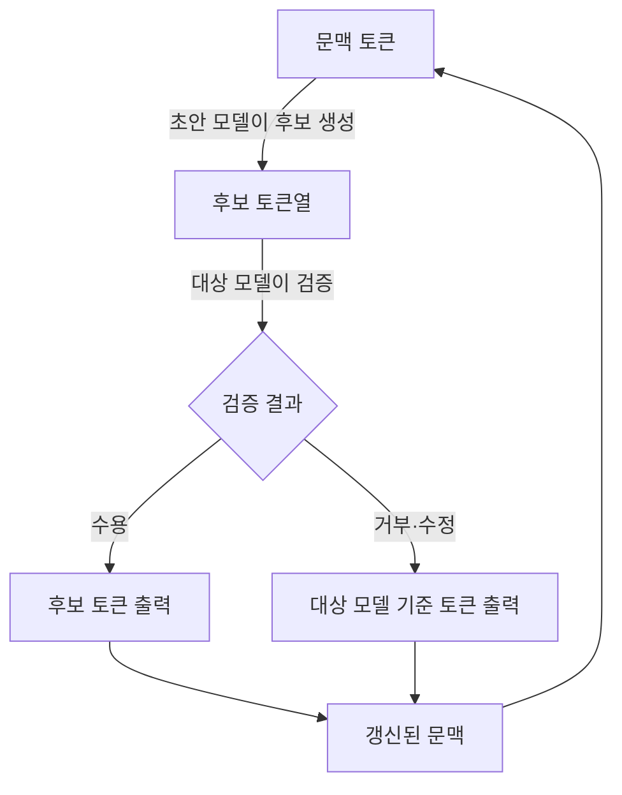
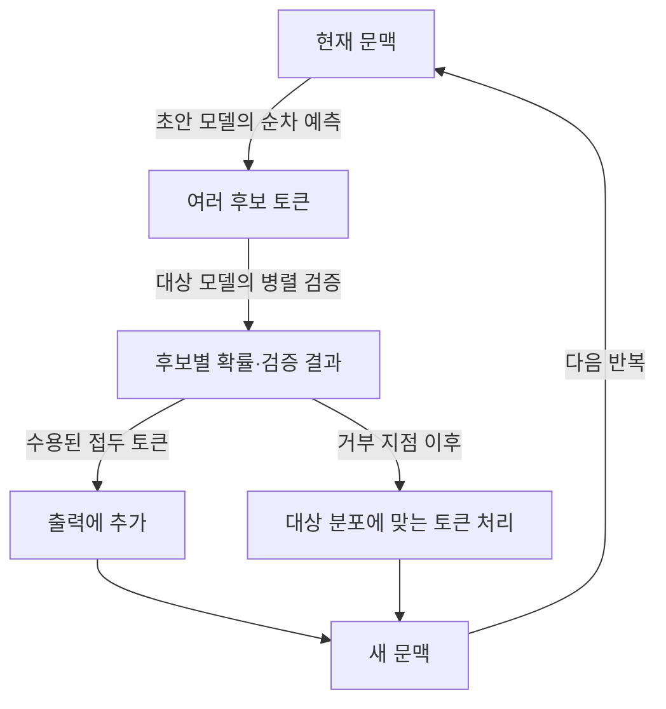
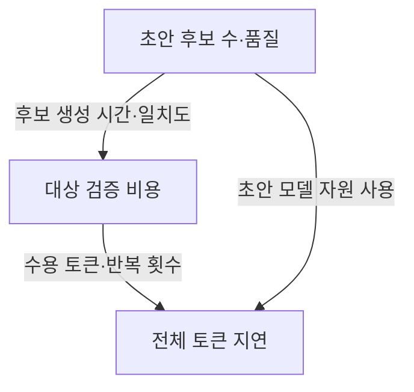

---
sidebar:
  order: 75
  label: "075. 추측 디코딩"
  badge:
    text: "서브"
    variant: note
title: "추측 디코딩 (Speculative Decoding)"
author: "GPT-6"
date: "2026-09-24T22:00:00+09:00"
tags:
  - "notes-computer-system"
extra:
  model: "GPT-6"
  keyword_grade: "서브"
  question_no: "075"
---

## 지식 로드맵 내 현재 위치

컴퓨터 시스템 및 네트워크 → AI 추론 최적화 → 자동회귀 생성 가속

## 30초 인출

- 본질: **추측 디코딩 (Speculative Decoding)**은 빠른 초안 생성과 큰 모델의 검증을 결합해 언어 모델의 토큰 생성을 가속하는 기법
- 메커니즘: 초안 모델이 여러 토큰 후보 생성 → 대상 모델이 후보를 함께 검증 → 수용된 토큰을 출력하고 나머지는 재생성

핵심 용어

- **추측 디코딩 (Speculative Decoding)**: 작은 초안 모델 등의 후보 제안과 대상 모델 검증을 결합하는 추론 기법
- **초안 모델 (Draft Model)**: 다음 토큰 후보를 빠르게 제안하는 모델
- **대상 모델 (Target Model)**: 최종 출력 분포를 정의하고 초안 토큰을 검증하는 본 모델
- **수용률 (Acceptance Rate)**: 제안된 토큰 가운데 검증을 통과해 출력에 사용되는 비율
- **자동회귀 생성 (Autoregressive Generation)**: 이전 출력 토큰을 조건으로 다음 토큰을 차례로 생성하는 방식

---

## 1교시 예상문제 (10점)

> 추측 디코딩의 개념과 초안·검증 처리 구조를 설명하시오. (예상)

---

## 1교시 10점 답안

### Ⅰ. 개요

| 구분 | 핵심 |
|---|---|
| 정의 | **추측 디코딩 (Speculative Decoding)**은 초안 모델이 제안한 토큰을 대상 모델이 검증해 자동회귀 생성의 반복 지연을 줄이는 추론 기법 |
| 목적 | 모델의 출력 품질 기준을 유지하면서 토큰 생성 지연을 줄이는 것 |

### Ⅱ. 처리 구조

### Ⅲ. 제언

- 제언: 초안 생성 비용·수용률·대상 모델 지연을 함께 측정하는 서빙 최적화

---

## 2~4교시 예상문제 (25점)

> 추측 디코딩의 구조와 검증 원리를 설명하고, 대규모 언어 모델 서빙에 적용할 때의 성능·운영 고려사항을 제시하시오. (예상)

---

## 2~4교시 25점 답안

### Ⅰ. 개요

| 구분 | 핵심 |
|---|---|
| 정의 | **추측 디코딩 (Speculative Decoding)**은 초안 모델이 제안한 토큰을 대상 모델이 검증해 자동회귀 생성의 반복 지연을 줄이는 추론 기법 |
| 목적 | 모델의 출력 품질 기준을 유지하면서 토큰 생성 지연을 줄이는 것 |

### Ⅱ. 대상 문제

| 병목 | 원인 | 영향 |
|---|---|---|
| 토큰별 반복 실행 | 다음 토큰 생성이 직전 토큰에 의존 | 작은 배치 추론에서 반복 실행 지연 누적 |
| 큰 모델의 연산·메모리 비용 | 매 토큰마다 대상 모델 수행 | 응답 지연·자원 사용 증가 |

### Ⅲ. 초안·검증 구조

| 단계 | 수행 내용 | 처리 특성 |
|---|---|---|
| 제안 | 초안 모델이 여러 후보 토큰 생성 | 초안 정확도와 비용이 후보 효율에 영향 |
| 검증 | 대상 모델이 후보 접두열을 평가 | 병렬 계산으로 검증 호출당 후보 수용 가능 |
| 갱신 | 수용 접두열과 보정 토큰으로 문맥 갱신 | 다음 반복의 입력 구성 |

### Ⅳ. 출력 분포 보존

| 구현 조건 | 의미 |
|---|---|
| 적절한 검증·수용 규칙 | 대표적인 speculative sampling은 보정 절차를 사용해 대상 모델의 출력 분포를 보존할 수 있음 |
| 단순 후보 선택 | 검증·보정 규칙이 없으면 대상 모델과 동일한 분포를 보장할 수 없음 |
| 다양한 추측 방식 | 초안 모델 외에 n-gram·추가 예측 헤드 등 구현 방식이 있으며 세부 성질은 방식별 확인 필요 |

### Ⅴ. 성능 영향 요인

| 요인 | 성능에 미치는 영향 |
|---|---|
| 초안 품질 | 대상 분포와 차이가 크면 수용 접두 길이가 짧아질 수 있음 |
| 후보 수 | 늘릴수록 병렬 검증 이점과 검증 비용이 함께 변함 |
| 배치·하드웨어 | 병렬 검증 효율과 메모리 점유가 달라짐 |

### Ⅵ. 적용 시 한계와 대응

| 한계 | 해결 방안 |
|---|---|
| 모든 입력에서 초안·대상 모델의 토큰 일치가 높지는 않음 | 도메인별 수용률·지연을 측정하고 이점이 낮은 요청은 기본 디코딩으로 처리 |
| 보조 모델은 메모리와 유지보수 비용을 추가할 수 있음 | 자원 여유·모델 갱신·품질 기준을 포함한 부하 시험으로 도입 여부 판단 |

### Ⅶ. 기술사적 제언

| 한계 | 해결 방안 |
|---|---|
| 평균 토큰 처리량만으로는 사용자 체감 지연과 품질 영향을 파악하기 어려움 | 첫 토큰 지연·토큰 간 지연·총 지연·정확도·GPU 메모리를 함께 측정해 요청 유형별 라우팅 기준 수립 |

---

## 출제 이력과 검증 출처

- 기출 확인 없음. 예상문제는 추측 디코딩 자체의 초안·검증 메커니즘을 직접 질문
- 검증 출처:
  - [Leviathan et al., Fast Inference from Transformers via Speculative Decoding, ICML 2023](https://proceedings.mlr.press/v202/leviathan23a.html)
  - [NVIDIA Triton Inference Server: Speculative Decoding](https://docs.nvidia.com/deeplearning/triton-inference-server/user-guide/docs/llm_features/speculative_decoding_by_backend_type.html)