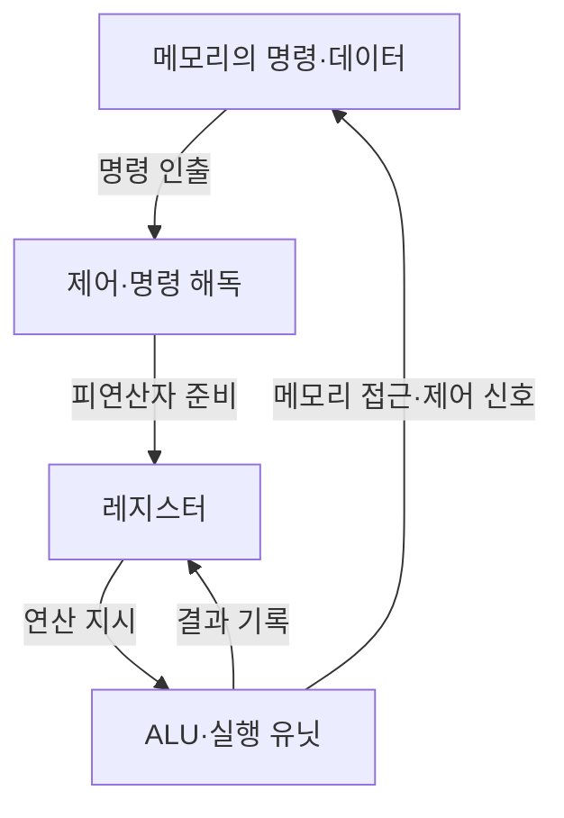
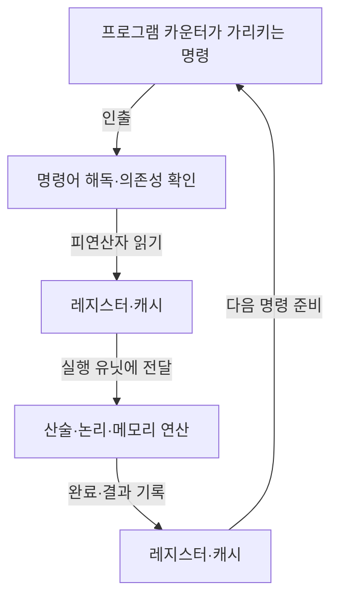
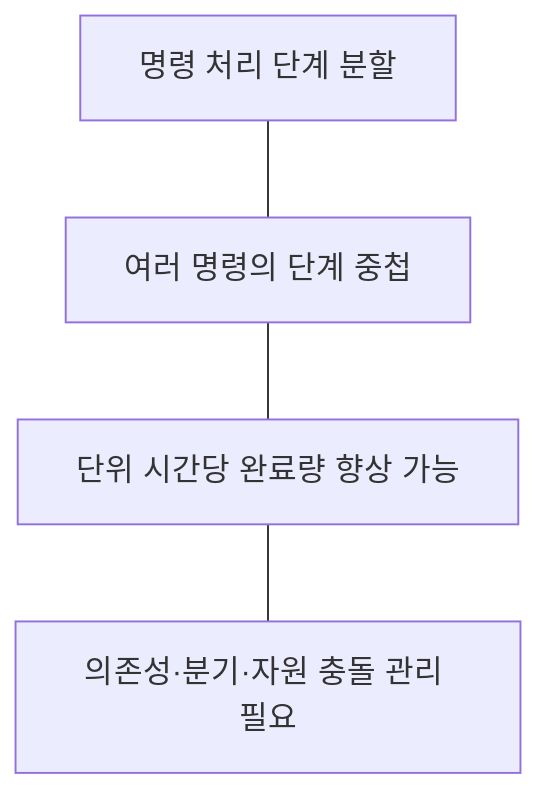

---
sidebar:
  order: 76
  label: "076. CPU"
  badge:
    text: "기초"
    variant: note
title: "CPU (Central Processing Unit)"
author: "GPT-6"
date: "2026-09-24T22:00:00+09:00"
tags:
  - "notes-computer-system"
extra:
  model: "GPT-6"
  keyword_grade: "기초"
  question_no: "076"
---

## 지식 로드맵 내 현재 위치

컴퓨터 시스템 및 네트워크 → 컴퓨터 구조 → 중앙처리장치

## 30초 인출

- 본질: **CPU (Central Processing Unit)**는 프로그램 명령을 해석·실행하고 시스템의 연산·제어를 담당하는 프로세서
- 메커니즘: 명령어 인출 → 해독·피연산자 준비 → 실행 → 결과 기록, 예외·인터럽트도 처리

핵심 용어

- **CPU (Central Processing Unit)**: 프로그램 명령을 실행하고 연산·제어를 제공하는 중앙처리장치
- **ALU (Arithmetic Logic Unit)**: 정수 산술·논리 연산을 수행하는 장치
- **레지스터 (Register)**: 명령 실행에 필요한 값·주소·상태를 빠르게 보관하는 프로세서 내부 저장소
- **캐시 (Cache)**: 자주 쓰는 명령·데이터를 가까운 계층에 저장해 접근 지연을 줄이는 메모리
- **명령어 집합 구조 (ISA, Instruction Set Architecture)**: 소프트웨어와 프로세서 구현 사이의 명령어·레지스터 등 보이는 규약

---

## 1교시 예상문제 (10점)

> CPU의 개념과 주요 구성요소 및 명령 실행 절차를 설명하시오. (예상)

---

## 1교시 10점 답안

### Ⅰ. 개요

| 구분 | 핵심 |
|---|---|
| 정의 | **CPU (Central Processing Unit)**는 프로그램 명령을 해석·실행하고 산술·논리 연산과 시스템 제어를 담당하는 프로세서 |
| 목적 | 프로그램 실행을 통해 운영체제·응용 서비스의 계산과 제어를 제공 |

### Ⅱ. 구성 및 동작

### Ⅲ. 제언

- 제언: 워크로드 특성과 지연·처리량 요구를 기준으로 CPU 자원을 설계·배치하는 접근

---

## 2~4교시 예상문제 (25점)

> CPU의 구성과 명령 처리 구조를 설명하고, 다중 코어 시스템의 성능·확장 고려사항을 제시하시오. (예상)

---

## 2~4교시 25점 답안

### Ⅰ. 개요

| 구분 | 핵심 |
|---|---|
| 정의 | **CPU (Central Processing Unit)**는 프로그램 명령을 해석·실행하고 산술·논리 연산과 시스템 제어를 담당하는 프로세서 |
| 목적 | 프로그램 실행을 통해 운영체제·응용 서비스의 계산과 제어를 제공 |

### Ⅱ. 주요 구성요소

| 구성요소 | 기능 |
|---|---|
| 제어장치 | 명령 해독, 실행 유닛·데이터 경로 제어 |
| ALU·실행 유닛 | 산술·논리·주소 계산 등 명령 실행 |
| 레지스터 | 피연산자·주소·상태 정보를 보관 |
| 캐시 | 메모리 접근 지연을 줄이기 위한 계층형 저장 |
| 인터커넥트·메모리 인터페이스 | 코어·캐시·메모리·입출력 사이의 데이터 전달 |

### Ⅲ. 명령 처리 흐름

| 처리 단계 | 핵심 기능 | 성능 요소 |
|---|---|---|
| 인출·해독 | 명령어 확보와 실행 제어 생성 | 명령 캐시·분기 예측 |
| 실행 | 연산·메모리 접근 | 실행 유닛·데이터 의존성 |
| 기록 | 결과를 아키텍처 상태에 반영 | 레지스터·캐시·메모리 계층 |

### Ⅳ. 파이프라이닝·병렬성

| 기법 | 목적 | 제약 |
|---|---|---|
| 파이프라이닝 | 명령 단계 중첩 | 데이터·제어 위험으로 정지·취소 발생 가능 |
| 비순차 실행 | 준비된 명령을 먼저 실행 | 의존성 추적·상태 복구 구조 필요 |
| 다중 코어 | 독립 작업을 병렬 실행 | 병렬화 가능성·동기화·메모리 대역폭 제약 |

### Ⅴ. CPU와 GPGPU의 적용 구분

| 구분 | CPU | GPGPU (General-Purpose computing on GPU) |
|---|---|---|
| 구조적 초점 | 다양한 제어 흐름과 낮은 단일 작업 지연 | 다수 데이터의 병렬 처리량 |
| 적합한 작업 | 운영체제·서비스 제어·분기 중심 처리 | 대규모 병렬 수치·행렬 연산 |
| 설계 고려 | 캐시·분기·응답성 | 병렬도·메모리 대역폭·데이터 이동 |

### Ⅵ. 성능·확장 관리

| 한계 | 해결 방안 |
|---|---|
| 코어 수만 늘려도 직렬 구간·동기화·메모리 병목 때문에 성능이 선형 증가하지 않음 | 병렬화 비율·동기화 대기·캐시 미스·메모리 대역폭을 프로파일링해 병목을 우선 개선 |
| CPU와 가속기 사이 데이터 이동이 계산 이득을 줄일 수 있음 | 데이터 지역성·배치 크기·전송량을 포함해 CPU·GPGPU 작업 분할을 시험 |

### Ⅶ. 기술사적 제언

| 한계 | 해결 방안 |
|---|---|
| 평균 CPU 이용률만으로는 응답 지연이나 코어 편중을 설명하기 어려움 | 서비스 목표별 지연시간·처리량·코어별 부하·메모리 대기를 함께 관찰하고, 워크로드별 CPU·가속기 배치 기준을 정립 |

---

## 출제 이력과 검증 출처

- 제120회 1교시 12번: “CPU와 GPGPU (General-Purpose computing on Graphics Processing Unit)” 출제 이력 유지
- 검증 출처:
  - [Intel 64 and IA-32 Architectures Software Developer Manuals](https://www.intel.com/content/www/us/en/developer/articles/technical/intel-sdm.html)
  - [RISC-V Ratified Specifications: RV32I](https://docs.riscv.org/reference/isa/v20240411/unpriv/rv32.html)