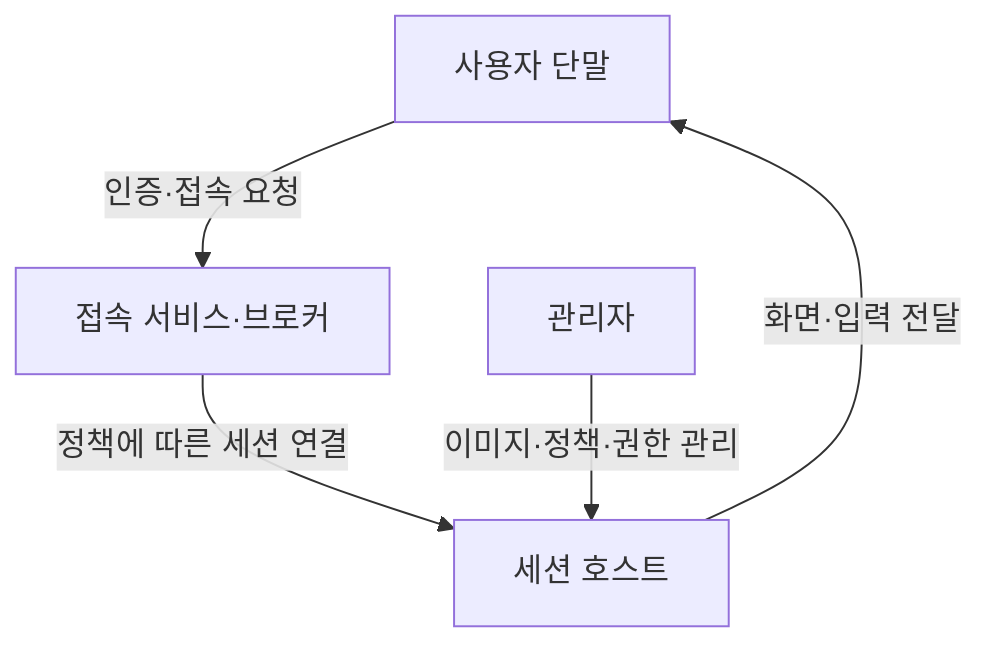
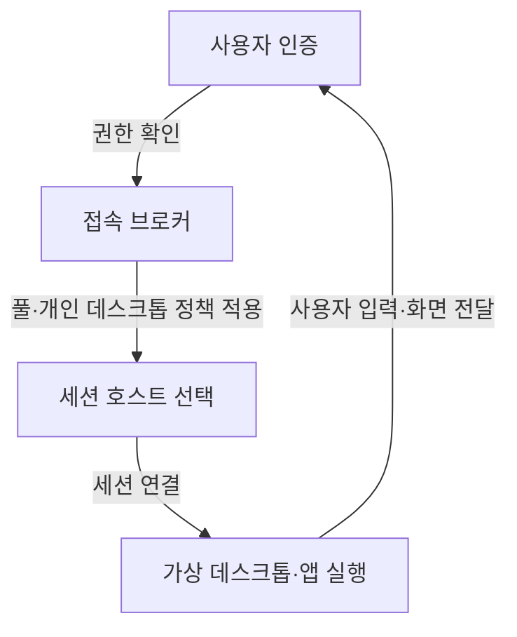
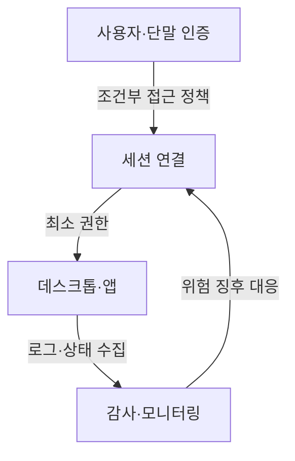

---
sidebar:
  order: 77
  label: "077. DaaS"
  badge:
    text: "서브"
    variant: note
title: "DaaS (Desktop as a Service)"
author: "GPT-6"
date: "2026-09-24T22:30:00+09:00"
tags:
  - "notes-computer-system"
extra:
  model: "GPT-6"
  keyword_grade: "서브"
  question_no: "077"
---

## 지식 로드맵 내 현재 위치

컴퓨터 시스템 및 네트워크 → 클라우드 서비스 모델 → 가상 데스크톱 제공

## 30초 인출

- 본질: **DaaS (Desktop as a Service)**는 네트워크를 통해 사용자에게 가상 데스크톱이나 애플리케이션을 서비스로 제공하는 모델
- 메커니즘: 사용자 접속 → 인증·세션 중개 → 가상 데스크톱 호스트 연결 → 중앙 정책·이미지·자원 운영

핵심 용어

- **DaaS (Desktop as a Service)**: 가상 데스크톱 환경을 네트워크로 제공하고 중앙에서 운영하는 서비스 모델
- **VDI (Virtual Desktop Infrastructure)**: 가상 머신에서 데스크톱 운영체제를 실행해 사용자에게 제공하는 인프라 구조
- **세션 호스트 (Session Host)**: 사용자 데스크톱·앱 세션을 실행하는 가상 머신 또는 서버
- **호스트 풀 (Host Pool)**: 데스크톱 세션을 제공하는 호스트의 논리적 집합
- **브로커 (Broker)**: 사용자를 적절한 데스크톱 호스트·세션에 연결하는 구성 요소

---

## 1교시 예상문제 (10점)

> DaaS의 개념과 기본 서비스 구조를 설명하시오. (예상)

---

## 1교시 10점 답안

### Ⅰ. 개요

| 구분 | 핵심 |
|---|---|
| 정의 | **DaaS (Desktop as a Service)**는 가상화된 데스크톱·애플리케이션을 사용자에게 네트워크 서비스로 제공하고 관리 기능을 중앙화하는 모델 |
| 목적 | 사용자 단말의 위치와 종류에 덜 의존하는 업무환경 제공 및 데스크톱 운영의 중앙 관리 |

### Ⅱ. 서비스 연결 구조

### Ⅲ. 제언

- 제언: 업무 민감도·접속 품질·운영 책임을 반영한 사용자별 데스크톱 서비스 설계

---

## 2~4교시 예상문제 (25점)

> DaaS의 서비스 구조와 운영 방식을 설명하고, 도입 시 보안·성능·비용 측면의 고려사항을 제시하시오. (예상)

---

## 2~4교시 25점 답안

### Ⅰ. 개요

| 구분 | 핵심 |
|---|---|
| 정의 | **DaaS (Desktop as a Service)**는 가상화된 데스크톱·애플리케이션을 사용자에게 네트워크 서비스로 제공하고 관리 기능을 중앙화하는 모델 |
| 목적 | 사용자 단말의 위치와 종류에 덜 의존하는 업무환경 제공 및 데스크톱 운영의 중앙 관리 |

### Ⅱ. 서비스 구성

| 구성요소 | 역할 | 주요 운영 대상 |
|---|---|---|
| 접속 서비스 | 사용자 연결 수립 | 인증·연결 경로 |
| 브로커 | 세션 호스트 선택·연결 | 세션 할당·가용성 |
| 세션 호스트 | 데스크톱·앱 실행 | OS 이미지·자원·패치 |
| 프로파일·저장소 | 사용자 데이터·설정 제공 | 데이터 보호·백업 |
| 관리·모니터링 | 정책·접속 현황 관리 | 권한·장애·용량 |

### Ⅲ. 세션 처리

| 제공 형태 | 특성 | 선택 기준 |
|---|---|---|
| 개인형 | 사용자별 전용·지속 환경 | 개인화·격리 필요성 |
| 풀형 | 공통 호스트 자원 공유 | 표준 업무·자원 효율 |
| 앱 게시 | 전체 데스크톱 대신 앱 제공 | 업무 범위·사용자 경험 |

### Ⅳ. 보안·운영 통제

| 통제 대상 | 고려사항 |
|---|---|
| 사용자·관리자 권한 | 최소 권한·강한 인증·관리자 작업 분리 |
| 데이터 | 클립보드·드라이브·인쇄 등 단말 전달 경로 정책 |
| 이미지·패치 | 기준 이미지 검증, 취약점 수정, 변경 이력 관리 |
| 세션·접속 | 접속 로그와 장애·성능 지표의 보존·감사 |

### Ⅴ. 성능·비용 구조

| 요소 | 영향 | 검토 기준 |
|---|---|---|
| 사용자 동시성 | 호스트·라이선스 용량에 영향 | 업무 시간대별 동시 접속률 |
| 프로파일·저장소 | 로그인·앱 반응 및 사용자 데이터 안정성 | 저장 지연·백업·복구 목표 |
| 네트워크 | 화면 반응·음성·영상 품질 | 지연·대역폭·접속 위치 |
| 과금·운영 | 서비스형 비용과 직접 관리 범위 변화 | 공급자 책임·사용량·종료 비용 |

### Ⅵ. 도입 시 한계와 대응

| 한계 | 해결 방안 |
|---|---|
| 네트워크 상태가 나쁘면 데스크톱 반응이 저하될 수 있음 | 사용자 위치·업무 유형별 연결 품질을 시험하고 대역폭·접속 경로를 설계 |
| 중앙 집중 환경에서 계정·브로커 장애가 다수 사용자에게 영향을 줄 수 있음 | 이중화·복구 시험·관리자 비상 접속 절차를 검증 |

### Ⅶ. 기술사적 제언

| 한계 | 해결 방안 |
|---|---|
| 중앙 관리 편의만 보고 도입하면 기존 앱 호환성·사용자 경험·운영 책임의 공백이 남을 수 있음 | 업무군별 파일럿으로 앱·주변장치·접속 품질을 검증하고, 공급자와 고객의 보안·복구 책임을 서비스 수준 협약에 명시 |

---

## 출제 이력과 검증 출처

- 기출 확인 없음. 예상문제는 DaaS 자체의 서비스 구조와 운영 고려사항을 직접 질문
- 검증 출처:
  - [Microsoft Learn: What is Azure Virtual Desktop?](https://learn.microsoft.com/en-us/azure/virtual-desktop/overview)
  - [Microsoft Learn: Azure Virtual Desktop terminology](https://learn.microsoft.com/en-us/azure/virtual-desktop/environment-setup)
  - [Microsoft Learn: Azure Virtual Desktop service architecture and resilience](https://learn.microsoft.com/en-us/azure/virtual-desktop/service-architecture-resilience)