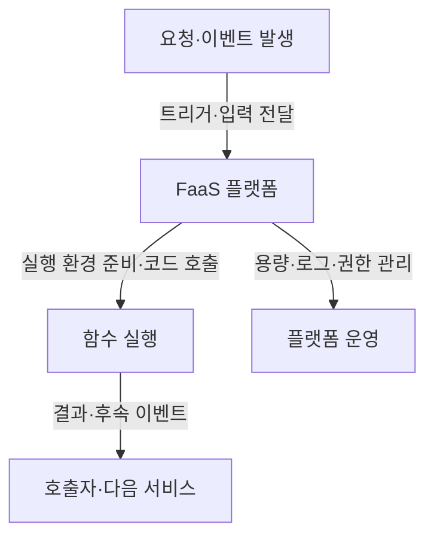
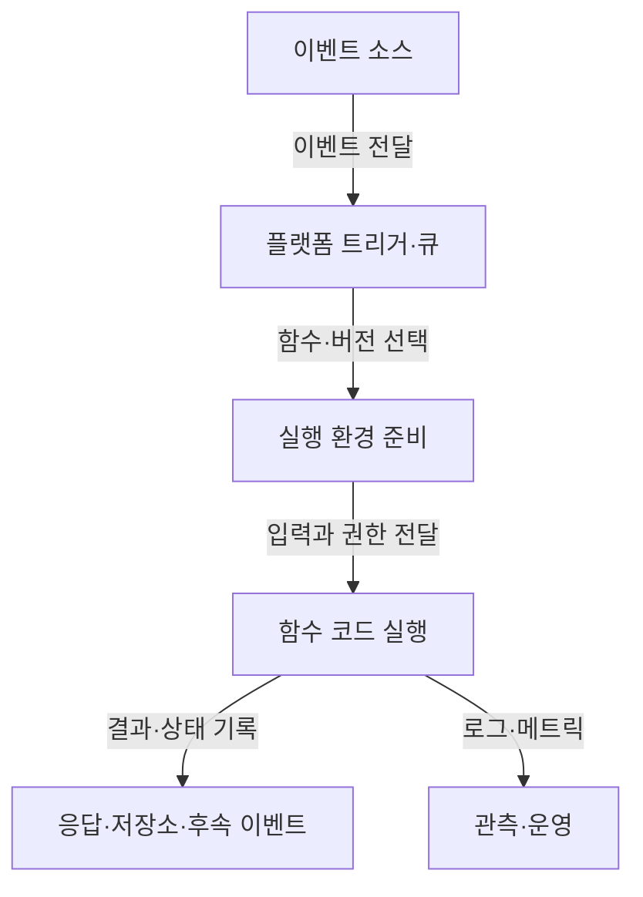
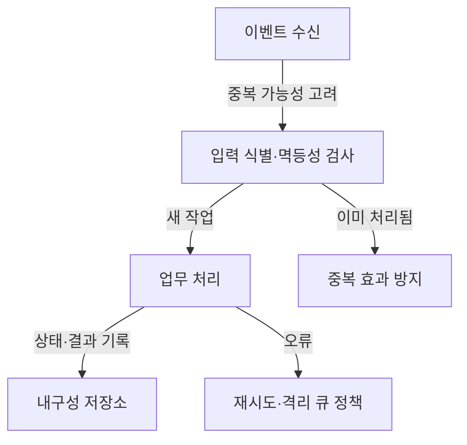

---
sidebar:
  order: 78
  label: "078. FaaS"
  badge:
    text: "기초"
    variant: note
title: "FaaS (Function as a Service)"
author: "GPT-6"
date: "2026-09-24T22:30:00+09:00"
tags:
  - "notes-computer-system"
extra:
  model: "GPT-6"
  keyword_grade: "기초"
  question_no: "078"
---

## 지식 로드맵 내 현재 위치

컴퓨터 시스템 및 네트워크 → 클라우드 실행 모델 → 이벤트 기반 함수 실행

## 30초 인출

- 본질: **FaaS (Function as a Service)**는 개발자가 함수 코드를 배포하면 클라우드 플랫폼이 이벤트에 맞춰 실행 환경과 확장을 관리하는 컴퓨팅 모델
- 메커니즘: 이벤트 발생 → 함수 호출 → 코드 실행 → 결과·상태 처리 → 필요 시 후속 이벤트

핵심 용어

- **FaaS (Function as a Service)**: 함수 단위 코드를 이벤트에 따라 실행하고 기반 서버 운영을 플랫폼이 관리하는 클라우드 모델
- **이벤트 소스 (Event Source)**: 함수 실행을 유발하고 입력 이벤트를 제공하는 서비스·요청
- **실행 환경 (Execution Environment)**: 런타임·코드·설정을 갖추고 함수를 실행하는 격리된 환경
- **콜드 스타트 (Cold Start)**: 실행 환경 준비가 필요해 첫 호출 또는 유휴 후 호출의 지연이 커지는 현상
- **멱등성 (Idempotency)**: 같은 요청이 여러 번 처리되어도 의도한 최종 효과가 한 번 처리한 것과 같도록 하는 성질

---

## 1교시 예상문제 (10점)

> FaaS의 개념과 이벤트 기반 실행 구조를 설명하시오. (예상)

---

## 1교시 10점 답안

### Ⅰ. 개요

| 구분 | 핵심 |
|---|---|
| 정의 | **FaaS (Function as a Service)**는 개발자가 배포한 함수 코드를 이벤트에 따라 실행하고 기반 인프라 운영을 클라우드 플랫폼에 맡기는 컴퓨팅 모델 |
| 목적 | 서버 프로비저닝 부담을 줄이고 이벤트·요청에 맞춰 코드 실행 자원을 제공하는 것 |

### Ⅱ. 실행 구조

### Ⅲ. 제언

- 제언: 이벤트 처리 특성과 재실행 가능성을 반영한 함수 경계·상태 설계

---

## 2~4교시 예상문제 (25점)

> FaaS의 서비스 구조와 실행 절차를 설명하고, 상태·성능·보안 측면의 적용 고려사항을 제시하시오. (예상)

---

## 2~4교시 25점 답안

### Ⅰ. 개요

| 구분 | 핵심 |
|---|---|
| 정의 | **FaaS (Function as a Service)**는 개발자가 배포한 함수 코드를 이벤트에 따라 실행하고 기반 인프라 운영을 클라우드 플랫폼에 맡기는 컴퓨팅 모델 |
| 목적 | 서버 프로비저닝 부담을 줄이고 이벤트·요청에 맞춰 코드 실행 자원을 제공하는 것 |

### Ⅱ. 구성요소

| 구성요소 | 기능 | 설계 기준 |
|---|---|---|
| 함수 코드 | 업무 로직 수행 | 단일 책임·실행시간 제한 확인 |
| 이벤트 소스 | 함수 호출과 입력 제공 | 전달 보장·중복·순서 특성 확인 |
| 실행 환경 | 런타임과 자원 제공 | 메모리·시간·네트워크 설정 |
| 상태 저장소 | 함수 간 지속 상태 보관 | 트랜잭션·중복 처리·접근 통제 |
| 관측·권한 | 실행 추적·서비스 접근 허용 | 최소 권한·로그·비밀정보 관리 |

### Ⅲ. 처리 흐름

| 단계 | 검토 내용 |
|---|---|
| 호출 | 인증·입력 검증·이벤트 스키마 |
| 실행 | 런타임 준비·자원 할당·제한 시간 |
| 처리 | 업무 결과·예외·재시도 정책 |
| 완료 | 상태 저장·로그·후속 호출 |

### Ⅳ. 실행 모델의 특성

| 특성 | 의미 | 설계 영향 |
|---|---|---|
| 관리형 실행 | 플랫폼이 기반 서버·런타임 운영 일부를 담당 | 공급자 책임과 사용자 코드 책임 구분 |
| 이벤트 기반 | 요청·큐·저장소 변경 등이 실행을 유발 | 이벤트 중복·순서·재처리 고려 |
| 탄력적 용량 | 실행 수요에 맞춰 용량 변경 가능 | 동시성·할당량·하위 서비스 용량 관리 |
| 짧은 작업 단위 | 함수별 실행 제한이 서비스마다 존재 | 장기 작업은 워크플로·큐·분할 처리 검토 |

### Ⅴ. 상태와 신뢰성

| 문제 | 설계 방안 |
|---|---|
| 이벤트 재시도로 중복 효과 발생 가능 | 이벤트 식별자·멱등 키·중복 제거 저장소 활용 |
| 로컬 실행 환경을 지속 상태 저장소로 오인 | 세션 상태·파일을 관리형 외부 저장소에 보관 |
| 재시도가 장애를 증폭할 수 있음 | 재시도 횟수·간격·격리 큐와 하위 시스템 보호 설정 |

### Ⅵ. 성능·보안 고려

| 한계 | 해결 방안 |
|---|---|
| 첫 실행의 환경 준비로 지연이 달라질 수 있음 | 사용자 체감 지연·실행 분포를 측정하고 프로비저닝 동시성 등 서비스 기능을 선택적으로 검토 |
| 함수 권한이 과도하면 침해 범위가 커질 수 있음 | 함수·역할별 최소 권한, 비밀정보 관리, 공급망 검증 적용 |

### Ⅶ. 기술사적 제언

| 한계 | 해결 방안 |
|---|---|
| 작은 함수 단위로 분해만 하면 호출·관측 복잡성과 비용이 커질 수 있음 | 호출 빈도·트랜잭션 경계·운영 소유권을 기준으로 분해 수준을 정하고, 서비스 종속·장애 복구를 부하 시험으로 검증 |

---

## 출제 이력과 검증 출처

- 기출 확인 없음. 예상문제는 FaaS 자체의 이벤트 기반 실행 구조를 직접 질문
- 검증 출처:
  - [AWS Lambda: Functions and durable functions](https://docs.aws.amazon.com/lambda/latest/dg/lambda-functions-chapter.html)
  - [AWS Serverless Developer Guide](https://docs.aws.amazon.com/serverless/latest/devguide/serverless-core.pdf)