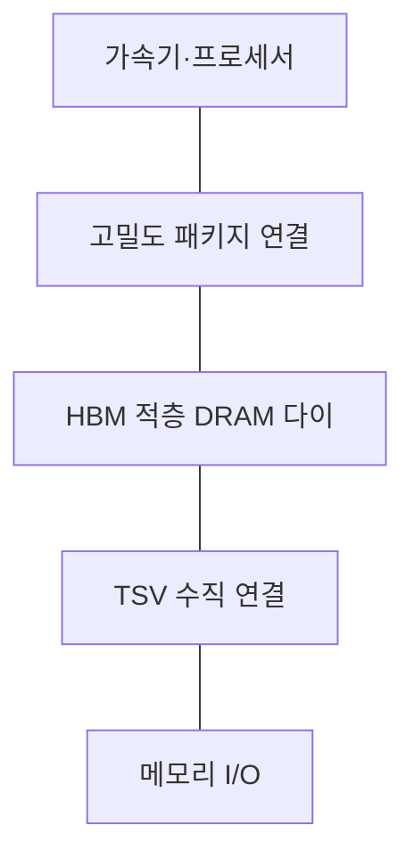
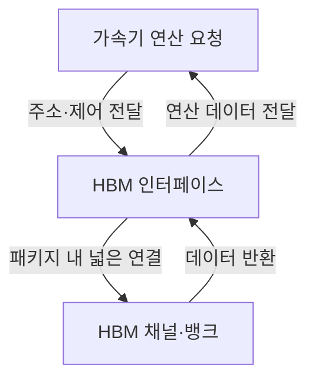
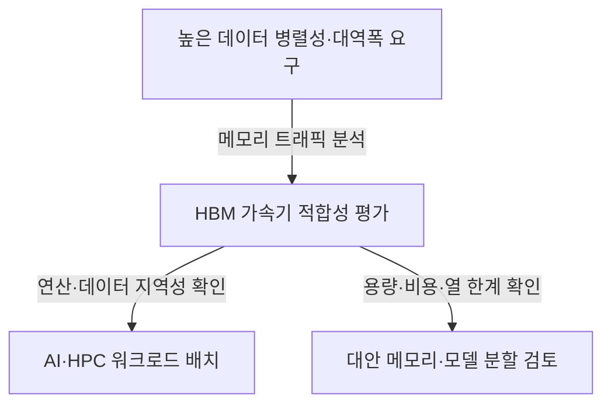

---
sidebar:
  order: 79
  label: "079. HBM"
  badge:
    text: "서브"
    variant: note
title: "HBM (High Bandwidth Memory)"
author: "GPT-6"
date: "2026-09-24T22:30:00+09:00"
tags:
  - "notes-computer-system"
extra:
  model: "GPT-6"
  keyword_grade: "서브"
  question_no: "079"
---

## 지식 로드맵 내 현재 위치

컴퓨터 시스템 및 네트워크 → 메모리 계층 → 가속기 근접 고대역폭 메모리

## 30초 인출

- 본질: **HBM (High Bandwidth Memory)**은 여러 DRAM 다이를 수직 적층하고 넓은 인터페이스로 가속기와 연결하는 고대역폭 메모리
- 메커니즘: 적층 다이의 TSV 연결과 고밀도 패키징으로 데이터 이동 경로·I/O 폭을 구성하며, 용량·대역폭·발열·패키지 비용을 함께 고려

핵심 용어

- **HBM (High Bandwidth Memory)**: 적층 DRAM과 넓은 인터페이스를 이용해 프로세서 가까이에서 높은 메모리 대역폭을 제공하는 메모리
- **DRAM (Dynamic Random-Access Memory)**: 전하를 이용해 데이터를 저장하며 주기적 리프레시가 필요한 휘발성 메모리
- **TSV (Through-Silicon Via)**: 실리콘 다이를 수직 방향으로 연결하는 관통 전극 기술
- **인터포저 (Interposer)**: 칩·메모리 사이의 고밀도 연결을 제공하는 패키지 기판
- **메모리 대역폭 (Memory Bandwidth)**: 단위 시간에 메모리와 데이터를 주고받을 수 있는 양

---

## 1교시 예상문제 (10점)

> HBM의 개념과 적층·연결 구조 및 적용 목적을 설명하시오. (예상)

---

## 1교시 10점 답안

### Ⅰ. 개요

| 구분 | 핵심 |
|---|---|
| 정의 | **HBM (High Bandwidth Memory)**은 DRAM 다이를 수직 적층하고 넓은 I/O 인터페이스로 프로세서 가까이에 배치하는 고대역폭 메모리 |
| 목적 | 데이터 처리량이 큰 가속기에 메모리 대역폭을 제공하고 데이터 이동 병목을 완화하는 것 |

### Ⅱ. 패키지 구조

### Ⅲ. 제언

- 제언: 연산 성능뿐 아니라 메모리 대역폭·용량·발열·패키지 조건을 함께 고려하는 가속기 설계

---

## 2~4교시 예상문제 (25점)

> HBM의 구조와 데이터 전달 특성을 설명하고, 가속기 시스템 적용 시 이점·제약 및 설계 고려사항을 제시하시오. (예상)

---

## 2~4교시 25점 답안

### Ⅰ. 개요

| 구분 | 핵심 |
|---|---|
| 정의 | **HBM (High Bandwidth Memory)**은 DRAM 다이를 수직 적층하고 넓은 I/O 인터페이스로 프로세서 가까이에 배치하는 고대역폭 메모리 |
| 목적 | 데이터 처리량이 큰 가속기에 메모리 대역폭을 제공하고 데이터 이동 병목을 완화하는 것 |

### Ⅱ. 구성요소

| 요소 | 기능 | 설계 관점 |
|---|---|---|
| DRAM 적층 다이 | 데이터 저장 | 적층 수·용량·수율 |
| TSV | 적층 다이 간 수직 연결 | 전기적 연결·열·공정 신뢰성 |
| 베이스 다이·인터페이스 | 외부 연결과 다이 제어 | 세대별 규격·신호·전력 특성 |
| 패키지·인터포저 | 가속기와 HBM 사이의 고밀도 연결 | 면적·배선·조립·열관리 |

### Ⅲ. 데이터 경로

| 구조 특성 | 의미 |
|---|---|
| 프로세서 근접 배치 | 패키지 수준의 짧은 연결 경로 구성 |
| 넓은 병렬 인터페이스 | 여러 데이터 전송을 병렬화해 대역폭 확보 |
| 적층 구조 | 패키지 면적 제약 안에서 메모리 용량 집적 가능 |

### Ⅳ. 성능 특성

| 항목 | HBM의 설계 특성 | 비교 시 확인할 점 |
|---|---|---|
| 대역폭 | 넓은 인터페이스와 병렬 채널 활용 | 실제 워크로드 접근 패턴·컨트롤러 효율 |
| 지연 | 대역폭과 지연은 서로 다른 지표 | 접근 지연이 모든 메모리보다 낮다고 단정하지 않음 |
| 용량 | 적층·패키지 구성으로 결정 | 스택 수·다이 용량·플랫폼 한도 |
| 에너지 | 데이터 전송 에너지와 성능 목표를 함께 고려 | 시스템 경계·부하별 측정 |

### Ⅴ. 적용 분야와 시스템 적합성

| 적용 | 주요 조건 |
|---|---|
| AI 학습·추론 | 모델·활성값의 대규모 데이터 공급 요구 |
| 고성능 컴퓨팅 | 계산 노드의 지속적 메모리 대역폭 요구 |
| 그래픽·가속기 | 병렬 실행 유닛의 데이터 공급 요구 |

### Ⅵ. 한계와 대응

| 한계 | 해결 방안 |
|---|---|
| 적층·고밀도 패키지의 제조·열·수율 제약 | 열 경로·전력·패키지 한도를 시스템 설계 초기에 함께 검증 |
| 용량과 대역폭만으로 전체 성능을 보장할 수 없음 | 캐시·데이터 배치·전송량·가속기 이용률을 실제 작업으로 측정 |
| 플랫폼 의존성이 높고 공급·비용 제약이 있을 수 있음 | 세대·공급자별 규격과 호환성, 대체 구성의 비용·성능을 비교 |

### Ⅶ. 기술사적 제언

| 한계 | 해결 방안 |
|---|---|
| 메모리 성능을 피크 대역폭 하나로 판단하면 실제 병목과 비용을 놓칠 수 있음 | 대표 워크로드에서 메모리 대역폭·용량·지연·전력·패키지 비용을 함께 평가해 시스템별 적정 구성을 결정 |

---

## 출제 이력과 검증 출처

- 기출 확인 없음. 예상문제는 HBM의 자체 구조·목적과 시스템 적용을 직접 질문
- 검증 출처:
  - [SK hynix: HBM2E and TSV stack architecture](https://news.skhynix.com/en/hbm2e-opens-the-era-of-ultra-speed-memory-semiconductors/)
  - [SK hynix: Advanced memory package architecture](https://research-user.skhynix.com/research-areas/advanced-package/advanced-memory-package-architecture)
  - [JEDEC Solid State Technology Association](https://www.jedec.org/)