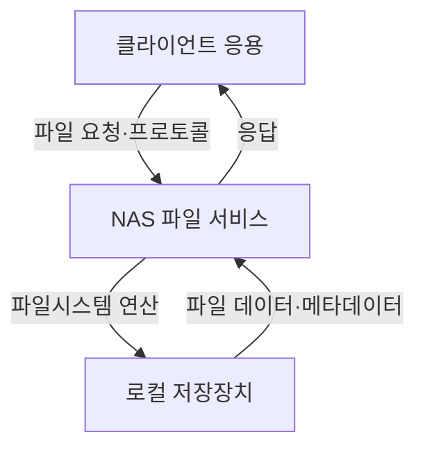
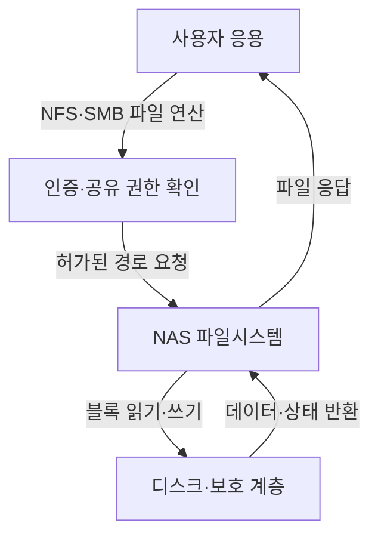
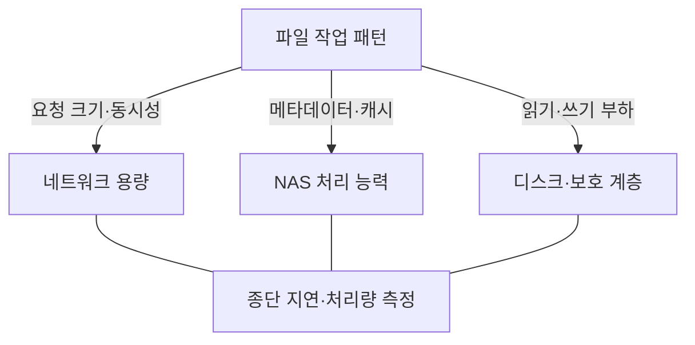

---
sidebar:
  order: 80
  label: "080. NAS"
  badge:
    text: "기초"
    variant: note
title: "NAS (Network-Attached Storage)"
author: "GPT-6"
date: "2026-09-24T23:00:00+09:00"
tags:
  - "notes-computer-system"
extra:
  model: "GPT-6"
  keyword_grade: "기초"
  question_no: "080"
---

## 지식 로드맵 내 현재 위치

컴퓨터 시스템 및 네트워크 → 저장장치 구조 → 파일 서비스형 네트워크 스토리지

## 30초 인출

- 본질: **NAS (Network-Attached Storage)**는 네트워크를 통해 여러 사용자가 공유 파일에 접근하도록 제공하는 스토리지 시스템
- 메커니즘: 클라이언트의 파일 요청 → NAS 파일 서비스 → 파일시스템·디스크 처리 → 응답 전달

핵심 용어

- **NAS (Network-Attached Storage)**: 네트워크로 파일 단위 저장 공간을 제공하는 스토리지 시스템
- **파일 프로토콜 (File Protocol)**: 파일 생성·읽기·쓰기·속성 조회 등을 주고받는 통신 규약
- **NFS (Network File System)**: 네트워크를 통해 원격 파일시스템에 접근하는 프로토콜 계열
- **SMB (Server Message Block)**: 파일·프린터 등 공유 서비스에 사용하는 네트워크 프로토콜 계열
- **파일시스템 (File System)**: 파일 이름·디렉터리·메타데이터·데이터 블록을 관리하는 구조

---

## 1교시 예상문제 (10점)

> NAS의 개념과 구성·파일 요청 처리 구조를 설명하시오. (예상)

---

## 1교시 10점 답안

### Ⅰ. 개요

| 구분 | 핵심 |
|---|---|
| 정의 | **NAS (Network-Attached Storage)**는 네트워크에 연결되어 클라이언트에 파일 단위 저장 서비스를 제공하는 시스템 |
| 목적 | 파일·디렉터리 기반 데이터를 여러 사용자·서버가 공유하도록 하는 것 |

### Ⅱ. 파일 접근 흐름

### Ⅲ. 제언

- 제언: 동시 접근·권한·백업 요구를 반영한 파일 공유 서비스 설계

---

## 2~4교시 예상문제 (25점)

> NAS의 구조와 파일 서비스 방식을 설명하고, 업무시스템 적용 시 성능·보안·가용성 고려사항을 제시하시오. (예상)

---

## 2~4교시 25점 답안

### Ⅰ. 개요

| 구분 | 핵심 |
|---|---|
| 정의 | **NAS (Network-Attached Storage)**는 네트워크에 연결되어 클라이언트에 파일 단위 저장 서비스를 제공하는 시스템 |
| 목적 | 파일·디렉터리 기반 데이터를 여러 사용자·서버가 공유하도록 하는 것 |

### Ⅱ. 구성요소

| 구성요소 | 역할 |
|---|---|
| 네트워크 인터페이스 | 클라이언트와 파일 요청·응답 전달 |
| 파일 서비스 | NFS·SMB 등 파일 프로토콜 요청 처리 |
| 파일시스템 | 디렉터리·파일 메타데이터·데이터 블록 관리 |
| 저장장치 | 파일 데이터의 영속 저장·보호 |
| 관리 기능 | 사용자·그룹 권한, 용량, 백업·복구 운영 |

### Ⅲ. 파일 요청 처리

| 처리 관점 | 핵심 |
|---|---|
| 이름 공간 | 공유·디렉터리 구조 제공 |
| 동시성 | 잠금·캐시 일관성·동시 변경 처리 |
| 권한 | 계정·그룹·ACL과 파일 권한 연계 |
| 보호 | 스냅샷·복제·백업을 복구 목표에 맞게 선택 |

### Ⅳ. NAS와 SAN 구분

| 구분 | NAS | SAN |
|---|---|---|
| 제공 단위 | 파일·디렉터리 | 블록 장치 |
| 주 접근 방식 | 파일 프로토콜 | 블록 I/O 프로토콜·패브릭 |
| 파일시스템 책임 | NAS가 파일서비스·파일시스템 제공 | 호스트가 블록 위 파일시스템을 관리하는 경우가 일반적 |
| 대표 고려사항 | 공유 권한·파일 동시성 | 경로 이중화·LUN·호스트 파일시스템 조정 |

### Ⅴ. 성능·가용성

| 부하 특성 | 측정·설계 |
|---|---|
| 대용량 순차 처리 | 네트워크 대역폭·읽기/쓰기 처리량 |
| 작은 파일 다량 처리 | 메타데이터 응답·디렉터리 탐색 |
| 다수 사용자 동시 접근 | 동시 세션·잠금·캐시 효과 |
| 장애·복구 | 경로·컨트롤러 이중화와 복구시간 시험 |

### Ⅵ. 보안·운영 한계

| 한계 | 해결 방안 |
|---|---|
| 공유 경로 권한이 넓으면 데이터 노출·변조 범위 확대 | 사용자·그룹·ACL 최소권한, 관리자 계정 분리, 접근 감사 적용 |
| 스냅샷·복제를 백업과 동일시하면 삭제·침해 시 복구 실패 가능 | 별도 장애영역 백업과 복구 시험을 구성하고 보존·불변 정책 검증 |

### Ⅶ. 기술사적 제언

| 한계 | 해결 방안 |
|---|---|
| 파일공유 사용량만으로 서비스 품질과 복구 가능성을 판단하기 어려움 | 파일 유형별 지연·처리량·오류와 복원 시험 결과를 함께 측정해 용량·보호 계층을 정기 조정 |

---

## 출제 이력과 검증 출처

- 기출 확인 없음. 예상문제는 NAS의 파일 서비스 본질과 구조를 직접 질문
- 검증 출처:
  - [NFS protocol overview, IETF RFC 7530](https://www.rfc-editor.org/rfc/rfc7530)
  - [Microsoft Learn: Server Message Block overview](https://learn.microsoft.com/en-us/windows-server/storage/file-server/file-server-smb-overview)