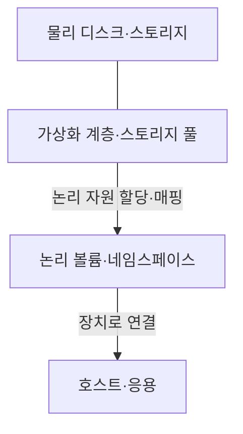
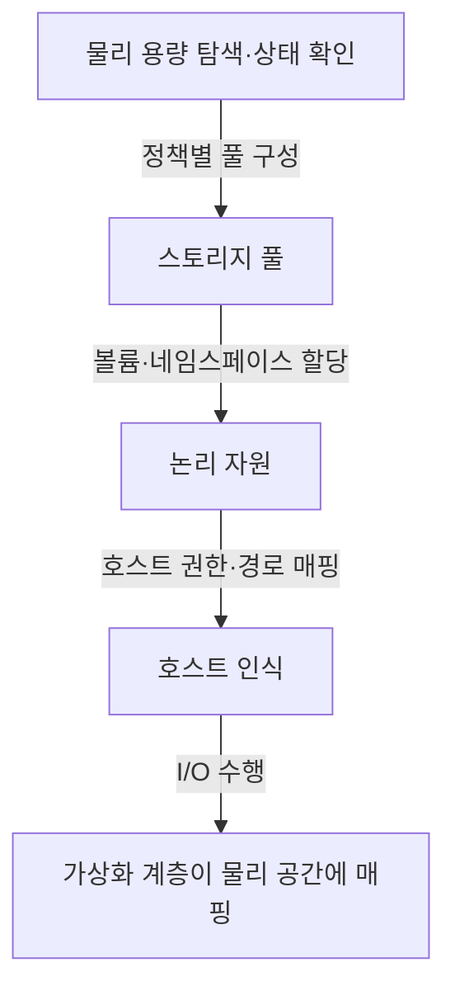
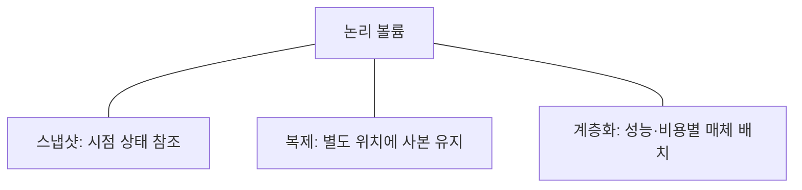
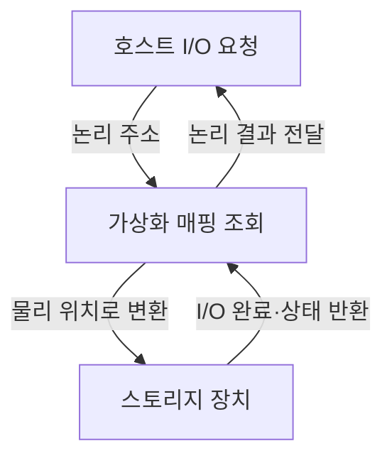

---
sidebar:
  order: 81
  label: "081. 스토리지 가상화"
  badge:
    text: "서브"
    variant: note
title: "스토리지 가상화 (Storage Virtualization)"
author: "GPT-6"
date: "2026-09-24T23:00:00+09:00"
tags:
  - "notes-computer-system"
extra:
  model: "GPT-6"
  keyword_grade: "서브"
  question_no: "081"
---

## 지식 로드맵 내 현재 위치

컴퓨터 시스템 및 네트워크 → 저장장치 관리 → 물리 자원 추상화

## 30초 인출

- 본질: **스토리지 가상화 (Storage Virtualization)**는 물리 저장장치를 논리 자원으로 추상화해 호스트에 일관된 저장 공간을 제공하는 구조
- 메커니즘: 물리 장치 풀 구성 → 논리 볼륨·네임스페이스 생성 → 호스트에 매핑 → 용량·보호·성능 관리

핵심 용어

- **스토리지 가상화 (Storage Virtualization)**: 물리 저장 자원을 논리 저장 공간으로 추상화하는 기술
- **논리 볼륨 (Logical Volume)**: 하나 이상의 물리 저장 영역을 논리적으로 묶어 호스트에 제공한 저장 단위
- **씬 프로비저닝 (Thin Provisioning)**: 논리 용량을 미리 크게 할당해 보여주되 물리 용량은 실제 사용에 따라 할당하는 방식
- **스냅샷 (Snapshot)**: 특정 시점의 데이터 상태를 복구·참조하기 위해 보존하는 논리 이미지
- **스토리지 풀 (Storage Pool)**: 가상 볼륨을 제공하기 위해 물리 저장 용량을 묶은 자원 집합

---

## 1교시 예상문제 (10점)

> 스토리지 가상화의 개념과 자원 매핑 구조를 설명하시오. (예상)

---

## 1교시 10점 답안

### Ⅰ. 개요

| 구분 | 핵심 |
|---|---|
| 정의 | **스토리지 가상화 (Storage Virtualization)**는 여러 물리 저장 자원을 논리 자원으로 추상화해 호스트에 제공하는 기술 |
| 목적 | 물리 장치와 호스트 간 결합을 낮추고 용량·보호·운영을 통합 관리하는 것 |

### Ⅱ. 논리 자원 제공

### Ⅲ. 제언

- 제언: 성능·보호 정책을 논리 자원 단위와 물리 자원 단위에서 함께 관리하는 체계

---

## 2~4교시 예상문제 (25점)

> 스토리지 가상화의 구성과 제공 절차를 설명하고, 용량·성능·데이터 보호 측면의 운영 고려사항을 제시하시오. (예상)

---

## 2~4교시 25점 답안

### Ⅰ. 개요

| 구분 | 핵심 |
|---|---|
| 정의 | **스토리지 가상화 (Storage Virtualization)**는 여러 물리 저장 자원을 논리 자원으로 추상화해 호스트에 제공하는 기술 |
| 목적 | 물리 장치와 호스트 간 결합을 낮추고 용량·보호·운영을 통합 관리하는 것 |

### Ⅱ. 구성 계층

| 계층 | 역할 | 관리 대상 |
|---|---|---|
| 물리 자원 | 디스크·플래시·스토리지 시스템 제공 | 상태·장애·성능 |
| 가상화 계층 | 물리 공간을 풀로 묶고 논리 자원 생성 | 매핑·할당·정책 |
| 논리 자원 | 호스트에 볼륨·네임스페이스 제공 | 크기·접근·보호 |
| 호스트·응용 | 논리 저장장치 사용 | 파일시스템·데이터 일관성 |

### Ⅲ. 자원 제공 흐름

| 방식 | 개념 | 운영 시 확인 |
|---|---|---|
| 블록 가상화 | 물리 블록을 논리 볼륨으로 매핑 | LUN·호스트 경로·파일시스템 |
| 파일 가상화 | 여러 파일시스템의 이름 공간 통합 | 경로 이동·권한·파일 잠금 |
| 씬 프로비저닝 | 논리 용량을 물리 사용량과 분리 | 실제 풀 여유·임계치 경보 |

### Ⅳ. 운영 기능

| 기능 | 목적 | 유의점 |
|---|---|---|
| 스냅샷 | 빠른 복구 지점·테스트 복제 | 스냅샷 단독은 별도 백업·격리를 대체하지 않음 |
| 복제 | 장애영역 분리·재해복구 | 복제 지연·일관성·전환 절차 시험 |
| 계층화 | 데이터 특성에 맞는 매체 배치 | 이동 정책·성능 변동 관찰 |

### Ⅴ. 호스트 I/O 처리

| 확인 항목 | 의미 |
|---|---|
| 매핑 정확성 | 모든 논리 블록이 유효한 물리 영역과 연결 |
| 다중 경로 | 장애·부하 조건에서 적절한 경로 사용 |
| 일관성 | 복제·스냅샷 시점과 응용 쓰기 순서 관리 |

### Ⅵ. 한계와 대응

| 한계 | 해결 방안 |
|---|---|
| 씬 할당량이 실제 풀 용량을 넘으면 쓰기 실패가 발생할 수 있음 | 실제 사용량·성장률·복제 공간을 포함한 임계치 경보와 증설 절차 운영 |
| 추상화 계층이 늘면 장애 원인과 성능 병목 추적이 어려워질 수 있음 | 논리-물리 매핑·경로·지연 지표를 한 흐름으로 관측하고 장애 훈련 수행 |

### Ⅶ. 기술사적 제언

| 한계 | 해결 방안 |
|---|---|
| 가상 용량만으로 증설·보호 수준을 정하면 물리 여유와 복구 능력을 잘못 판단할 수 있음 | 논리 할당·물리 사용량·장애영역·복구 시험 결과를 통합 대시보드와 용량 계획에 연결 |

---

## 출제 이력과 검증 출처

- 기출 확인 없음. 예상문제는 스토리지 가상화의 자원 추상화·매핑을 직접 질문
- [SNIA, Storage Virtualization 정의와 계층](https://www.snia.org/sites/default/files/sniavirt.pdf)
