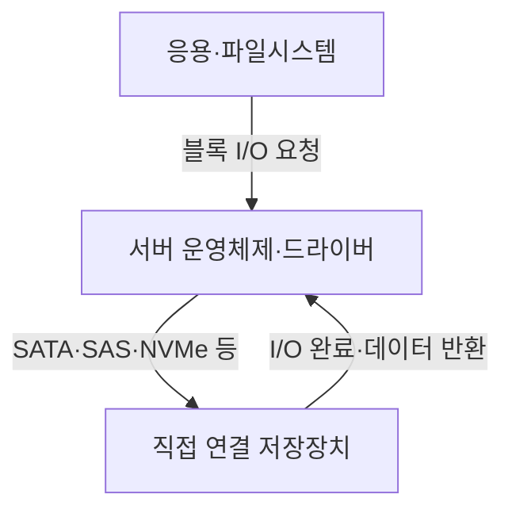
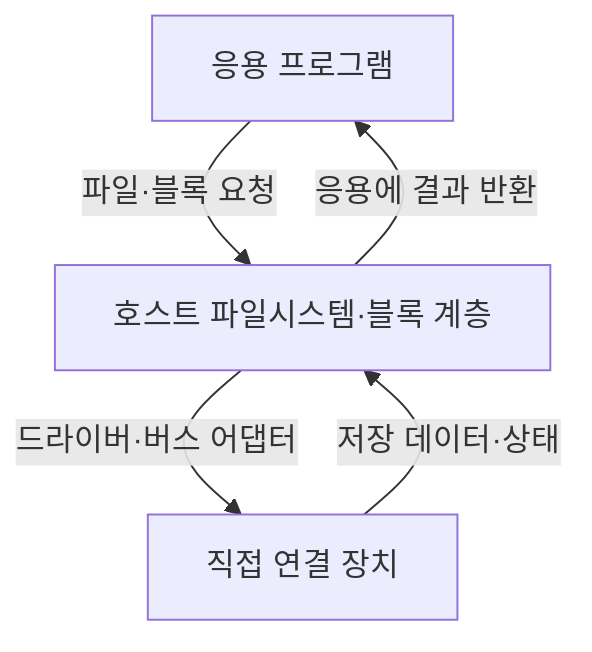
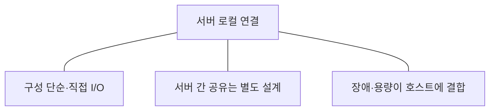

---
sidebar:
  order: 82
  label: "082. DAS"
  badge:
    text: "기초"
    variant: note
title: "DAS (Direct-Attached Storage)"
author: "GPT-6"
date: "2026-09-24T23:00:00+09:00"
tags:
  - "notes-computer-system"
extra:
  model: "GPT-6"
  keyword_grade: "기초"
  question_no: "082"
---

## 지식 로드맵 내 현재 위치

컴퓨터 시스템 및 네트워크 → 저장장치 연결 방식 → 서버 직접 연결

## 30초 인출

- 본질: **DAS (Direct-Attached Storage)**는 네트워크 스토리지 서비스 계층을 거치지 않고 서버에 직접 연결해 쓰는 저장장치 구성
- 메커니즘: 서버 I/O 요청 → 로컬 또는 직접 연결된 장치 → 서버 운영체제·파일시스템이 저장을 관리

핵심 용어

- **DAS (Direct-Attached Storage)**: 서버에 직접 연결해 해당 서버가 주로 사용하는 저장장치 구성
- **HBA (Host Bus Adapter)**: 서버와 저장장치 인터페이스 사이의 연결을 제공하는 어댑터
- **SATA (Serial ATA)**: 저장장치 연결에 쓰이는 직렬 인터페이스 규격
- **SAS (Serial Attached SCSI)**: 서버·엔터프라이즈 저장장치 연결에 쓰이는 직렬 SCSI 인터페이스
- **NVMe (Non-Volatile Memory Express)**: PCI Express 기반 비휘발성 저장장치 접근 프로토콜 계열

---

## 1교시 예상문제 (10점)

> DAS의 개념과 서버·저장장치 간 기본 구조를 설명하시오. (예상)

---

## 1교시 10점 답안

### Ⅰ. 개요

| 구분 | 핵심 |
|---|---|
| 정의 | **DAS (Direct-Attached Storage)**는 서버에 직접 연결되어 서버 운영체제가 접근·관리하는 저장장치 구성 |
| 목적 | 서버에 필요한 저장 용량과 I/O를 별도 스토리지 네트워크 계층 없이 제공하는 것 |

### Ⅱ. 연결 구조

### Ⅲ. 제언

- 제언: 서버 장애·증설·복구 특성을 고려한 직접 연결 용량과 보호 설계

---

## 2~4교시 예상문제 (25점)

> DAS의 연결 구조와 특성을 설명하고, NAS·SAN과 비교해 시스템 적용 시 고려사항을 제시하시오. (예상)

---

## 2~4교시 25점 답안

### Ⅰ. 개요

| 구분 | 핵심 |
|---|---|
| 정의 | **DAS (Direct-Attached Storage)**는 서버에 직접 연결되어 서버 운영체제가 접근·관리하는 저장장치 구성 |
| 목적 | 서버에 필요한 저장 용량과 I/O를 별도 스토리지 네트워크 계층 없이 제공하는 것 |

### Ⅱ. 구성과 I/O 경로

| 요소 | 기능 |
|---|---|
| 저장장치 | HDD·SSD 등 영속 저장 제공 |
| 연결 인터페이스 | SATA·SAS·PCIe/NVMe 등 장치 통신 |
| 호스트 스택 | 드라이버·블록 계층·파일시스템 수행 |
| 보호 수단 | 로컬 RAID·복제·백업 등 요구별 구성 |

### Ⅲ. 연결 방식 비교

| 구분 | DAS | NAS | SAN |
|---|---|---|---|
| 호스트 연결 | 서버에 직접 연결 | 파일 프로토콜로 네트워크 접근 | 스토리지 패브릭을 통한 블록 접근 |
| 접근 단위 | 블록·장치 | 파일·디렉터리 | 블록 장치 |
| 공유 | 기본적으로 서버 중심, 별도 공유 구성 필요 | 파일 서비스로 다중 사용자 공유 | 여러 호스트가 블록에 접근 가능하나 파일시스템 조정 필요 |
| 관리 지점 | 서버와 장치 | NAS 파일 서비스 | 스토리지 패브릭·어레이·호스트 |

### Ⅳ. 장단점과 적용

| 적합한 조건 | 고려사항 |
|---|---|
| 단일 서버의 로컬 용량·저지연 I/O | 서버 장애와 데이터 접근성의 결합 |
| 소규모·독립 업무시스템 | 증설·교체 시 장치별 작업 필요 |
| 임시·캐시·분산형 저장 역할 | 백업·복제·데이터 이동을 별도 설계 |

### Ⅴ. 가용성과 데이터 보호

| 장애·요구 | 설계 검토 |
|---|---|
| 디스크 고장 | RAID 수준·예비 장치·복구 절차 |
| 서버 장애 | 데이터 복구·대체 서버 연결성 |
| 백업·재해복구 | 별도 장애영역 사본·복원 검증 |
| 성능 저하 | 장치 지연·큐 깊이·호스트 버스 병목 |

### Ⅵ. 한계와 대응

| 한계 | 해결 방안 |
|---|---|
| 저장장치가 특정 서버에 묶이면 서버 장애 시 다른 호스트에서 즉시 활용하기 어려움 | 중요도에 맞춰 복제·백업·대체 호스트 연결·복구 시간을 시험 |
| 서버별로 저장소를 분산하면 용량·보호 정책이 달라질 수 있음 | 공통 모니터링·백업 기준을 두고 중앙 인벤토리로 용량·장애를 관리 |

### Ⅶ. 기술사적 제언

| 한계 | 해결 방안 |
|---|---|
| 초기 연결 비용만 보고 DAS를 선택하면 데이터 공유·확장·복구 요구가 뒤늦게 드러날 수 있음 | 데이터 중요도·공유 범위·복구 목표·증설 주기를 기준으로 DAS와 네트워크 스토리지의 총 운영 비용을 비교 |

---

## 출제 이력과 검증 출처

- 기출 확인 없음. 예상문제는 DAS의 직접 연결 본질과 시스템 적용 특성을 직접 질문
- 검증 출처:
  - [NVM Express specifications](https://nvmexpress.org/specifications/)
  - [INCITS T10 Technical Committee: SCSI standards](https://www.t10.org/)