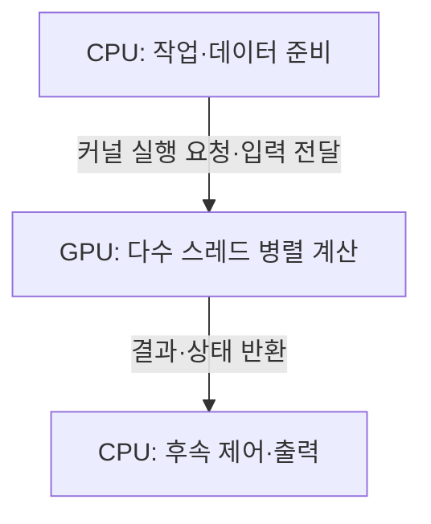
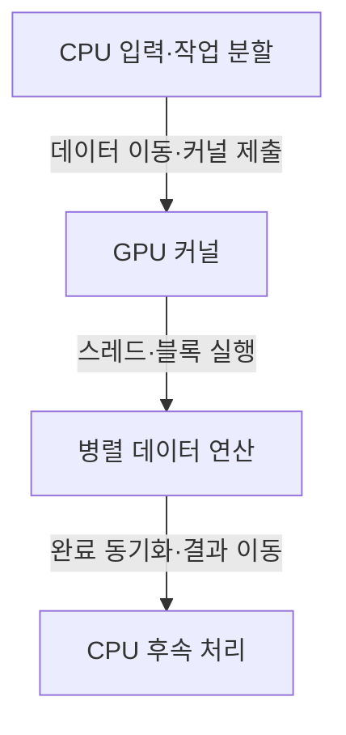
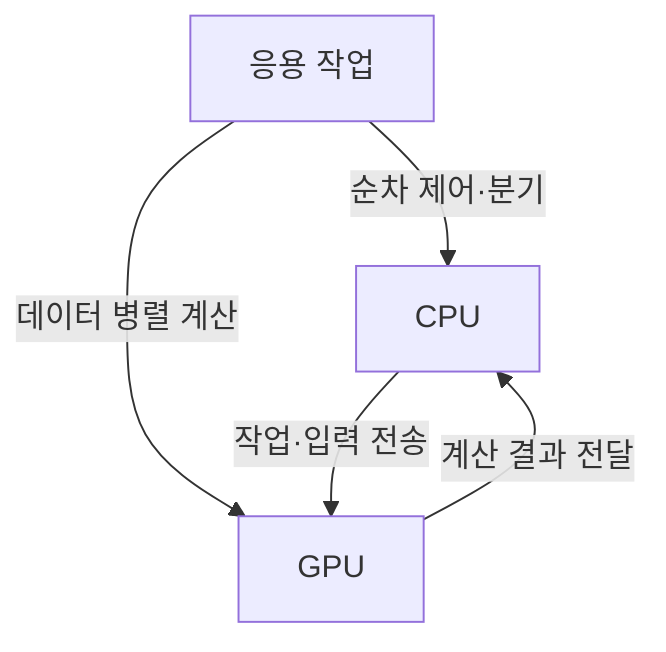

---
sidebar:
  order: 83
  label: "083. GPGPU"
  badge:
    text: "서브"
    variant: note
title: "GPGPU (General-Purpose computing on Graphics Processing Units)"
author: "GPT-6"
date: "2026-09-24T23:30:00+09:00"
tags:
  - "notes-computer-system"
extra:
  model: "GPT-6"
  keyword_grade: "서브"
  question_no: "083"
---

## 지식 로드맵 내 현재 위치

컴퓨터 시스템 및 네트워크 → 병렬 컴퓨팅 → GPU 범용 연산 활용

## 30초 인출

- 본질: **GPGPU (General-Purpose computing on Graphics Processing Units)**는 그래픽 처리용 GPU를 데이터 병렬성이 높은 범용 계산에 활용하는 방식
- 메커니즘: CPU가 작업·데이터를 준비하고 GPU 커널을 실행하며, 다수 스레드가 데이터에 같은 연산을 적용

핵심 용어

- **GPGPU (General-Purpose computing on Graphics Processing Units)**: 그래픽 외의 일반 계산을 GPU에서 수행하는 컴퓨팅 방식
- **SIMT (Single Instruction, Multiple Threads)**: 여러 스레드를 묶어 동일한 명령을 여러 데이터에 적용하는 GPU 실행 모델
- **커널 (Kernel)**: GPU에서 병렬 실행하도록 작성한 계산 함수
- **워프 (Warp)**: NVIDIA GPU에서 함께 스케줄되는 스레드 묶음; 크기·세부 동작은 아키텍처별 확인 필요
- **메모리 병합 접근 (Coalesced Memory Access)**: 스레드의 메모리 요청을 효율적인 데이터 전송으로 묶는 접근 패턴

---

## 1교시 예상문제 (10점)

> GPGPU의 개념과 CPU·GPU 간 기본 처리 구조를 설명하시오. (예상)

---

## 1교시 10점 답안

### Ⅰ. 개요

| 구분 | 핵심 |
|---|---|
| 정의 | **GPGPU (General-Purpose computing on Graphics Processing Units)**는 GPU의 병렬 실행 자원을 그래픽 이외의 범용 계산에 이용하는 방식 |
| 목적 | 데이터 병렬 계산에서 처리량을 높이고 CPU와 이기종으로 작업을 수행하는 것 |

### Ⅱ. 이기종 실행 구조

### Ⅲ. 제언

- 제언: 병렬화 이득과 데이터 이동 비용을 함께 측정한 GPU 오프로딩 판단

---

## 2~4교시 예상문제 (25점)

> GPGPU의 실행 구조와 CPU와의 역할 분담을 설명하고, 응용시스템 적용 시 성능·데이터 이동 고려사항을 제시하시오. (예상)

---

## 2~4교시 25점 답안

### Ⅰ. 개요

| 구분 | 핵심 |
|---|---|
| 정의 | **GPGPU (General-Purpose computing on Graphics Processing Units)**는 GPU의 병렬 실행 자원을 그래픽 이외의 범용 계산에 이용하는 방식 |
| 목적 | 데이터 병렬 계산에서 처리량을 높이고 CPU와 이기종으로 작업을 수행하는 것 |

### Ⅱ. 실행 구조

| 구성요소 | 기능 |
|---|---|
| CPU 호스트 | 순차 제어·작업 분할·GPU 작업 제출 |
| GPU 디바이스 | 다수의 병렬 스레드로 커널 수행 |
| 메모리 계층 | 호스트·디바이스 간 또는 통합 메모리 경로 제공 |
| 런타임·드라이버 | 커널 실행·메모리·동기화 관리 |

### Ⅲ. 커널 실행 흐름

| 실행 단위 | 의미 |
|---|---|
| 스레드 | 데이터 요소별 계산과 실행 상태 |
| 블록·그룹 | 스레드 협력·동기화·자원 배치 단위 |
| 실행 묶음 | 하드웨어가 스레드를 묶어 스케줄하는 단위; 구현은 GPU별 상이 |

### Ⅳ. 적합한 연산과 병목

| 관점 | GPU에 적합한 조건 | 불리할 수 있는 조건 |
|---|---|---|
| 병렬성 | 큰 데이터 집합에 반복 적용되는 연산 | 분기·의존성이 강한 소량 순차 작업 |
| 데이터 이동 | GPU에서 재사용되는 입력이 충분 | 전송·동기화 비용이 계산량에 비해 큼 |
| 메모리 접근 | 인접 스레드가 효율적으로 접근 가능 | 불규칙·비병합 접근으로 대역폭 낭비 |

### Ⅴ. CPU와 GPU 역할 분담

| 구분 | CPU 중심 | GPGPU 활용 |
|---|---|---|
| 제어 | 복잡한 분기·시스템 제어 | 데이터 병렬 커널 중심 |
| 계산 | 다양한 단일·다중 스레드 작업 | 처리량이 높은 반복 계산 |
| 비용 | 호스트 메모리·CPU 자원 | GPU 메모리·전력·전송·개발 비용 |

### Ⅵ. 성능 최적화

| 한계 | 해결 방안 |
|---|---|
| 커널 실행 전후의 데이터 복사·동기화가 가속 이득을 줄일 수 있음 | 데이터 재사용·배치 처리·비동기 전송을 프로파일링 결과에 따라 적용 |
| 분기 발산·메모리 접근 패턴이 처리량을 낮출 수 있음 | 스레드 배치와 데이터 레이아웃을 커널 단위로 측정·조정 |

### Ⅶ. 기술사적 제언

| 한계 | 해결 방안 |
|---|---|
| 피크 연산량만으로 실제 서비스 성능을 예측할 수 없음 | 대표 데이터와 종단 처리 흐름에서 지연·처리량·메모리·전력·비용을 함께 비교한 뒤 오프로딩 범위 결정 |

---

## 출제 이력과 검증 출처

- 제120회 1교시 12번 CPU와 GPGPU 비교 문항과 연계된 주제
- 검증 출처:
  - [NVIDIA CUDA Programming Guide](https://docs.nvidia.com/cuda/cuda-programming-guide/)
  - [NVIDIA CUDA Programming Guide: SIMT kernels](https://docs.nvidia.com/cuda/cuda-programming-guide/02-basics/writing-cuda-kernels.html)