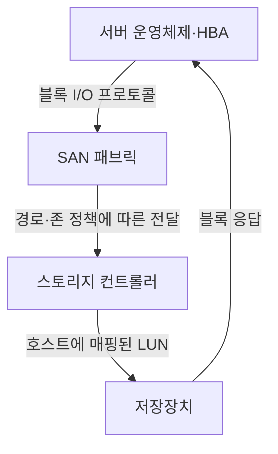
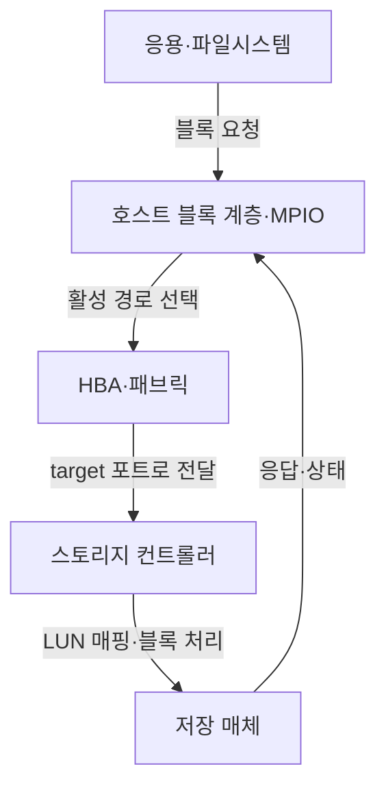
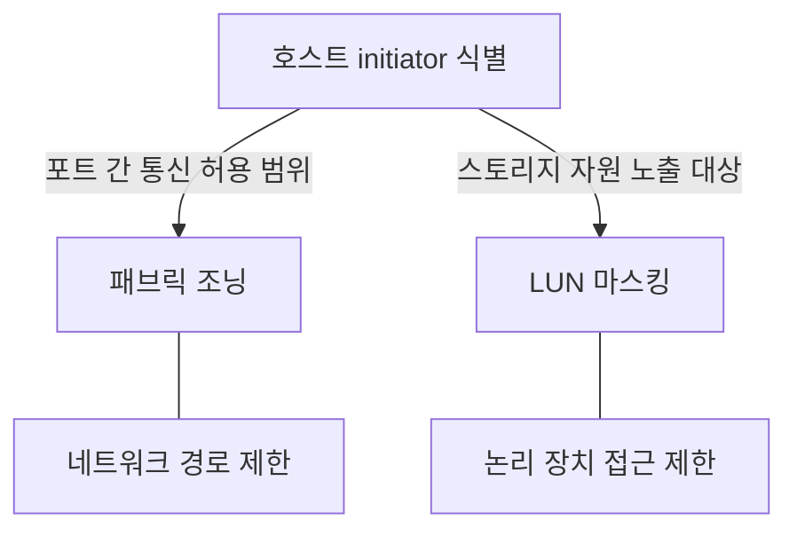
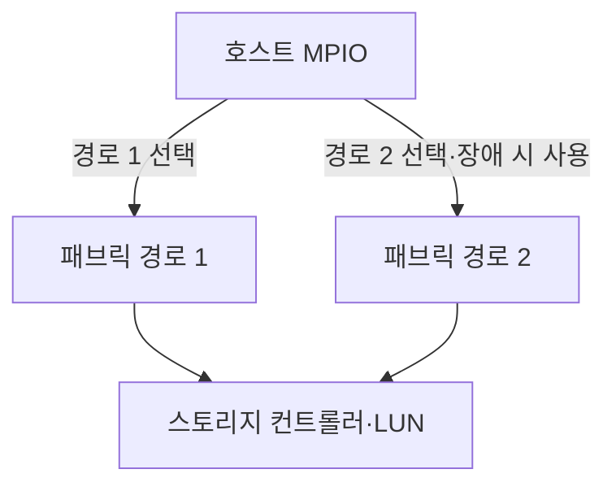

---
sidebar:
  order: 84
  label: "084. SAN"
  badge:
    text: "서브"
    variant: note
title: "SAN (Storage Area Network)"
author: "GPT-6"
date: "2026-09-24T23:30:00+09:00"
tags:
  - "notes-computer-system"
extra:
  model: "GPT-6"
  keyword_grade: "서브"
  question_no: "084"
---

## 지식 로드맵 내 현재 위치

컴퓨터 시스템 및 네트워크 → 저장장치 연결 방식 → 블록 스토리지 패브릭

## 30초 인출

- 본질: **SAN (Storage Area Network)**은 서버가 원격 저장장치를 블록 장치처럼 접근하도록 제공하는 전용 또는 논리적 스토리지 네트워크
- 메커니즘: 서버 HBA·프로토콜 → 패브릭 스위치 → 스토리지 포트·LUN → 호스트 블록 장치

핵심 용어

- **SAN (Storage Area Network)**: 서버와 저장장치 사이에 블록 접근 경로를 제공하는 스토리지 네트워크
- **FC (Fibre Channel)**: 스토리지 통신에 사용하는 고속 직렬 패브릭 기술
- **HBA (Host Bus Adapter)**: 서버를 스토리지 네트워크나 장치에 연결하는 어댑터
- **LUN (Logical Unit Number)**: 스토리지 시스템이 호스트에 제공하는 논리 단위 식별자
- **조닝 (Zoning)**: 패브릭에서 통신 가능한 포트·장치 집합을 제한하는 구성
- **LUN 마스킹 (LUN Masking)**: 스토리지 측에서 어떤 호스트에 논리 장치를 노출할지 제어하는 설정
- **MPIO (Multipath I/O)**: 호스트와 저장장치 사이의 복수 경로를 관리하는 기능

---

## 1교시 예상문제 (10점)

> SAN의 개념과 서버에서 저장장치까지의 접근 구조를 설명하시오. (예상)

---

## 1교시 10점 답안

### Ⅰ. 개요

| 구분 | 핵심 |
|---|---|
| 정의 | **SAN (Storage Area Network)**은 서버에 원격 스토리지를 블록 장치로 제공하는 네트워크 구성 |
| 목적 | 서버와 저장장치의 연결·용량을 분리해 공유·확장·중앙 관리하는 것 |

### Ⅱ. 기본 경로

### Ⅲ. 제언

- 제언: 경로·호스트 매핑·장애 전환을 함께 검증하는 SAN 운영

---

## 2~4교시 예상문제 (25점)

> SAN의 구성과 블록 I/O 경로를 설명하고, 호스트 접근 제어·다중 경로·장애 대응 방안을 제시하시오. (예상)

---

## 2~4교시 25점 답안

### Ⅰ. 개요

| 구분 | 핵심 |
|---|---|
| 정의 | **SAN (Storage Area Network)**은 서버에 원격 스토리지를 블록 장치로 제공하는 네트워크 구성 |
| 목적 | 서버와 저장장치의 연결·용량을 분리해 공유·확장·중앙 관리하는 것 |

### Ⅱ. 구성요소

| 구성요소 | 기능 | 운영 설정 |
|---|---|---|
| 서버 HBA·initiator | 블록 I/O 시작 | 포트·식별자·드라이버 |
| SAN 패브릭 | 호스트와 스토리지 경로 연결 | 스위치·조닝·경로 |
| 스토리지 target | 호스트 I/O 수신·처리 | 포트·컨트롤러 |
| LUN·논리 장치 | 블록 용량을 호스트에 제공 | 매핑·마스킹·용량 |
| 호스트 MPIO | 복수 경로 관리 | 경로 선택·장애 정책 |

### Ⅲ. I/O 전달 흐름

| 경로 단계 | 확인 항목 |
|---|---|
| 호스트 식별 | WWN (World Wide Name) 등 initiator 식별자 |
| 패브릭 접근 | 조닝·포트 연결·패브릭 상태 |
| 논리 장치 노출 | 스토리지 LUN 매핑·마스킹 |
| 호스트 인식 | 다중 경로·장치 식별·파일시스템 |

### Ⅳ. 접근 제어

| 통제 | 적용 위치 | 유의점 |
|---|---|---|
| 조닝 | SAN 패브릭 | 호스트·스토리지 간 필요한 경로만 허용 |
| LUN 마스킹 | 스토리지 시스템 | 호스트별 논리 장치 노출 제한 |
| 계정·관리 접근 | 관리 인터페이스 | 데이터 경로 접근 제어와 별도로 보호 |

### Ⅴ. 다중 경로·가용성

| 설계 항목 | 검토 내용 |
|---|---|
| 경로 분리 | 카드·케이블·스위치·컨트롤러의 장애영역 확인 |
| MPIO 정책 | 공급자·OS 지원 조합과 경로 전환 동작 시험 |
| 장애 처리 | 경로 장애 감지·I/O 재시도·복구 검증 |
| 성능 | 활성·대기 경로 정책과 부하 분산 조건 확인 |

### Ⅵ. 한계와 대응

| 한계 | 해결 방안 |
|---|---|
| 조닝과 LUN 설정이 불일치하면 장치 미인식이나 과도한 노출 가능 | 변경 승인·호스트 매핑 대조·신규 경로 연결 시험을 표준 절차화 |
| 다중 경로를 구성해도 공통 스위치·전원·컨트롤러가 있으면 단일 장애점 잔존 | 종단 경로의 공통 장애영역을 분석하고 실제 경로 장애·복구 시험 수행 |

### Ⅶ. 기술사적 제언

| 한계 | 해결 방안 |
|---|---|
| 포트 수·대역폭만으로 SAN 가용성과 성능을 평가하면 실제 호스트 경로·LUN 장애가 누락될 수 있음 | 서비스별 종단 I/O 지표와 경로별 장애 훈련 결과를 용량·경로 증설 우선순위에 반영 |

---

## 출제 이력과 검증 출처

- 기출 확인 없음. 예상문제는 SAN의 블록 스토리지 접근 구조를 직접 질문
- 검증 출처:
  - [NVM Express specifications](https://nvmexpress.org/specifications/)
  - [INCITS T10 Technical Committee: SCSI standards](https://www.t10.org/)