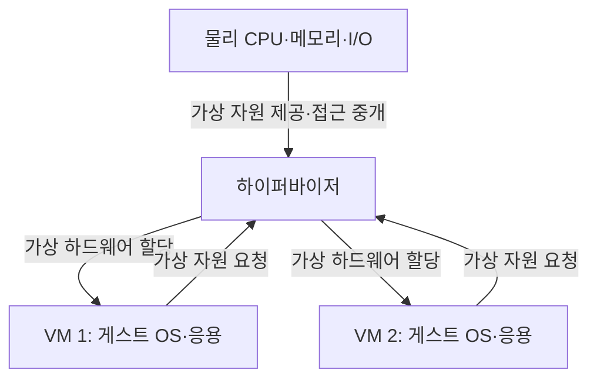
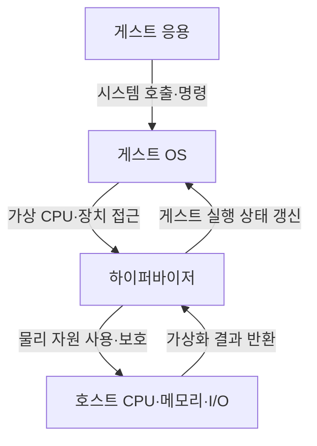
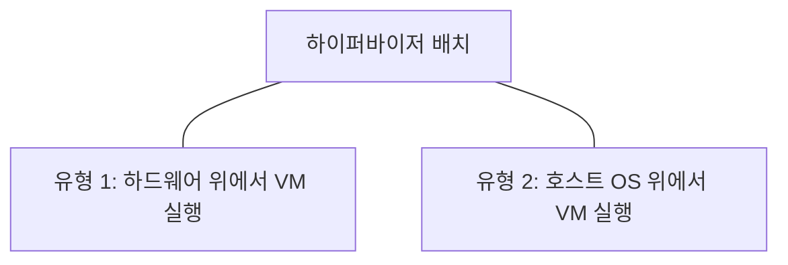

---
sidebar:
  order: 85
  label: "085. 가상머신"
  badge:
    text: "기초"
    variant: note
title: "가상머신 (Virtual Machine)"
author: "GPT-6"
date: "2026-09-24T23:30:00+09:00"
tags:
  - "notes-computer-system"
extra:
  model: "GPT-6"
  keyword_grade: "기초"
  question_no: "085"
---

## 지식 로드맵 내 현재 위치

컴퓨터 시스템 및 네트워크 → 시스템 가상화 → 가상머신

## 30초 인출

- 본질: **가상머신 (Virtual Machine, VM)**은 물리 자원을 가상 하드웨어로 추상화해 독립된 운영체제 환경을 실행하는 소프트웨어 기반 컴퓨터
- 메커니즘: 하이퍼바이저가 CPU·메모리·입출력을 중개하고 각 VM에 가상 자원을 제공

핵심 용어

- **가상머신 (Virtual Machine, VM)**: 가상 하드웨어와 운영체제를 포함해 격리 실행되는 논리 컴퓨터
- **하이퍼바이저 (Hypervisor)**: 물리 자원을 VM에 가상화·할당하고 접근을 중개하는 소프트웨어 계층
- **게스트 운영체제 (Guest OS)**: 가상머신 안에서 실행되는 운영체제
- **vCPU (Virtual CPU)**: 하이퍼바이저가 VM에 제공하는 논리 프로세서
- **라이브 마이그레이션 (Live Migration)**: 실행 중인 VM의 상태를 다른 호스트로 옮기는 기능; 전송 방식·서비스 중단 시간은 환경별 확인 필요

---

## 1교시 예상문제 (10점)

> 가상머신의 개념과 하이퍼바이저의 자원 중개 구조를 설명하시오. (예상)

---

## 1교시 10점 답안

### Ⅰ. 개요

| 구분 | 핵심 |
|---|---|
| 정의 | **가상머신 (Virtual Machine, VM)**은 가상 하드웨어 환경에 게스트 운영체제와 응용을 실행하는 소프트웨어 기반 논리 컴퓨터 |
| 목적 | 하나의 물리 호스트 자원을 여러 실행 환경이 공유하면서 논리적 격리·운영 유연성을 제공하는 것 |

### Ⅱ. 자원 중개 구조

### Ⅲ. 제언

- 제언: 워크로드 격리·호스트 용량·복구 요구를 반영한 VM 배치 기준

---

## 2~4교시 예상문제 (25점)

> 가상머신의 실행 구조와 자원 가상화 방식을 설명하고, 서버 통합 시 격리·성능·운영 고려사항을 제시하시오. (예상)

---

## 2~4교시 25점 답안

### Ⅰ. 개요

| 구분 | 핵심 |
|---|---|
| 정의 | **가상머신 (Virtual Machine, VM)**은 가상 하드웨어 환경에 게스트 운영체제와 응용을 실행하는 소프트웨어 기반 논리 컴퓨터 |
| 목적 | 하나의 물리 호스트 자원을 여러 실행 환경이 공유하면서 논리적 격리·운영 유연성을 제공하는 것 |

### Ⅱ. 구성 계층

| 계층 | 기능 |
|---|---|
| 물리 호스트 | CPU·메모리·저장장치·네트워크 제공 |
| 하이퍼바이저 | VM 생성·스케줄링·자원 접근 중개 |
| 가상 하드웨어 | VM이 인식하는 CPU·메모리·장치 인터페이스 |
| 게스트 OS·응용 | VM 안에서 독립적으로 동작하는 소프트웨어 |

### Ⅲ. VM 실행 경로

| 자원 | 가상화 관점 | 운영 요소 |
|---|---|---|
| CPU | vCPU를 물리 실행 자원에 스케줄 | 예약·제한·경합 |
| 메모리 | 게스트 주소와 호스트·기계 주소 매핑 | 회수·오버커밋·NUMA |
| 저장장치 | 가상 디스크·장치 패스스루 등 제공 | 용량·지연·백업 |
| 네트워크 | 가상 NIC·스위치 연결 | 분리·정책·대역폭 |

### Ⅳ. 하이퍼바이저 유형

| 구분 | 구조 | 주요 고려 |
|---|---|---|
| 유형 1 | 하드웨어 위에서 하이퍼바이저가 VM 관리 | 관리 평면·드라이버·보안 구성 |
| 유형 2 | 호스트 운영체제 위에 가상화 프로그램 배치 | 호스트 OS 의존성·성능·사용 편의 |

### Ⅴ. 성능·이동성

| 기능 | 목적 | 검증 항목 |
|---|---|---|
| 자원 스케줄링 | 다수 VM에 물리 자원 배분 | 경합·예약·성능 격리 |
| 스냅샷 | 특정 상태 보존·복귀 | 애플리케이션 일관성·보존 정책 |
| 라이브 마이그레이션 | 호스트 간 VM 실행상태 이전 | 호환성·네트워크·저장소·중단 시간 |
| 템플릿 | 일관된 VM 배포 | 이미지 취약점·패치·시크릿 제거 |

### Ⅵ. 격리와 운영 한계

| 한계 | 해결 방안 |
|---|---|
| VM 간 논리 격리는 하이퍼바이저·관리면 취약점으로 영향을 받을 수 있음 | 하이퍼바이저 패치·관리 권한 분리·가상 네트워크 통제·보안 모니터링 적용 |
| 자원 오버커밋은 부하 집중 시 성능 변동을 키울 수 있음 | 예약·한도·경합 지표를 정의하고 실제 최고 부하에서 성능 검증 |

### Ⅶ. 기술사적 제언

| 한계 | 해결 방안 |
|---|---|
| 서버 통합률만 높이면 장애 영향 범위와 자원 경합이 커질 수 있음 | 업무 중요도별 배치·격리 정책과 장애 도메인을 정의하고, 용량·보안·복구 시험을 통과한 호스트 풀만 운영에 반영 |

---

## 출제 이력과 검증 출처

- 기출 확인 없음. 예상문제는 가상머신의 실행 구조와 하이퍼바이저 역할을 직접 질문
- 검증 출처:
  - [NIST SP 800-125: Guide to Security for Full Virtualization Technologies](https://csrc.nist.gov/pubs/sp/800/125/final)
  - [NIST SP 800-125A Rev. 1: Server-based Hypervisor Platforms](https://csrc.nist.gov/pubs/sp/800/125/a/r1/final)
  - [Linux kernel KVM documentation](https://docs.kernel.org/virt/kvm/index.html)