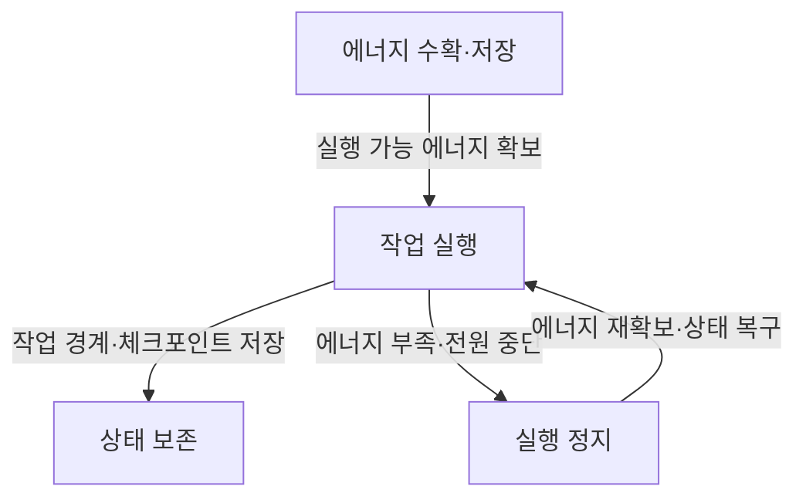
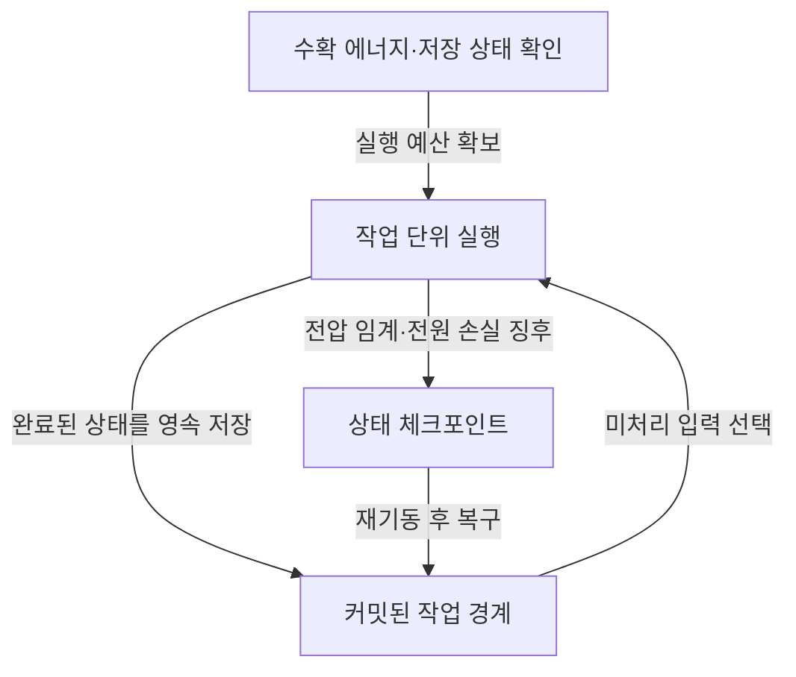
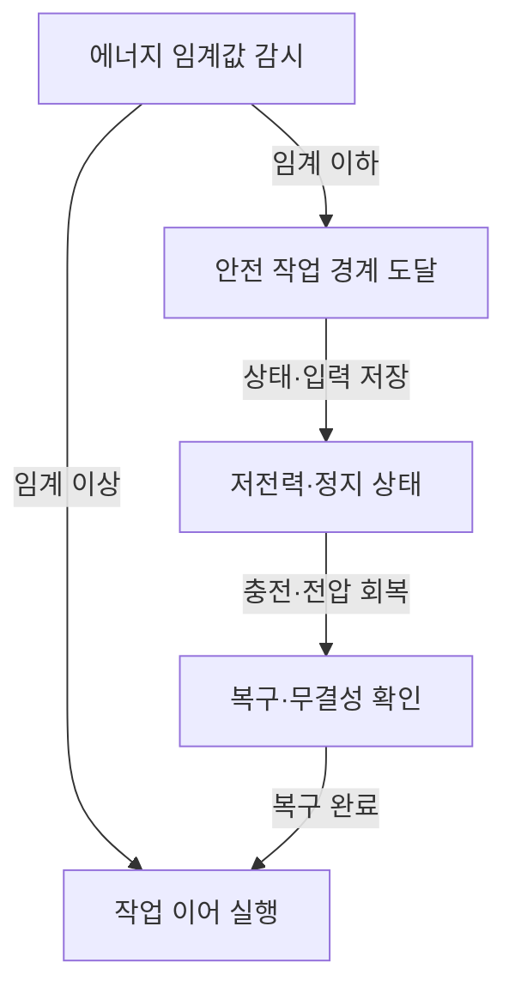

---
sidebar:
  order: 86
  label: "086. Intermittent Computing"
  badge:
    text: "서브"
    variant: note
title: "간헐적 컴퓨팅 (Intermittent Computing)"
author: "GPT-6"
date: "2026-09-24T23:59:00+09:00"
tags:
  - "notes-computer-system"
extra:
  model: "GPT-6"
  keyword_grade: "서브"
  question_no: "086"
---

## 지식 로드맵 내 현재 위치

컴퓨터 시스템 및 네트워크 → 에너지 수확형 단말 → 전원 단절을 고려한 실행

## 30초 인출

- 본질: **간헐적 컴퓨팅 (Intermittent Computing)**은 에너지 수확 등으로 전원이 반복 단절되는 장치에서 작업을 나눠 보존·재개하는 실행 방식
- 메커니즘: 에너지 확보 → 작업 실행 → 전력 부족 전 상태 보존 또는 일관된 작업 경계 도달 → 재충전 후 안전하게 재개

핵심 용어

- **간헐적 컴퓨팅 (Intermittent Computing)**: 불안정한 전원·에너지 수확 환경에서 실행 중단과 재개를 고려하는 컴퓨팅 방식
- **에너지 수확 (Energy Harvesting)**: 빛·진동·열 등 주변 에너지를 전기 에너지로 변환해 사용하는 기술
- **체크포인트 (Checkpoint)**: 중단 뒤 실행을 재개할 수 있도록 필요한 프로그램 상태를 보존하는 지점
- **영속 메모리 (Non-Volatile Memory)**: 전원이 끊겨도 저장 내용을 유지하는 메모리
- **원자적 작업 (Atomic Task)**: 중단·재실행 시 부분 효과가 노출되지 않도록 실행 경계를 설계한 작업 단위

---

## 1교시 예상문제 (10점)

> 간헐적 컴퓨팅의 개념과 전원 단절 대응 구조를 설명하시오. (예상)

---

## 1교시 10점 답안

### Ⅰ. 개요

| 구분 | 핵심 |
|---|---|
| 정의 | **간헐적 컴퓨팅 (Intermittent Computing)**은 실행 중 전원 중단이 가능한 환경에서 작업 상태 보존과 재개를 고려하는 컴퓨팅 방식 |
| 목적 | 배터리·상시 전원에 의존하기 어려운 단말이 불연속적인 에너지 공급 중에도 계산을 진전시키는 것 |

### Ⅱ. 실행 사이클

### Ⅲ. 제언

- 제언: 중단 뒤 데이터 일관성과 재실행 가능성을 먼저 검증하는 에너지 제약형 응용 설계

---

## 2~4교시 예상문제 (25점)

> 간헐적 컴퓨팅의 실행 모델과 상태 보존 기법을 설명하고, 에너지 수확형 정보시스템 적용 시 정확성·성능 고려사항을 제시하시오. (예상)

---

## 2~4교시 25점 답안

### Ⅰ. 개요

| 구분 | 핵심 |
|---|---|
| 정의 | **간헐적 컴퓨팅 (Intermittent Computing)**은 실행 중 전원 중단이 가능한 환경에서 작업 상태 보존과 재개를 고려하는 컴퓨팅 방식 |
| 목적 | 배터리·상시 전원에 의존하기 어려운 단말이 불연속적인 에너지 공급 중에도 계산을 진전시키는 것 |

### Ⅱ. 시스템 구성

| 구성 | 역할 |
|---|---|
| 에너지 수확원 | 외부 환경에서 에너지 획득 |
| 전력 관리 회로 | 수확·저장된 에너지와 장치 전원 관리 |
| 실행 장치 | 센싱·계산·통신 수행 |
| 영속 상태 저장소 | 체크포인트·작업 결과 저장 |
| 소프트웨어 런타임 | 중단 탐지·작업 경계·복구 제어 |

### Ⅲ. 상태 보존·재개 흐름

| 접근법 | 동작 | 장단점 |
|---|---|---|
| 체크포인트 기반 | 실행 상태를 저장한 뒤 재부팅 후 이어서 처리 | 상태 저장 비용·주기 조정 필요 |
| 태스크 기반 | 중단 안전한 작업 단위마다 결과를 영속 반영 | 작업 분할과 부작용 관리 필요 |
| 응용 의미 기반 | 계산 의미에 따라 중간 데이터·입력을 선택 보존 | 응용별 설계와 검증 필요 |

### Ⅳ. 정확성 조건

| 조건 | 확인 내용 |
|---|---|
| 재실행 안전성 | 중단 후 같은 작업이 반복돼도 데이터 손상·중복 효과 방지 |
| 입력 처리 | 센서·통신 입력을 잃지 않거나 중복 처리 방지 |
| 상태 원자성 | 관련 상태 갱신이 부분적으로만 저장되지 않도록 설계 |
| 진행 보장 | 작은 에너지 예산에서도 완료 가능한 작업 단위 구성 |

### Ⅴ. 실행 관리

| 관리요소 | 설계 관점 |
|---|---|
| 에너지 예측 | 수확량 변동과 작업 에너지 요구 추정 |
| 저장 정책 | 체크포인트 크기·빈도·쓰기 에너지 절충 |
| 작업 분할 | 작업 시간이 확보 에너지 구간을 넘지 않도록 조정 |
| 통신 | 연결 중단·재전송·중복 메시지 고려 |

### Ⅵ. 한계와 대응

| 한계 | 해결 방안 |
|---|---|
| 잦은 체크포인트는 저장 에너지·시간을 소모하고, 드문 저장은 재실행 비용을 키움 | 실제 에너지 수확·중단 패턴에서 체크포인트 주기와 작업 크기를 측정해 조정 |
| 외부 시스템에 비가역 부작용을 남기는 작업은 단순 재시도로 중복 실행될 수 있음 | 요청 식별자·멱등성·커밋 경계를 이용해 입력 수신과 외부 효과를 조정 |

### Ⅶ. 기술사적 제언

| 한계 | 해결 방안 |
|---|---|
| 계산 완료율만 높이면 에너지 비용·데이터 무결성·서비스 신뢰성을 놓칠 수 있음 | 작업 완료율·재실행량·저장 에너지·결과 일관성을 함께 측정하고, 응용의 안전한 완료 경계에 맞춰 실행 단위를 결정 |

---

## 출제 이력과 검증 출처

- 기출 확인 없음. 예상문제는 간헐적 컴퓨팅 자체의 실행·복구 모델을 직접 질문
- 검증 출처:
  - [ACM: Towards a formal foundation of intermittent computing](https://doi.org/10.1145/3428231)
  - [Alpaca: Intermittent Execution without Checkpoints](https://doi.org/10.1145/3133920)
