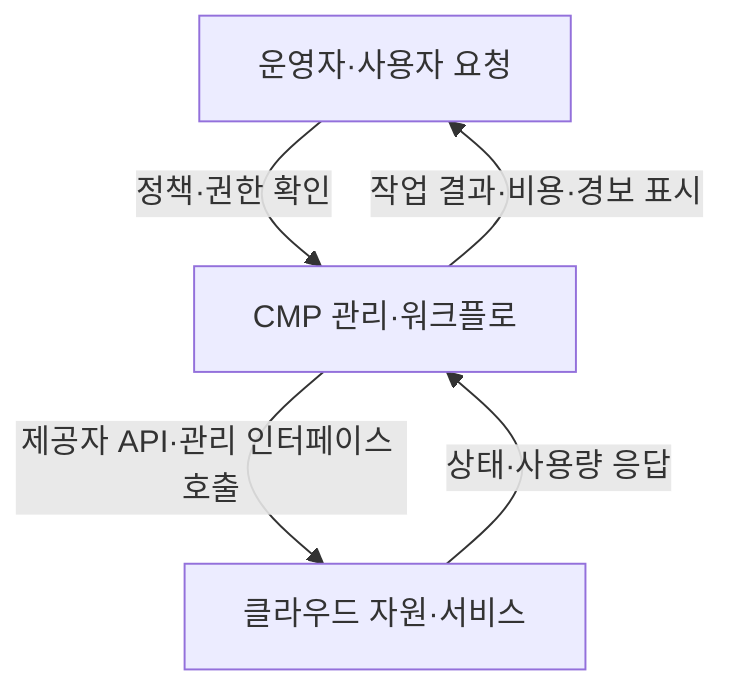
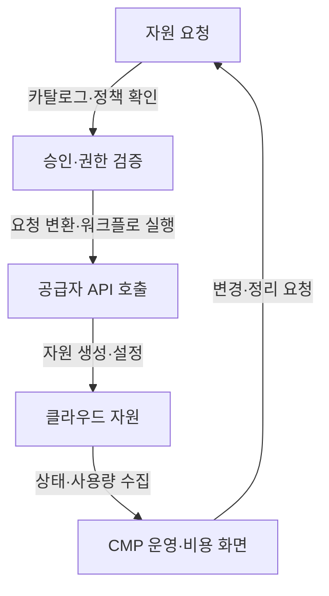
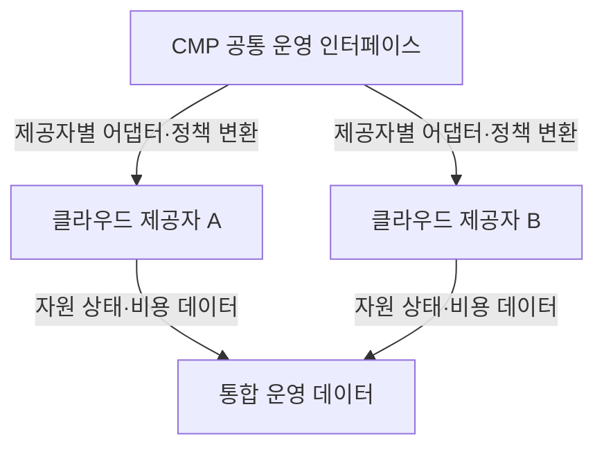

---
sidebar:
  order: 87
  label: "087. 클라우드 관리 플랫폼"
  badge:
    text: "서브"
    variant: note
title: "클라우드 관리 플랫폼 (Cloud Management Platform, CMP)"
author: "GPT-6"
date: "2026-09-24T23:59:00+09:00"
tags:
  - "notes-computer-system"
extra:
  model: "GPT-6"
  keyword_grade: "서브"
  question_no: "087"
---

## 지식 로드맵 내 현재 위치

컴퓨터 시스템 및 네트워크 → 클라우드 운영관리 → 통합 관리·자동화

## 30초 인출

- 본질: **클라우드 관리 플랫폼 (Cloud Management Platform, CMP)**은 클라우드 자원·서비스를 조회·통제·자동화하는 관리 도구의 집합
- 메커니즘: 운영자 요청 → 관리 정책·워크플로 → 공급자 API·관리 인터페이스 → 자원 변경·상태·비용을 통합 조회

핵심 용어

- **클라우드 관리 플랫폼 (Cloud Management Platform, CMP)**: 클라우드 자원·서비스의 운영·관리 기능을 제공하는 플랫폼; 범위와 기능은 제품·환경별로 다름
- **클라우드 관리 브로커 (Cloud Management Broker)**: 소비자와 클라우드 제공자 사이에서 서비스 관리·연계 기능을 수행하는 역할
- **프로비저닝 (Provisioning)**: 요청·정책에 따라 클라우드 자원을 생성·설정하는 작업
- **FinOps (Cloud Financial Management)**: 기술·재무·업무 조직이 클라우드 사용·비용을 함께 관리하는 실천 분야
- **RBAC (Role-Based Access Control)**: 역할에 따라 사용자 권한을 부여하는 접근통제 방식

---

## 1교시 예상문제 (10점)

> 클라우드 관리 플랫폼의 개념과 기본 관리 흐름을 설명하시오. (예상)

---

## 1교시 10점 답안

### Ⅰ. 개요

| 구분 | 핵심 |
|---|---|
| 정의 | **클라우드 관리 플랫폼 (Cloud Management Platform, CMP)**은 클라우드 자원·서비스의 조회·설정·운영을 지원하는 관리 기능의 집합 |
| 목적 | 관리 업무의 가시성·일관성·자동화를 지원하는 것 |

### Ⅱ. 관리 흐름

### Ⅲ. 제언

- 제언: 자원 변경 권한·승인·감사 요구를 반영한 클라우드 관리 자동화

---

## 2~4교시 예상문제 (25점)

> 클라우드 관리 플랫폼의 기능 구성과 자원 운영 절차를 설명하고, 다중 클라우드 환경 적용 시 통합성·보안·비용 측면의 고려사항을 제시하시오. (예상)

---

## 2~4교시 25점 답안

### Ⅰ. 개요

| 구분 | 핵심 |
|---|---|
| 정의 | **클라우드 관리 플랫폼 (Cloud Management Platform, CMP)**은 클라우드 자원·서비스의 조회·설정·운영을 지원하는 관리 기능의 집합 |
| 목적 | 관리 업무의 가시성·일관성·자동화를 지원하는 것 |

### Ⅱ. 관리 기능

| 기능 | 운영 역할 |
|---|---|
| 자원·서비스 카탈로그 | 승인된 자원 유형·기본 설정 제공 |
| 프로비저닝·오케스트레이션 | 요청 검증·자원 생성·연계 자동화 |
| 모니터링·운영 | 상태·성능·장애 정보 통합 조회 |
| 비용·사용량 관리 | 계정·태그·서비스별 사용량 분석 |
| 정책·권한 관리 | 승인·접근 제어·감사 기록 연계 |

### Ⅲ. 자원 요청 처리

| 단계 | 처리 |
|---|---|
| 요청 | 사용자·서비스 요구와 자원 템플릿 입력 |
| 검증 | 권한·예산·정책·승인 확인 |
| 실행 | 제공자별 API 호출 또는 자동화 작업 |
| 운영 | 자산·상태·비용·정책 준수 정보 수집 |
| 종료 | 자원 반납·데이터 처리·비용 종료 검증 |

### Ⅳ. 통합·다중 클라우드 관리

| 통합 대상 | 고려사항 |
|---|---|
| 자원 생명주기 | API·자원 유형·설정 항목 차이 |
| 계정·권한 | 자격증명 연계·최소 권한·비상 접근 |
| 운영 정보 | 상태·성능·비용의 공통 분류와 원천 데이터 |
| 자동화 | 공급자 API 변경·실패·재시도 처리 |

### Ⅴ. 비용·정책 통제

| 관리 관점 | 기능 | 검증 기준 |
|---|---|---|
| 비용 가시성 | 계정·태그·업무별 사용량 분석 | 비용 귀속률·미분류 자원 |
| 정책 준수 | 승인된 이미지·구성·위치 제한 | 정책 위반 탐지·예외 기록 |
| 자원 최적화 | 유휴·과대 자원 식별 | 성능 영향 검토 뒤 변경 |
| 변경 감사 | 요청자·승인자·작업 내역 보존 | 로그 완전성·조회 권한 |

### Ⅵ. 한계와 대응

| 한계 | 해결 방안 |
|---|---|
| 제공자별 API·기능 차이를 공통 모델이 모두 표현하지 못할 수 있음 | 공통 관리 대상과 제공자 고유 기능을 구분하고, 미지원 기능·실패 동작을 명시 |
| CMP에 관리자 권한이 집중되면 자격증명 침해의 영향이 커질 수 있음 | 별도 관리 ID·최소 권한·비밀정보 회전·관리 행위 감사를 적용하고, 비상 복구 경로를 독립 검증 |

### Ⅶ. 기술사적 제언

| 한계 | 해결 방안 |
|---|---|
| 단일 관리 화면을 도입해도 정책·비용 분류·자산 소유 정보가 표준화되지 않으면 운영 통합이 제한됨 | 공통 자원 분류·소유 태그·승인·비용 규칙을 먼저 정의하고, 소규모 업무군에서 프로비저닝·변경·반납의 전 과정 연계를 검증 |

---

## 출제 이력과 검증 출처

- 기출 확인 없음. 예상문제는 CMP의 관리 기능과 자원 운영 흐름을 직접 질문
- 검증 출처:
  - [NIST: Cloud Management Broker](https://www.nist.gov/itl/61-cloud-management-broker)
  - [NIST Cloud Computing Reference Architecture, SP 500-292](https://doi.org/10.6028/NIST.SP.500-292)
  - [Google Cloud: What is cloud management?](https://cloud.google.com/learn/what-is-cloud-management)