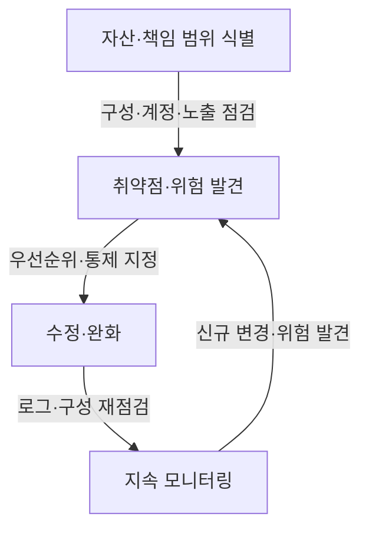
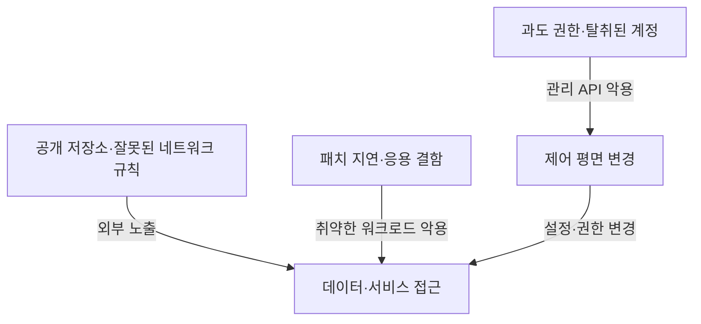
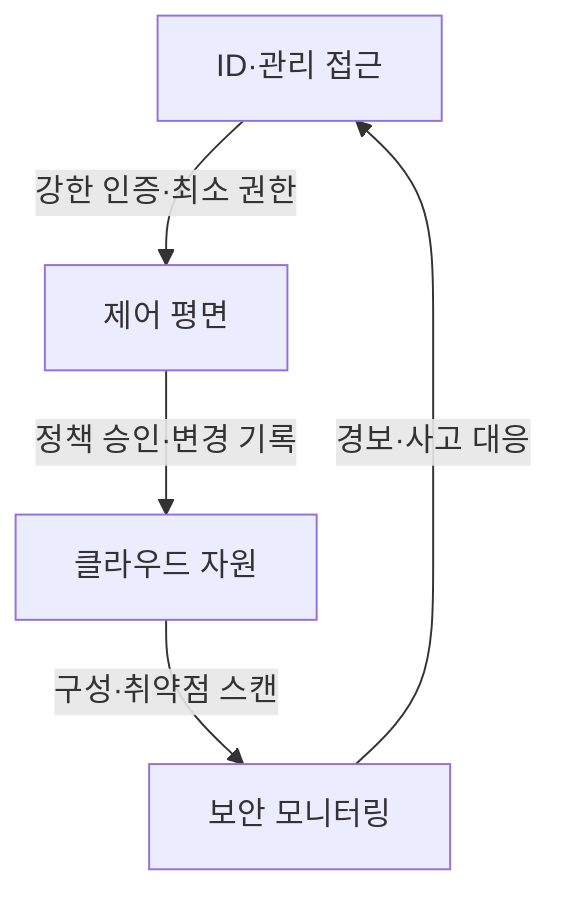

---
sidebar:
  order: 88
  label: "088. 클라우드 서비스 보안 취약점"
  badge:
    text: "서브"
    variant: note
title: "클라우드 서비스 보안 취약점과 대응"
author: "GPT-6"
date: "2026-09-24T23:59:00+09:00"
tags:
  - "notes-computer-system"
extra:
  model: "GPT-6"
  keyword_grade: "서브"
  question_no: "088"
---

## 지식 로드맵 내 현재 위치

컴퓨터 시스템 및 네트워크 → 클라우드 운영보안 → 구성·접근·데이터 위험 관리

## 30초 인출

- 본질: **클라우드 서비스 보안 취약점**은 클라우드 자원·관리 인터페이스·계정·데이터의 잘못된 구성이나 결함으로 기밀성·무결성·가용성이 위협받는 약점
- 메커니즘: 공격 표면·책임 범위 식별 → 위험 통제 → 로그·구성 감시 → 사고 대응·복구

핵심 용어

- **클라우드 서비스 보안 취약점**: 클라우드 기반 서비스의 구성·소프트웨어·접근통제 결함으로 악용될 수 있는 약점
- **제어 평면 (Control Plane)**: 클라우드 자원 생성·권한·정책·설정을 관리하는 인터페이스와 기능
- **IAM (Identity and Access Management)**: 사용자·서비스 ID와 권한을 관리하는 체계
- **공동 책임 모델 (Shared Responsibility Model)**: 공급자와 고객의 보안 책임을 서비스 유형·계약·구성에 따라 나누는 원칙
- **CSPM (Cloud Security Posture Management)**: 클라우드 구성·정책 준수 위험을 지속적으로 발견·관리하는 보안 접근·도구 범주

---

## 1교시 예상문제 (10점)

> 클라우드 서비스 보안 취약점의 주요 유형과 관리 흐름을 설명하시오. (예상)

---

## 1교시 10점 답안

### Ⅰ. 개요

| 구분 | 핵심 |
|---|---|
| 정의 | **클라우드 서비스 보안 취약점**은 자원 구성·관리 인터페이스·계정·응용의 약점이 클라우드 환경의 정보자산 위협으로 이어질 수 있는 상태 |
| 목적 | 취약점·설정 오류를 조기에 찾아 서비스·데이터의 보안 위험을 낮추는 것 |

### Ⅱ. 관리 흐름

### Ⅲ. 제언

- 제언: 계정·제어 평면·데이터 노출을 함께 점검하는 클라우드 보안 기준

---

## 2~4교시 예상문제 (25점)

> 클라우드 서비스 환경의 주요 보안 취약점과 공격 경로를 설명하고, 예방·탐지·대응 체계를 제시하시오. (예상)

---

## 2~4교시 25점 답안

### Ⅰ. 개요

| 구분 | 핵심 |
|---|---|
| 정의 | **클라우드 서비스 보안 취약점**은 자원 구성·관리 인터페이스·계정·응용의 약점이 클라우드 환경의 정보자산 위협으로 이어질 수 있는 상태 |
| 목적 | 취약점·설정 오류를 조기에 찾아 서비스·데이터의 보안 위험을 낮추는 것 |

### Ⅱ. 보안 범위

| 영역 | 보호 대상 | 주요 통제 |
|---|---|---|
| 제어 평면 | 계정·정책·자원 설정 | 강한 인증·최소 권한·관리 감사 |
| 데이터 평면 | 응용·가상 네트워크·데이터 | 네트워크 분리·암호화·응용 보안 |
| 공급자 기반시설 | 물리 시설·기반 서비스 | 서비스 책임·인증 자료·계약 조건 확인 |
| 고객 구성 | 계정·워크로드·데이터 설정 | 구성 기준·취약점 관리·복구 통제 |

### Ⅲ. 주요 취약점과 경로

| 취약점 유형 | 발생 원인 | 보호 대상 |
|---|---|---|
| 과도한 권한·계정 탈취 | 권한 과다, 자격증명 노출, 인증 약화 | 제어 평면·데이터 |
| 잘못된 구성 | 공개 설정, 보안그룹·저장소 정책 오류 | 네트워크·데이터 |
| 취약한 API·응용 | 입력 검증·인증·패치 결함 | 서비스·계정 |
| 다중 테넌시 격리 결함 | 가상화·서비스의 격리 약점 | 다른 고객의 자원·정보 |
| 가시성 부족 | 로그·자산·구성 변경 추적 미흡 | 탐지·조사 능력 |

### Ⅳ. 공격 경로별 통제

| 통제 계층 | 핵심 조치 |
|---|---|
| ID·권한 | MFA, 역할 분리, 단기 자격증명, 비밀정보 보호 |
| 구성 | 정책 기반 배포, 보안 기준선, 공개 노출 방지 검사 |
| 워크로드 | 취약점·이미지 스캔, 패치, 런타임 보호 |
| 데이터 | 분류·암호화·키 관리·접근 감사 |
| 운영 | 중앙 로그, 경보, 조사·복구 훈련 |

### Ⅴ. 공동 책임·위험 관리

| 구분 | 확인 사항 |
|---|---|
| 책임 경계 | IaaS·PaaS·SaaS 및 서비스별 공급자·고객 책임 확인 |
| 위험 평가 | 정보 민감도·위협·영향도에 따른 통제 우선순위 |
| 공급자 검토 | 보안 기능·사고 통지·데이터 위치·삭제·감사 증빙 |
| 복구 | 백업·키 복구·계정 복구·서비스 전환 시험 |

### Ⅵ. 한계와 대응

| 한계 | 해결 방안 |
|---|---|
| 책임 분담을 서비스 이름만으로 판단하면 실제 구성·계약상의 책임이 빠질 수 있음 | 서비스 유형·계약·배포 구성을 기준으로 책임 행렬과 통제 소유자를 문서화 |
| 자동 구성 점검은 정책 예외·업무 맥락을 이해하지 못할 수 있음 | 예외 승인·만료·보완 통제를 갖추고 위험 기반 우선순위로 조치 |

### Ⅶ. 기술사적 제언

| 한계 | 해결 방안 |
|---|---|
| 발견 건수만 줄이면 위험 감소와 서비스 영향이 함께 확인되지 않을 수 있음 | 자산 중요도·노출 경로·악용 가능성·업무 영향으로 위험을 우선순위화하고, 수정 후 통제 효과·복구 가능성을 검증 |

---

## 출제 이력과 검증 출처

- 기출 확인 없음. 예상문제는 클라우드 서비스 취약점과 보안 관리 흐름을 직접 질문
- 검증 출처:
  - [NIST SP 800-144: Guidelines on Security and Privacy in Public Cloud Computing](https://csrc.nist.gov/pubs/sp/800/144/final)
  - [NIST SP 800-210: General Access Control Guidance for Cloud Systems](https://csrc.nist.gov/pubs/sp/800/210/final)