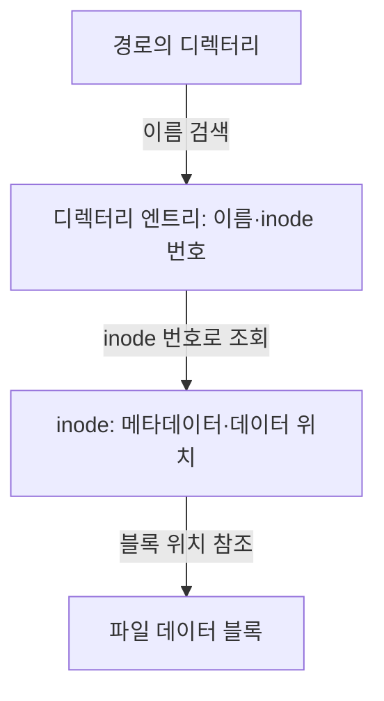
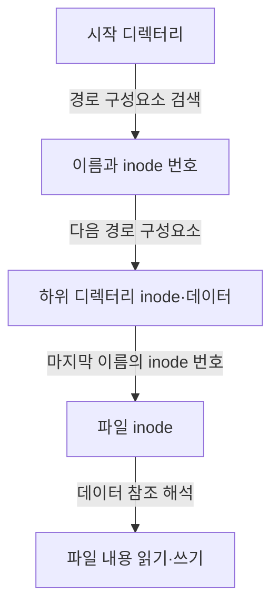
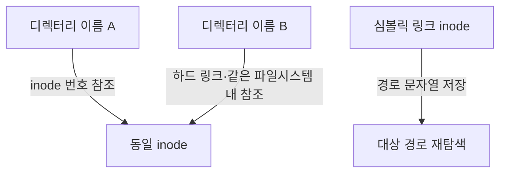

---
sidebar:
  order: 89
  label: "089. inode"
  badge:
    text: "기초"
    variant: note
title: "inode (Index Node)"
author: "GPT-6"
date: "2026-09-24T23:59:00+09:00"
tags:
  - "notes-computer-system"
extra:
  model: "GPT-6"
  keyword_grade: "기초"
  question_no: "089"
---

## 지식 로드맵 내 현재 위치

컴퓨터 시스템 및 네트워크 → 파일시스템 → 파일 메타데이터와 데이터 연결

## 30초 인출

- 본질: **inode (Index Node)**는 Unix 계열 파일시스템에서 파일 객체의 메타데이터와 데이터 위치 정보를 관리하는 자료구조
- 메커니즘: 디렉터리 이름 → inode 번호 → inode 메타데이터·데이터 블록 참조

핵심 용어

- **inode (Index Node)**: 파일의 유형·권한·소유자·크기·시간·데이터 블록 정보를 저장하는 파일시스템 자료구조
- **디렉터리 엔트리 (Directory Entry)**: 파일 이름과 해당 파일시스템 내 inode 번호를 연결하는 디렉터리의 항목
- **하드 링크 (Hard Link)**: 같은 inode를 가리키는 추가 디렉터리 엔트리
- **심볼릭 링크 (Symbolic Link)**: 대상 경로명을 내용으로 저장하는 별도 파일 객체
- **링크 수 (Link Count)**: inode를 참조하는 디렉터리 링크 수를 나타내는 메타데이터 값

---

## 1교시 예상문제 (10점)

> inode의 개념과 디렉터리 이름에서 파일 데이터에 이르는 연결 구조를 설명하시오. (예상)

---

## 1교시 10점 답안

### Ⅰ. 개요

| 구분 | 핵심 |
|---|---|
| 정의 | **inode (Index Node)**는 파일시스템에서 파일 객체의 메타데이터와 데이터 위치 정보를 관리하는 자료구조 |
| 목적 | 파일 이름 공간과 파일 객체·데이터 저장 위치를 분리해 파일을 관리하는 것 |

### Ⅱ. 파일 탐색 구조

### Ⅲ. 제언

- 제언: 파일 이름·inode·데이터 블록을 구분해 분석하는 파일시스템 장애 진단

---

## 2~4교시 예상문제 (25점)

> inode의 구성과 파일 접근·링크 동작을 설명하고, 파일시스템 운영·장애 분석 시 고려사항을 제시하시오. (예상)

---

## 2~4교시 25점 답안

### Ⅰ. 개요

| 구분 | 핵심 |
|---|---|
| 정의 | **inode (Index Node)**는 파일시스템에서 파일 객체의 메타데이터와 데이터 위치 정보를 관리하는 자료구조 |
| 목적 | 파일 이름 공간과 파일 객체·데이터 저장 위치를 분리해 파일을 관리하는 것 |

### Ⅱ. inode 정보

| 정보 | 역할 |
|---|---|
| 파일 유형·권한 | 일반 파일·디렉터리 등 객체 유형과 접근 모드 |
| 소유자·그룹 | 접근 제어 주체 정보 |
| 크기·시간 | 객체 크기와 파일시스템별 시각 정보 |
| 링크 수 | inode를 참조하는 링크 수 |
| 데이터 위치 | 파일 내용의 저장 블록·extent 참조 |

### Ⅲ. 경로명 탐색

| 구분 | 저장 위치·역할 |
|---|---|
| 파일 이름 | 디렉터리 엔트리 |
| 파일 메타데이터 | inode |
| 파일 내용 | 파일 데이터 블록 또는 파일시스템이 제공하는 데이터 영역 |

### Ⅳ. 링크 동작

| 구분 | 하드 링크 | 심볼릭 링크 |
|---|---|---|
| 참조 대상 | 같은 파일시스템의 동일 inode | 대상 경로명을 가진 별도 inode |
| 이름 삭제 | 한 엔트리 삭제; 다른 링크는 남을 수 있음 | 링크 객체 제거; 대상 파일은 별도 |
| 파일시스템 경계 | inode 참조이므로 일반적으로 경계를 넘지 않음 | 경로 문자열이므로 다른 파일시스템 대상 가능 |

### Ⅴ. 생성·삭제와 공간 회수

| 동작 | inode·디렉터리 처리 |
|---|---|
| 파일 생성 | 디렉터리 엔트리와 inode·데이터 공간 할당 |
| 하드 링크 추가 | 같은 inode를 가리키는 엔트리 추가·링크 수 갱신 |
| 이름 삭제 | 디렉터리 엔트리 제거·링크 수 갱신 |
| 실제 회수 | 링크가 더 없고 열린 참조도 해제되면 파일시스템이 공간 회수 가능 |

### Ⅵ. 운영 한계와 진단

| 한계 | 해결 방안 |
|---|---|
| 데이터 용량 여유가 있어도 파일시스템의 inode 자원이 부족하면 새 객체 생성이 제한될 수 있음 | 파일 수·inode 사용량·디렉터리 증가를 함께 모니터링하고 파일시스템별 할당 정책 확인 |
| 이름·inode·데이터 블록 중 어느 단계가 손상됐는지에 따라 증상이 다름 | 디렉터리 엔트리·inode 메타데이터·블록 참조를 파일시스템 도구로 점검하고 백업 기반 복구 절차 사용 |

### Ⅶ. 기술사적 제언

| 한계 | 해결 방안 |
|---|---|
| 파일 경로만 조사하면 파일 이름 변경·하드 링크·삭제 후 열린 파일 때문에 실제 객체 상태를 놓칠 수 있음 | 장애 조사 시 경로와 inode 식별자·링크 수·열린 참조·데이터 블록 상태를 함께 수집하는 진단 절차 마련 |

---

## 출제 이력과 검증 출처

- 기출 확인 없음. 예상문제는 inode의 파일시스템 역할과 연결 구조를 직접 질문
- 검증 출처:
  - [Linux kernel documentation: ext4 inode structures](https://docs.kernel.org/filesystems/ext4/inodes.html)
  - [Linux kernel documentation: ext4 directory entries](https://docs.kernel.org/filesystems/ext4/directory.html)