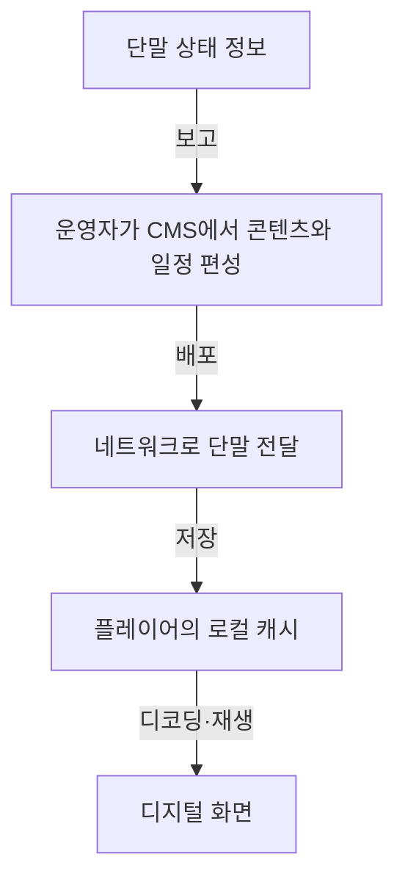
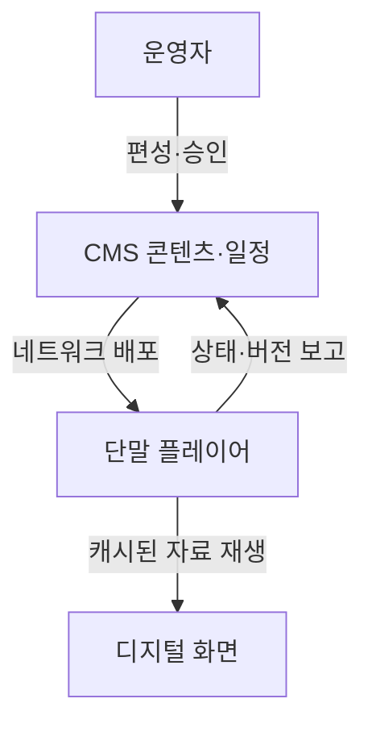

## 지식 로드맵 내 현재 위치

컴퓨터 시스템 → 디지털 사이니지 → DID

## 30초 인출

- 본질: DID(Digital Information Display)는 중앙에서 콘텐츠를 편성해 네트워크 단말에 배포하고 화면에 표출하는 디지털 사이니지 시스템
- 메커니즘: 콘텐츠 편성·배포 → 단말 캐시·재생 → 상태 확인·갱신

핵심 용어

- **DID (Digital Information Display, 디지털 정보 디스플레이)** : 네트워크로 콘텐츠를 관리하고 디지털 화면에 표출하는 사이니지 시스템
- **CMS (Content Management System, 콘텐츠 관리 시스템)** : 화면별 콘텐츠·재생 일정·배포 대상을 관리하는 소프트웨어
- **SoC (System on a Chip, 시스템 온 칩)** : 프로세서·메모리 등 기능을 하나의 반도체에 통합한 회로
- **번인(Burn-in)** : 같은 화면 요소의 장시간 표시로 디스플레이에 잔상이 남는 열화 현상

---

## 1교시 예상문제 (10점)

> DID(Digital Information Display)의 정의와 목적, 주요 구성요소 및 콘텐츠 표출 과정을 설명하시오. (예상)

---

## 1교시 10점 답안

## Ⅰ. DID의 개요

| 구분 | 핵심 |
|---|---|
| 정의 | DID는 중앙 CMS에서 콘텐츠와 일정을 관리하고 네트워크 단말에 배포해 디지털 화면에 표출하는 사이니지 시스템 |
| 목적 | 여러 장소의 화면을 일관되게 갱신하고 현장별 수작업 게시를 줄이는 운영 |

## Ⅱ. 구성과 표출 과정

- CMS는 편성·배포, 플레이어는 캐시·재생, 화면은 콘텐츠 표출을 담당
- 제언: 콘텐츠 버전과 단말별 재생 상태를 중앙에서 확인할 수 있도록 배포 이력을 관리.

---
## 2~4교시 예상문제 (25점)

> DID의 구성요소와 콘텐츠 배포·표출 구조를 설명하고, 운영상 한계와 대응 방안을 제시하시오. (예상)

---

## 2~4교시 25점 답안

## Ⅰ. DID의 개요

| 구분 | 핵심 |
|---|---|
| 정의 | DID는 중앙 CMS에서 콘텐츠와 일정을 관리하고 네트워크 단말에 배포해 디지털 화면에 표출하는 사이니지 시스템 |
| 목적 | 여러 장소의 화면을 일관되게 갱신하고 현장별 수작업 게시를 줄이는 운영 |

## Ⅱ. 콘텐츠 관리와 표출 구조

- CMS는 콘텐츠와 일정, 대상 단말을 관리하고 플레이어는 받은 콘텐츠를 화면에 재생
- 통신이 끊기면 새 콘텐츠 배포는 멈추지만 이미 저장한 자료는 단말의 지원 범위에서 재생 가능

## Ⅲ. 구성요소별 역할과 관리 기준

| 구성요소 | 역할 | 운영 확인점 |
|---|---|---|
| CMS | 콘텐츠 제작·승인·일정·배포 관리 | 권한과 승인 이력 |
| 통신망 | CMS와 단말 사이 콘텐츠·상태 전달 | 연결 상태와 전송 재시도 |
| 플레이어 | 콘텐츠 저장·디코딩·재생 | 캐시 용량·버전·재생 상태 |
| 디스플레이 | 영상·이미지 표출 | 설치 환경에 맞는 밝기·운전 사양 |

## Ⅳ. 운영 한계와 대응

| 한계 | 대응 |
|---|---|
| 통신 장애로 최신 콘텐츠를 받지 못함 | 로컬 캐시 재생과 연결 복구 후 재배포 절차를 마련 |
| 같은 화면 요소를 오래 표시해 잔상이 생길 수 있음 | 화면 보호 기능을 확인하고 콘텐츠 표시 주기를 관리 |

## Ⅴ. 기술사적 제언

| 한계 | 해결 방안 |
|---|---|
| 여러 장소의 표출 상태와 콘텐츠 버전이 흩어져 장애 원인 확인이 늦어짐 | 단말별 배포 버전·재생 상태·장애 기록을 중앙에서 조회하도록 운영 기준을 통합 |
## 출제 이력과 검증 출처

- 기출 회차·문항 원문: 공식 자료 대조 전 미확인
- [Samsung Business, 디지털 사이니지 콘텐츠·원격 관리 구현 사례](https://www.samsung.com/us/business/solutions/digital-signage-solutions/magicinfo/)
