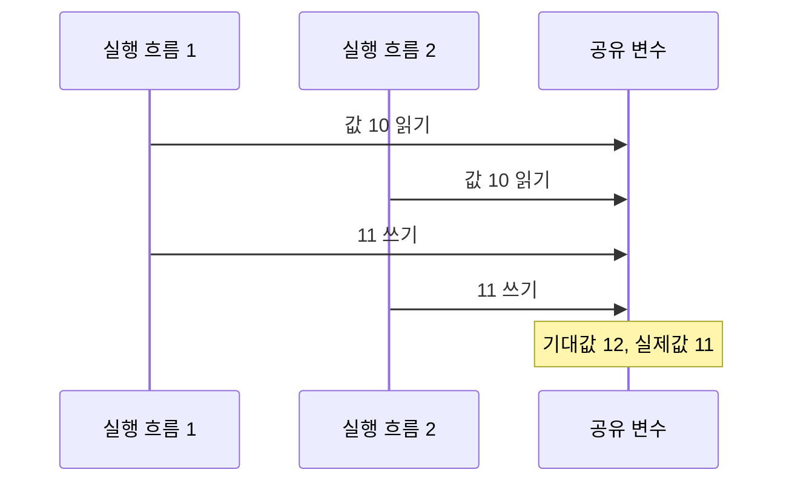
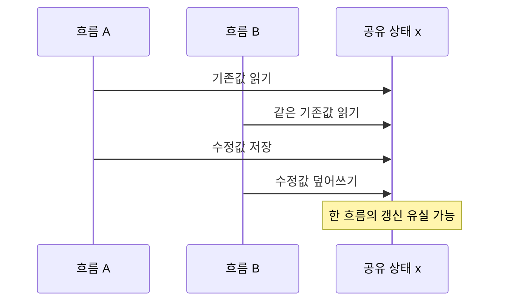

## 지식 로드맵 내 현재 위치

컴퓨터 시스템 → 동시성 제어 → 경쟁 상태

## 30초 인출

- 본질: 경쟁 상태는 여러 실행 흐름의 순서나 타이밍에 따라 결과가 달라지는 결함
- 메커니즘: 공유 상태 접근의 원자성·순서를 보장하지 못하면 실행 간섭으로 결과 불일치 발생

## 핵심 용어

핵심 용어

- **경쟁 상태(Race Condition)** : 실행 순서·타이밍에 따라 결과가 달라지는 결함
- **임계구역(Critical Section)** : 공유 상태에 접근해 불변식을 바꾸는 코드 영역
- **상호 배제(Mutual Exclusion)** : 한 실행 흐름이 임계구역을 사용하는 동안 다른 흐름의 동시 진입을 막는 성질
- **데이터 레이스(Data Race)** : 동기화 없이 같은 메모리 위치를 동시에 접근하고, 그중 하나 이상이 쓰기인 실행
- **원자 연산(Atomic Operation)** : 다른 실행 흐름에서 중간 상태를 관찰할 수 없도록 하나의 연산으로 처리되는 동작

---

## 1교시 예상문제 (10점)

> 경쟁 상태의 정의와 발생 원리, 공유 상태를 보호하는 기본 방법을 설명하시오. (예상)

---

## 1교시 10점 답안

## Ⅰ. 개요

| 구분 | 핵심 |
|---|---|
| 정의 | 경쟁 상태는 여러 실행 흐름의 순서나 타이밍에 따라 결과가 달라지는 결함 |
| 목적 | 공유 상태의 원자성과 일관성을 지켜 의도한 결과를 보존 |

## Ⅱ. 발생 원리와 기본 통제

| 통제 방법 | 핵심 작동 |
|---|---|
| 상호 배제 | 임계구역에 한 흐름만 진입하도록 잠금 |
| 원자 연산 | 읽기·수정·쓰기를 분할 불가능한 연산으로 처리 |

- 제언: 공유 상태를 갱신하는 구간을 먼저 식별하고 불변식에 맞는 동기화 수단을 선택.

---
## 2~4교시 예상문제 (25점)

> 경쟁 상태의 발생 구조와 데이터 레이스와의 차이를 설명하고, 동시성 결함의 통제 방법과 적용 시 유의점을 제시하시오. (예상)

---

## 2~4교시 25점 답안

## Ⅰ. 개요

| 구분 | 핵심 |
|---|---|
| 정의 | 경쟁 상태는 여러 실행 흐름의 순서나 타이밍에 따라 결과가 달라지는 결함 |
| 목적 | 공유 상태의 원자성과 일관성을 지켜 의도한 결과를 보존 |

## Ⅱ. 공유 상태 갱신에서 발생하는 경쟁

일반적인 증가 연산이 소스 코드에서 한 줄이어도 구현상 원자성이 보장되지 않으면 읽기와 쓰기 사이에 다른 실행이 끼어들 수 있음.

## Ⅲ. 경쟁 상태와 데이터 레이스의 구분

| 구분 | 경쟁 상태 | 데이터 레이스 |
|---|---|---|
| 초점 | 실행 순서에 따라 달라지는 기능 결과 | 메모리 모델에서 동기화 없는 충돌 접근 |
| 범위 | 비동기 이벤트·공유 외부 상태 등도 포함하는 넓은 개념 | 같은 메모리 위치의 동시 접근 중 하나 이상이 쓰기인 경우 |
| 통제 관점 | 결과의 순서·원자성·불변식 검증 | 언어 메모리 모델에 맞는 동기화 적용 |

## Ⅳ. 통제 수단의 선택

| 수단 | 적합한 상황 | 확인할 점 |
|---|---|---|
| 뮤텍스·락 | 여러 연산이 함께 불변식을 갱신 | 잠금 범위와 순서, 교착 가능성 |
| 원자 연산 | 단일 값의 원자적 갱신 | 메모리 순서와 복합 불변식 한계 |
| 트랜잭션·버전 검증 | 데이터 저장소의 조건부 갱신 | 충돌 재시도와 격리 수준 |

## Ⅴ. 기술사적 제언

| 한계 | 해결 방안 |
|---|---|
| 간헐적 동시성 결함은 부하와 타이밍에 따라 재현이 어려움 | 공유 상태의 불변식과 갱신 경계를 문서화하고, 동시 실행 테스트와 런타임 오류 감지를 배포 절차에 포함 |
## 출제 이력과 검증 출처

- 회차·문항 원문은 공식 자료 대조 전 미확인
