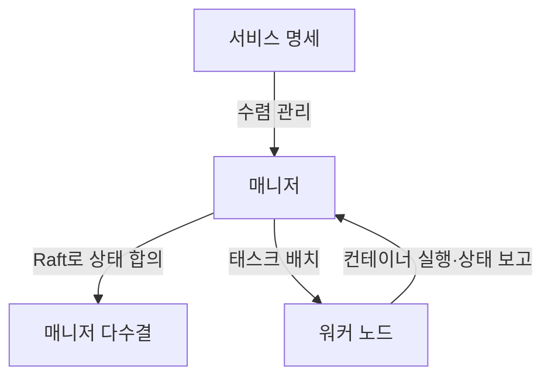
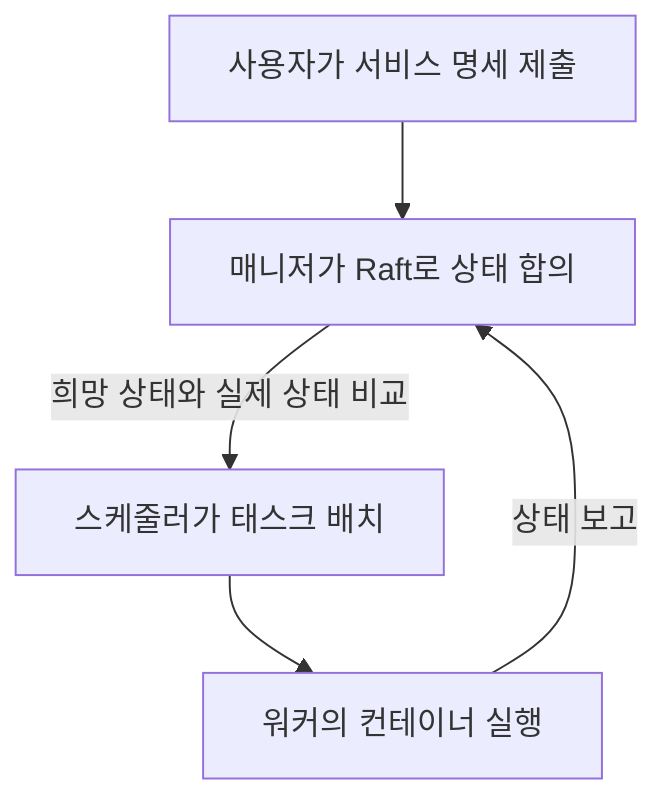

## 지식 로드맵 내 현재 위치

컴퓨터 시스템 및 네트워크 → 핵심 개념 → 도커 스웜

## 30초 인출

- 본질: Docker Swarm은 여러 Docker Engine을 하나의 클러스터로 묶어 서비스를 배포·관리하는 컨테이너 오케스트레이션 기능
- 메커니즘: 매니저가 Raft로 클러스터 상태를 합의하고, 스케줄러가 선언된 서비스를 노드의 태스크로 배치

## 핵심 용어

핵심 용어

- **Docker Swarm mode** : Docker Engine 클러스터에서 서비스 배포·확장·복구를 관리하는 오케스트레이션 기능
- **매니저(Manager)** : 클러스터 상태와 서비스 배치를 관리하는 노드 역할
- **Raft consensus** : 매니저 다수결로 클러스터의 관리 상태를 일관되게 복제하는 합의 방식
- **태스크(Task)** : 서비스 복제본을 실행하기 위해 노드에 배정되는 단위
- **라우팅 메시(Routing Mesh)** : 게시된 서비스 포트의 연결을 해당 서비스 태스크로 전달하는 Swarm 기능

---

## 1교시 예상문제 (10점)

> Docker Swarm의 정의와 목적, 클러스터 구성 및 서비스 배치 방식을 설명하시오. (예상)

---

## 1교시 10점 답안

## Ⅰ. 개요

| 구분 | 핵심 |
|---|---|
| 정의 | Docker Swarm은 여러 Docker Engine을 클러스터로 묶어 컨테이너 서비스를 배포·관리하는 오케스트레이션 기능 |
| 목적 | 서비스 복제본의 배치와 상태 관리를 자동화해 컨테이너 운영을 단순화 |

## Ⅱ. 매니저와 서비스 태스크

- 제언: 운영 규모와 필요한 오케스트레이션 기능을 기준으로 Swarm 적용 범위를 정하고 장애 시 관리 동작을 시험.

---
## 2~4교시 예상문제 (25점)

> Docker Swarm의 클러스터 구성과 서비스 배치·트래픽 전달 방식을 설명하고, 운영상 한계와 대응 방안을 제시하시오. (예상)

---

## 2~4교시 25점 답안

## Ⅰ. 개요

| 구분 | 핵심 |
|---|---|
| 정의 | Docker Swarm은 여러 Docker Engine을 클러스터로 묶어 컨테이너 서비스를 배포·관리하는 오케스트레이션 기능 |
| 목적 | 서비스 복제본의 배치와 상태 관리를 자동화해 컨테이너 운영을 단순화 |

## Ⅱ. 클러스터의 상태 관리와 실행

매니저 과반수(quorum)가 있어야 관리 상태를 변경할 수 있으며, 쿼럼을 잃어도 이미 실행 중인 태스크는 계속 동작할 수 있음.

## Ⅲ. 구성 요소와 통신 경로

| 구성 요소 | 역할 | 관계 |
|---|---|---|
| 매니저 | 상태 관리·스케줄링 | Raft로 관리 상태 합의 |
| 워커 | 배정된 태스크 실행 | 실행 상태를 매니저에 보고 |
| 서비스·태스크 | 원하는 복제 수와 실행 단위 | 서비스 명세에서 태스크 생성 |
| Routing Mesh | 게시 포트 연결 전달 | 노드 포트 연결을 서비스 태스크로 전달 |

## Ⅳ. 운영 한계와 대응

| 한계 | 대응 |
|---|---|
| 매니저 쿼럼 상실 시 새 배치·관리 변경이 불가 | 매니저를 장애 영역에 분산하고 정족수 복구 절차를 마련 |
| 상태 저장형 워크로드는 태스크 재배치만으로 데이터 연속성을 보장하기 어려움 | 영속 볼륨의 위치·복제·복구 방식을 별도로 설계하고 장애 복구를 시험 |

## Ⅴ. 기술사적 제언

| 한계 | 해결 방안 |
|---|---|
| 서비스 수와 운영 요구가 늘면 단순한 설치 편의만으로 플랫폼 적합성을 판단하기 어려움 | 필수 기능·운영 역량·장애 복구 목표를 기준으로 Swarm과 대안을 비교 검증한 뒤 적용 범위를 결정 |
## 출제 이력과 검증 출처

- Swarm mode의 합의·정족수·매니저 동작: [Docker 공식 문서](https://docs.docker.com/engine/swarm/raft/), [관리 안내](https://docs.docker.com/engine/swarm/admin_guide/)
