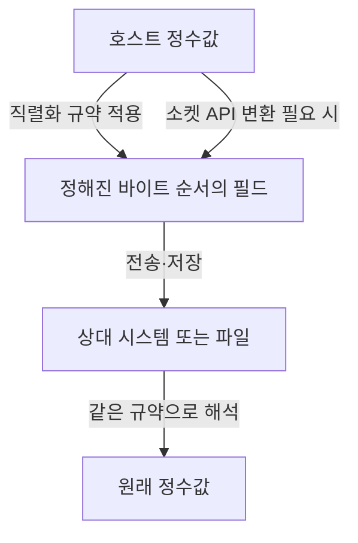

## 지식 로드맵 내 현재 위치

컴퓨터 시스템 → 데이터 표현 → 엔디언

## 30초 인출

- 본질: 리틀 엔디언은 여러 바이트로 된 값을 저장할 때 최하위 바이트를 가장 낮은 메모리 주소에 두는 바이트 순서
- 메커니즘: 바이트 순서를 정하는 규칙으로, 값의 수치나 바이트 자체는 바꾸지 않고 메모리 배치만 결정

핵심 용어

- **리틀 엔디언(Little Endian)** : 여러 바이트 값의 최하위 바이트를 낮은 주소에 저장하는 바이트 순서
- **LSB (Least Significant Byte, 최하위 바이트)** : 값에서 가장 낮은 자리 가중치를 나타내는 바이트
- **MSB (Most Significant Byte, 최상위 바이트)** : 값에서 가장 높은 자리 가중치를 나타내는 바이트
- **네트워크 바이트 순서(Network Byte Order)** : IP 계열 프로토콜의 다중 바이트 필드에서 사용하는 최상위 바이트 우선 표현
- **htonl() (Host to Network Long)** : 32비트 값을 호스트 바이트 순서에서 네트워크 바이트 순서로 바꾸는 POSIX 소켓 API 함수
- **ntohl() (Network to Host Long)** : 32비트 값을 네트워크 바이트 순서에서 호스트 바이트 순서로 바꾸는 POSIX 소켓 API 함수

---
## 1교시 예상문제 (10점)

> 리틀 엔디언의 정의와 목적, 다중 바이트 값의 메모리 배치 방식을 설명하시오. (예상)

---

## 1교시 10점 답안

## Ⅰ. 개요

| 구분 | 핵심 |
|---|---|
| 정의 | 리틀 엔디언은 여러 바이트 값의 최하위 바이트를 낮은 메모리 주소에 저장하는 바이트 순서 |
| 목적 | 메모리 바이트 배치 규칙을 정해 프로세서·데이터 교환에서 값을 일관되게 해석 |

## Ⅱ. 메모리 배치

| 주소 증가 방향 | 0x100 | 0x101 | 0x102 | 0x103 |
|---|---:|---:|---:|---:|
| 리틀 엔디언 | 0x78 (LSB) | 0x56 | 0x34 | 0x12 (MSB) |
| 빅 엔디언 | 0x12 (MSB) | 0x34 | 0x56 | 0x78 (LSB) |

예시 값 `0x12345678`의 바이트 배치이며, 주소는 왼쪽에서 오른쪽으로 증가.

- 제언: 파일·통신 경계에서 바이트 순서를 명시하고 직렬화·역직렬화 단계에서 변환 여부를 확인.

---
## 2~4교시 예상문제 (25점)

> 리틀 엔디언의 메모리 배치와 빅 엔디언과의 차이를 설명하고, 이기종 데이터 교환 시 바이트 순서 처리 방안을 제시하시오. (예상)

---

## 2~4교시 25점 답안

## Ⅰ. 개요

| 구분 | 핵심 |
|---|---|
| 정의 | 리틀 엔디언은 여러 바이트 값의 최하위 바이트를 낮은 메모리 주소에 저장하는 바이트 순서 |
| 목적 | 메모리 바이트 배치 규칙을 정해 프로세서·데이터 교환에서 값을 일관되게 해석 |

## Ⅱ. 다중 바이트 값의 배치

| 주소 증가 방향 | 0x100 | 0x101 | 0x102 | 0x103 |
|---|---:|---:|---:|---:|
| 리틀 엔디언 | 0x78 (LSB) | 0x56 | 0x34 | 0x12 (MSB) |
| 빅 엔디언 | 0x12 (MSB) | 0x34 | 0x56 | 0x78 (LSB) |

`0x12345678`을 메모리에 배치한 예. 리틀·빅 엔디언은 바이트의 주소 순서만 다르게 정하며, 한 바이트 내부의 비트 전송 순서와는 별개.

## Ⅲ. 호스트 바이트 순서와 네트워크 바이트 순서

| 구분 | 리틀 엔디언 | 빅 엔디언 |
|---|---|---|
| 낮은 주소에 놓는 바이트 | 최하위 바이트(LSB) | 최상위 바이트(MSB) |
| 다중 바이트 필드 해석 | 호스트·파일 형식에 따라 결정 | IP 계열 프로토콜에서 다중 바이트 필드의 네트워크 순서로 사용 |
| 변환 | 호스트가 리틀 엔디언이면 네트워크 전송 전에 변환 | 빅 엔디언 호스트에서는 일부 변환이 항등일 수 있음 |

## Ⅳ. 이기종 데이터 교환과 변환

| 위험 | 대응 |
|---|---|
| 구조체 메모리를 그대로 전송해 패딩·호스트 바이트 순서가 노출 | 명시적 필드 직렬화와 버전이 있는 포맷 사용 |
| 숫자 필드의 호스트·네트워크 순서 불일치 | 16·32비트 네트워크 필드는 플랫폼 API나 명시적 인코더·디코더로 변환 |

## Ⅴ. 기술사적 제언

| 한계 | 해결 방안 |
|---|---|
| 저장 파일이나 프로토콜에 호스트의 구조체 표현을 그대로 기록하면 다른 플랫폼에서 해석이 달라질 수 있음 | 경계마다 표준 직렬화 형식과 필드 바이트 순서를 문서화하고, 서로 다른 엔디언 환경 간 호환 시험 수행 |
## 출제 이력과 검증 출처

- 회차·문항 원문은 공식 자료 대조 전 미확인
- `htonl()`·`ntohl()`의 POSIX 규격: [The Open Group](https://pubs.opengroup.org/onlinepubs/000095399/functions/htonl.html)
- ARM의 구현별 엔디언 지원: [Armv8-A Memory Model Guide](https://developer.arm.com/-/media/Arm%20Developer%20Community/PDF/Learn%20the%20Architecture/Armv8-A%20memory%20model%20guide.pdf?revision=58b1dd0a-3800-4218-b21a-f95a0332034c)
- IP 규격 원문: [RFC 791](https://datatracker.ietf.org/doc/rfc791/)
