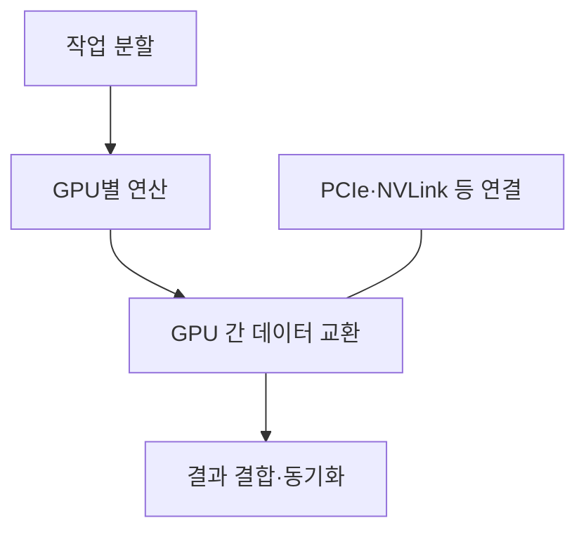
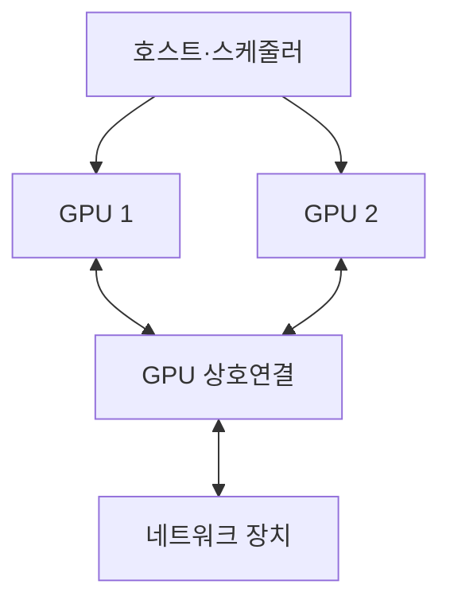
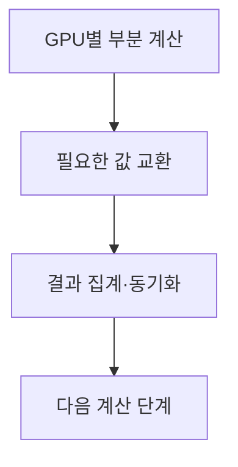
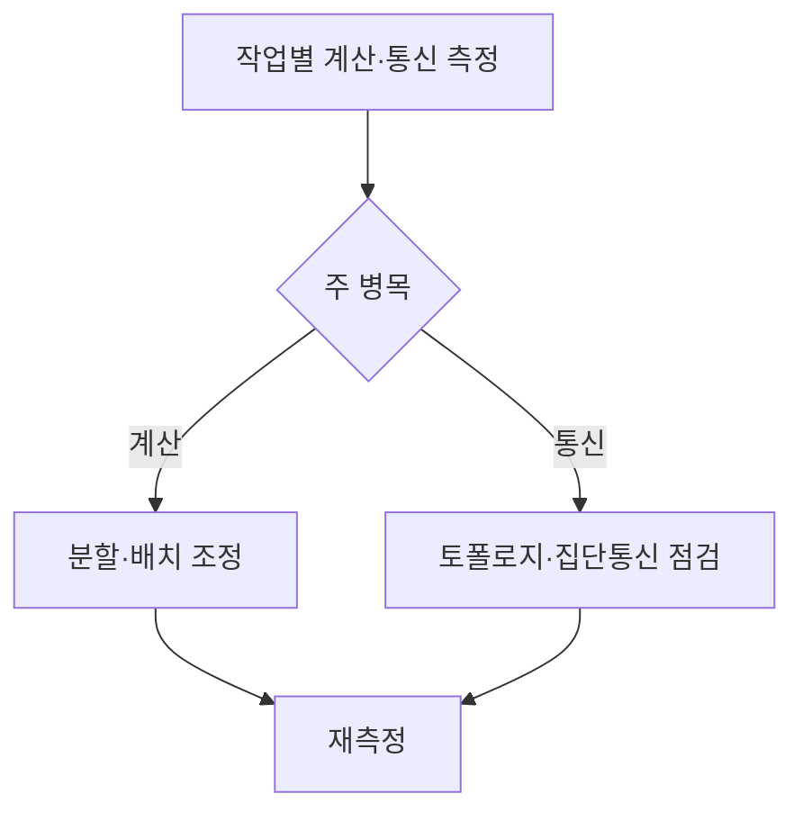

## 지식 로드맵 내 현재 위치

컴퓨터 시스템 및 네트워크 → 가속기 시스템 → 멀티 GPU

## 30초 인출

- 본질: 멀티 GPU는 여러 GPU가 한 작업을 나누어 처리하는 병렬 구성
- 메커니즘: 연결 경로와 통신 패턴이 데이터 교환 비용을 좌우

핵심 용어

- **멀티 GPU(Multi-GPU)**: 하나의 작업을 여러 GPU에 분산해 처리하는 시스템 구성
- **GPU 상호연결(Interconnect)**: GPU 사이 데이터 이동을 담당하는 PCIe·NVLink 등의 연결 경로
- **NVLink**: NVIDIA의 GPU·시스템 구성요소 간 연결 기술 계열
- **GPU Direct RDMA (Remote Direct Memory Access)**: 지원되는 네트워크 장치가 GPU 메모리에 직접 접근해 CPU 메모리 복사를 줄이는 기술
- **NCCL (NVIDIA Collective Communications Library)**: 다중 GPU·노드 집단 통신 연산 라이브러리

---
## 1교시 예상문제 (10점)

> 멀티 GPU의 개념과 핵심 구조를 설명하시오. (예상)

---
## 1교시 10점 답안

### Ⅰ. 정의·목적

| 구분 | 핵심 |
|---|---|
| 정의 | **멀티 GPU**는 여러 GPU가 연산을 나누고 필요한 데이터를 교환하도록 구성한 병렬 시스템 |
| 목적 | 단일 GPU의 연산·메모리 한계를 보완하고 대규모 작업을 분할 처리 |

### Ⅱ. 구성과 통신

| 구성 | 역할 |
|---|---|
| GPU | 할당 연산 수행 |
| 연결 경로 | 장치 간 데이터 이동 |
| 통신 라이브러리 | 집단 통신과 토폴로지 활용 |

### Ⅲ. 확장 판단

작업 분할 가능성과 통신량이 실제 확장 효율을 결정

> 제언: 도입 전 대표 작업의 GPU 간 통신량과 처리시간을 측정

---
## 2~4교시 예상문제 (25점)

> 멀티 GPU의 구조와 통신 방식을 설명하고, 확장 시 고려사항과 도입 방안을 제시하시오. (예상)

---
## 2~4교시 25점 답안

### Ⅰ. 정의·목적

| 구분 | 핵심 |
|---|---|
| 정의 | **멀티 GPU**는 여러 GPU가 연산을 나누고 필요한 데이터를 교환하도록 구성한 병렬 시스템 |
| 목적 | 단일 GPU의 연산·메모리 한계를 보완하고 대규모 작업을 분할 처리 |

### Ⅱ. 시스템 구성

노드 내부 연결과 노드 간 네트워크는 서로 다른 성능·구성 조건으로 설계

### Ⅲ. 작업 분할과 통신

| 방식 | 분할 대상 | 주요 교환 |
|---|---|---|
| 데이터 병렬 | 입력 데이터 | 그래디언트 동기화 |
| 모델 병렬 | 모델 계산 | 중간 활성값·부분 결과 |
| 혼합 병렬 | 데이터와 모델 | 각 방식의 통신 |

### Ⅳ. 성능 한계와 대응

| 한계 | 대응 |
|---|---|
| 분할이 어려워 일부 GPU 유휴 | 연산 그래프·배치 단위 재검토 |
| 통신이 계산을 지연 | 통신 패턴과 실제 토폴로지 측정 후 배치 조정 |
| GPU·NIC 연결 차이가 병목 | 장치 연결과 통신 라이브러리의 토폴로지 인식 확인 |

### Ⅴ. 기술사적 제언

| 한계 | 해결 방안 |
|---|---|
| GPU 증설만으로 성능 향상을 예측하기 어려움 | 분할 가능성·통신량·지연을 사전 시험해 증설 단계를 결정 |

## 검증 출처

- [NVIDIA NCCL 문서](https://docs.nvidia.com/deeplearning/nccl/): 집단 통신과 토폴로지 인식
- [NVIDIA GPU Direct 문서](https://docs.nvidia.com/deeplearning/nccl/user-guide/docs/troubleshooting/gpu_troubleshooting.html): GPU 직접 통신의 조건
