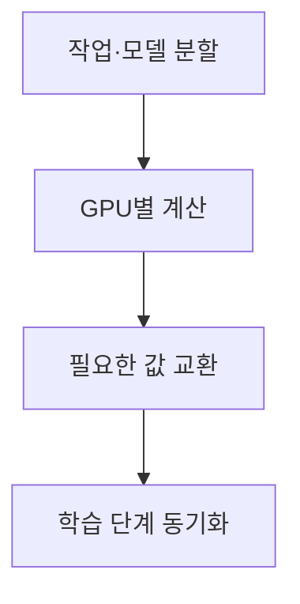
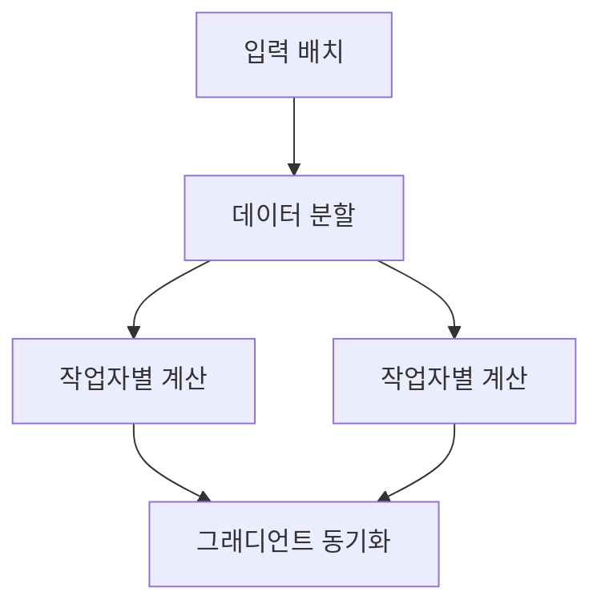
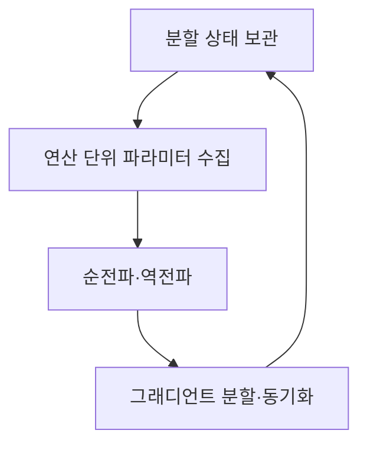
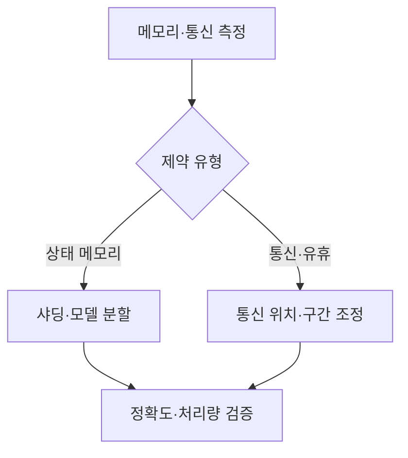

## 지식 로드맵 내 현재 위치

컴퓨터 시스템 및 네트워크 → 병렬 처리 → 멀티 GPU 분산학습

## 30초 인출

- 본질: 분산학습은 여러 처리 장치가 학습 계산을 나누고 필요한 값을 교환하는 방식
- 메커니즘: 분할 방식에 따라 메모리 사용과 통신 위치가 달라짐

핵심 용어

- **분산 학습(Distributed Training)**: 여러 처리 장치가 학습 계산을 나누어 수행하는 방식
- **데이터 병렬화(Data Parallelism)**: 모델 복제본이 서로 다른 데이터를 처리하고 그래디언트를 동기화하는 방식
- **텐서 병렬화(Tensor Parallelism)**: 계층 내 텐서 계산을 여러 장치에 나누는 방식
- **파이프라인 병렬화(Pipeline Parallelism)**: 모델 계층을 장치별 구간으로 나누어 처리하는 방식
- **DDP (Distributed Data Parallel)**: PyTorch 분산 데이터 병렬 인터페이스
- **FSDP (Fully Sharded Data Parallel)**: 모델 상태를 작업자에 분할 저장하는 PyTorch 분산 방식
- **All-Reduce**: 작업자별 값을 결합해 결과를 각 작업자에 전달하는 집단 통신

---
## 1교시 예상문제 (10점)

> 멀티 GPU 분산학습의 개념과 주요 병렬화 방식을 설명하시오. (예상)

---
## 1교시 10점 답안

### Ⅰ. 정의·목적

| 구분 | 핵심 |
|---|---|
| 정의 | **멀티 GPU 분산학습**은 여러 GPU가 학습 계산을 나누고 필요한 값을 교환하는 방식 |
| 목적 | 단일 GPU의 메모리·연산 한계를 보완하고 학습 작업을 확장 |

### Ⅱ. 병렬화 방식

| 방식 | 분할 대상 | 핵심 교환 |
|---|---|---|
| 데이터 병렬 | 입력 데이터 | 그래디언트 |
| 텐서 병렬 | 계층 내 텐서 | 부분 계산값 |
| 파이프라인 병렬 | 모델 계층 | 마이크로배치 활성값 |

### Ⅲ. 동작 흐름

> 제언: 모델 크기와 통신 위치를 기준으로 병렬화 방식을 선택

---
## 2~4교시 예상문제 (25점)

> 멀티 GPU 분산학습의 구조와 병렬화 방식을 설명하고, 메모리·통신 제약에 대한 설계 방안을 제시하시오. (예상)

---
## 2~4교시 25점 답안

### Ⅰ. 정의·목적

| 구분 | 핵심 |
|---|---|
| 정의 | **멀티 GPU 분산학습**은 여러 GPU가 학습 계산을 나누고 필요한 값을 교환하는 방식 |
| 목적 | 단일 GPU의 메모리·연산 한계를 보완하고 학습 작업을 확장 |

### Ⅱ. 병렬화 구조

| 방식 | 분할 단위 | 대표 통신 |
|---|---|---|
| 데이터 병렬 | 배치·샘플 | 그래디언트 동기화 |
| 텐서 병렬 | 계층 내 텐서 연산 | 분할 연산의 부분 결과 집계·집단 통신 |
| 파이프라인 병렬 | 모델 구간 | 구간 간 활성값 전달 |

### Ⅲ. 메모리와 동기화

| 설계 | 장치별 모델 상태 | 고려점 |
|---|---|---|
| DDP | 모델 상태 복제 | 그래디언트 동기화 비용 |
| FSDP | 파라미터·그래디언트·옵티마이저 상태 분할 | 연산 구간에서 파라미터 수집에 따른 통신 |

### Ⅳ. 제약과 대응

| 한계 | 대응 |
|---|---|
| 모델 상태가 메모리를 초과 | 상태 샤딩 또는 모델 병렬 검토 |
| 통신·동기화가 계산을 지연 | 통신 집중 구간과 토폴로지 측정 후 병렬 방식 조정 |
| 파이프라인 구간별 처리량 불균형 | 구간별 계산량과 마이크로배치 흐름을 측정해 재조정 |

### Ⅴ. 기술사적 제언

| 한계 | 해결 방안 |
|---|---|
| 한 병렬 방식이 모든 모델·환경에 적합하지 않음 | 상태 크기·통신 패턴·토폴로지를 소규모 시험으로 비교한 뒤 조합 결정 |

## 검증 출처

- [PyTorch FSDP 문서](https://docs.pytorch.org/docs/main/fsdp.html): 파라미터 샤딩 구조
- [PyTorch FSDP 튜토리얼](https://docs.pytorch.org/tutorials/intermediate/FSDP1_tutorial.html): 샤드 수집과 학습 흐름
- [NVIDIA NCCL 문서](https://docs.nvidia.com/deeplearning/nccl/): 집단 통신
