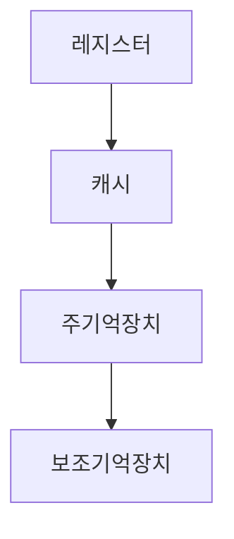
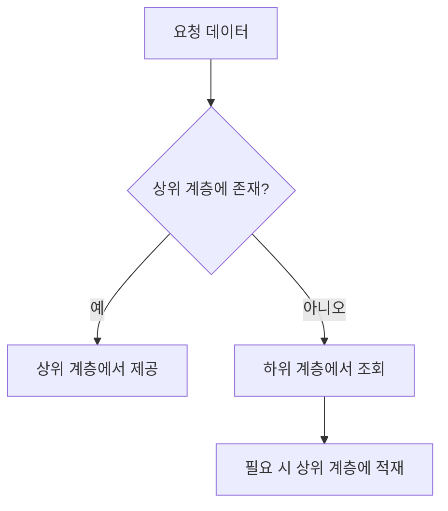
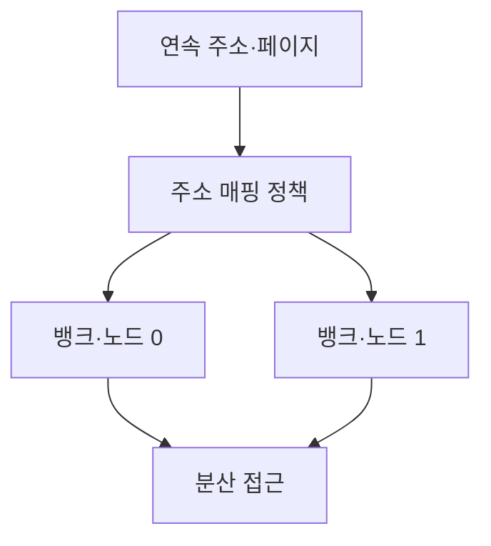
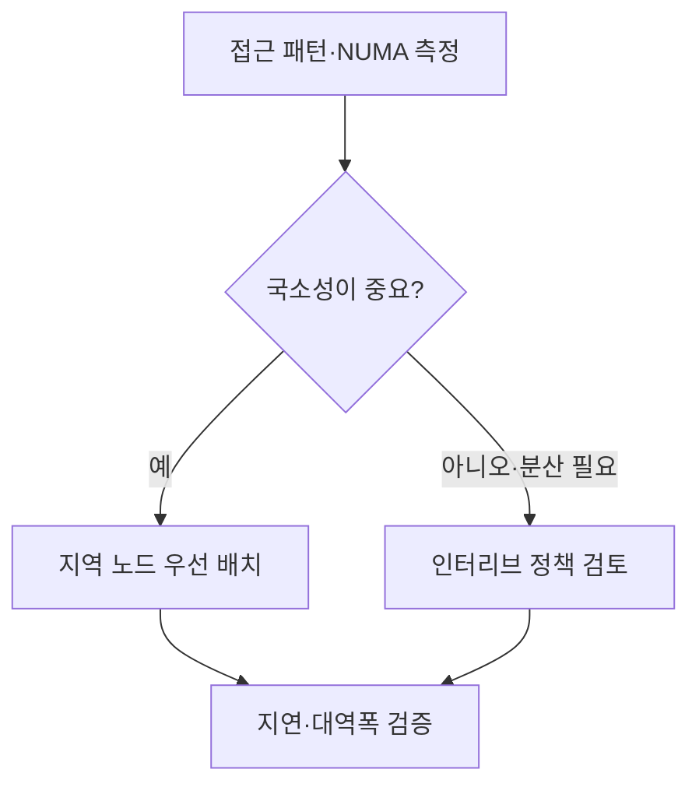

## 지식 로드맵 내 현재 위치

컴퓨터 시스템 및 네트워크 → 기억장치 → 메모리 계층과 인터리빙

## 30초 인출

- 본질: 메모리 계층은 속도·용량·비용이 다른 저장 장치를 계층화한 구조
- 메커니즘: 인터리빙은 주소·페이지를 복수 뱅크·노드에 분산해 접근을 겹칠 기회를 제공하는 배치 기법

핵심 용어

- **메모리 계층(Memory Hierarchy)**: 접근 속도·용량·비용이 다른 저장소를 계층으로 구성한 구조
- **인터리빙(Interleaving)**: 주소 또는 페이지를 여러 뱅크·메모리 노드에 분산 배치하는 기법
- **뱅크(Bank)**: 메모리 내부에서 독립적으로 접근을 처리할 수 있는 논리 단위
- **NUMA (Non-Uniform Memory Access)**: CPU와 메모리 노드 사이 거리에 따라 접근 비용이 달라지는 구조
- **지역성(Locality)**: 최근 또는 가까운 데이터가 다시 접근될 가능성을 활용하는 원리

---
## 1교시 예상문제 (10점)

> 메모리 계층과 인터리빙의 개념 및 목적을 설명하시오. (예상)

---
## 1교시 10점 답안

### Ⅰ. 정의·목적

| 구분 | 핵심 |
|---|---|
| 정의 | **메모리 계층·인터리빙**은 저장소를 특성별로 계층화하고 주소를 복수 뱅크·노드에 나누어 배치하는 구조·기법 |
| 목적 | 자주 쓰는 데이터는 빠르게 제공하고 병렬 접근이 가능한 경우 메모리 활용을 높임 |

### Ⅱ. 계층 구조

| 상위 계층 | 하위 계층 |
|---|---|
| 빠른 접근·작은 용량·높은 비용 | 느린 접근·큰 용량·낮은 비용 |

### Ⅲ. 인터리빙 원리

인터리빙은 분산 배치로 독립 뱅크·노드의 접근을 겹칠 기회를 제공하며, 효과는 주소 패턴과 하드웨어에 좌우

> 제언: 메모리 병목 분석 시 데이터 지역성과 NUMA 배치를 함께 측정

---
## 2~4교시 예상문제 (25점)

> 메모리 계층과 인터리빙의 구조·동작을 설명하고, 성능·지역성 관점의 적용 기준을 제시하시오. (예상)

---
## 2~4교시 25점 답안

### Ⅰ. 정의·목적

| 구분 | 핵심 |
|---|---|
| 정의 | **메모리 계층·인터리빙**은 저장소를 특성별로 계층화하고 주소를 복수 뱅크·노드에 나누어 배치하는 구조·기법 |
| 목적 | 자주 쓰는 데이터는 빠르게 제공하고 병렬 접근이 가능한 경우 메모리 활용을 높임 |

### Ⅱ. 계층 역할

| 계층 | 역할 | 접근 경향 |
|---|---|---|
| 레지스터·캐시 | 최근·현재 계산 데이터 제공 | 빠르고 용량이 작음 |
| 주기억장치 | 실행 중 코드·데이터 보관 | 중간 계층 |
| 보조기억장치 | 영구 데이터 저장 | 용량이 크고 상대적으로 느림 |

### Ⅲ. 인터리빙 배치

| 관점 | 배치 | 조건 |
|---|---|---|
| 메모리 뱅크 | 연속 접근을 복수 뱅크로 분산 | 독립 접근 중첩 여부는 패턴·컨트롤러에 의존 |
| NUMA 노드 | 페이지를 지정 노드 또는 노드 간 배치 | 원격 접근은 지연·비용이 달라질 수 있음 |

### Ⅳ. 적용 기준과 한계

| 선택 | 적합한 상황 | 점검 사항 |
|---|---|---|
| 지역 배치 | 가까운 메모리 접근이 중요 | CPU·스레드·페이지의 NUMA 친화도 |
| 인터리브 배치 | 여러 노드로 작업 데이터를 분산할 때 | 접근 패턴·대역폭·원격 접근 비중 |
| 단일 위치 고정 | 데이터 국소성이 높음 | 용량 불균형·핫스폿 |

### Ⅴ. 기술사적 제언

| 한계 | 해결 방안 |
|---|---|
| 인터리빙이 모든 작업의 지연을 줄이지는 않음 | 실제 접근과 노드별 지표를 측정해 지역 배치와 인터리브를 작업별로 선택 |

## 검증 출처

- [Linux NUMA 개요](https://docs.kernel.org/mm/numa.html): NUMA 접근 비용과 지역성
- [Linux NUMA 메모리 정책](https://docs.kernel.org/admin-guide/mm/numa_memory_policy.html): 노드 간 인터리브 방식
