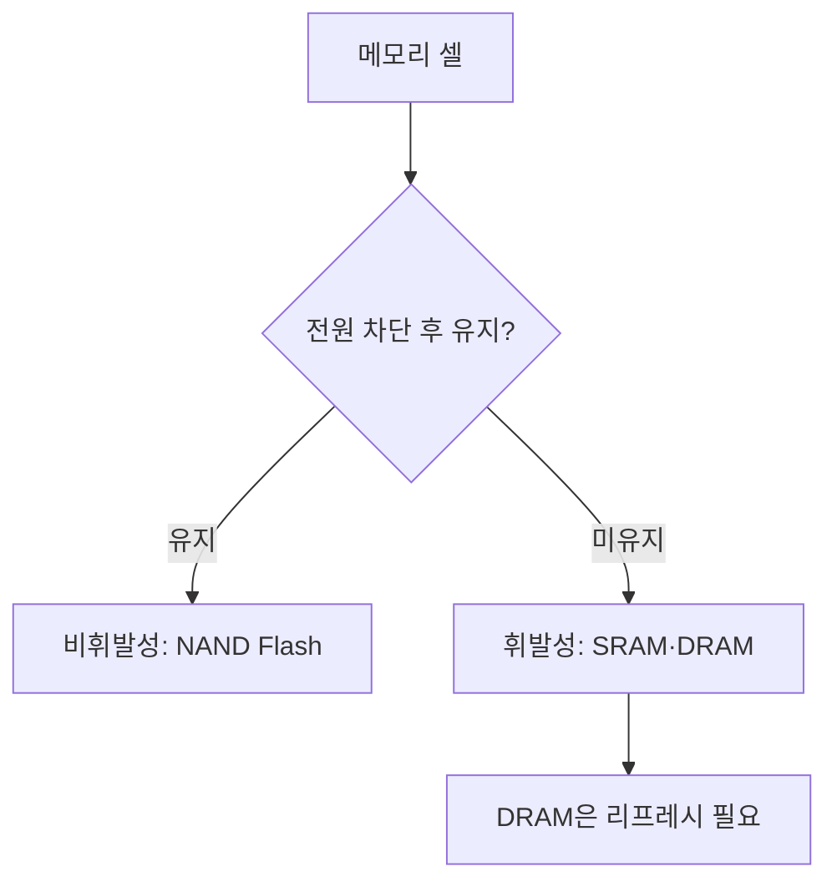
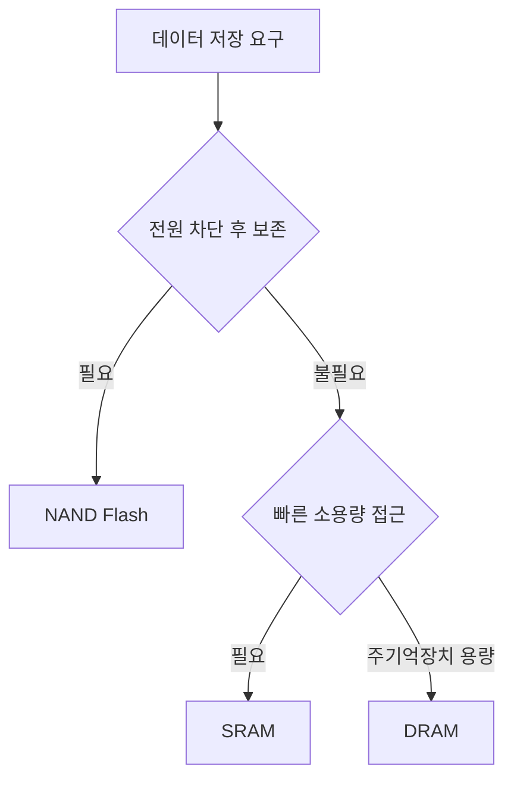
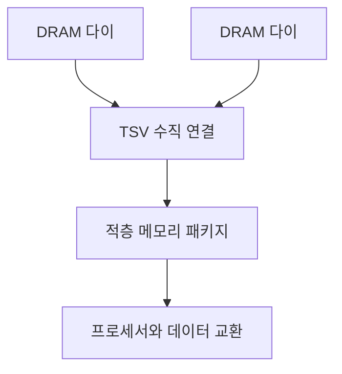
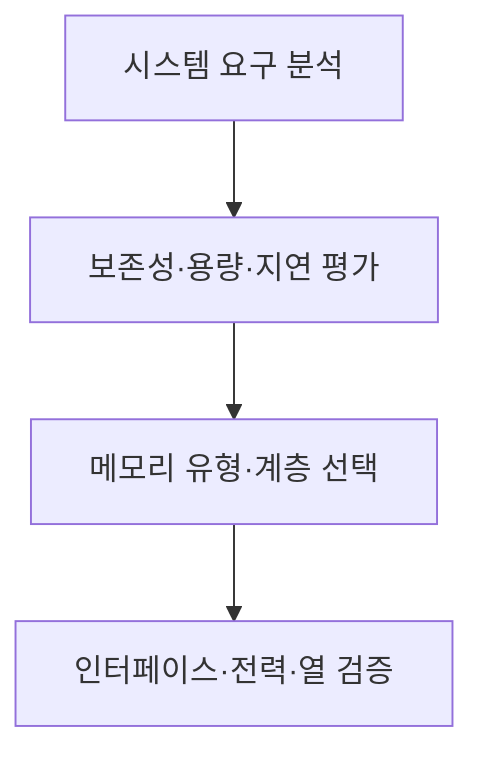

## 지식 로드맵 내 현재 위치

컴퓨터 시스템 및 네트워크 → 기억장치 → 메모리 반도체

## 30초 인출

- 본질: 메모리 반도체는 데이터를 저장하고 필요할 때 읽고 쓰는 반도체 소자
- 메커니즘: 저장 방식에 따라 휘발성·비휘발성으로 나뉘며 셀 구조가 용량·속도·유지 특성을 좌우

핵심 용어

- **메모리 반도체(Memory Semiconductor)**: 전기적 상태를 이용해 데이터를 저장·판독하는 반도체 소자
- **DRAM (Dynamic Random-Access Memory)**: 커패시터에 전하를 저장하고 주기적 리프레시가 필요한 휘발성 메모리
- **SRAM (Static Random-Access Memory)**: 플립플롭 회로로 상태를 저장하는 휘발성 메모리
- **NAND Flash**: 전원을 끊어도 데이터를 유지하는 비휘발성 플래시 메모리
- **HBM (High Bandwidth Memory)**: DRAM 다이를 적층하고 넓은 인터페이스로 연결하는 고대역폭 메모리 규격 계열
- **TSV (Through-Silicon Via)**: 실리콘 다이를 수직으로 연결하는 관통 전극 구조

---
## 1교시 예상문제 (10점)

> 메모리 반도체의 개념과 주요 유형을 설명하시오. (예상)

---
## 1교시 10점 답안

### Ⅰ. 정의·목적

| 구분 | 핵심 |
|---|---|
| 정의 | **메모리 반도체**는 전기적 상태를 이용해 데이터를 저장하고 판독하는 반도체 소자 |
| 목적 | 시스템 요구에 맞춰 데이터 저장·접근 기능을 제공 |

### Ⅱ. 주요 유형

| 유형 | 저장 특성 | 대표 용도 |
|---|---|---|
| SRAM·DRAM | 휘발성 | 캐시·주기억장치 |
| NAND Flash | 비휘발성 | SSD·이동식 저장장치 |
| HBM | 적층 DRAM 계열 | 프로세서 주변의 고대역폭 메모리 |

### Ⅲ. 저장 특성

> 제언: 용량과 함께 휘발성·접근 특성·시스템 연결을 고려해 메모리를 선택

---
## 2~4교시 예상문제 (25점)

> 메모리 반도체의 개념과 주요 유형을 설명하고 시스템 요구에 따른 적용 기준을 제시하시오. (예상)

---
## 2~4교시 25점 답안

### Ⅰ. 정의·목적

| 구분 | 핵심 |
|---|---|
| 정의 | **메모리 반도체**는 전기적 상태를 이용해 데이터를 저장하고 판독하는 반도체 소자 |
| 목적 | 시스템 요구에 맞춰 데이터 저장·접근 기능을 제공 |

### Ⅱ. 유형과 셀 특성

| 유형 | 기본 특성 | 시스템 역할 |
|---|---|---|
| SRAM | 플립플롭 기반 휘발성 저장 | 빠른 캐시 구성 |
| DRAM | 커패시터 기반 휘발성 저장, 리프레시 필요 | 주기억장치 |
| NAND Flash | 비휘발성 셀 저장 | 대용량 보조 저장 |

### Ⅲ. 적층·연결 구조

| 기술 | 구조 | 의미 |
|---|---|---|
| HBM | DRAM 다이 적층·넓은 인터페이스 | 프로세서와 메모리 간 대역폭 요구 대응 |
| TSV | 적층 다이 사이 수직 전기 연결 | 다이 간 신호 경로 |

### Ⅳ. 시스템 적용 기준과 한계

| 판단 축 | 선택 기준 |
|---|---|
| 데이터 보존 | 전원 차단 후 보존이 필요하면 비휘발성 저장 |
| 접근 지연·용량 | 캐시·주기억·저장장치의 역할에 맞춤 |
| 데이터 이동 | 프로세서·메모리 간 대역폭·전력·패키지 구성을 검토 |

### Ⅴ. 기술사적 제언

| 한계 | 해결 방안 |
|---|---|
| 단일 유형으로 용량·속도·보존 요구를 모두 충족하기 어려움 | 데이터 사용 주기와 접근 특성에 따라 계층을 구성하고 시스템 수준에서 검증 |

## 검증 출처

- [JEDEC 메모리 기술 분야](https://www.jedec.org/standards-documents/focus/memory): DDR SDRAM·HBM 등 표준 분야
- [Micron 메모리 셀 소개](https://www.micron.com/content/dam/micron/educatorhub/intro-to-memory/micron-intro-to-memory-presentation.pdf): DRAM·NAND 셀 구조
