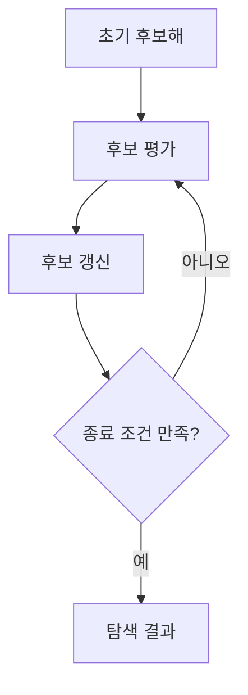
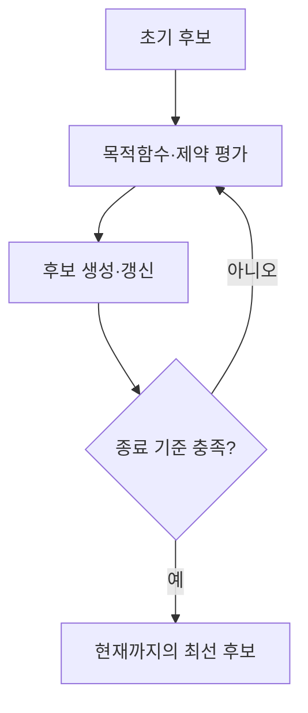
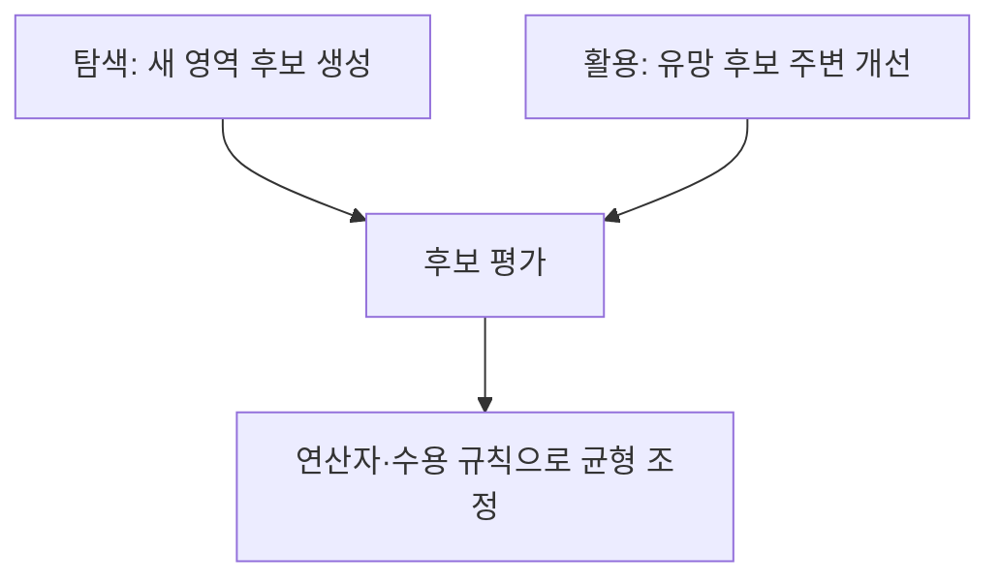
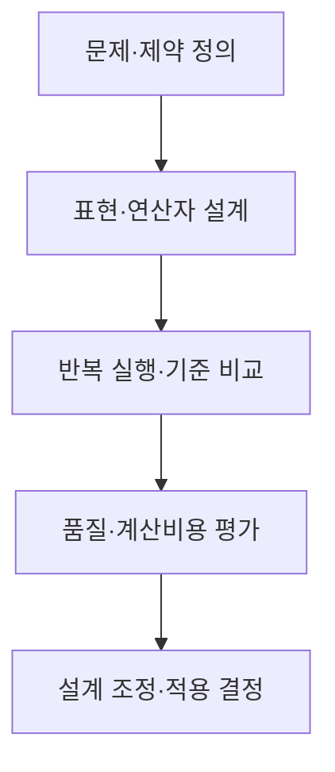

## 지식 로드맵 내 현재 위치

컴퓨터 시스템 및 네트워크 → 최적화 기법 → 메타휴리스틱

## 30초 인출

- 본질: 메타휴리스틱은 여러 최적화 문제에서 후보해 탐색을 안내하는 상위 전략
- 메커니즘: 후보해를 반복 생성·평가·갱신하며 탐색과 활용의 균형을 조정

핵심 용어

- **메타휴리스틱(Metaheuristic)**: 탐색 방향과 후보 갱신을 안내하는 상위 탐색 전략
- **휴리스틱(Heuristic)**: 문제 구조나 경험 규칙으로 해를 빠르게 구성·개선하는 방법
- **탐색(Exploration)**: 해 공간의 새로운 영역을 조사하는 과정
- **활용(Exploitation)**: 유망 후보 주변을 더 깊게 살피는 과정
- **담금질 기법(Simulated Annealing)**: 매개변수에 따라 열등한 이웃해도 확률적으로 수용하는 기법
- **유전 알고리즘(Genetic Algorithm)**: 후보 집단에 선택·교차·변이 연산을 적용하는 기법

---
## 1교시 예상문제 (10점)

> 메타휴리스틱의 개념과 탐색 원리를 설명하시오. (예상)

---
## 1교시 10점 답안

### Ⅰ. 정의·목적

| 구분 | 핵심 |
|---|---|
| 정의 | **메타휴리스틱**은 여러 최적화 문제에서 후보해 탐색을 안내하는 상위 전략 |
| 목적 | 제한된 계산 자원 안에서 유용한 후보해를 찾도록 지원 |

### Ⅱ. 탐색 원리

| 균형 | 역할 |
|---|---|
| 탐색 | 새로운 후보 영역 확인 |
| 활용 | 유망 후보 주변 개선 |

### Ⅲ. 대표 기법

유전 알고리즘은 선택·교차·변이, 담금질 기법은 이웃해 이동과 확률적 수용을 사용

> 제언: 문제 제약과 계산 예산을 반영해 후보 생성·평가·종료 기준을 설계

---
## 2~4교시 예상문제 (25점)

> 메타휴리스틱의 개념·공통 구조와 대표 기법을 설명하고 적용 시 유의사항을 제시하시오. (예상)

---
## 2~4교시 25점 답안

### Ⅰ. 정의·목적

| 구분 | 핵심 |
|---|---|
| 정의 | **메타휴리스틱**은 여러 최적화 문제에서 후보해 탐색을 안내하는 상위 전략 |
| 목적 | 제한된 계산 자원 안에서 유용한 후보해를 찾도록 지원 |

### Ⅱ. 공통 탐색 구조

| 단계 | 처리 |
|---|---|
| 초기화 | 초기 후보해 집합 구성 |
| 평가 | 목적함수·제약으로 후보 적합도 판단 |
| 갱신 | 연산자에 따라 후보 생성·수용·교체 |
| 종료 | 계산 예산·종료 조건에 따라 결과 반환 |

### Ⅲ. 탐색 균형과 대표 기법

| 기법 | 후보 갱신 | 특징 |
|---|---|---|
| 유전 알고리즘 | 선택·교차·변이 | 후보 집단을 세대별로 갱신 |
| 담금질 기법 | 이웃해 이동·확률 수용 | 열등 후보도 조건에 따라 수용 |
| 입자 군집 최적화 | 위치·속도 갱신 | 집단·개인 정보를 활용 |

### Ⅳ. 적용 한계와 검증

| 한계 | 대응 |
|---|---|
| 문제와 맞지 않는 연산자는 비효율 후보를 생성 | 표현·연산자·제약 처리를 문제 특성에 맞게 설계 |
| 확률·초기값에 따라 결과가 달라짐 | 반복 실행과 기준 알고리즘 비교로 안정성 평가 |
| 전역 최적해 도달이 보장되지 않음 | 종료 예산과 허용 품질을 정하고 품질·비용을 함께 평가 |

### Ⅴ. 기술사적 제언

| 한계 | 해결 방안 |
|---|---|
| 알고리즘 이름만으로 업무의 해 품질을 보장할 수 없음 | 업무 제약과 데이터 규모를 반영한 기준 사례로 재현 가능한 비교시험 후 채택 |

## 검증 출처

- [Wolpert·Macready, No Free Lunch Theorems for Optimization](https://www.cs.ubc.ca/~hutter/earg/papers07/00585893.pdf): 평균 성능 정리의 적용 전제
