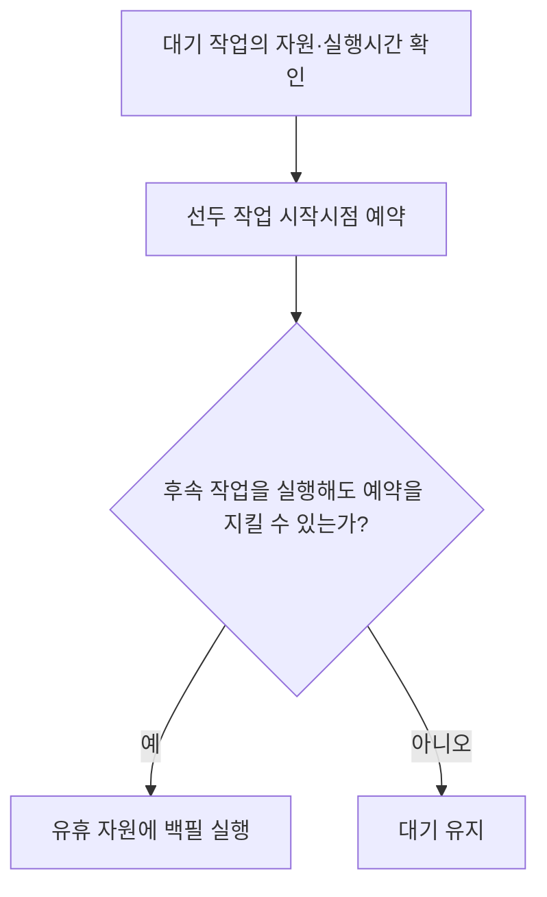
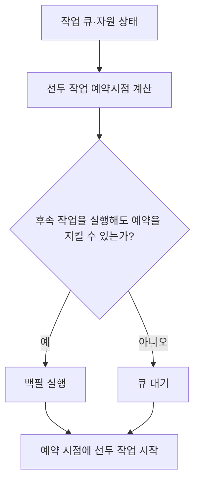
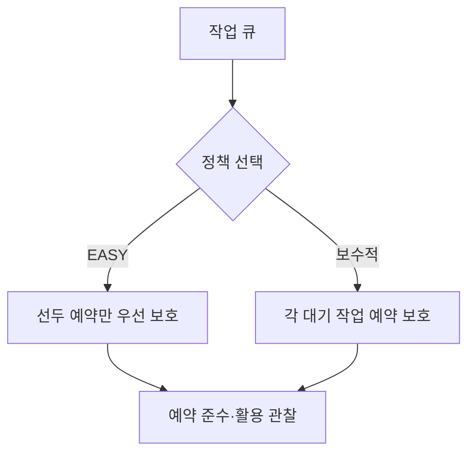
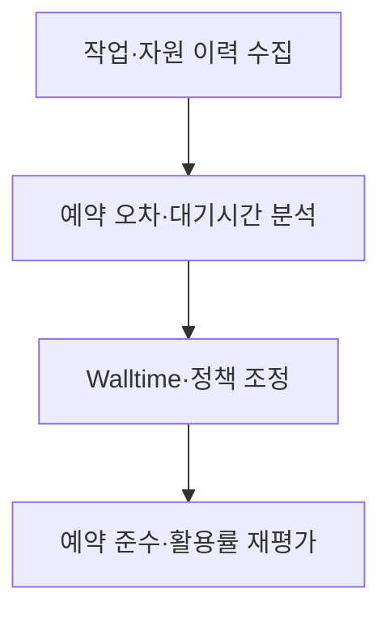

## 지식 로드맵 내 현재 위치

컴퓨터 시스템 및 네트워크 → 작업 스케줄링 → 백필

## 30초 인출

- 본질: 백필은 선두 예약 작업의 시작을 늦추지 않으면서 유휴 자원에 후속 작업을 배치하는 스케줄링 방식
- 메커니즘: 후속 작업의 자원·실행시간을 대입해 보호 대상 작업의 예약 시작이 지연되는지 확인

핵심 용어

- **백필(Backfilling)**: 예약 시작 시점을 침범하지 않는 후속 작업을 유휴 자원에 배치하는 스케줄링 기법
- **EASY 백필(EASY Backfilling)**: 큐 선두 작업의 예약을 보호하고, 뒤 작업의 즉시 실행을 허용하는 정책
- **보수적 백필(Conservative Backfilling)**: 대기 중인 각 작업의 예약 시점을 보호하며 백필하는 정책
- **Walltime**: 작업 제출자가 선언하는 최대 실행시간으로, 스케줄러의 자원 예약 계산에 쓰이는 값

---
## 1교시 예상문제 (10점)

> 백필의 개념과 동작 원리를 설명하시오. (예상)

---
## 1교시 10점 답안

### Ⅰ. 정의·목적

| 구분 | 핵심 |
|---|---|
| 정의 | **백필**은 선두 예약 작업의 시작을 늦추지 않으면서 유휴 자원에 후속 작업을 배치하는 스케줄링 방식 |
| 목적 | 예약 자원의 유휴 구간을 활용하면서 선두 작업의 예약을 보호 |

### Ⅱ. 동작

| 확인 값 | 판단 |
|---|---|
| 작업의 자원 요구량 | 현재 가용 자원과 맞는지 |
| 예상 종료 시점·남는 자원 | 작업이 예약 시점에 계속 실행돼도 예약 자원이 충분한지 |

### Ⅲ. 적용 주의

Walltime 과대 선언은 예약 계산의 정확도를 떨어뜨리고 과소 선언은 작업 종료 위험을 높이는 입력 품질 요소

> 제언: 실행 이력으로 Walltime 입력을 보정하고 예약 준수율과 자원 활용을 함께 관찰

---
## 2~4교시 예상문제 (25점)

> 백필의 동작과 정책 유형을 설명하고, 예약 보호와 자원 활용을 함께 달성하기 위한 운영 방안을 제시하시오. (예상)

---
## 2~4교시 25점 답안

### Ⅰ. 정의·목적

| 구분 | 핵심 |
|---|---|
| 정의 | **백필**은 선두 예약 작업의 시작을 늦추지 않으면서 유휴 자원에 후속 작업을 배치하는 스케줄링 방식 |
| 목적 | 예약 자원의 유휴 구간을 활용하면서 선두 작업의 예약을 보호 |

### Ⅱ. 예약 기반 동작

### Ⅲ. 정책 유형

| 정책 | 보호하는 예약 | 특성 |
|---|---|---|
| EASY | 선두 작업 | 후속 작업의 즉시 실행 기회가 큼 |
| 보수적 백필 | 대기 작업별 예약 | 예약 보호 범위가 넓어 더 보수적으로 배치 |

### Ⅳ. 운영 한계와 대응

| 한계 | 대응 |
|---|---|
| 부정확한 실행시간 예측이 예약 판단을 왜곡 | 과거 실행 이력 기반 Walltime 보정 |
| 과도한 백필이 후속 작업 대기·기아를 키움 | 정책별 예약 보호 범위와 대기시간을 점검 |
| 자원 조각화로 적합 작업이 없을 수 있음 | 자원 형상과 큐별 작업 분포를 분석 |

### Ⅴ. 기술사적 제언

| 한계 | 해결 방안 |
|---|---|
| 활용률만 높이면 예약 공정성·선두 작업 보장이 약화될 수 있음 | 예약 준수, 대기시간 분포, 자원 활용을 함께 목표로 두고 정책을 조정 |

## 검증 출처

- [Slurm backfill scheduling](https://slurm.schedmd.com/sched_config.html#backfill): 예약 기반 백필 설정과 정책
- [Slurm job scheduling](https://slurm.schedmd.com/job_sched.html): 작업 우선순위·예약 설명
