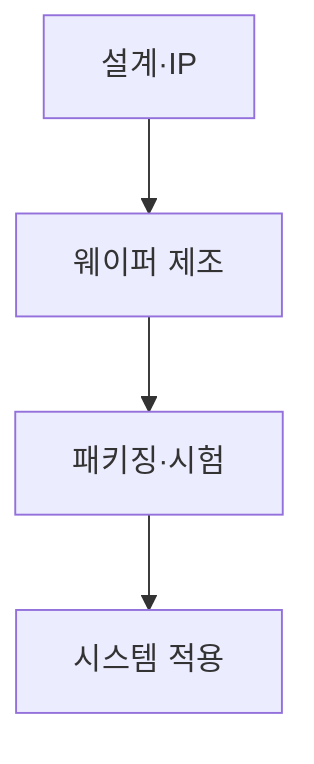
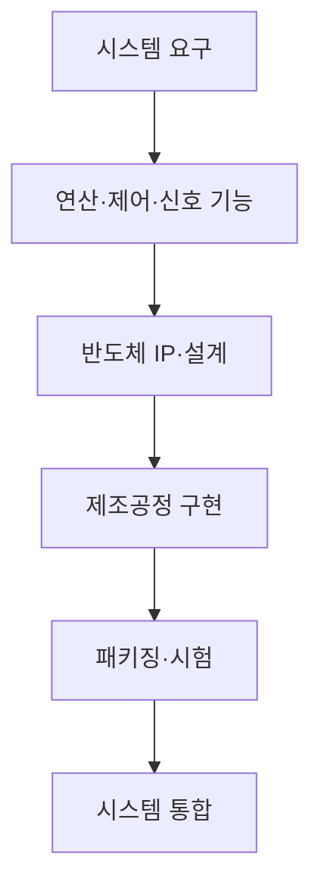
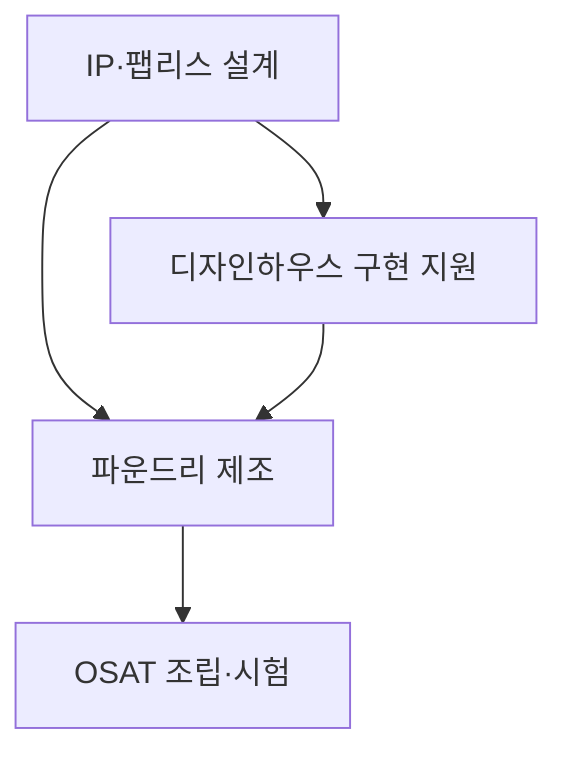
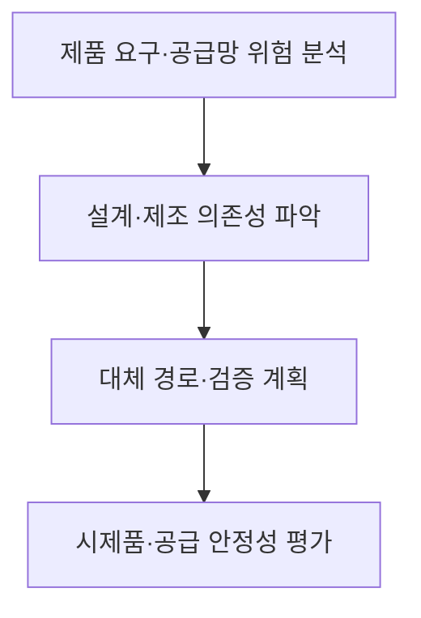

## 지식 로드맵 내 현재 위치

컴퓨터 시스템 및 네트워크 → 반도체 시스템 → 비메모리 반도체

## 30초 인출

- 본질: 비메모리 반도체는 데이터의 연산·제어·신호 처리를 수행하는 반도체
- 메커니즘: CPU·GPU·SoC·아날로그·센서 등 기능별 회로를 설계·제조·패키징

핵심 용어

- **비메모리 반도체(Non-Memory Semiconductor)**: 데이터를 저장하기보다 연산·제어·신호 처리 기능을 수행하는 반도체의 통칭
- **팹리스(Fabless)**: 반도체 설계와 판매에 집중하고 자체 웨이퍼 제조시설을 운영하지 않는 사업 형태
- **파운드리(Foundry)**: 고객의 반도체 설계를 위탁받아 웨이퍼 제조를 수행하는 사업 형태
- **디자인하우스(Design House)**: 설계를 특정 제조공정에 맞게 구현하도록 지원하는 기업·서비스
- **OSAT (Outsourced Semiconductor Assembly and Test)**: 외부 위탁 방식의 반도체 조립·패키징·시험 서비스

---
## 1교시 예상문제 (10점)

> 비메모리 반도체의 개념과 주요 제품을 설명하시오. (예상)

---
## 1교시 10점 답안

### Ⅰ. 정의·목적

| 구분 | 핵심 |
|---|---|
| 정의 | **비메모리 반도체**는 데이터의 연산·제어·신호 처리를 수행하는 반도체 |
| 목적 | 시스템의 계산·제어·입출력 요구를 전자회로로 구현 |

### Ⅱ. 주요 제품

| 기능 | 제품 예 |
|---|---|
| 연산 | CPU·GPU·NPU |
| 시스템 통합 | SoC·마이크로컨트롤러 |
| 신호·전력 | 아날로그·전력관리 IC |
| 입력 감지 | 이미지·각종 센서 |

### Ⅲ. 산업 구조

> 제언: 제품 기능과 함께 설계·제조·패키징 단계의 공급망 의존성을 파악

---
## 2~4교시 예상문제 (25점)

> 비메모리 반도체의 기능과 산업 구조를 설명하고, 경쟁력 확보를 위한 정보기술·공급망 관점의 방안을 제시하시오. (예상)

---
## 2~4교시 25점 답안

### Ⅰ. 정의·목적

| 구분 | 핵심 |
|---|---|
| 정의 | **비메모리 반도체**는 데이터의 연산·제어·신호 처리를 수행하는 반도체 |
| 목적 | 시스템의 계산·제어·입출력 요구를 전자회로로 구현 |

### Ⅱ. 기능별 분류

| 기능 | 대표 유형 | 적용 예 |
|---|---|---|
| 범용 연산 | CPU | 서버·개인용 컴퓨터 |
| 병렬·AI 연산 | GPU·NPU | 그래픽·AI 처리 |
| 통합 제어 | SoC·마이크로컨트롤러 | 모바일·임베디드 장치 |
| 신호 변환·관리 | 아날로그·전력 IC | 센서·전원 회로 |

### Ⅲ. 설계·제조 분업

| 주체 | 핵심 역할 |
|---|---|
| IP 제공자 | 재사용 가능한 설계 블록 제공 |
| 팹리스 | 제품 아키텍처·회로 설계 |
| 파운드리 | 웨이퍼 제조 |
| 디자인하우스 | 설계의 공정 구현 지원 |
| OSAT | 조립·패키징·시험 |

### Ⅳ. 경쟁력 한계와 대응

| 한계 | 대응 |
|---|---|
| 설계·제조·패키징 역량이 여러 기업에 분산 | 인터페이스·검증 데이터의 협업 관리 |
| 특정 공정·공급자 의존으로 전환 위험 | 대체 공급경로와 제품 재설계 가능성을 사전 평가 |
| 설계 복잡도와 검증 범위 증가 | EDA·시뮬레이션·검증 자동화에 투자 |

### Ⅴ. 기술사적 제언

| 한계 | 해결 방안 |
|---|---|
| 설계 역량만으로 제품 공급 경쟁력을 확보하기 어려움 | 설계도구·공정·패키징·검증 데이터를 연결한 협업 생태계와 대체 조달 계획을 함께 구축 |

## 검증 출처

- [SIA: What is a semiconductor?](https://www.semiconductors.org/semiconductors-101/): 반도체 제품·산업 기초
- [TSMC Open Innovation Platform](https://www.tsmc.com/english/dedicatedFoundry/technology/open_innovation): 설계 생태계 협업
