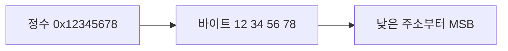
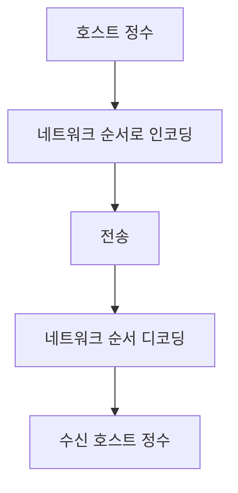
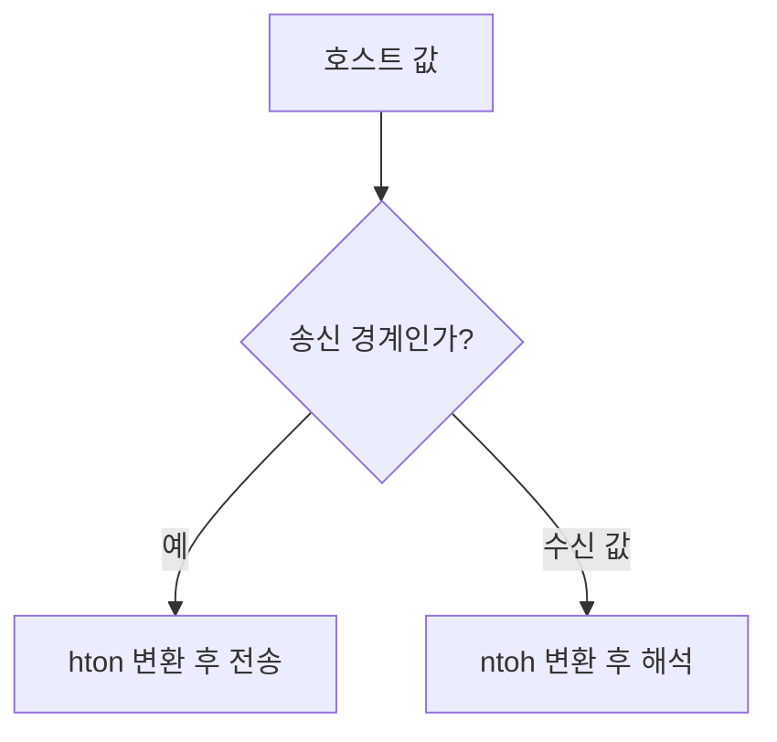

## 지식 로드맵 내 현재 위치

컴퓨터 시스템 및 네트워크 → 데이터 표현 → 빅엔디언

## 30초 인출

- 본질: 빅엔디언은 다중 바이트 값의 최상위 바이트를 낮은 메모리 주소에 두는 바이트 순서
- 메커니즘: 수신·송신 경계에서 상대 시스템의 바이트 순서와 맞추어 정수 필드를 해석

핵심 용어

- **빅엔디언(Big-Endian)**: 다중 바이트 값에서 최상위 바이트를 낮은 주소에 저장하는 순서
- **리틀엔디언(Little-Endian)**: 다중 바이트 값에서 최하위 바이트를 낮은 주소에 저장하는 순서
- **네트워크 바이트 순서(Network Byte Order)**: 인터넷 프로토콜에서 다중 바이트 값을 표현할 때 사용하는 빅엔디언 순서
- **htonl/htons**: 호스트 순서의 32/16비트 값을 네트워크 순서로 변환하는 POSIX 소켓 인터페이스

---
## 1교시 예상문제 (10점)

> 빅엔디언의 개념과 메모리 표현을 설명하시오. (예상)

---
## 1교시 10점 답안

### Ⅰ. 정의·목적

| 구분 | 핵심 |
|---|---|
| 정의 | **빅엔디언**은 다중 바이트 값의 최상위 바이트를 낮은 메모리 주소에 두는 바이트 순서 |
| 목적 | 서로 다른 시스템 사이 다중 바이트 값을 일관되게 표현·교환 |

### Ⅱ. 메모리 표현

| 주소 증가 | 0x100 | 0x101 | 0x102 | 0x103 |
|---|---:|---:|---:|---:|
| 값 0x12345678의 저장 바이트 | 0x12 (MSB) | 0x34 | 0x56 | 0x78 (LSB) |

### Ⅲ. 사용 경계

인터넷 프로토콜의 다중 바이트 필드는 네트워크 바이트 순서에 맞춰 인코딩·디코딩

> 제언: 송수신 경계에서 명시적 변환 API를 사용하고 필드 단위 시험을 수행

---
## 2~4교시 예상문제 (25점)

> 빅엔디언의 메모리 표현을 설명하고, 리틀엔디언과의 상호운용 시 변환 방안을 제시하시오. (예상)

---
## 2~4교시 25점 답안

### Ⅰ. 정의·목적

| 구분 | 핵심 |
|---|---|
| 정의 | **빅엔디언**은 다중 바이트 값의 최상위 바이트를 낮은 메모리 주소에 두는 바이트 순서 |
| 목적 | 서로 다른 시스템 사이 다중 바이트 값을 일관되게 표현·교환 |

### Ⅱ. 저장 표현

| 주소 증가 | 0x100 | 0x101 | 0x102 | 0x103 |
|---|---:|---:|---:|---:|
| 빅엔디언 | 0x12 | 0x34 | 0x56 | 0x78 |
| 리틀엔디언 | 0x78 | 0x56 | 0x34 | 0x12 |

### Ⅲ. 표준 적용과 변환

| 항목 | 처리 |
|---|---|
| 단일 바이트 필드 | 바이트 순서 변환 불필요 |
| 다중 바이트 프로토콜 필드 | 네트워크 바이트 순서로 인코딩 |
| 호스트 메모리 값 | 네트워크↔호스트 변환 API 사용 |

### Ⅳ. 상호운용 한계와 대응

| 한계 | 대응 |
|---|---|
| 호스트 순서를 전제로 패킷 필드를 직접 해석 | 프로토콜 직렬화·역직렬화 계층에서 변환 |
| 필드 폭·부호 해석 차이가 변환 오류를 가림 | 필드 폭을 고정하고 경계값 시험 |
| 구조체를 그대로 전송하면 패딩·정렬 차이가 생김 | 필드 단위로 명시적 인코딩 |

### Ⅴ. 기술사적 제언

| 한계 | 해결 방안 |
|---|---|
| CPU 내부 바이트 순서를 네트워크 프로토콜의 표현과 혼동하기 쉬움 | 전송 형식과 호스트 표현을 분리하고 상호운용 시험으로 검증 |

## 검증 출처

- [RFC 791](https://datatracker.ietf.org/doc/html/rfc791): IPv4 필드 표현
- [The Open Group htonl/htons](https://pubs.opengroup.org/onlinepubs/000095399/functions/htonl.html): POSIX 호스트·네트워크 바이트 순서 API
