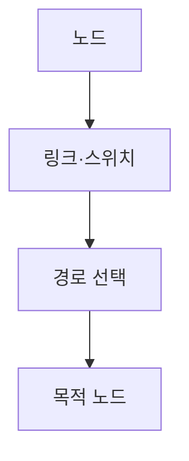
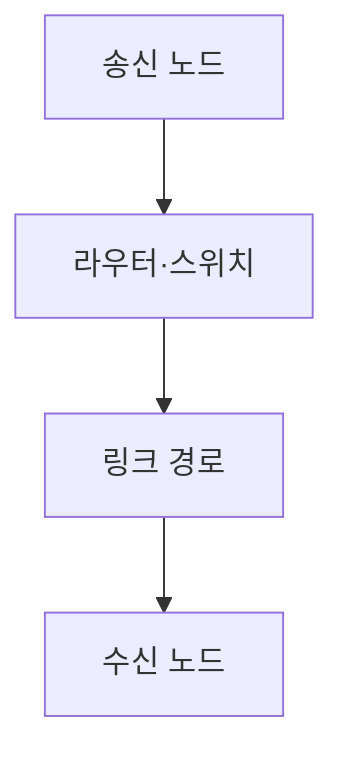
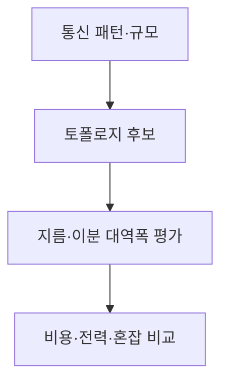

## 지식 로드맵 내 현재 위치

컴퓨터 시스템 및 네트워크 → 병렬 컴퓨터 구조 → 상호연결망

## 30초 인출

- 본질: 상호연결망은 병렬 시스템의 노드·프로세서·메모리 사이 데이터 경로를 제공하는 구조
- 메커니즘: 토폴로지와 스위칭·라우팅 방식이 경로 수, 지연, 확장 비용을 결정

핵심 용어

- **상호연결망(Interconnection Network)**: 병렬 시스템 구성요소 간 통신 경로를 제공하는 네트워크 구조
- **토폴로지(Topology)**: 노드와 링크가 연결된 형태
- **지름(Diameter)**: 네트워크에서 두 노드 사이 최단 경로 길이 중 최댓값
- **이분 대역폭(Bisection Bandwidth)**: 노드를 두 집합으로 나누는 절단면을 통과할 수 있는 총 대역폭
- **웜홀 라우팅(Wormhole Routing)**: 패킷을 플릿 단위로 전달해 경로 자원을 점유하는 라우팅 방식

---
## 1교시 예상문제 (10점)

> 상호연결망의 개념과 주요 평가 기준을 설명하시오. (예상)

---
## 1교시 10점 답안

### Ⅰ. 정의·목적

| 구분 | 핵심 |
|---|---|
| 정의 | **상호연결망**은 병렬 시스템 구성요소 간 통신 경로를 제공하는 네트워크 구조 |
| 목적 | 노드 간 데이터 전달과 병렬 작업의 통신 지원 |

### Ⅱ. 구조와 지표

| 지표 | 의미 |
|---|---|
| 지름 | 최악의 최소 홉 경로 |
| 이분 대역폭 | 네트워크 분할면의 통신 용량 |
| 지연·비용 | 전송시간과 연결 구성 자원 |

### Ⅲ. 평가 관점

토폴로지와 라우팅을 함께 보며 지연, 처리량, 확장성, 비용을 작업 통신 패턴에 맞춰 평가

> 제언: 평균 지연만 보지 말고 경로 혼잡과 이분 대역폭을 함께 측정

---
## 2~4교시 예상문제 (25점)

> 상호연결망의 토폴로지와 평가 기준을 설명하고, 병렬 시스템 규모·통신 특성에 맞는 설계 방안을 제시하시오. (예상)

---
## 2~4교시 25점 답안

### Ⅰ. 정의·목적

| 구분 | 핵심 |
|---|---|
| 정의 | **상호연결망**은 병렬 시스템 구성요소 간 통신 경로를 제공하는 네트워크 구조 |
| 목적 | 노드 간 데이터 전달과 병렬 작업의 통신 지원 |

### Ⅱ. 구성 요소와 데이터 전달

| 요소 | 기능 |
|---|---|
| 노드 | 연산·저장 구성요소 |
| 링크 | 인접 노드·스위치 연결 |
| 스위치·라우터 | 입력 경로와 출력 경로 연결 |
| 라우팅 | 목적지까지 전달 경로 선택 |

### Ⅲ. 토폴로지와 평가

| 토폴로지 | 구조적 특징 | 주요 검토 |
|---|---|---|
| 버스 | 공유 전송 매체 | 단순성·공유 병목 |
| 메쉬 | 격자형 인접 링크 | 경로 길이·링크 수 |
| 토러스 | 메쉬 경계 연결 | 링크 수·우회 경로 |
| 트리형 | 계층 스위치 연결 | 상위 링크 혼잡·확장 구성 |

### Ⅳ. 설계 한계와 대응

| 한계 | 대응 |
|---|---|
| 특정 링크·스위치에 트래픽 집중 | 실제 통신 패턴과 혼잡 지표 기반으로 경로·대역 설계 |
| 네트워크 규모 증가에 따른 비용·전력 증가 | 토폴로지 후보별 비용과 요구 성능 비교 |
| 라우팅 경로의 순환 의존·교착 가능성 | 라우팅 규칙·가상 채널·흐름제어를 검증 |

### Ⅴ. 기술사적 제언

| 한계 | 해결 방안 |
|---|---|
| 하나의 토폴로지가 모든 통신 패턴과 규모에 최선이 아님 | 업무의 통신행렬과 장애·비용 조건을 반영한 부하 시험으로 토폴로지를 선정 |

## 검증 출처

- [Linux kernel interconnect overview](https://docs.kernel.org/driver-api/interconnect.html): 시스템 구성요소 간 상호연결 개념과 관리
- [Open MPI documentation](https://docs.open-mpi.org/): 병렬 시스템 통신 구현 참고
