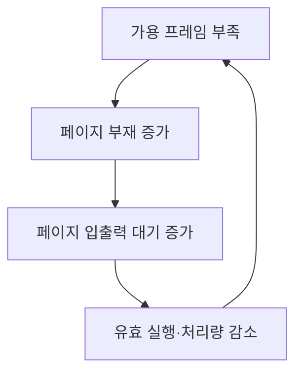
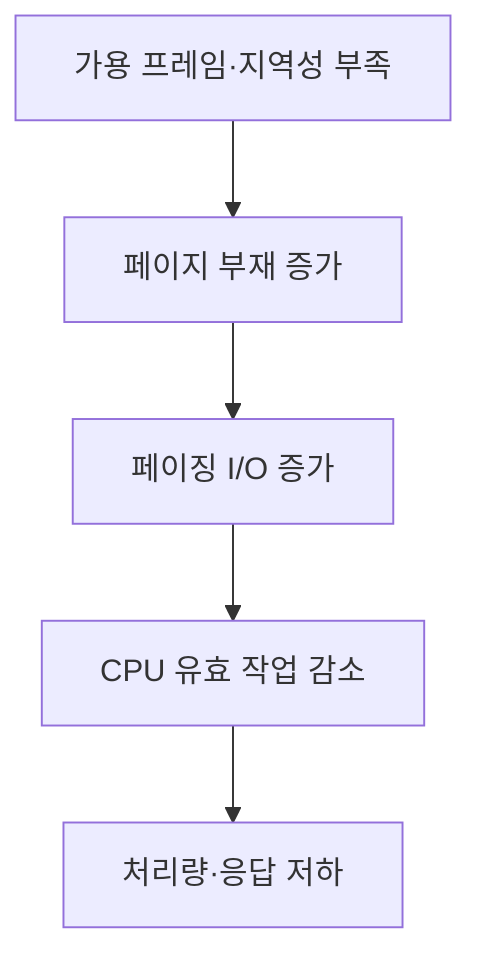
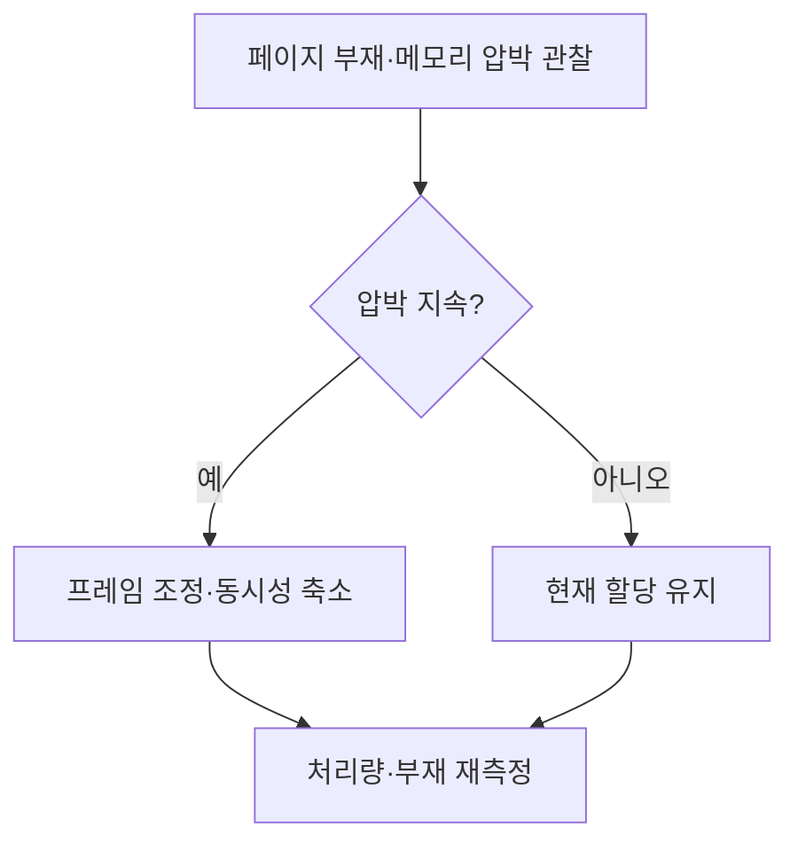

## 지식 로드맵 내 현재 위치

컴퓨터 시스템 및 네트워크 → 운영체제 메모리 관리 → 스래싱

## 30초 인출

- 본질: 스래싱은 메모리 부족으로 페이지 교체가 과도해져 유효한 실행보다 페이징에 시간을 쓰는 상태
- 메커니즘: 작업의 메모리 요구가 가용 프레임을 넘으면 페이지 부재와 디스크 I/O가 늘어 처리량이 저하

핵심 용어

- **스래싱(Thrashing)**: 페이지 부재와 페이징이 과도해 시스템 처리 효율이 급격히 낮아지는 상태
- **워킹셋(Working Set)**: 일정 참조 구간 동안 프로세스가 사용한 페이지 집합
- **다중 프로그래밍 정도(Multiprogramming Degree)**: 동시에 메모리에 적재되어 실행되는 작업 수의 정도
- **PFF (Page-Fault Frequency)**: 페이지 부재 빈도를 관찰해 메모리 압박을 조정하는 접근

---
## 1교시 예상문제 (10점)

> 스래싱의 개념과 발생 원리를 설명하시오. (예상)

---
## 1교시 10점 답안

### Ⅰ. 정의·목적

| 구분 | 핵심 |
|---|---|
| 정의 | **스래싱**은 과도한 페이지 부재·페이징으로 유효 실행보다 페이지 입출력에 시간을 쓰는 상태 |
| 목적 | 워킹셋·페이지 부재 추이를 활용해 메모리 압박을 조기에 파악 |

### Ⅱ. 발생 원리

### Ⅲ. 관찰 지표

| 지표 | 쓰임 |
|---|---|
| 페이지 부재 추이 | 메모리 접근 압박 확인 |
| 워킹셋·동시 작업 수 | 할당 프레임과 부하 관계 파악 |

> 제언: 페이지 부재·I/O 대기·처리량을 함께 관찰해 메모리 증설과 동시성 조정을 판단

---
## 2~4교시 예상문제 (25점)

> 스래싱의 원인·영향을 설명하고, 운영체제와 시스템 운영 관점의 예방·대응 방안을 제시하시오. (예상)

---
## 2~4교시 25점 답안

### Ⅰ. 정의·목적

| 구분 | 핵심 |
|---|---|
| 정의 | **스래싱**은 과도한 페이지 부재·페이징으로 유효 실행보다 페이지 입출력에 시간을 쓰는 상태 |
| 목적 | 워킹셋·페이지 부재 추이를 활용해 메모리 압박을 조기에 파악 |

### Ⅱ. 발생 메커니즘

| 원인 | 변화 |
|---|---|
| 작업 메모리 요구 합이 가용 프레임 초과 | 자주 쓰는 페이지가 반복 교체 |
| 동시 작업 증가 | 작업별 프레임 감소 가능 |
| 접근 국소성 약화 | 페이지 재참조 전 교체 가능성 증가 |

### Ⅲ. 탐지와 제어

| 기법 | 관찰·제어 |
|---|---|
| 워킹셋 | 최근 참조 구간의 페이지 집합을 고려해 프레임 할당 |
| PFF | 페이지 부재 빈도에 따라 프레임 요구 조정 |
| 동시성 제어 | 메모리 압박 시 작업 수 조정 |

### Ⅳ. 운영 한계와 대응

| 한계 | 대응 |
|---|---|
| 저장장치 스왑만 늘려도 메모리 압박 자체는 해소되지 않음 | 작업 동시성·메모리 한도·물리 메모리 여유를 함께 점검 |
| 과도한 페이지 부재만으로 원인을 단정하기 어려움 | I/O 대기·메모리 압박·처리량을 함께 상관 분석 |
| 컨테이너 메모리 정책이 노드 자원과 충돌할 수 있음 | cgroup·노드 메모리 지표와 워크로드 제한을 함께 조정 |

### Ⅴ. 기술사적 제언

| 한계 | 해결 방안 |
|---|---|
| 장애 후 스왑 증가만으로 대응하면 성능 저하가 반복될 수 있음 | 페이지 부재와 처리량의 상관 임계치를 정하고 자동 경보·동시성 조정을 검증 |

## 검증 출처

- [Linux kernel page reclaim documentation](https://docs.kernel.org/mm/page_reclaim.html): 페이지 회수·메모리 압박
- [Linux PSI documentation](https://docs.kernel.org/accounting/psi.html): 메모리·I/O 압박 지표
