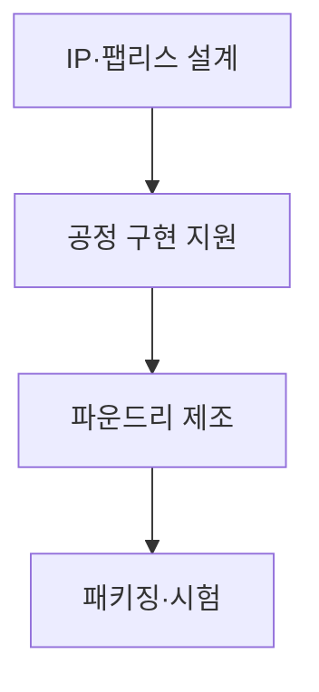
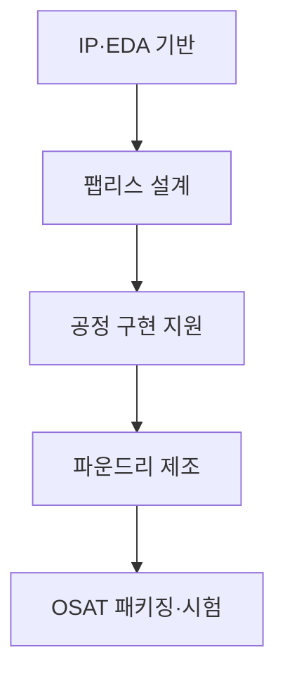
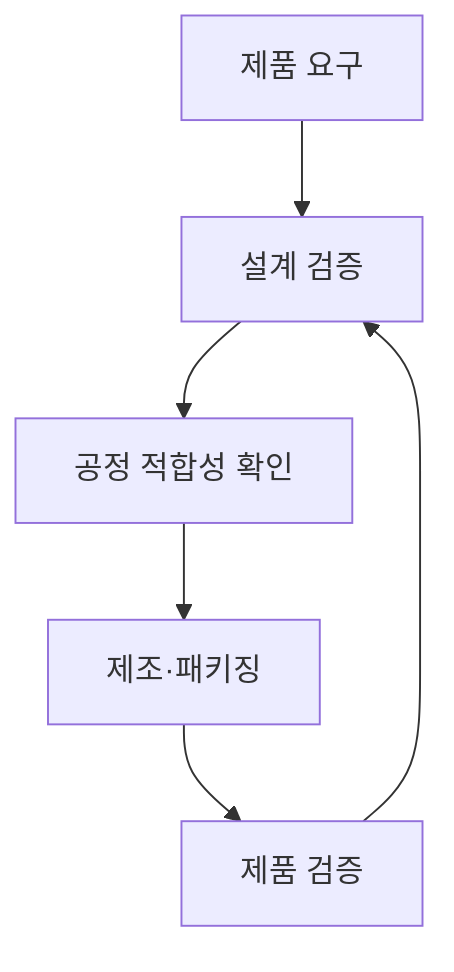

## 지식 로드맵 내 현재 위치

컴퓨터 시스템 및 네트워크 → 반도체 시스템 → 시스템 반도체 생태계

## 30초 인출

- 본질: 시스템 반도체 생태계는 설계·제조·패키징 역량이 여러 전문 주체에 나뉜 산업 구조
- 메커니즘: IP·팹리스·파운드리·후공정 기업이 설계 자료와 제조 공정으로 연결

핵심 용어

- **시스템 반도체 생태계(System Semiconductor Ecosystem)**: 시스템 반도체 설계·제조·패키징에 관여하는 기업과 기술의 협업 구조
- **팹리스(Fabless)**: 반도체 제품을 설계하고 자체 웨이퍼 제조시설은 보유하지 않는 사업 형태
- **디자인하우스(Design House)**: 설계가 특정 공정에서 구현되도록 설계·물리 구현을 지원하는 기업
- **파운드리(Foundry)**: 고객 설계에 따라 웨이퍼를 제조하는 사업 형태
- **OSAT (Outsourced Semiconductor Assembly and Test)**: 외부 위탁 조립·패키징·시험 서비스

---
## 1교시 예상문제 (10점)

> 시스템 반도체 생태계의 구성과 역할을 설명하시오. (예상)

---
## 1교시 10점 답안

### Ⅰ. 정의·목적

| 구분 | 핵심 |
|---|---|
| 정의 | **시스템 반도체 생태계**는 설계·제조·패키징 역량이 여러 전문 주체에 나뉜 산업 구조 |
| 목적 | 전문 역량을 연결해 제품 개발과 공급을 지원 |

### Ⅱ. 구성과 역할

| 주체 | 역할 |
|---|---|
| IP 제공자 | 재사용 설계 블록 제공 |
| 팹리스 | 제품 아키텍처·회로 설계 |
| 파운드리 | 웨이퍼 제조 |
| 디자인하우스·OSAT | 공정 구현 지원·패키징·시험 |

### Ⅲ. 협업 요점

설계 규칙·공정 자료·검증 결과의 연계가 제품 구현의 핵심

> 제언: 공정·후공정·설계 도구까지 고려해 협업 경로와 대체 공급처를 점검

---
## 2~4교시 예상문제 (25점)

> 시스템 반도체 생태계의 구성과 역할을 설명하고, 협업·공급망 안정화 방안을 제시하시오. (예상)

---
## 2~4교시 25점 답안

### Ⅰ. 정의·목적

| 구분 | 핵심 |
|---|---|
| 정의 | **시스템 반도체 생태계**는 설계·제조·패키징 역량이 여러 전문 주체에 나뉜 산업 구조 |
| 목적 | 전문 역량을 연결해 제품 개발과 공급을 지원 |

### Ⅱ. 가치사슬

| 단계 | 주체 | 역할 |
|---|---|---|
| 설계 기반 | IP·EDA | 설계 블록·개발 도구 |
| 제품 설계 | 팹리스 | 회로·제품 설계 |
| 구현 지원 | 디자인하우스 | 공정 특화 설계 지원 |
| 제조 | 파운드리 | 웨이퍼 제조 |
| 후공정 | OSAT | 조립·패키징·시험 |

### Ⅲ. 상호 의존

| 연결 | 협업 요소 |
|---|---|
| 설계-공정 | 설계 규칙·검증 |
| 제조-후공정 | 웨이퍼·패키지 조건 |
| 제품-시스템 | 성능·전력·품질 요구 |

### Ⅳ. 협업 한계와 대응

| 한계 | 대응 |
|---|---|
| 데이터와 책임이 기업별로 나뉨 | 인터페이스·변경관리·검증 기준 합의 |
| 특정 제조·패키징 역량에 공급 집중 | 대체 경로와 설계 이식성 평가 |
| 전문 도구 접근성 차이 | 공용 검증환경·개발지원 확충 |

### Ⅴ. 기술사적 제언

| 한계 | 해결 방안 |
|---|---|
| 단일 기업 육성만으로 생태계 병목을 해소하기 어려움 | 가치사슬의 의존도를 지도화하고 공용기반·대체경로를 함께 지원 |

## 검증 출처

- [TSMC Open Innovation Platform](https://www.tsmc.com/english/dedicatedFoundry/technology/open_innovation): 설계 생태계 협업
- [JEDEC](https://www.jedec.org/): 반도체 표준 활동
