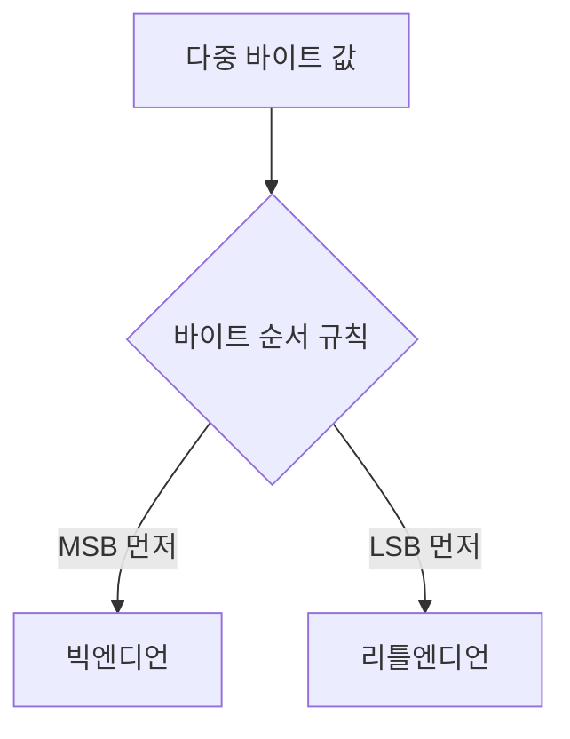
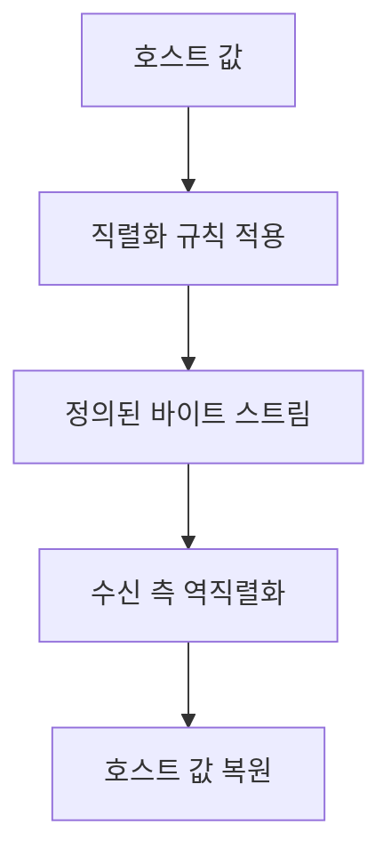
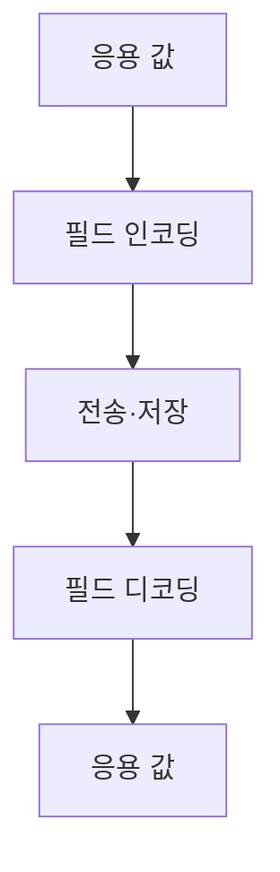

## 지식 로드맵 내 현재 위치

컴퓨터 시스템 및 네트워크 → 데이터 표현 → 엔디언

## 30초 인출

- 본질: 엔디언은 다중 바이트 값을 메모리 바이트 주소에 배열하는 순서
- 메커니즘: 빅엔디언은 최상위 바이트, 리틀엔디언은 최하위 바이트를 낮은 주소에 저장

핵심 용어

- **엔디언(Endianness)**: 다중 바이트 값의 바이트 순서를 메모리 주소에 대응하는 규칙
- **빅엔디언(Big-Endian)**: 최상위 바이트를 낮은 주소에 저장하는 순서
- **리틀엔디언(Little-Endian)**: 최하위 바이트를 낮은 주소에 저장하는 순서
- **네트워크 바이트 순서(Network Byte Order)**: 인터넷 프로토콜 다중 바이트 필드에 쓰이는 빅엔디언 순서
- **직렬화(Serialization)**: 자료를 정해진 바이트 형식으로 변환하는 과정

---
## 1교시 예상문제 (10점)

> 엔디언의 개념과 빅엔디언·리틀엔디언의 차이를 설명하시오. (예상)

---
## 1교시 10점 답안

### Ⅰ. 정의·목적

| 구분 | 핵심 |
|---|---|
| 정의 | **엔디언**은 다중 바이트 값을 메모리 주소에 배열하는 순서 |
| 목적 | 메모리 표현과 시스템 간 데이터 교환 형식을 정함 |

### Ⅱ. 바이트 배열

| 주소 증가 | 낮은 주소 | 다음 주소 | 다음 주소 | 높은 주소 |
|---|---|---|---|---|
| 빅엔디언 0x12345678 | 12 (MSB) | 34 | 56 | 78 (LSB) |
| 리틀엔디언 0x12345678 | 78 (LSB) | 56 | 34 | 12 (MSB) |

### Ⅲ. 이식성

외부 시스템·파일과의 교환은 명시적 인코딩·디코딩으로 처리

> 제언: 내부 메모리 표현과 저장·전송 형식을 분리

---
## 2~4교시 예상문제 (25점)

> 엔디언의 메모리 표현을 설명하고, 이기종 시스템의 데이터 교환 방안을 제시하시오. (예상)

---
## 2~4교시 25점 답안

### Ⅰ. 정의·목적

| 구분 | 핵심 |
|---|---|
| 정의 | **엔디언**은 다중 바이트 값을 메모리 주소에 배열하는 순서 |
| 목적 | 메모리 표현과 시스템 간 데이터 교환 형식을 정함 |

### Ⅱ. 바이트 순서

| 순서 | 낮은 주소 | 이후 주소 |
|---|---|---|
| 빅엔디언 | 최상위 바이트 | 하위 바이트 순 |
| 리틀엔디언 | 최하위 바이트 | 상위 바이트 순 |

### Ⅲ. 적용 지점

| 대상 | 처리 |
|---|---|
| CPU 내부 값 | 아키텍처의 메모리 표현 적용 |
| 네트워크 필드 | 프로토콜 지정 순서로 변환 |
| 파일·IPC 형식 | 명시적 스키마·직렬화 규칙 정의 |

### Ⅳ. 상호운용 한계와 대응

| 한계 | 대응 |
|---|---|
| 호스트 순서를 패킷 표현으로 간주 | 경계에서 변환 API·직렬화 사용 |
| 구조체를 그대로 전송 | 필드 폭·패딩을 명시 |
| 부호·길이 차이가 바이트 오류와 혼재 | 형식 버전과 경계값 시험 관리 |

### Ⅴ. 기술사적 제언

| 한계 | 해결 방안 |
|---|---|
| 엔디언 변환만으로 자료 형식의 모든 차이가 해결되지는 않음 | 스키마에 필드 폭·부호·문자 인코딩도 정의하고 상호운용 검증 |

## 검증 출처

- [RFC 791](https://datatracker.ietf.org/doc/html/rfc791): IPv4 필드 표현
- [The Open Group htonl/htons](https://pubs.opengroup.org/onlinepubs/000095399/functions/htonl.html): 호스트·네트워크 바이트 순서 변환
