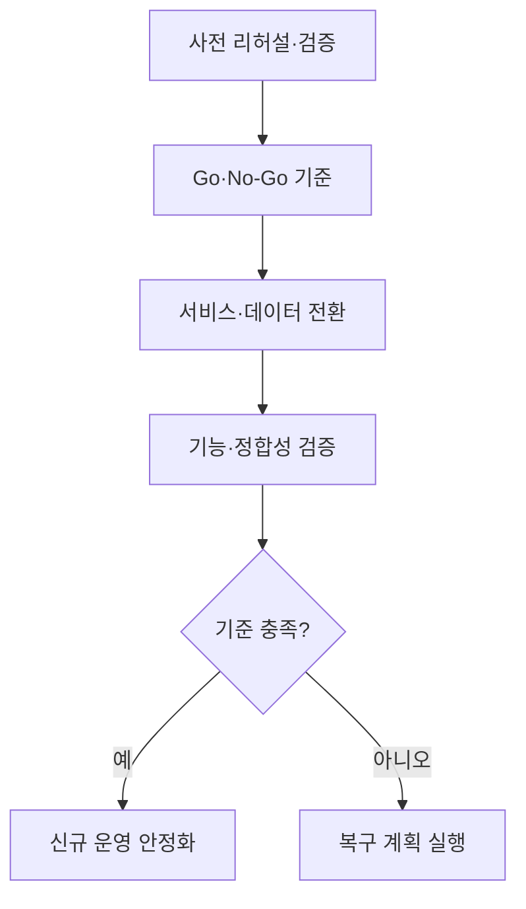
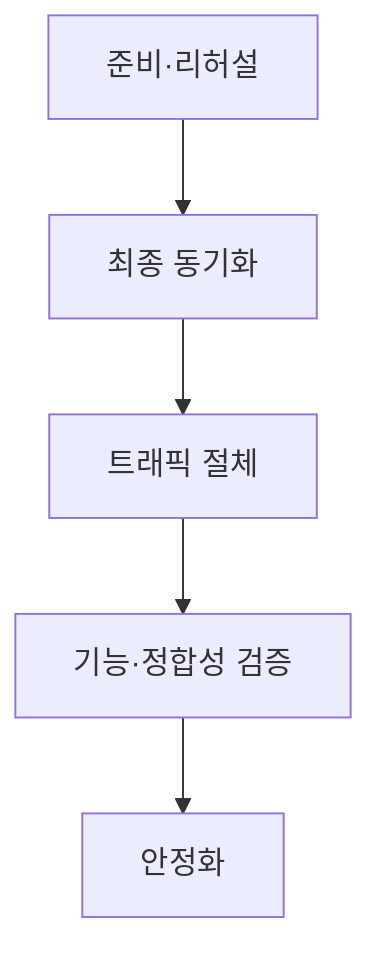
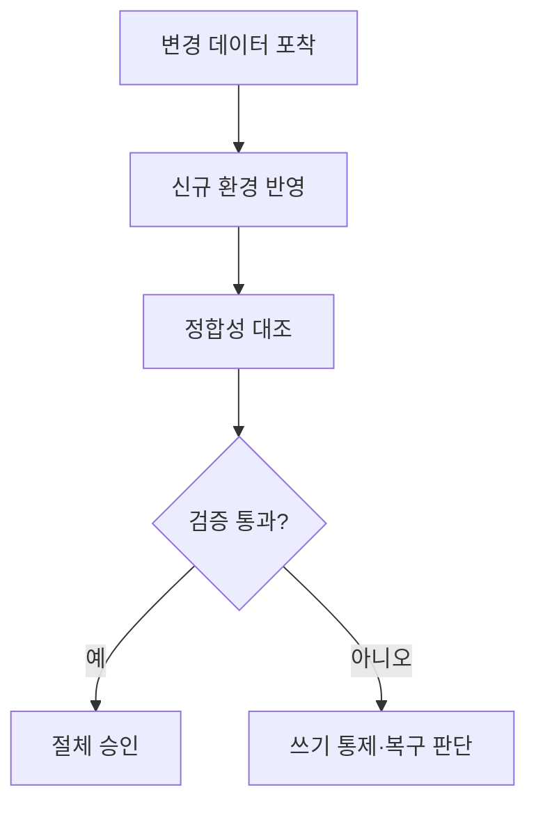

## 지식 로드맵 내 현재 위치

컴퓨터 시스템 및 네트워크 → 정보시스템 운영 → 운영환경 전환 장애관리

## 30초 인출

- 본질: 운영환경 전환 장애관리는 서비스·데이터를 새 환경으로 옮길 때 실패 영향을 통제하는 활동
- 메커니즘: 리허설, 데이터 검증, Go/No-Go 기준, 복구 계획으로 전환을 관리

핵심 용어

- **컷오버(Cutover)**: 기존 운영에서 신규 운영환경으로 서비스와 처리를 전환하는 절차
- **Go/No-Go**: 사전 합의 기준에 따라 전환을 진행하거나 중단하는 결정
- **CDC (Change Data Capture)**: 데이터 변경을 식별해 다른 시스템에 전달하는 방식
- **롤백(Rollback)**: 실패 시 계획된 이전 운영상태로 복구하는 절차
- **병행 운영(Parallel Run)**: 기존·신규 시스템 결과를 일정 기간 비교하는 방식

---
## 1교시 예상문제 (10점)

> 운영환경 전환 장애관리의 개념과 핵심 통제 항목을 설명하시오. (예상)

---
## 1교시 10점 답안

### Ⅰ. 정의·목적

| 구분 | 핵심 |
|---|---|
| 정의 | **운영환경 전환 장애관리**는 서비스·데이터를 새 환경으로 옮길 때 실패 영향을 통제하는 활동 |
| 목적 | 서비스 연속성과 데이터 정합성, 복구 가능성 확보 |

### Ⅱ. 전환 흐름

### Ⅲ. 준비 항목

| 준비 | 확인 |
|---|---|
| 실행계획 | 작업순서·담당·시간창 |
| 데이터 | 최종 동기화·정합성 |
| 복구 | 중단 기준·복구 경로·책임자 |

> 제언: 실패 기준과 복구 가능 시간을 이해관계자와 사전 합의

---
## 2~4교시 예상문제 (25점)

> 운영환경 전환 절차를 설명하고 데이터 정합성과 서비스 복구를 위한 통제 방안을 제시하시오. (예상)

---
## 2~4교시 25점 답안

### Ⅰ. 정의·목적

| 구분 | 핵심 |
|---|---|
| 정의 | **운영환경 전환 장애관리**는 서비스·데이터를 새 환경으로 옮길 때 실패 영향을 통제하는 활동 |
| 목적 | 서비스 연속성과 데이터 정합성, 복구 가능성 확보 |

### Ⅱ. 전환 단계

| 단계 | 통제 |
|---|---|
| 준비 | 범위·책임·시간창·복구기준 확정 |
| 리허설 | 절차와 데이터량을 반영한 시험 |
| 전환 | 쓰기 경계·최종 동기화·트래픽 이동 관리 |
| 안정화 | 기능·정합성·성능 관찰 |

### Ⅲ. 데이터·복구 관리

| 통제 | 내용 |
|---|---|
| CDC·증분 동기화 | 변경 데이터 전달·적용 상태 확인 |
| 정합성 대조 | 건수·합계·업무 결과 비교 |
| 쓰기 권한 | 전환 중 동시 쓰기와 충돌 방지 |
| 복구 절차 | 데이터 손실·역동기화 가능성 확인 |

### Ⅳ. 장애 한계와 대응

| 한계 | 대응 |
|---|---|
| 전환시간·데이터량 추정 오류 | 리허설로 소요시간과 병목 측정 |
| 양쪽 시스템의 데이터 차이 | 단일 쓰기 원칙, CDC 방향·복구 시점 명시 |
| 현장 판단 지연 | 시간 제한과 결정 책임자 사전 합의 |

### Ⅴ. 기술사적 제언

| 한계 | 해결 방안 |
|---|---|
| 복구계획이 신규 시스템의 변경까지 자동 복원한다고 오해 | 전환 구간별 데이터 방향·쓰기 권한·손실 허용치를 명시하고 리허설로 입증 |

## 검증 출처

- [AWS DMS CDC](https://docs.aws.amazon.com/dms/latest/userguide/CHAP_Task.CDC.html): 변경 데이터 캡처·적용 개념
- [NIST SP 800-34 Rev.1](https://csrc.nist.gov/pubs/sp/800/34/r1/upd1/final): 정보시스템 비상계획·복구
