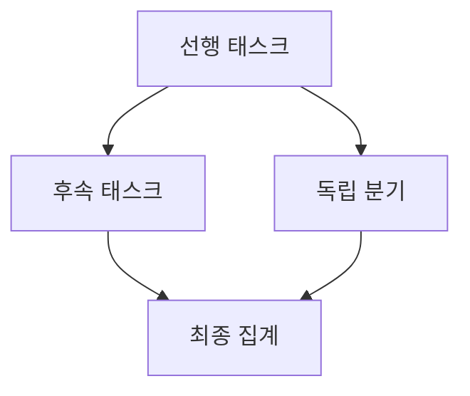
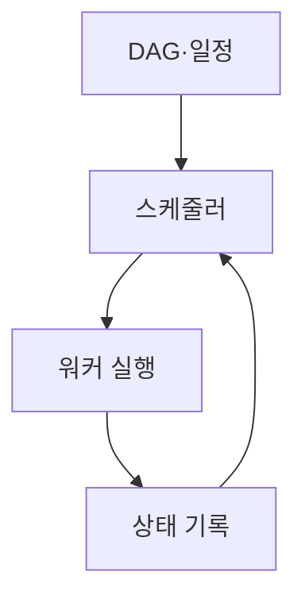
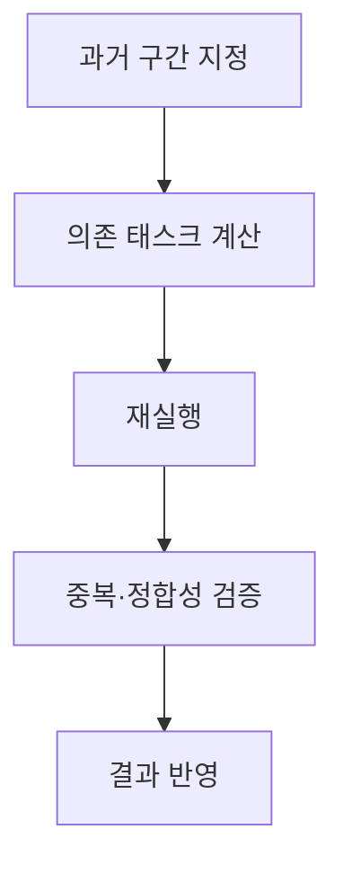

## 지식 로드맵 내 현재 위치

컴퓨터 시스템 및 네트워크 → 작업 자동화 → 워크플로 스케줄링과 데이터 백필

## 30초 인출

- 본질: 워크플로 스케줄링은 태스크 의존성과 자원 조건에 따라 실행 순서·시점을 정하는 기능
- 메커니즘: DAG 선행조건을 만족한 태스크를 실행하며 데이터 백필은 과거 구간을 재처리

핵심 용어

- **DAG (Directed Acyclic Graph)**: 태스크 간 선후 관계를 순환 없이 표현한 방향 그래프
- **워크플로 스케줄링(Workflow Scheduling)**: 의존성·자원·실행 조건에 따라 태스크를 배치하는 과정
- **데이터 백필(Data Backfill)**: 과거 데이터 구간을 지정해 워크플로를 재실행하는 작업
- **메이크스팬(Makespan)**: 워크플로 시작부터 최종 태스크 완료까지의 경과시간

---
## 1교시 예상문제 (10점)

> 워크플로 스케줄링과 데이터 백필의 개념 및 동작을 설명하시오. (예상)

---
## 1교시 10점 답안

### Ⅰ. 정의·목적

| 구분 | 핵심 |
|---|---|
| 정의 | **워크플로 스케줄링·데이터 백필**은 의존성에 따라 태스크를 배치하고 과거 데이터 구간을 재처리하는 기능 |
| 목적 | 작업 흐름을 자동 실행하고 데이터 누락·변경을 보정 |

### Ⅱ. DAG 실행

### Ⅲ. 데이터 재처리

| 동작 | 의미 |
|---|---|
| 기간 지정 | 재처리할 과거 데이터 범위 선택 |
| 재실행 | 해당 구간 태스크 수행 |
| 검증 | 중복·누락·결과 일관성 확인 |

> 제언: 과거 재실행 전 멱등성·중복 처리·외부 부작용을 점검

---
## 2~4교시 예상문제 (25점)

> 워크플로 스케줄링과 데이터 백필의 구조를 설명하고 재처리 정합성·자원 통제 방안을 제시하시오. (예상)

---
## 2~4교시 25점 답안

### Ⅰ. 정의·목적

| 구분 | 핵심 |
|---|---|
| 정의 | **워크플로 스케줄링·데이터 백필**은 의존성에 따라 태스크를 배치하고 과거 데이터 구간을 재처리하는 기능 |
| 목적 | 작업 흐름을 자동 실행하고 데이터 누락·변경을 보정 |

### Ⅱ. 의존성·실행

| 요소 | 역할 |
|---|---|
| DAG | 태스크와 선후 의존성 표현 |
| 스케줄러 | 실행 시점·조건 판단 |
| 워커 | 할당 태스크 실행 |
| 상태 저장소 | 실행·재시도·완료 상태 기록 |

### Ⅲ. 데이터 백필

| 단계 | 통제 |
|---|---|
| 기간 선택 | 구간·시간대 명시 |
| 재실행 | 의존 태스크와 자원 관리 |
| 결과 반영 | 중복 방지·멱등성 |
| 검증 | 건수·업무 결과 대조 |

### Ⅳ. 운영 한계와 대응

| 한계 | 대응 |
|---|---|
| 동시 재처리가 운영 자원을 압박 | 병렬도·우선순위·실행 시간창 제한 |
| 재실행이 외부 부작용을 중복 발생 | 멱등 처리·중복 키·쓰기 경계 관리 |
| 시간대·일정 변경으로 구간 의미 혼선 | 논리 구간·시간대·워크플로 버전 명시 |

### Ⅴ. 기술사적 제언

| 한계 | 해결 방안 |
|---|---|
| 재처리 완료만으로 업무 정합성이 보장되지 않음 | 재처리 전후 계보·건수·업무 지표를 검증 게이트로 설정 |

## 검증 출처

- [Apache Airflow backfill](https://airflow.apache.org/docs/apache-airflow/stable/core-concepts/backfill.html): 과거 구간 워크플로 실행
- [Apache Airflow DAG](https://airflow.apache.org/docs/apache-airflow/stable/core-concepts/dags.html): DAG 의존성 모델
