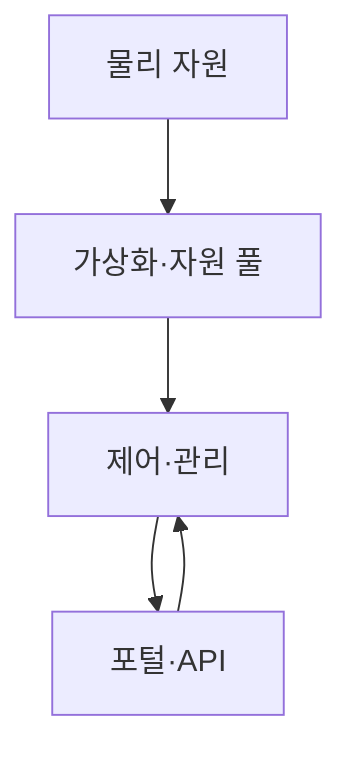
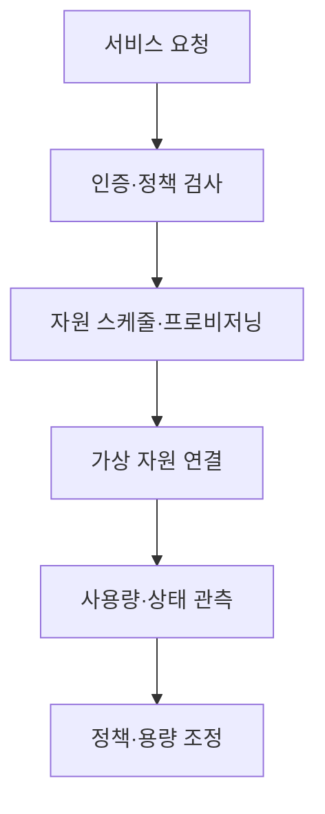
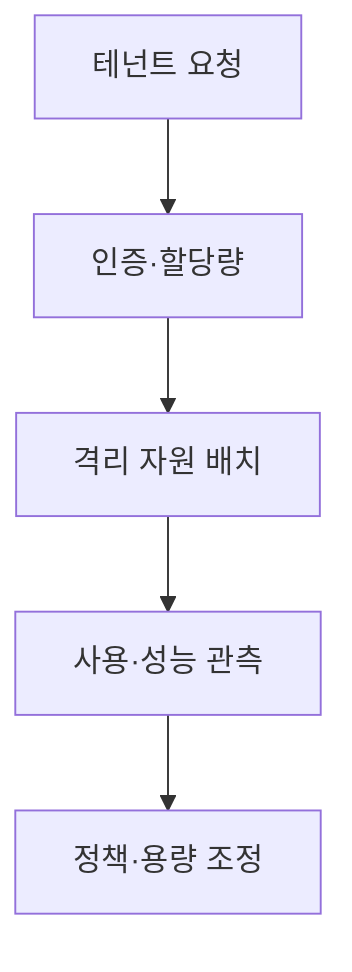

## 지식 로드맵 내 현재 위치

컴퓨터 시스템 및 네트워크 → 클라우드 컴퓨팅 → 클라우드 인프라 아키텍처

## 30초 인출

- 본질: 클라우드 인프라는 컴퓨팅·저장·네트워크 자원을 추상화해 온디맨드로 제공하는 구조
- 메커니즘: 물리 자원 위에 가상화·제어·서비스 인터페이스를 두고 API로 수명주기를 관리

핵심 용어

- **클라우드 인프라(Cloud Infrastructure)**: 클라우드 서비스의 컴퓨팅·저장·네트워크 자원과 관리 기능
- **가상화(Virtualization)**: 물리 자원을 논리 자원으로 추상화·분할하는 기술
- **SDDC (Software-Defined Data Center)**: 데이터센터 자원을 소프트웨어 기반으로 추상화·관리하는 아키텍처 접근
- **CMP (Cloud Management Platform)**: 클라우드 자원 요청·관리·운영을 지원하는 관리 플랫폼
- **오버레이 네트워크(Overlay Network)**: 기존 네트워크 위에 논리 네트워크를 구성하는 방식

---
## 1교시 예상문제 (10점)

> 클라우드 인프라 아키텍처의 개념과 주요 계층을 설명하시오. (예상)

---
## 1교시 10점 답안

### Ⅰ. 정의·목적

| 구분 | 핵심 |
|---|---|
| 정의 | **클라우드 인프라 아키텍처**는 컴퓨팅·저장·네트워크 자원을 추상화해 온디맨드로 제공하는 구조 |
| 목적 | 자원 프로비저닝과 운영의 표준화·자동화 |

### Ⅱ. 계층 구조

| 계층 | 역할 |
|---|---|
| 물리 자원 | 서버·저장·네트워크 제공 |
| 가상화·추상화 | 자원 풀과 논리 자원 구성 |
| 제어·관리 | 배치·정책·관측·수명주기 관리 |
| 서비스 인터페이스 | 포털·API 요청·사용 |

### Ⅲ. 운영 원리

요청은 권한·정책 검증 뒤 자원 배치와 설정으로 이어지고, 관측 정보는 운영 제어에 반영

> 제언: 자원 API·정책·운영 책임을 하나의 흐름으로 설계

---
## 2~4교시 예상문제 (25점)

> 클라우드 인프라 아키텍처의 구성과 동작을 설명하고 멀티테넌시·운영 안정성 방안을 제시하시오. (예상)

---
## 2~4교시 25점 답안

### Ⅰ. 정의·목적

| 구분 | 핵심 |
|---|---|
| 정의 | **클라우드 인프라 아키텍처**는 컴퓨팅·저장·네트워크 자원을 추상화해 온디맨드로 제공하는 구조 |
| 목적 | 자원 프로비저닝과 운영의 표준화·자동화 |

### Ⅱ. 계층과 제어 흐름

| 계층 | 기능 |
|---|---|
| 물리 인프라 | 서버·스토리지·네트워크 |
| 가상화·추상화 | 분할·풀링·논리 자원 구성 |
| 제어·관리 | 스케줄링·정책·모니터링 |
| 서비스 접점 | 사용자·운영자 API |

### Ⅲ. 멀티테넌시·운영 통제

| 통제 | 고려사항 |
|---|---|
| 격리 | 컴퓨팅·네트워크·저장소 접근 통제 |
| 자원 관리 | 할당량·우선순위·서비스 품질 |
| 운영 | 변경·장애·용량·비용 관측 |
| 제어면 | 권한·가용성·감사 |

### Ⅳ. 설계 한계와 대응

| 한계 | 대응 |
|---|---|
| 관리면 장애가 자원 변경에 영향 | 관리면 고가용성·백업·복구 절차 검증 |
| 공유 자원 경합이 테넌트에 영향 | 할당량·QoS·관측 지표 설계 |
| 추상화가 물리 병목을 숨김 | 하부 네트워크·스토리지 용량과 병목 가시성 유지 |

### Ⅴ. 기술사적 제언

| 한계 | 해결 방안 |
|---|---|
| 자동화만으로 격리·가용성·비용이 보장되지는 않음 | 프로비저닝·관측·회수까지 정책과 감사 추적을 일관 적용 |

## 검증 출처

- [NIST SP 800-145](https://csrc.nist.gov/pubs/sp/800/145/final): 클라우드 정의·특성
- [OpenStack Architecture Design Guide](https://docs.openstack.org/arch-design/): 인프라 구성과 설계
